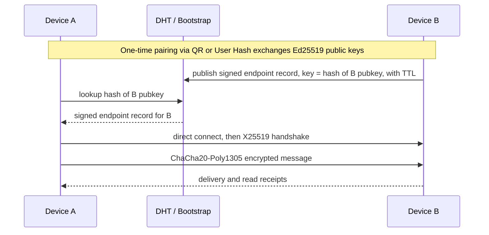

# vMessenger

> A fully decentralized, end-to-end encrypted messenger for Android. No accounts. No phone numbers. No central servers. Every device is a peer.

vMessenger is a privacy-first communication platform where each Android device is a sovereign peer that owns its own cryptographic identity. There is no backend to trust, no directory of users, and no company that can read, retain, or hand over your messages. Contacts are added only through QR codes or human-readable User Hashes, messages are end-to-end encrypted, and live location can be shared securely and revocably.

- Bundle ID: `ir.vmessenger.android`
- Platform: Android 8.0+ (API 26+)
- UI language: Persian (RTL), Material 3, light/dark
- Status: **MVP 0.1.0-rc1** — identity, pairing, DHT discovery, E2EE messaging, live location, and settings/debug ship in this repo.

---

## Vision

Build a messenger that cannot be shut down, censored, or surveilled from a single point, because there is no single point. The network is the sum of its users. Trust is rooted in cryptographic identity, not in a service provider.

Guiding values:

- Privacy by default. Plaintext never leaves the device; sensitive data at rest is encrypted.
- Self-sovereign identity. Your private key is your account, generated on-device and never transmitted.
- Decentralization without compromise. No central authentication, database, or message server.
- Calm, premium, minimal UX. The interface should make people feel safe, private, and in control.

---

## Core principles

- No user accounts, email, phone numbers, or usernames.
- No centralized authentication, database, or message relay.
- Identity is an on-device Ed25519 keypair. The public key derives a permanent identity hash and a human-readable User Hash.
- Contacts are added only via QR code or User Hash.
- The architecture is layered so each concern can be replaced independently: `Identity -> Discovery -> Transport -> Encryption -> Messaging`.
- The Discovery layer is fully independent from the Messaging layer.

---

## How it works (MVP)

The MVP is functional over the public Internet using a minimal Distributed Hash Table (DHT) for routing only.

1. Each device generates an Ed25519 identity locally.
2. Two users pair once by exchanging long-term public keys via QR or User Hash. No network needed for pairing.
3. To become reachable, a device joins the DHT through bootstrap nodes and publishes a signed, timestamped, expiring endpoint record (its current reachable address).
4. To start a conversation, a device looks up the contact's identity hash in the DHT, retrieves the signed endpoint record, and connects directly.
5. The two peers run an X25519 handshake, derive session keys with HKDF, and exchange ChaCha20-Poly1305 encrypted messages with forward secrecy and replay protection.

The DHT stores only temporary routing metadata. It never stores messages, contacts, private keys, or profiles.



---

## MVP feature scope

- Identity generation (Ed25519) and human-readable User Hash.
- QR code pairing and User Hash pairing.
- Minimal DHT discovery: bootstrap, publish, lookup, TTL, refresh.
- End-to-end encrypted 1:1 messaging with delivery and read status.
- Retry queue and offline queue (store-and-forward on the sender side).
- Live Location sharing with a foreground service and encrypted location packets.
- Encrypted local storage (Room over SQLCipher) and contact management.

Designed for but intentionally deferred to later phases: groups, voice/video calls, file and image transfer, Bluetooth and Wi-Fi Direct transports, mesh networking, geofencing, location history analytics, SOS mode, team and family management, plugin system, and full Kademlia/NAT hole-punching. **Relay fallback** via `relay.vmessenger.ir` (DHT + circuit relay, E2E only) is implemented — see [deploy/README.md](deploy/README.md).

---

## Technology stack

- Language: Kotlin
- Architecture: Clean Architecture + MVVM
- UI: Jetpack Compose + Material 3 (Persian / RTL)
- DI: Hilt
- Async: Coroutines + Flow
- Database: Room over SQLCipher
- Serialization: Protocol Buffers (proto3)
- Crypto: Ed25519, X25519, ChaCha20-Poly1305, HKDF, SHA-256 (libsodium / BouncyCastle), Android Keystore for key wrapping

---

## Documentation index

Read these in order for a top-down understanding of the system.

- [docs/Architecture.md](docs/Architecture.md) - requirements analysis, Clean Architecture + MVVM, module map, DI, concurrency, end-to-end data flow.
- [docs/Network.md](docs/Network.md) - the layered networking model and automatic transport selection.
- [docs/Protocol.md](docs/Protocol.md) - wire format, Protobuf schemas, handshake, sessions, receipts, queues, versioning.
- [docs/Security.md](docs/Security.md) - cryptographic design, key management, forward secrecy, replay protection, threat model.
- [docs/Discovery.md](docs/Discovery.md) - the modular Discovery layer, QR and User Hash pairing, DHT-based resolution.
- [docs/DHT.md](docs/DHT.md) - the minimal DHT design, signed routing records, TTL and refresh, anti-centralization rules.
- [docs/Bootstrap.md](docs/Bootstrap.md) - the BootstrapProvider interface and how to operate bootstrap nodes.
- [docs/Database.md](docs/Database.md) - encrypted local schema, entities, DAOs, and migrations.
- [docs/UI.md](docs/UI.md) - Persian RTL design system, theme, and screen-by-screen specifications.
- [docs/FolderStructure.md](docs/FolderStructure.md) - the Gradle multi-module layout.
- [docs/Roadmap.md](docs/Roadmap.md) - the phased delivery plan from MVP to full feature set.

---

## Repository status and layout

```
vMessenger/
  app/                 <- Android application (Hilt, navigation, Splash)
  build-logic/         <- Gradle convention plugins
  core/                <- shared libraries (design system, database, proto, …)
  data/                <- repository implementations
  domain/              <- pure Kotlin domain layer
  feature/             <- feature UI modules (Compose)
  network/             <- networking stack modules
  node/                <- host-run bootstrap/DHT reference node (dev)
  scripts/             <- emulator-connect.sh for two-emulator TCP
  docs/                <- architecture and protocol documentation
  vMessenger-icon/     <- app launcher icons and brand logos
```

Phases 1–7 (MVP) are implemented. See [docs/Roadmap.md](docs/Roadmap.md) for post-MVP work.

---

## Two-emulator dev test (Mac)

Two emulators cannot reach each other directly. Use a host bootstrap node plus `adb` port forwarding:

1. **Terminal A** — start the reference DHT node:
   ```bash
   ./gradlew :node:run
   ```
2. **Terminal B** — forward ports (run once per emulator session):
   ```bash
   ./scripts/emulator-connect.sh
   ```
3. **Both emulators** — uninstall/reinstall the app, create identity, pair via **User Hash** (Contacts → add by hash).
4. Open **Debug** (Settings) on each device — confirm DHT joined and endpoint published (`10.0.2.2:<port>`).
5. Send an encrypted message; share live location from a conversation.

Uninstall the app before retesting identity creation. Emulator extended controls can set GPS for location tests.

---

## Building and running

Requirements:

- JDK 21 (Gradle toolchain; CI uses Temurin 21)
- Android SDK 35 with Build Tools 35
- `local.properties` with `sdk.dir` pointing at your Android SDK

```bash
./gradlew assembleDebug
```

Install on a device or emulator:

```bash
./gradlew installDebug
```

### Release APKs (CI)

Updating [`gradle/version.properties`](gradle/version.properties) on `main` runs a **build-only** check. To **publish** APKs, push a matching version tag:

```bash
git tag v0.1.0-rc1   # must match versionName in gradle/version.properties
git push origin v0.1.0-rc1
```

The [Release APK](.github/workflows/release-apk.yml) workflow attaches per-architecture release APKs to the GitHub Release:

- `armeabi-v7a` (32-bit ARM)
- `arm64-v8a` (64-bit ARM, most phones)
- `x86` / `x86_64` (emulators)
- `universal` (all ABIs in one APK)

APKs are published as **GitHub Release assets** (not Actions artifacts), which avoids the Actions artifact storage quota.

Optional repository secrets for Play-ready signing: `ANDROID_KEYSTORE_BASE64`, `ANDROID_KEYSTORE_PASSWORD`, `ANDROID_KEY_ALIAS`, `ANDROID_KEY_PASSWORD`. Without them, CI signs with the debug keystore.

Run static analysis and unit tests:

```bash
./gradlew detekt testDebugUnitTest
```

The app launches to a themed Splash screen, then Home with Persian RTL navigation. Theme mode (Light / Dark / System) can be changed under **تنظیمات** (Settings).

---

## Contributing and bootstrap nodes

vMessenger is designed to be community-operated. Anyone can run a bootstrap node or a DHT node; see [docs/Bootstrap.md](docs/Bootstrap.md). No bootstrap operator can read messages or identify users beyond ephemeral routing metadata, and the app never depends on a single bootstrap server.

---

## License

To be determined before the first public release. A permissive or copyleft open-source license is expected so the protocol and node software remain auditable and self-hostable.
