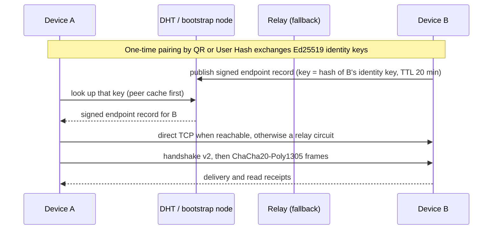

# vMessenger

> A decentralized, end-to-end encrypted messenger for Android. No accounts. No phone numbers. No message server. Every device owns its own cryptographic identity.

vMessenger is a privacy-first messenger where each Android device is a peer that owns its own Ed25519 identity. There is no backend that holds messages, no directory of users, and no operator who can read your conversations. Contacts are added through a QR code or a human-readable User Hash, messages are end-to-end encrypted, and live location can be shared per contact and revoked.

| | |
|---|---|
| Bundle ID | `ir.vmessenger.android` |
| Version | `versionName` / `versionCode` in [`gradle/version.properties`](gradle/version.properties) |
| Platform | Android 8.0+ (API 26), compile/target SDK 35 |
| UI language | Persian (RTL), Material 3, light/dark |
| Wire protocol | **major 2** — not interoperable with 0.x builds ([docs/Protocol.md](docs/Protocol.md) §15) |
| Database | Room over SQLCipher, **schema 18** ([docs/Database.md](docs/Database.md)) |
| License | GPL-3.0 ([LICENSE](LICENSE)) |

> ## Uninstall any 0.x build before installing 1.x
>
> This is not a recommendation. Protocol major 2 is a deliberate clean break: the handshake, the
> AEAD associated data, every signed transcript and the User Hash format (`vm1-` → `vm2-`) all
> changed together, and no compatibility shim exists in the app. A 0.x client is rejected with a
> `CLOSE` frame rather than downgraded.
>
> **There is no migration path and none is planned.** Uninstall the 0.x app, then install 1.x.
> Identity, contacts and message history do not survive that, and the backup bundle is no help
> either — it was added after the last 0.x release, so no 0.x build could produce one. Anyone you
> had paired with must re-pair with you once you both have 1.x.

What changed in 1.0 is in [CHANGELOG.md](CHANGELOG.md).

---

## Principles

- No accounts, email addresses, phone numbers or usernames.
- Identity is an on-device Ed25519 key pair. The private key never leaves the device.
- No central authentication, database or message store. Relay and DHT nodes forward opaque ciphertext and hold signed, expiring routing records — nothing else.
- The layers are replaceable independently: `Identity → Discovery → Transport → Encryption → Messaging`.
- Discovery is fully independent of Messaging.

---

## How it works

1. The device generates an Ed25519 identity locally, derives its identity hash and a `vm2-…` User Hash, and picks a display name.
2. Two users pair by exchanging long-term public keys — by QR (in-person, instant) or by User Hash (sends a contact request that the other side approves).
3. To be reachable, a device joins the DHT through bootstrap nodes and publishes a signed, expiring endpoint record (20-minute TTL, re-announced every 10 minutes).
4. To message a contact, the app resolves endpoints (local cache first, then the DHT), tries direct TCP, and falls back to an encrypted relay circuit.
5. Peers run the v2 handshake — three signed steps, three X25519 DHs — and exchange ChaCha20-Poly1305 frames over a symmetric ratchet.


```mermaid
sequenceDiagram
  participant A as Device A
  participant DHT as DHT / bootstrap node
  participant R as Relay (fallback)
  participant B as Device B
  Note over A,B: One-time pairing by QR or User Hash exchanges Ed25519 identity keys
  B->>DHT: publish signed endpoint record (key = hash of B's identity key, TTL 20 min)
  A->>DHT: look up that key (peer cache first)
  DHT-->>A: signed endpoint record for B
  A->>B: direct TCP when reachable, otherwise a relay circuit
  A->>B: handshake v2, then ChaCha20-Poly1305 frames
  B-->>A: delivery and read receipts
```

The DHT stores routing metadata only. It never stores messages, contacts, private keys or profiles.

---

## Features

Implemented and verified on two emulators (see [docs/Testing.md](docs/Testing.md) §4):

- **Identity** — Ed25519 + X25519 static key pair, display name, `vm2-` User Hash with a full-prefix checksum.
- **Pairing** — signed QR descriptor (transcript v2) for instant in-person adds; User Hash adds that require mutual approval, with deterministic request ids and a repeat-request cap.
- **Messaging** — 1:1 end-to-end encrypted chat with replies, delivery and read receipts (batched), a persistent encrypted outbox with backoff and a 24-hour retry window.
- **Groups** — client-side fan-out over the existing pairwise sessions, with creator-authoritative versioned membership, gap detection and snapshot recovery, system lines for membership changes, and a closed group that keeps its history. A group message's single tick is aggregated from per-recipient state; a long press opens a per-member delivered/read sheet.
- **Voice messages** — hold to record, slide to cancel, drag to lock; one shared player that auto-advances through unplayed messages, with duration and waveform carried in the transfer header so the bubble has its shape before the audio lands.
- **Attachments** — images, videos and files up to 25 MB, chunked at 128 KiB over a single session, with a plaintext SHA-256 the receiver verifies, and encrypted at rest in a `VMA1` container.
- **Live location** — MapLibre map, per-contact allow list, mutual visibility, foreground service, encrypted location packets, retention limits.
- **Discovery** — minimal DHT (bootstrap, store, find-value, TTL, re-announce), verified peer/endpoint cache, relay fallback.
- **Multi-node network** — database-backed bootstrap and relay lists with health ranking and a trust tier (built-in / user / official / community); add, enable, share and import nodes with `vmnode:bootstrap:…` / `vmnode:relay:…` links or QR.
- **Security** — MITM-resistant v2 handshake, per-contact X25519 key pinning, inbound authorization on every envelope kind, SQLCipher database, Keystore-wrapped keys (StrongBox where available), `FLAG_SECURE`, private lock-screen notifications, boot-restart of the network service, and a complete secure wipe. See [docs/Security.md](docs/Security.md).
- **Backup** — passphrase-protected identity/contacts backup bundle (Argon2id13 + XChaCha20-Poly1305).
- **In-app updates** — checks GitHub Releases, picks the APK matching the device ABI, verifies it against the release's published checksums and signer before handing it to the package installer.
- **Reference node** — a JVM bootstrap/DHT + relay node anyone can run ([docs/Deployment.md](docs/Deployment.md)).

Not implemented: voice or video calls, Bluetooth / Wi-Fi Direct / mesh transports, geofencing, location analytics, SOS mode, a plugin system.

---

## Known limitations

An honest list of what does **not** work or is not protected today.

### Security and privacy

The cryptographic and metadata gaps are enumerated as **L1–L14 in [docs/Security.md](docs/Security.md) §10**, with the file and flag behind each one. That table is the authoritative list and is not duplicated here. The four that most change what a user should expect:

- **No post-compromise security.** The session uses a symmetric ratchet, not a Double Ratchet — there is no DH step (L1).
- **Metadata is visible to relay and DHT nodes** — who is online, from which IP, who dials whom, and every endpoint record and lookup. There is no padding, no cover traffic and no blinded lookup (L2).
- **Contact keys are trust-on-first-use**, and a contact whose key changes stays unreachable because nothing calls `acceptKeyChange` (L4, L5).
- **A group's membership is whatever its creator says it is.** There is no group key, no admin transfer and no member-side veto, and the fan-out pattern itself tells a relay which peers form a group (L12, L13).

Two more, outside that table:

- **The operator trust anchor is a placeholder.** `NetworkConfig.OPERATOR_ED25519_PUBLIC_KEY_HEX` is 64 zeros, so no `SignedNodeRecord` can ever be marked `OFFICIAL`. It must be set before release.
- **The in-app updater trusts GitHub as a distribution channel.** It verifies the download against the release's published checksums and signer, but the release metadata itself is fetched over TLS from GitHub rather than being signed by the project.

### Networking

- **No NAT traversal.** A UDP transport exists and TCP endpoints can be mirrored as UDP candidates, but there is no STUN/ICE candidate gathering, no hole punching and no connectivity checks. Two phones behind carrier-grade NAT will not connect directly; they go through a relay. The UDP path is off by default.
- **The node's DHT record store is in-memory.** `DhtRequestHandler` keeps records in a `ConcurrentHashMap`, `FIND_NODE` returns the configured peer nodes rather than the closest ones, and there is no replication, no parallel lookup and no k-bucket routing on the node side. A node restart drops every record it held; devices re-announce within 10 minutes.
- **Embedded DHT participation on phones is experimental** and off by default. Most phones are not reachable from the public Internet, so it helps in limited cases at best.
- **User-operated relay mode is off by default.** The circuit protocol, circuit table, TTL and a policy gate (off / contacts-only / Wi-Fi-only / charging-only) exist, but the path has not been through the same verification as the default relay.
- **Peer exchange of signed node records is off by default.** Records verify correctly and community records are stored disabled, but the flow is unverified end to end.
- **The default relay remains a single operational dependency in practice.** Demotion (`reduceDefaultRelay`) exists but is off, because the replacement paths above are not proven.
- **Only one built-in node ships** (`relay.vmessenger.ir`, serving both `/dht` and `/relay`), so "decentralized" today means "self-hostable and multi-node capable", not "no default operator".

### Platform

- **After a secure wipe the app does not come back to the foreground.** Android's background-activity-start restriction blocks the `AlarmManager` relaunch; the data is destroyed and the service restarts, but the user must tap the launcher icon.
- **Room schemas 3, 4, 5 and 11 were never committed versions**, so the exported schema history has gaps. The migration chain itself is continuous and is replayed 1 → 18 on a real SQLite engine in a JVM test.
- **Feature flags gate unproven code paths, not absent ones** (L14). Turning on peer exchange, embedded DHT, relay-peer mode, UDP attempts, store-and-forward or relay demotion in the debug screen enables code that the default build does not exercise.
- **Map pin rendering has never been visually verified**, because `screencap` returns a black image on the software-GPU emulator MapLibre renders on. See [docs/UI.md](docs/UI.md) §8.
- **There are no Compose UI tests and no accessibility audit.** The presentation layer is covered by ViewModel unit tests only.

---

## Technology

- Kotlin, Clean Architecture + MVVM, Jetpack Compose + Material 3 (Persian / RTL)
- Hilt, Coroutines + Flow
- Room over SQLCipher (schema 18), DataStore for preferences
- Protocol Buffers (proto3) for every wire format
- libsodium (Lazysodium): Ed25519, X25519, ChaCha20-Poly1305-IETF, XChaCha20-Poly1305 secretstream, `crypto_box_seal`, Argon2id13, HKDF-SHA256; Android Keystore (AES-256-GCM, StrongBox where available) for key wrapping
- MapLibre for the map; Ktor for the reference node

---

## Documentation

| Document | Contents |
|---|---|
| [docs/Architecture.md](docs/Architecture.md) | Clean Architecture + MVVM, module map, DI, concurrency, end-to-end data flows |
| [docs/Network.md](docs/Network.md) | the layered networking model and transport selection |
| [docs/Protocol.md](docs/Protocol.md) | framing, version negotiation, the v2 handshake, the ratchet, receipts, attachments, relay control, DHT RPC |
| [docs/Security.md](docs/Security.md) | threat model, handshake guarantees, key pinning, inbound authorization, encryption at rest, secure wipe, known limitations |
| [docs/Discovery.md](docs/Discovery.md) | the Discovery layer, QR and User Hash pairing, DHT resolution |
| [docs/DHT.md](docs/DHT.md) | the minimal DHT design, joining it, signed routing records, TTL and refresh |
| [docs/Database.md](docs/Database.md) | schema 18: entities, enums, indices, DAOs, the 1→18 migration chain |
| [docs/Testing.md](docs/Testing.md) | unit tests, node tests, the two-emulator procedure, the M3 scenario matrix, release verification |
| [docs/Deployment.md](docs/Deployment.md) | operator runbook for running a relay/DHT node |
| [docs/UI.md](docs/UI.md) | the design system, component catalogue, navigation, screens and the RTL/Persian rules |
| [docs/FolderStructure.md](docs/FolderStructure.md) | the Gradle multi-module layout |
| [CHANGELOG.md](CHANGELOG.md) | what each release changed |

---

## Repository layout

```
vMessenger/
  app/                 <- Android application (Hilt, navigation, lifecycle service)
  build-logic/         <- Gradle convention plugins
  core/                <- common, crypto, proto, database, datastore, location, map, notifications, designsystem
  data/                <- repository implementations, network coordinators, attachment + wipe + backup
  domain/              <- pure Kotlin domain layer
  feature/             <- identity, pairing, contacts, chat, map, settings, debug, about
  network/             <- discovery, dht, bootstrap, transport, messaging
  node/                <- standalone JVM bootstrap/DHT + relay node
  deploy/              <- nginx and systemd templates for a production node host
  scripts/             <- setup-node.sh, emulator-connect.sh, p2p-terminal-check.sh, sign-node-record
  docs/                <- this documentation set
  vMessenger-icon/     <- launcher icons and brand logos
```

---

## Building

Requirements: JDK 21 (Gradle toolchain; CI uses Temurin 21), Android SDK 35 with Build Tools 35, and a `local.properties` with `sdk.dir`.

```bash
./gradlew assembleDebug
./gradlew installDebug
./gradlew detekt unitTests     # static analysis + every unit test (Android and JVM modules)
```

`unitTests` is the aggregate task — a plain `testDebugUnitTest` skips `:core:common`, `:domain` and `:node`. See [docs/Testing.md](docs/Testing.md).

### Releases

Updating `gradle/version.properties` on `main` runs a build-only check. Publishing requires a matching tag:

```bash
git tag v1.0.0        # must equal versionName in gradle/version.properties
git push origin v1.0.0
```

The version is a single source of truth: `gradle/version.properties` still carries the previous
`versionName`, and cutting 1.0 means bumping both fields there, moving the `## [Unreleased]` section
of [CHANGELOG.md](CHANGELOG.md) under a dated `## [1.0.0]` heading, and setting
`NetworkConfig.OPERATOR_ED25519_PUBLIC_KEY_HEX` to the real operator key.

The [Release APK](.github/workflows/release-apk.yml) workflow gates on `detekt unitTests`, refuses to publish without the release keystore, builds per-ABI (`armeabi-v7a`, `arm64-v8a`, `x86`, `x86_64`) plus a universal APK, verifies every signature with `apksigner` (failing on a debug certificate or mismatched signers), and attaches the APKs, `SHA256SUMS.txt`, `SIGNING.txt`, the node tarball and the R8 mapping to the GitHub Release.

Signing secrets: `ANDROID_KEYSTORE_BASE64`, `ANDROID_KEYSTORE_PASSWORD`, `ANDROID_KEY_ALIAS`, `ANDROID_KEY_PASSWORD`.

---

## Running a node

Anyone can run a bootstrap (DHT) and/or relay node. Nodes never see plaintext — they hold signed, expiring endpoint records and forward opaque encrypted frames.

**Full operator runbook: [docs/Deployment.md](docs/Deployment.md)** — install and update, TLS, running behind a CDN, verification and day-to-day operation.

Quick start on a fresh Ubuntu/Debian host:

```bash
sudo ./scripts/setup-node.sh --domain relay.example.com
```

The node listens on `127.0.0.1:8443` and nginx terminates TLS and exposes:

| Path | Purpose |
|---|---|
| `GET /healthz` | `ok` (add `?verbose=1` for counters and the config summary) |
| `wss://<host>/dht` | one `DhtRpcRequest` → one `DhtRpcResponse` |
| `wss://<host>/relay` | listener control channels and bridged circuits |

Local development against two emulators:

```bash
./gradlew :node:run --args="--tcp"   # TCP DHT on :46555
./scripts/emulator-connect.sh        # adb port forwards
```

Add a node in the app under **تنظیمات → نودهای شبکه**, by pasting a link or scanning its QR:

```text
vmnode:bootstrap:wss://relay.example.com/dht
vmnode:relay:wss://relay.example.com/relay
```

---

## Contributing

vMessenger is meant to be community-operated: anyone can run a node, and no operator can read messages or identify users beyond the routing metadata listed under [Known limitations](#known-limitations). Changes to crypto, networking or storage need a matching update to the documents in `docs/`.

---

## License

**GNU General Public License, version 3.** The full text is in [LICENSE](LICENSE).

This keeps the protocol and the node software auditable and self-hostable: anyone distributing a modified build must make the corresponding source available under the same terms.
