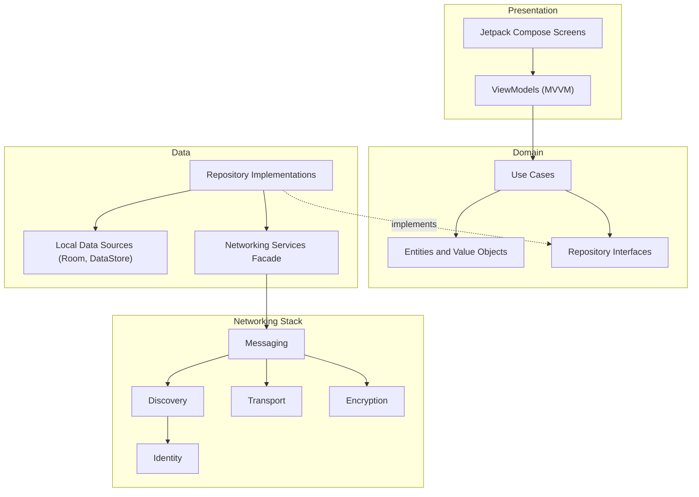
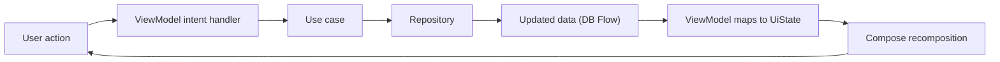
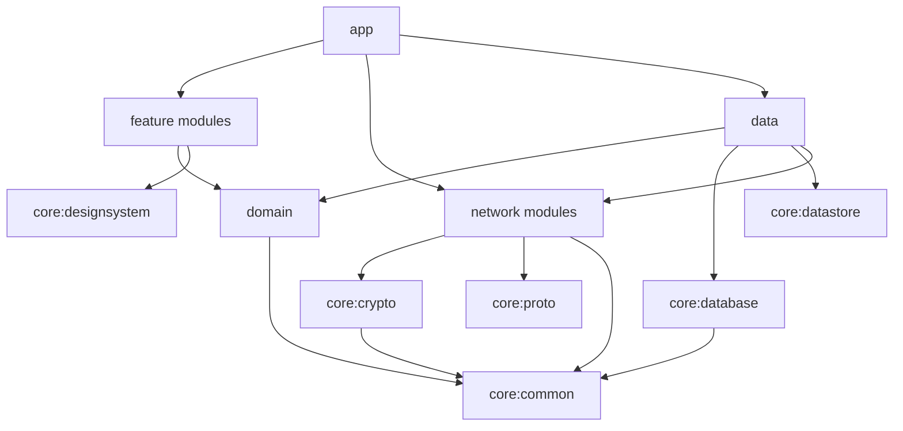
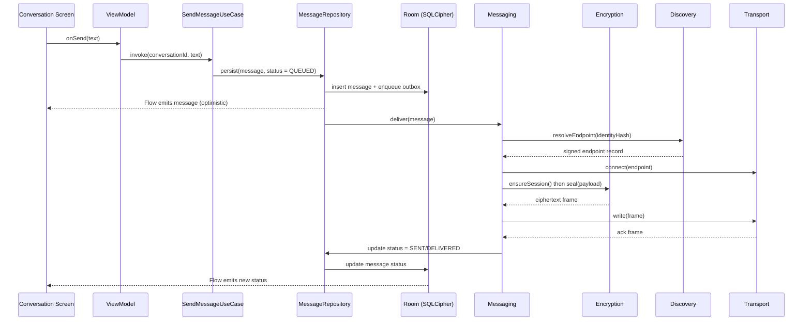

# vMessenger - Architecture

This document defines the overall software architecture of vMessenger: the requirements it must satisfy, the architectural style, the module decomposition, dependency rules, dependency injection, concurrency model, and the end-to-end data flows that tie everything together.

Related documents: [Network.md](Network.md), [Protocol.md](Protocol.md), [Security.md](Security.md), [Discovery.md](Discovery.md), [DHT.md](DHT.md), [Bootstrap.md](Bootstrap.md), [Database.md](Database.md), [UI.md](UI.md), [FolderStructure.md](FolderStructure.md), [Roadmap.md](Roadmap.md).

---

## 1. Requirements analysis

### 1.1 Functional requirements (MVP)

- FR-1 Identity: generate an Ed25519 keypair on-device; derive a permanent identity hash and a human-readable User Hash.
- FR-2 Pairing: add a contact by scanning a QR code or by entering a User Hash. No pairing depends on a server.
- FR-3 Discovery: become reachable by publishing a signed endpoint record into a minimal DHT; resolve a contact's current endpoint by DHT lookup.
- FR-4 Messaging: send and receive end-to-end encrypted 1:1 text messages.
- FR-5 Delivery semantics: track per-message status (queued, sent, delivered, read, failed).
- FR-6 Queues: retry transient failures; hold messages in an offline queue until the peer is reachable.
- FR-7 Live Location: share live location through a foreground service; render it on a map; stop/revoke at any time.
- FR-8 Storage: persist contacts, conversations, messages, keys, sessions, settings, and location history, encrypted at rest.
- FR-9 Contact management: list, rename (local alias), verify, block, and delete contacts.

### 1.2 Non-functional requirements

- NFR-1 Security: confidentiality, integrity, authenticity, forward secrecy, and replay protection for all messages; private keys never leave the device. See [Security.md](Security.md).
- NFR-2 Decentralization: no central authentication, database, or message server; no single point of failure or control.
- NFR-3 Modularity: each layer (Identity, Discovery, Transport, Encryption, Messaging) is replaceable behind an interface without changing the others.
- NFR-4 Extensibility: future features (groups, calls, file transfer, additional transports, mesh, plugins) can be added without breaking existing code.
- NFR-5 Performance and battery: adaptive location intervals, motion detection, efficient connection reuse; responsive UI on Android 8+ devices.
- NFR-6 Reliability: graceful degradation when the network, DHT, or a peer is unavailable; durable local queues.
- NFR-7 Privacy: minimize metadata; routing records are ephemeral and signed; no analytics or tracking.
- NFR-8 Testability: domain logic is pure and unit-testable; network and crypto layers are interface-driven and fakeable.
- NFR-9 Internationalization: Persian-first, full RTL, Material 3, light/dark. See [UI.md](UI.md).

### 1.3 Constraints and assumptions

- Minimum SDK 26 (Android 8.0); target the latest stable SDK.
- The MVP assumes at least one peer is directly reachable at its published endpoint (public IP, IPv6, port-forwarded, or same network). Carrier-grade NAT traversal and relay fallback are deferred (see [Roadmap.md](Roadmap.md)).
- Bootstrap nodes are used only to join the DHT; the app becomes bootstrap-independent after joining (see [Bootstrap.md](Bootstrap.md)).

---

## 2. Architectural goals and principles

1. Separation of concerns through Clean Architecture: business rules do not depend on frameworks, UI, or the network.
2. The Dependency Rule: source-code dependencies point inward, toward the domain. Inner layers know nothing about outer layers.
3. Interface-first networking: Identity, Discovery, Transport, Encryption, and Messaging are contracts; concrete implementations are swappable.
4. Unidirectional data flow in the presentation layer (MVVM + immutable UI state).
5. Offline-first: the local encrypted database is the source of truth for the UI; the network synchronizes it.
6. Fail safe: when in doubt, do not transmit plaintext, do not weaken crypto, and do not leak metadata.

---

## 3. High-level architecture

vMessenger combines two complementary views.

The horizontal view is Clean Architecture (Presentation, Domain, Data). The vertical view is the networking stack (Identity, Discovery, Transport, Encryption, Messaging), which lives behind the Data layer as a set of replaceable services.

### 3.1 The five networking layers

- Identity: owns the device keypair, identity hash, User Hash, and signing. Source of truth for "who am I" and "who is this peer". See [Security.md](Security.md).
- Discovery: turns an identity hash into reachable endpoints. Independent of Messaging. Implemented for MVP via QR/User Hash (identity exchange) and the DHT (endpoint resolution). See [Discovery.md](Discovery.md).
- Transport: establishes raw bidirectional byte channels to an endpoint. MVP implements an Internet (TCP) transport; Bluetooth, Wi-Fi Direct, and mesh are future. See [Network.md](Network.md).
- Encryption: performs the handshake, key derivation, ratcheting, and AEAD framing. Plaintext crosses this boundary only on the device. See [Security.md](Security.md) and [Protocol.md](Protocol.md).
- Messaging: sequences, acknowledges, retries, and queues application messages over an encrypted session. See [Protocol.md](Protocol.md).

Each layer depends only on the interface of the layer beneath it, so any layer can be replaced (for example, swapping the Internet transport for a Bluetooth transport) without touching the others.

---

## 4. Clean Architecture layers

### 4.1 Domain layer

Pure Kotlin, no Android or framework dependencies. Contains:

- Entities and value objects: `Identity`, `Contact`, `Conversation`, `Message`, `DeliveryStatus`, `EndpointRecord`, `LocationSample`, `SessionState`.
- Repository interfaces: `ContactRepository`, `MessageRepository`, `IdentityRepository`, `DiscoveryRepository`, `LocationRepository`, `SettingsRepository`.
- Use cases: small, single-responsibility classes that orchestrate repositories, for example `GenerateIdentityUseCase`, `AddContactByQrUseCase`, `AddContactByHashUseCase`, `SendMessageUseCase`, `ObserveConversationUseCase`, `StartLiveLocationUseCase`, `ResolveEndpointUseCase`.

Use cases express application business rules and are independently unit-testable with fake repositories.

### 4.2 Data layer

Implements the domain repository interfaces and coordinates local and networking data sources.

- Local data sources: Room DAOs (over SQLCipher) and encrypted DataStore for settings. See [Database.md](Database.md).
- Networking services facade: a thin boundary that exposes the networking stack (Discovery, Transport, Encryption, Messaging) to repositories as suspend functions and Flows.
- Mappers: convert between Protobuf wire models, Room entities, and domain models. The three representations are kept separate so wire and storage formats can evolve independently.

The data layer enforces offline-first behavior: writes go to the database first, then are scheduled for network delivery; reads are served from the database and observed via Flow.

### 4.3 Presentation layer

Jetpack Compose with MVVM. See [UI.md](UI.md) for screen specifications.

- Each screen has a `ViewModel` exposing an immutable `UiState` via `StateFlow` and accepting user intents as function calls.
- ViewModels depend only on use cases, never on repositories or the network directly.
- Navigation is centralized in the `:app` module's navigation host.

---

## 5. MVVM and unidirectional data flow

- State flows down (immutable `UiState`), events flow up (intent functions).
- The database is observed with Flow, so UI updates automatically when messages arrive or statuses change.
- ViewModels are lifecycle-aware and survive configuration changes; long-running work is delegated to use cases scoped to appropriate coroutine scopes.

---

## 6. Module decomposition and dependency graph

The project is a Gradle multi-module build. Full details and package layout are in [FolderStructure.md](FolderStructure.md); the dependency relationships are summarized here.

Key rules:

- `domain` depends on nothing but `core:common` (pure Kotlin).
- `feature:*` modules depend on `domain` and `core:designsystem`, never on `data` internals or `network` internals directly.
- `data` is the only module that wires repositories to `network`, `database`, and `datastore`.
- `network:*` modules depend on `core:crypto`, `core:proto`, and `core:common`, and never on `feature` or `presentation` code.

This guarantees the Dependency Rule and keeps build times and blast radius small.

---

## 7. Dependency injection (Hilt)

Hilt provides compile-time-verified DI with Android lifecycle integration.

- Scopes: `@Singleton` for identity, crypto engine, database, networking stack, and the DHT client; `@ViewModelScoped` for per-screen collaborators; `@ServiceComponent` bindings for the location foreground service.
- Modules bind interfaces to implementations, for example `@Binds` for each repository, `Transport`, `DiscoveryProvider`, `BootstrapProvider`, and `CryptoEngine`. Swapping an implementation is a one-line binding change, which is how new transports and discovery providers are introduced.
- Qualifiers distinguish multiple implementations of the same interface (for example `@InternetTransport` vs a future `@BluetoothTransport`) and dispatchers (`@IoDispatcher`, `@DefaultDispatcher`, `@MainDispatcher`).
- Multibinding (`@IntoSet`) is used for pluggable collections such as the set of active `Transport`s, the set of `BootstrapProvider`s, and future plugins, enabling the transport selector and bootstrap manager to iterate over all registered providers.

---

## 8. Concurrency model

vMessenger is built on Kotlin Coroutines and Flow with structured concurrency.

- Dispatchers are injected, never referenced as globals, so they can be replaced with test dispatchers.
  - `@IoDispatcher` for disk, database, and network I/O.
  - `@DefaultDispatcher` for CPU-bound work (crypto, serialization, parsing).
  - `@MainDispatcher` for UI updates.
- Suspend functions for one-shot operations (send a message, resolve an endpoint); Flow for streams (observe a conversation, observe connection state, location updates).
- Scopes:
  - `viewModelScope` for UI-bound work.
  - A `@Singleton` application-level `CoroutineScope` (with a `SupervisorJob`) owns long-lived network tasks: the DHT maintenance loop, endpoint republish/refresh, the outbox/retry worker, and inbound session listeners.
  - The location foreground service owns its own scope tied to the service lifecycle.
- Backpressure and buffering: inbound message Flows are conflated or buffered as appropriate; the outbox is drained by a single worker to preserve ordering per conversation.
- Cancellation is cooperative and propagated; closing a session cancels its read/write coroutines deterministically.

---

## 9. Background execution

- Live Location runs in a foreground service (`LocationService`) with a persistent notification, adaptive update interval, and motion detection. See [UI.md](UI.md) and [Roadmap.md](Roadmap.md).
- Outbox delivery and DHT endpoint refresh run in the application scope while the app is alive, and are additionally scheduled with WorkManager for periodic refresh and retry when the app is backgrounded, subject to OS constraints.
- The networking stack favors short-lived direct connections in the MVP; persistent presence and push-style wake-ups are a later-phase concern documented in [Roadmap.md](Roadmap.md).

---

## 10. End-to-end data flows

### 10.1 Create identity (first launch)

1. `GenerateIdentityUseCase` asks the Identity service to create an Ed25519 keypair.
2. The private key is stored wrapped by the Android Keystore; the public key, identity hash, and User Hash are persisted. See [Security.md](Security.md).
3. The UI transitions from the Create Identity screen to Home.

### 10.2 Add a contact (QR or User Hash)

1. The user scans a QR (or enters a User Hash). The payload carries the contact's Ed25519 public key plus metadata; see [Discovery.md](Discovery.md) and [Protocol.md](Protocol.md).
2. `AddContactByQrUseCase` / `AddContactByHashUseCase` validates the key, derives the identity hash, and stores a `Contact`.
3. No network call is required; pairing is purely a local identity exchange.

### 10.3 Send a message

If endpoint resolution or connection fails, the message remains in the offline/retry queue and is redelivered later (see [Protocol.md](Protocol.md)).

### 10.4 Receive a message

1. An inbound connection is accepted by the Transport listener.
2. Encryption completes/loads the session and decrypts the frame; replay protection rejects duplicates.
3. Messaging validates and acknowledges; the Data layer persists the message and emits it through the conversation Flow.
4. A read receipt is sent when the user views the conversation.

### 10.5 Share live location

1. `StartLiveLocationUseCase` starts `LocationService` and records an active sharing session for a contact.
2. The service samples location with an adaptive interval and motion detection, encrypts each `LocationSample` as a location packet, and sends it over the messaging session.
3. The recipient renders samples on the Map screen; sharing can be revoked, which ends the session and notifies the peer.

---

## 11. Error handling

- The domain expresses failures with a sealed `Result`/`AppError` type rather than exceptions crossing layer boundaries.
- Network and crypto errors are categorized (transient vs permanent) so the retry policy can decide whether to back off and retry or surface a permanent failure.
- The UI renders errors as calm, localized (Persian) messages and never exposes raw stack traces; a Debug screen surfaces diagnostics for development builds (see [UI.md](UI.md)).

---

## 12. Testing strategy (overview)

- Domain: pure unit tests for use cases with fake repositories.
- Data: repository tests with an in-memory Room database and fake networking services; mapper round-trip tests.
- Crypto: known-answer tests and round-trip seal/open tests; negative tests for tampered frames and replays. See [Security.md](Security.md).
- Network/DHT: deterministic tests using an in-memory transport and a simulated DHT; TTL/refresh/expiry behavior tests. See [DHT.md](DHT.md).
- Presentation: ViewModel state tests with test dispatchers; Compose UI tests for critical screens.
- A dedicated `core:testing` module provides shared fakes, fixtures, and test dispatchers.

---

## 13. How this architecture absorbs future features

- New transport (Bluetooth, Wi-Fi Direct, mesh): add a module implementing `Transport`, register it with a Hilt `@IntoSet` binding; the transport selector picks it automatically. No changes to Messaging or UI.
- Groups: add group entities and a group session strategy in Messaging/Encryption; the conversation abstraction already separates 1:1 from rendering.
- Calls (voice/video): add a real-time media module that reuses Identity, Discovery, and the handshake for signaling.
- Plugin system: plugins register via multibinding into well-defined extension points (transports, discovery providers, message handlers).

See [Roadmap.md](Roadmap.md) for sequencing.
