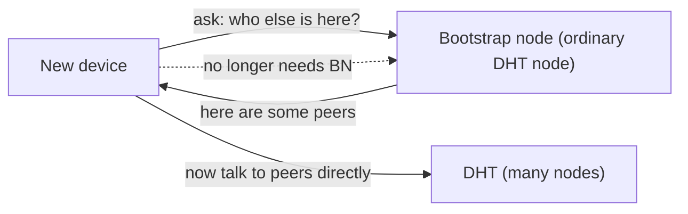
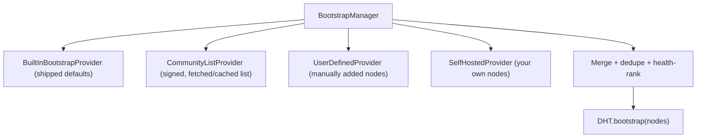

# vMessenger - Bootstrap Architecture

A decentralized network still needs a way for a brand-new node to find its first peers. That is the only job of bootstrap nodes: to help a device join the DHT. After joining, the device operates independently of any bootstrap node.

This document defines what bootstrap nodes are (and are not), the `BootstrapProvider` interface, the sources of bootstrap nodes, the join flow, post-join independence, and how to operate a bootstrap node.

Related: the DHT itself is in [DHT.md](DHT.md); discovery flow in [Discovery.md](Discovery.md); trust and signing in [Security.md](Security.md).

---

## 1. What bootstrap nodes are - and are not

A bootstrap node is a well-known DHT node with a stable, reachable address that a joining device can contact to learn about other nodes.

Bootstrap nodes are NOT:

- Message servers - they never see or relay messages.
- Authentication servers - there are no accounts to authenticate.
- Contact servers - they store no social graph.
- Identity servers - they issue and store no identities.
- Privileged nodes - they have no special authority over DHT records.

They are simply entry points. The moment a device has learned enough peers, the bootstrap node's role is finished.



---

## 2. Design principle: never depend on a single bootstrap

The architecture must always allow multiple bootstrap sources and must never hard-code dependence on one operator. If every listed bootstrap node is down, the user can add their own; the app keeps working as long as it can reach any node or any previously-known peer.

---

## 3. The BootstrapProvider interface

Bootstrap node lists come from pluggable providers, injected as a set (Hilt multibinding) and merged by a `BootstrapManager`.

```kotlin
interface BootstrapProvider {
    val id: BootstrapProviderId
    val priority: Int                       // ordering hint for the manager
    suspend fun nodes(): Result<List<BootstrapNode>>
}

data class BootstrapNode(
    val address: String,        // host:port
    val nodeId: ByteArray?,     // optional known DHT node id
    val publicKey: ByteArray?,  // optional Ed25519 key for authenticated nodes
    val source: BootstrapProviderId
)
```



---

## 4. Sources of bootstrap nodes

All four sources implement the same interface and can be enabled/disabled independently:

- Built-in defaults: a small set shipped with the app so first launch works out of the box. Treated as hints, not authorities.
- Community-operated nodes: a community-maintained list, distributed as a signed document and cached locally. Signing prevents tampering of the list; see Section 7.
- User-defined nodes: addresses the user adds manually (from a friend, a forum, or their own infrastructure) in Settings.
- Self-hosted nodes: nodes the user or their organization runs; ideal for families, teams, or privacy-sensitive deployments that want to depend only on infrastructure they control.

This diversity is the anti-single-point-of-failure guarantee.

---

## 5. The join flow

```mermaid
sequenceDiagram
  participant App as Device
  participant BM as BootstrapManager
  participant BN as Bootstrap node(s)
  participant DHT as DHT
  App->>BM: collect nodes from all providers
  BM-->>App: merged, health-ranked node list
  App->>BN: Ping / FindNode(self id) to several nodes in parallel
  BN-->>App: closest known nodes
  App->>DHT: iterative FindNode to populate routing table
  Note over App,DHT: Device is now a DHT participant
  App->>DHT: publish own EndpointRecord; ready to resolve contacts
```

- Contact several bootstrap nodes in parallel for resilience and speed.
- Use `FindNode` toward the device's own ID to discover the neighbors it will interact with most.
- Once the routing table has enough live contacts, joining is complete.

---

## 6. Post-join independence

- After a successful join, the device caches good peers (a persistent peer cache) and prefers them on the next launch, often skipping bootstrap entirely.
- Bootstrap nodes are consulted again only when the peer cache is too stale or empty (for example after a long offline period).
- The app must remain fully functional for messaging and discovery using the live DHT alone; bootstrap availability affects only the cold-join experience.

---

## 7. Trust and security

(See [Security.md](Security.md) for the broader model.)

- Bootstrap nodes are untrusted for content and authority. They cannot read messages (messages never touch them) and cannot forge DHT records (records are Ed25519-signed and verified by clients).
- Community list integrity: the community node list is distributed as a signed document; the app verifies the signature before use, so a compromised distribution channel cannot inject malicious nodes silently.
- Authenticated bootstrap (optional): a `BootstrapNode` may carry an Ed25519 public key; the joining device can verify the node's identity during the initial RPC to resist impersonation.
- Diversity for eclipse resistance: joining via multiple independent sources reduces the chance that a single adversary controls the entire view of the network.
- Rate limiting and abuse resistance are implemented on the node side (Section 8).

---

## 8. Operating a bootstrap node

Because anyone can run one, bootstrap operation is part of the product.

- Node software: a lightweight, standalone vMessenger DHT node (the same `DhtNode` RPC surface from [DHT.md](DHT.md) Section 4.6) with a stable public address. It stores only signed, expiring `EndpointRecord`s and serves Ping/FindNode/Store/FindValue.
- Requirements: a reachable host (public IP or port forwarding), modest CPU/RAM, and a persistent listening port. No database of users, no message storage, no logs of content (operators are encouraged to minimize connection logging for privacy).
- Configuration: bind address/port, optional node keypair (for authenticated bootstrap), resource limits (max records per key, per-source rate limits, record TTL ceilings), and an optional peering list of other nodes.
- Distribution: the node is intended to be packaged for easy self-hosting (container image and/or static binary) so families, teams, and communities can run their own; see [Roadmap.md](Roadmap.md).

Example configuration shape (illustrative):

```yaml
listen: "0.0.0.0:46555"
node_key_file: "/etc/vmessenger/node.key"   # optional; enables authenticated bootstrap
limits:
  max_records_per_key: 4
  max_record_ttl_ms: 1800000                 # 30 minutes
  rate_limit_per_ip_per_min: 120
peers:
  - "bootstrap.example.org:46555"
```

---

## 9. Configuration in the app

- Settings exposes the active bootstrap providers, lets users add/remove nodes, paste a signed community list URL, and prioritize self-hosted nodes.
- A diagnostics view (Debug screen, see [UI.md](UI.md)) shows join status, reachable bootstrap nodes, routing-table size, and last successful publish/lookup, so users can verify decentralization is working.

---

## 10. Summary

Bootstrap is the on-ramp, not the network. It is pluggable, multi-sourced, signed where it matters, and disposable after join. This preserves the core promise: vMessenger has no central server, no single point of failure, and no operator who can read or control communication.
