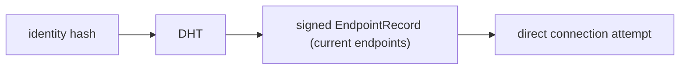
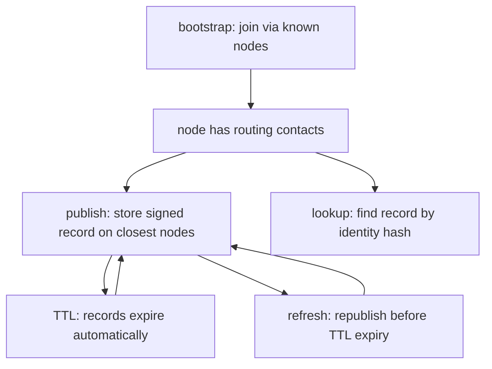

# vMessenger - Distributed Hash Table (DHT)

The DHT is vMessenger's decentralized routing layer. Its single job is to map an identity hash to that peer's current, signed, expiring network endpoints. It is the mechanism that makes the MVP functional over the public Internet without any central server.

This document defines what the DHT stores (and never stores), the record format, the minimal MVP operation set, the key space, refresh/expiry semantics, anti-centralization rules, security, and the path to a full Kademlia implementation later.

Related: discovery flow in [Discovery.md](Discovery.md); joining the DHT in [Bootstrap.md](Bootstrap.md); record signing in [Security.md](Security.md).

---

## 1. Purpose and scope

The DHT exists to answer one question: "What are the current reachable endpoints for identity hash X?"



What the DHT stores:

- Signed, timestamped, expiring routing records: identity hash to endpoints.

What the DHT must never store:

- Messages, message content, or metadata about conversations.
- Contacts or social graph.
- Private keys or any secret material.
- User profiles, names, avatars, or any personal data.

The DHT is routing infrastructure, not a database and not a directory.

---

## 2. The routing record

```proto
syntax = "proto3";
package vmessenger.dht.v1;

message EndpointRecord {
  bytes identity_hash = 1;     // SHA-256 of the publisher's Ed25519 public key = DHT key
  bytes identity_pub = 2;      // Ed25519 public key (lets verifiers check the signature)
  repeated Endpoint endpoints = 3;
  int64 published_at_unix_ms = 4;
  int64 ttl_ms = 5;            // record expires at published_at + ttl
  uint64 sequence = 6;         // monotonically increasing; newer replaces older
  bytes signature = 7;         // Ed25519 over all preceding fields
}

message Endpoint {
  string transport = 1;        // e.g. "INTERNET"
  string address = 2;          // e.g. "ip:port"
}
```

Record rules:

- `identity_hash` must equal `SHA-256(identity_pub)`; otherwise the record is invalid.
- `signature` must verify against `identity_pub`; otherwise the record is rejected. No node can forge or alter a record.
- A record is valid only while `now < published_at + ttl`. Default TTL is short (for example 10-30 minutes) so stale endpoints disappear quickly.
- `sequence` provides rollback protection: a node accepts a new record only if its sequence is greater than the stored one, preventing replay of an old endpoint.

---

## 3. Key space and node identity

- Keys and node IDs live in the same 256-bit space (SHA-256 output).
- A DHT node's ID is derived from its own key material; the DHT key for a user is their identity hash.
- Distance is the XOR metric (Kademlia), so "closest nodes to a key" is well-defined and records are stored on the nodes whose IDs are XOR-closest to the identity hash.
- This is the standard Kademlia foundation; the MVP implements the minimal subset of it (Section 4), and later phases add the full routing-table and lookup optimizations (Section 8).

---

## 4. Minimal MVP operation set

The MVP implements exactly five operations - bootstrap, publish, lookup, TTL, refresh - and nothing more.



### 4.1 bootstrap

Join the network by contacting one or more bootstrap nodes, learning initial routing contacts, and seeding the local routing table. Full flow in [Bootstrap.md](Bootstrap.md).

### 4.2 publish (announce)

- Compute the set of nodes closest to our identity hash (iterative node lookup over the XOR metric).
- Send the signed `EndpointRecord` to those nodes with a `STORE`-style RPC; they validate and keep it until TTL.

### 4.3 lookup (resolve)

- Iteratively query progressively closer nodes for the target identity hash until a valid signed record is returned or the search is exhausted.
- The client verifies signature, identity-hash match, TTL, and sequence before using the endpoints.

### 4.4 TTL (expiry)

- Storing nodes drop records once expired. No central garbage collection; expiry is intrinsic to every record.

### 4.5 refresh (republish)

- The publisher republishes its record before TTL expiry (and immediately when its endpoints change, for example after a network switch), incrementing `sequence`.
- A background maintenance loop (see [Architecture.md](Architecture.md) Section 8) handles refresh while the app is active.

### 4.6 Minimal RPC surface

```proto
service DhtNode {
  rpc Ping(PingRequest) returns (PingResponse);              // liveness + routing-table refresh
  rpc FindNode(FindNodeRequest) returns (FindNodeResponse);  // closest known nodes to a key
  rpc Store(StoreRequest) returns (StoreResponse);           // store a signed EndpointRecord
  rpc FindValue(FindValueRequest) returns (FindValueResponse); // record if present, else closest nodes
}
```

These four RPCs are the classic Kademlia primitives; they are sufficient for bootstrap, publish, lookup, TTL, and refresh.

---

## 5. MVP participation model and reachability

A realistic, honest description of who does what in the MVP:

- Reachable nodes (public IP / port-forwarded), including community and self-hosted bootstrap nodes, act as full DHT nodes: they participate in routing and store records.
- Mobile devices behind NAT primarily act as DHT clients: they bootstrap, publish their own record, and perform lookups, but may not reliably serve as storage nodes until NAT traversal lands.
- Therefore, in the MVP, records are predominantly stored on the reachable node set. This is still decentralized (anyone can run a node, there is no single operator), and it preserves the architecture for a phone-inclusive DHT once NAT traversal/relay arrive (see [Roadmap.md](Roadmap.md)).
- Connectivity assumption: a successful lookup yields endpoints, but a direct connection still requires the target to be reachable at a published endpoint. Carrier-grade NAT traversal and relay fallback are explicitly future work (see [Security.md](Security.md) Section 17).

This division keeps the MVP truthful: it is internet-functional and decentralized, while the hardest connectivity problems are scheduled rather than hand-waved.

---

## 6. Anti-centralization rules

These rules are invariants, enforced in code and review:

- The DHT must never become a directory: no enumeration of all users, no search by name, no listing of records. Lookups require knowing the exact identity hash.
- No privileged nodes: bootstrap nodes have no special authority over records; they are ordinary DHT nodes that also serve as entry points.
- No operator can read or alter routing records (records are signed) and none can read messages (messages never touch the DHT).
- The app must function with any sufficient set of nodes and must not hard-depend on a specific operator's nodes.
- Record contents are minimized: only endpoints and the data needed to verify them.

---

## 7. Security

(See [Security.md](Security.md) for the full treatment.)

- Authenticity/integrity: every record is Ed25519-signed; tampering or forgery is detected.
- Rollback protection: monotonic `sequence` plus TTL.
- Sybil/eclipse resistance (MVP-level): use multiple bootstrap nodes and multiple independent lookups; require records from several closest nodes where possible; rate-limit and validate aggressively. Stronger eclipse defenses (node-ID derivation constraints, diversity heuristics) are future hardening.
- Resource protection: storing nodes bound record sizes and counts per key, apply per-source rate limits, and expire aggressively.
- Privacy: a lookup reveals interest in an identity hash to the storing nodes - a documented MVP limitation, mitigated later by private-lookup techniques.

---

## 8. Future optimizations (post-MVP)

Designed-for, not built in the MVP:

- Full Kademlia routing table with k-buckets, bucket refresh, and replacement caches.
- Parallel iterative lookups (the `alpha` concurrency parameter) and adaptive timeouts.
- Record replication and re-publication across the closest k nodes for resilience.
- NAT traversal (hole punching) and relay-assisted reachability so phones become full nodes.
- Private/blinded lookups to reduce metadata exposure.
- Optional record types beyond endpoints (for example, prekey bundles for asynchronous X3DH session setup - see [Security.md](Security.md) Section 9), still signed and expiring.
- Mesh and offline DHT operation for transports without Internet.

---

## 9. Interface sketch

```kotlin
interface Dht {
    suspend fun bootstrap(nodes: List<BootstrapNode>): Result<Unit>
    suspend fun publish(record: EndpointRecord): Result<Unit>
    suspend fun lookup(identityHash: IdentityHash): Result<EndpointRecord?>
    fun maintenance(): Flow<DhtEvent>   // periodic refresh, bucket upkeep, expiry
}
```

The `Dht` lives in `:network:dht`; the `DhtDiscoveryProvider` in `:network:discovery` adapts it to the `DiscoveryProvider` contract (see [FolderStructure.md](FolderStructure.md)).
