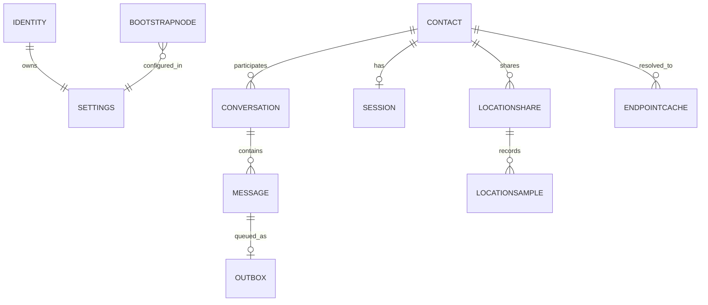

# vMessenger - Local Database

vMessenger has no server, so the on-device database is the single source of truth for the UI and the durable backing store for messaging queues. Everything sensitive is encrypted at rest. This document defines the storage philosophy, encryption, schema (entities, relationships, DAOs), type conversion, reactive queries, migrations, and data-retention/deletion policy.

Encryption key management is detailed in [Security.md](Security.md); how the data layer uses these stores is in [Architecture.md](Architecture.md).

---

## 1. Storage philosophy

- Offline-first: the UI reads from the database and observes it via Flow; the network updates the database. The app is fully usable with no connectivity (reading history, composing, queueing).
- Source of truth: message status, conversations, contacts, and queues live here, not on any server.
- Encrypted at rest: the entire database is encrypted with SQLCipher; additional blobs are encrypted with AEAD. Plaintext exists only in memory while in use.
- Minimal and purposeful: store what the app needs; avoid accumulating metadata. Routing data is cached briefly and expires.

---

## 2. Encryption and engine

- Engine: Room (the Jetpack persistence library) over SQLCipher (encrypted SQLite).
- Key: a random 256-bit database key, wrapped by the Android Keystore master key; supplied to SQLCipher via a `SupportFactory` at open time. The plaintext key is never persisted. See [Security.md](Security.md) Section 12.
- Optional auth binding: the Keystore master key can require device unlock/biometric, so the database opens only when the device is unlocked.
- Blob fields: large or especially sensitive payloads (for example serialized session state, key material) are stored as ChaCha20-Poly1305-sealed bytes under Keystore-wrapped keys, layered on top of SQLCipher.

---

## 3. Entity-relationship overview



---

## 4. Entities

The following are illustrative Room entity definitions. Byte-array columns hold keys, hashes, signatures, and serialized Protobuf. Enums and timestamps use type converters (Section 6).

### 4.1 Identity and keys

```kotlin
@Entity(tableName = "identity")
data class IdentityEntity(
    @PrimaryKey val id: Int = 0,            // single-row table
    val ed25519Public: ByteArray,
    val identityHash: ByteArray,            // SHA-256(ed25519Public)
    val userHash: String,                   // human-readable encoding
    val x25519StaticPublic: ByteArray,
    val createdAtUnixMs: Long
    // Private keys are NOT stored here in plaintext; they are Keystore-wrapped (see Security.md)
)

@Entity(tableName = "key_material")
data class KeyMaterialEntity(
    @PrimaryKey val alias: String,          // logical name, e.g. "identity", "x25519-static"
    val wrappedPrivateKey: ByteArray,       // encrypted (Keystore-wrapped) private key
    val updatedAtUnixMs: Long
)
```

### 4.2 Contact

```kotlin
@Entity(
    tableName = "contact",
    indices = [Index(value = ["identityHash"], unique = true)]
)
data class ContactEntity(
    @PrimaryKey val id: String,             // UUID
    val identityHash: ByteArray,
    val ed25519Public: ByteArray,
    val userHash: String,
    val displayName: String,                // local alias only; never from the network authoritatively
    val verified: Boolean,                  // safety-number verified
    val blocked: Boolean,
    val createdAtUnixMs: Long,
    val lastSeenUnixMs: Long?
)
```

### 4.3 Conversation

```kotlin
@Entity(
    tableName = "conversation",
    foreignKeys = [ForeignKey(
        entity = ContactEntity::class,
        parentColumns = ["id"],
        childColumns = ["contactId"],
        onDelete = ForeignKey.CASCADE
    )],
    indices = [Index("contactId")]
)
data class ConversationEntity(
    @PrimaryKey val id: String,             // UUID
    val contactId: String,                  // 1:1 in MVP; group support added later
    val lastMessageId: String?,
    val lastActivityUnixMs: Long,
    val unreadCount: Int,
    val muted: Boolean
)
```

### 4.4 Message

```kotlin
@Entity(
    tableName = "message",
    foreignKeys = [ForeignKey(
        entity = ConversationEntity::class,
        parentColumns = ["id"],
        childColumns = ["conversationId"],
        onDelete = ForeignKey.CASCADE
    )],
    indices = [Index("conversationId"), Index(value = ["messageId"], unique = true)]
)
data class MessageEntity(
    @PrimaryKey val messageId: String,      // matches wire message_id for dedup
    val conversationId: String,
    val direction: Direction,               // OUTGOING / INCOMING
    val contentType: ContentType,           // TEXT / LOCATION_CONTROL / ...
    val body: String?,                      // text content (already decrypted, stored encrypted-at-rest)
    val replyToMessageId: String?,
    val status: DeliveryStatus,             // QUEUED/SENT/DELIVERED/READ/FAILED
    val createdAtUnixMs: Long,
    val sentAtUnixMs: Long?,
    val deliveredAtUnixMs: Long?,
    val readAtUnixMs: Long?
)
```

### 4.5 Outbox (retry / offline queue)

```kotlin
@Entity(
    tableName = "outbox",
    indices = [Index("conversationId"), Index("nextAttemptUnixMs")]
)
data class OutboxEntity(
    @PrimaryKey val messageId: String,
    val conversationId: String,
    val sealedPayload: ByteArray?,          // optional precomputed payload
    val attemptCount: Int,
    val nextAttemptUnixMs: Long,            // backoff schedule
    val lastError: String?
)
```

### 4.6 Session (encryption state)

```kotlin
@Entity(tableName = "session", indices = [Index(value = ["contactId"], unique = true)])
data class SessionEntity(
    @PrimaryKey val contactId: String,
    val sealedState: ByteArray,             // AEAD-sealed ratchet/session state (see Security.md)
    val updatedAtUnixMs: Long
)
```

### 4.7 Endpoint cache (DHT routing cache)

```kotlin
@Entity(tableName = "endpoint_cache", indices = [Index("identityHash")])
data class EndpointCacheEntity(
    @PrimaryKey val identityHash: ByteArray,
    val endpointsProto: ByteArray,          // serialized endpoints
    val sequence: Long,
    val fetchedAtUnixMs: Long,
    val expiresAtUnixMs: Long               // honor record TTL; purge on expiry
)
```

### 4.8 Live location

```kotlin
@Entity(tableName = "location_share", indices = [Index("contactId")])
data class LocationShareEntity(
    @PrimaryKey val shareId: String,
    val contactId: String,
    val direction: Direction,               // OUTGOING (we share) / INCOMING (they share)
    val active: Boolean,
    val startedAtUnixMs: Long,
    val endedAtUnixMs: Long?
)

@Entity(
    tableName = "location_sample",
    foreignKeys = [ForeignKey(
        entity = LocationShareEntity::class,
        parentColumns = ["shareId"],
        childColumns = ["shareId"],
        onDelete = ForeignKey.CASCADE
    )],
    indices = [Index("shareId"), Index("sampledAtUnixMs")]
)
data class LocationSampleEntity(
    @PrimaryKey(autoGenerate = true) val id: Long = 0,
    val shareId: String,
    val latitude: Double,
    val longitude: Double,
    val accuracyM: Float,
    val speedMps: Float?,
    val headingDeg: Float?,
    val batteryPct: Int?,
    val sampledAtUnixMs: Long
)
```

Location samples are persisted only when the user enables location history (a setting). Without history enabled, incoming samples are rendered live and not stored. This table is the foundation for future location-history and geofencing features (see [Roadmap.md](Roadmap.md)).

### 4.9 Settings and bootstrap configuration

```kotlin
@Entity(tableName = "settings")
data class SettingsEntity(
    @PrimaryKey val id: Int = 0,
    val themeMode: ThemeMode,               // LIGHT / DARK / SYSTEM
    val locationHistoryEnabled: Boolean,
    val screenSecurityEnabled: Boolean,     // FLAG_SECURE
    val requireUnlockForKeys: Boolean,
    val updatedAtUnixMs: Long
)

@Entity(tableName = "bootstrap_node", indices = [Index(value = ["address"], unique = true)])
data class BootstrapNodeEntity(
    @PrimaryKey val address: String,        // host:port
    val publicKey: ByteArray?,
    val source: String,                     // BUILT_IN / COMMUNITY / USER / SELF_HOSTED
    val enabled: Boolean,
    val lastOkUnixMs: Long?
)
```

Note: simple key/value preferences that are not sensitive may live in Jetpack DataStore instead of the `settings` table; sensitive flags stay in the encrypted database. See [Architecture.md](Architecture.md).

---

## 5. DAOs

DAOs expose suspend functions for writes/one-shot reads and `Flow` for observation, enabling the reactive UI described in [Architecture.md](Architecture.md).

```kotlin
@Dao
interface MessageDao {
    @Insert(onConflict = OnConflictStrategy.IGNORE)
    suspend fun insert(message: MessageEntity)

    @Query("SELECT * FROM message WHERE conversationId = :cid ORDER BY createdAtUnixMs ASC")
    fun observeConversation(cid: String): Flow<List<MessageEntity>>

    @Query("UPDATE message SET status = :status, deliveredAtUnixMs = :ts WHERE messageId = :id")
    suspend fun markDelivered(id: String, status: DeliveryStatus, ts: Long)

    @Query("UPDATE message SET status = :status, readAtUnixMs = :ts WHERE messageId = :id")
    suspend fun markRead(id: String, status: DeliveryStatus, ts: Long)
}

@Dao
interface OutboxDao {
    @Insert(onConflict = OnConflictStrategy.REPLACE)
    suspend fun enqueue(item: OutboxEntity)

    @Query("SELECT * FROM outbox WHERE nextAttemptUnixMs <= :now ORDER BY nextAttemptUnixMs ASC")
    suspend fun due(now: Long): List<OutboxEntity>

    @Delete suspend fun remove(item: OutboxEntity)
}

@Dao
interface ContactDao {
    @Query("SELECT * FROM contact WHERE blocked = 0 ORDER BY displayName")
    fun observeContacts(): Flow<List<ContactEntity>>

    @Insert(onConflict = OnConflictStrategy.ABORT)
    suspend fun add(contact: ContactEntity)
}

@Dao
interface ConversationDao {
    @Query("SELECT * FROM conversation ORDER BY lastActivityUnixMs DESC")
    fun observeChats(): Flow<List<ConversationEntity>>
}

@Dao
interface LocationDao {
    @Insert suspend fun insertSample(sample: LocationSampleEntity)

    @Query("SELECT * FROM location_sample WHERE shareId = :sid ORDER BY sampledAtUnixMs ASC")
    fun observeShare(sid: String): Flow<List<LocationSampleEntity>>
}
```

The full set also includes `IdentityDao`, `KeyMaterialDao`, `SessionDao`, `EndpointCacheDao`, `SettingsDao`, and `BootstrapNodeDao`.

---

## 6. Type converters

- Enums (`Direction`, `ContentType`, `DeliveryStatus`, `ThemeMode`) are stored as their stable string names.
- Timestamps are stored as `Long` epoch milliseconds; domain models convert to `Instant`.
- Byte arrays (keys, hashes, signatures, serialized Protobuf) are stored as `BLOB` directly.
- Larger structured payloads are stored as serialized Protobuf bytes and parsed in the data layer with mappers (see [Architecture.md](Architecture.md) Section 4.2).

---

## 7. Reactive queries

- The UI never polls. Conversation lists, message threads, contact lists, and live-location samples are exposed as `Flow` and collected by ViewModels.
- Writes (new message, status change, incoming sample) automatically propagate to the UI via Room's `Flow` invalidation.

---

## 8. Migrations

- Schema is versioned; Room schemas are exported (the schema JSON is committed) for diffing and test-based migration validation.
- Every schema change ships an explicit `Migration` with a migration test that opens an old database and verifies the upgrade.
- Destructive fallback is disabled in release builds; data is never silently dropped on upgrade.
- Protobuf payloads stored as bytes evolve independently using proto3 forward/backward compatibility, decoupling wire/payload evolution from SQL schema changes.

---

## 9. Retention, deletion, and panic

- Per-conversation deletion cascades to messages and outbox entries via foreign keys.
- Location history is opt-in and can be cleared by time range; samples auto-expire if a retention window is configured.
- Endpoint cache entries are purged on TTL expiry.
- Secure wipe / panic: a user-initiated wipe deletes the database and the Keystore-wrapped keys, rendering any residual encrypted bytes permanently unreadable (the wrapping key is destroyed). This is the decentralized equivalent of account deletion.
- `android:allowBackup=false` and exclusion of key/database files from auto-backup prevent secret material from leaving the device. See [Security.md](Security.md).

---

## 10. Performance

- Indices on hot paths: `conversationId`, `identityHash`, `nextAttemptUnixMs`, `sampledAtUnixMs`.
- Paging for long conversations (Paging 3) so threads with large histories scroll efficiently.
- The single-writer outbox worker preserves per-conversation ordering without lock contention (see [Protocol.md](Protocol.md) Section 9).
- Bulk inserts for location samples are batched to reduce write amplification during active sharing.
