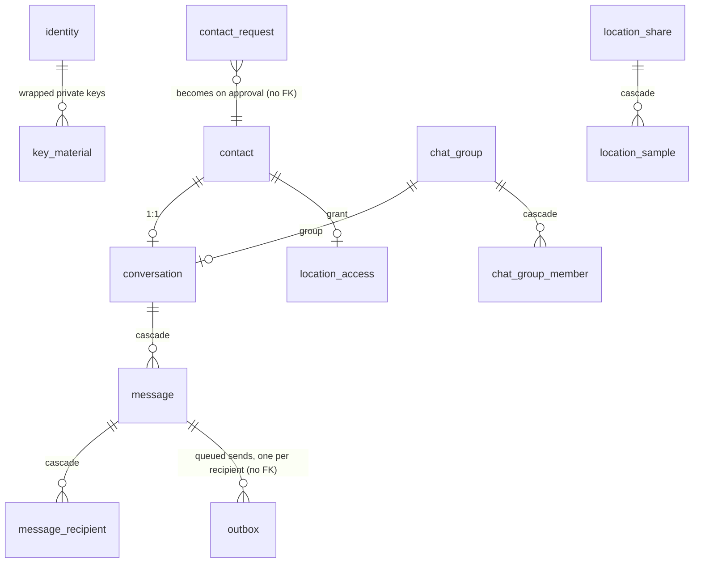

# vMessenger - Local Database

The on-device store: Room over SQLCipher, **schema version 19**.

Everything below is read off `core/database/src/main/kotlin/ir/vmessenger/core/database/` and the exported schema `core/database/schemas/ir.vmessenger.core.database.VMessengerDatabase/19.json`.

---

## 1. Storage philosophy

- The device is the only authority. There is no server copy of messages, contacts or keys, so the local database *is* the user's data.
- Nothing sensitive is written outside it except attachment files, which have their own container ([Security.md](Security.md) §7.2), and the Keystore-wrapped blobs in DataStore.
- `android:allowBackup="false"` — the database is never included in a cloud backup.
- Every enum is persisted as its Kotlin `name`, not an ordinal, so reordering an enum cannot silently reinterpret stored rows.

---

## 2. Engine and encryption

`core/database/.../di/DatabaseModule.kt`

```kotlin
Room.databaseBuilder(context, VMessengerDatabase::class.java, "vmessenger.db")
    .openHelperFactory(SupportOpenHelperFactory(passphrase))   // net.zetetic SQLCipher
    .addMigrations(MIGRATION_1_2 … MIGRATION_18_19)
    .build()
```

- File: `vmessenger.db` (`DatabaseModule.DATABASE_NAME`), also what the secure wipe deletes together with its `-wal` / `-shm` / `-journal` siblings.
- Passphrase: 32 random bytes, Keystore-wrapped, cached for the process lifetime by `DatabaseKeyProvider` under a mutex (see [Security.md](Security.md) §7.1).
- `exportSchema = true`; schemas land in `core/database/schemas/`.
- No `fallbackToDestructiveMigration` — every version step has an explicit migration.
- 20 entities, 19 DAOs.

**Note on the `session` table.** It was declared but never used — sessions are connection-scoped and never persisted ([Protocol.md](Protocol.md) §6) — and was dropped in migration 17 → 18. Nothing references it any more.

**Note on identity-hash columns.** The tables added with groups (`chat_group`, `chat_group_member`, `message_recipient`, `outbox.recipientIdentityHash`, `message.senderIdentityHash`) store an identity hash as the **routing key**: its first 16 bytes, lowercase hex, as produced by `IdentityHashMatcher.routingKeyHex`. Two reasons. Pairing by user hash only ever learns that prefix, so the prefix is the one key on which a group member and a contact row can meet; and these are primary-key and JOIN columns, where a BLOB is awkward to compare, log and re-key in a migration. The older columns (`contact.identityHash`, `mailbox_blob.recipientIdentityHash`) stay BLOB.

---

## 3. Entity-relationship overview


```mermaid
erDiagram
  identity ||--o{ key_material : "wrapped private keys"
  contact ||--o| conversation : "1:1"
  chat_group ||--o| conversation : "group"
  chat_group ||--o{ chat_group_member : "cascade"
  contact ||--o| location_access : "grant"
  conversation ||--o{ message : "cascade"
  message ||--o{ message_recipient : "cascade"
  message ||--o{ outbox : "queued sends, one per recipient (no FK)"
  location_share ||--o{ location_sample : "cascade"
  contact_request }o--|| contact : "becomes on approval (no FK)"
```

A conversation is 1:1 **or** group: exactly one of `contactId` and `groupId` is set. SQLite has no sum type, so both columns are nullable and the invariant is enforced where conversations are created; every read path branches on which one is present.

Seven foreign keys exist (all `ON DELETE CASCADE`, `ON UPDATE NO ACTION`):

| Child | Parent | Effect |
|---|---|---|
| `conversation.contactId` | `contact.id` | deleting a contact deletes the 1:1 conversation |
| `conversation.groupId` | `chat_group.id` | deleting a group deletes its conversation |
| `chat_group_member.groupId` | `chat_group.id` | deleting a group deletes its membership |
| `message.conversationId` | `conversation.id` | deleting a conversation deletes its messages |
| `message_recipient.messageId` | `message.messageId` | deleting a message deletes its delivery rows |
| `location_access.contactId` | `contact.id` | deleting a contact revokes the grant |
| `location_sample.shareId` | `location_share.shareId` | deleting a share deletes its samples |

`outbox` has **no** foreign key on purpose, so deleting a conversation does not silently drop queued rows — callers must call `OutboxDao.removeByConversation` explicitly, otherwise the dispatcher keeps retrying orphans (documented on `ConversationDao.deleteById`).

A second trap is documented on `ConversationDao.update`: never use `upsert` to modify an existing conversation. `@Insert(REPLACE)` is `INSERT OR REPLACE`, which deletes the old row first and cascades away every message in the conversation.

---

## 4. Entities

Types below are the SQLite affinities from `17.json`. `?` marks a nullable column.

### 4.1 `app_metadata`

| Column | Type | Notes |
|---|---|---|
| `id` | INTEGER | PK, always 0 |
| `schemaVersion` | INTEGER | app-written marker |

### 4.2 `identity`

Single row, `id = 0`.

| Column | Type | Notes |
|---|---|---|
| `id` | INTEGER | PK, 0 |
| `ed25519Public` | BLOB | identity public key |
| `identityHash` | BLOB | `SHA256(ed25519Public)` |
| `userHash` | TEXT | `vm2-…` form ([Protocol.md](Protocol.md) §8.5) |
| `displayName` | TEXT | default `""` |
| `x25519StaticPublic` | BLOB | static DH public key |
| `createdAtUnixMs` | INTEGER | |
| `avatarPath` | TEXT? | our own profile photo, in the `VMA1` container; null means the identicon |
| `avatarRevision` | INTEGER | bumped on every change so a peer can tell a new photo from a re-send |

### 4.3 `key_material`

Wrapped private keys. Aliases: `identity-ed25519`, `identity-x25519-static`.

| Column | Type | Notes |
|---|---|---|
| `alias` | TEXT | PK |
| `wrappedPrivateKey` | BLOB | `0x02 ‖ iv ‖ ct`, Keystore AES-GCM, alias-bound AAD |
| `updatedAtUnixMs` | INTEGER | |

### 4.4 `contact`

| Column | Type | Notes |
|---|---|---|
| `id` | TEXT | PK |
| `identityHash` | BLOB | **unique index** `index_contact_identityHash` |
| `ed25519Public` | BLOB | pinned identity key |
| `x25519StaticPublic` | BLOB? | pinned static key; null until learned |
| `userHash` | TEXT | |
| `displayName` | TEXT | |
| `verified` | INTEGER | boolean |
| `blocked` | INTEGER | boolean |
| `relationshipStatus` | TEXT | `ContactRelationshipStatus` name |
| `createdAtUnixMs` | INTEGER | |
| `lastSeenUnixMs` | INTEGER? | last inbound traffic |
| `pendingX25519StaticPublic` | BLOB? | key the peer presented that differs from the pin; the handshake was **refused** |
| `keyChangedAtUnixMs` | INTEGER? | when that happened |
| `avatarPath` | TEXT? | the photo this contact sent, in the `VMA1` container |
| `avatarRevision` | INTEGER | the revision that photo came with; 0 for a contact who has never sent one |

### 4.5 `contact_request`

| Column | Type | Notes |
|---|---|---|
| `requestId` | TEXT | PK; deterministic over (requester, us) |
| `requesterIdentityHash` | BLOB | index `index_contact_request_requesterIdentityHash` |
| `requesterUserHash` | TEXT | derived from the proven identity, not the payload |
| `requesterDisplayName` | TEXT | |
| `requesterEd25519Public` | BLOB | |
| `requesterX25519StaticPublic` | BLOB? | |
| `receivedAtUnixMs` | INTEGER | |
| `status` | TEXT | `ContactRequestStatus` name |
| `rejectCount` | INTEGER | repeat requests are auto-declined silently past a threshold |

### 4.6 `location_access`

| Column | Type | Notes |
|---|---|---|
| `contactId` | TEXT | PK, FK → `contact.id` CASCADE |
| `canSeeMyLocation` | INTEGER | boolean |
| `updatedAtUnixMs` | INTEGER | |

### 4.7 `conversation`

| Column | Type | Notes |
|---|---|---|
| `id` | TEXT | PK |
| `contactId` | TEXT? | FK → `contact.id` CASCADE, index; null for a group |
| `groupId` | TEXT? | FK → `chat_group.id` CASCADE, **unique** index; null for 1:1 |
| `lastMessageId` | TEXT? | chat-list preview pointer |
| `lastActivityUnixMs` | INTEGER | chat-list ordering |
| `unreadCount` | INTEGER | |
| `muted` | INTEGER | boolean |

The index on `groupId` is unique (one conversation per group). SQLite treats NULLs as distinct, so every 1:1 row still passes it.

### 4.8 `message`

| Column | Type | Notes |
|---|---|---|
| `messageId` | TEXT | PK; also **unique index** `index_message_messageId` |
| `conversationId` | TEXT | FK → `conversation.id` CASCADE |
| `direction` | TEXT | `MessageDirection` name |
| `contentType` | TEXT | `MessageContentType` name |
| `body` | TEXT? | chat text |
| `replyToMessageId` | TEXT? | quoted message |
| `status` | TEXT | `DeliveryStatus` name |
| `createdAtUnixMs` | INTEGER | local insert time; the ordering key |
| `sentAtUnixMs` | INTEGER? | |
| `deliveredAtUnixMs` | INTEGER? | clamped receipt time |
| `readAtUnixMs` | INTEGER? | clamped receipt time |
| `attachmentName` | TEXT? | |
| `attachmentMimeType` | TEXT? | |
| `attachmentSizeBytes` | INTEGER? | |
| `attachmentPath` | TEXT? | app-private path |
| `attachmentSha256` | BLOB? | plaintext digest from the transfer header |
| `attachmentEncrypted` | INTEGER | true when the file is in the `VMA1` container |
| `senderIdentityHash` | TEXT? | routing key of an incoming group message's sender; null in 1:1 and for our own |
| `caption` | TEXT? | text sent alongside an attachment |
| `attachmentDurationMs` | INTEGER? | voice/video length, known before the file arrives |
| `attachmentWaveform` | BLOB? | exactly 64 amplitude buckets (one byte each, 0..255) |
| `editedAtUnixMs` | INTEGER? | when the sender last edited it; null for a message that never was |

Indices:

| Index | Columns | Purpose |
|---|---|---|
| `index_message_conversationId` | `conversationId` | FK support |
| `index_message_messageId` | `messageId` (unique) | dedup |
| `index_message_conv_dir_status` | `conversationId, direction, status` | unread scans, `markIncomingRead` |
| `index_message_conv_created` | `conversationId, createdAtUnixMs` | windowed paging (added in v17) |

### 4.9 `outbox`

One row per **pending delivery of one message to one recipient**.

| Column | Type | Notes |
|---|---|---|
| `messageId` | TEXT | PK part 1 |
| `recipientIdentityHash` | TEXT | PK part 2; routing key of the member this row delivers to |
| `conversationId` | TEXT | index |
| `envelopeBytes` | BLOB? | the exact envelope to send, when the dispatcher cannot rebuild it (group control) |
| `attemptCount` | INTEGER | |
| `nextAttemptUnixMs` | INTEGER | index; `0` means due now |
| `lastError` | TEXT? | stable failure code, surfaced in the chat UI |
| `receiptWaitCount` | INTEGER | re-sends after transport delivery while waiting for a receipt |

A group message fans out to N rows sharing a `messageId`; a 1:1 message is the N = 1 case, so there is one delivery pipeline rather than two. Backoff, receipt waiting and the mailbox hand-off are therefore **per recipient**: one unreachable member never stalls delivery to the rest.

`envelopeBytes` exists because a group control describes the group *at its version*, not as it will be by the time a retry runs; ordinary messages leave it null and the dispatcher rebuilds their envelope from the message row.

### 4.10 `message_recipient`

Per-recipient delivery state of an outgoing message.

| Column | Type | Notes |
|---|---|---|
| `messageId` | TEXT | PK part 1; FK → `message.messageId` CASCADE |
| `identityHash` | TEXT | PK part 2; routing key of the recipient; index |
| `status` | TEXT | `DeliveryStatus` name |
| `sentAtUnixMs` | INTEGER? | |
| `deliveredAtUnixMs` | INTEGER? | |
| `readAtUnixMs` | INTEGER? | |

`MessageRecipientDao.advance` only ever moves a row forward (QUEUED → SENT → DELIVERED → READ, with FAILED just above QUEUED so a later success overwrites it), so a re-send or an out-of-order receipt cannot regress the state the aggregate is computed from. `DeliveryAggregator` collapses these rows into `message.status`: READ when all read, DELIVERED when all delivered, FAILED when all failed, SENT when any is on the wire.

### 4.11 `chat_group`

| Column | Type | Notes |
|---|---|---|
| `id` | TEXT | PK; the wire `group_id` (16 random bytes) as lowercase hex |
| `name` | TEXT | ≤ 64 chars |
| `creatorIdentityHash` | TEXT | routing key of the creator |
| `createdAtUnixMs` | INTEGER | |
| `version` | INTEGER | creator-assigned revision of the membership |
| `closed` | INTEGER | boolean: creator closed it, we left, or we were removed |
| `avatarSeed` | TEXT | identicon seed, derived from `id` at creation |

### 4.12 `chat_group_member`

| Column | Type | Notes |
|---|---|---|
| `groupId` | TEXT | PK part 1; FK → `chat_group.id` CASCADE |
| `identityHash` | TEXT | PK part 2; routing key; index |
| `identityPub` | BLOB | Ed25519 identity key, so fan-out can reach a non-contact |
| `x25519StaticPub` | BLOB? | |
| `displayName` | TEXT | name from the group snapshot; the user's own contact name wins when they have one |
| `role` | TEXT | `GroupMemberRole` name (`CREATOR`/`MEMBER`) |
| `joinedAtUnixMs` | INTEGER | |
| `removedAtUnixMs` | INTEGER? | tombstone: non-null means no longer active |

Leaving is a tombstone rather than a delete, so a control message that arrives after a member left is recognised instead of silently re-adding them.

### 4.13 `endpoint_cache`

| Column | Type | Notes |
|---|---|---|
| `identityHash` | BLOB | PK, index |
| `endpointsProto` | BLOB | serialized record |
| `sequence` | INTEGER | monotonic per publisher |
| `fetchedAtUnixMs` | INTEGER | |
| `expiresAtUnixMs` | INTEGER | purge key |

### 4.14 `bootstrap_node` and `relay_node`

Identical shape, one per role.

| Column | Type | Notes |
|---|---|---|
| `address` | TEXT | PK, **unique index** |
| `publicKey` | BLOB? | |
| `source` | TEXT | `BUILT_IN`, `USER`, `PEER_EXCHANGE`, `CACHED_DHT` |
| `enabled` | INTEGER | community nodes are stored **disabled** |
| `lastOkUnixMs` | INTEGER? | |
| `priority` | INTEGER | default 100 |
| `lastFailUnixMs` | INTEGER? | |
| `failCount` | INTEGER | reset to 0 by `markOk` |
| `trust` | TEXT | `NodeTrust` name, default `COMMUNITY` |
| `learnedFromHash` | BLOB? | identity hash of the peer that told us |

Ranking is **not** done in SQL: `getEnabled()` returns rows unordered and `core/common/.../network/NodeRanking.kt` applies the policy — healthy bucket first (`failCount < 3`), then `priority DESC`, `failCount ASC`, `lastOkUnixMs DESC`. Default priorities: user 150, built-in 100, official 100, community 80.

### 4.15 `location_share` and `location_sample`

| `location_share` | Type | Notes |
|---|---|---|
| `shareId` | TEXT | PK |
| `contactId` | TEXT | index |
| `direction` | TEXT | `MessageDirection` name (outgoing = we share) |
| `active` | INTEGER | boolean |
| `startedAtUnixMs` | INTEGER | |
| `endedAtUnixMs` | INTEGER? | |

| `location_sample` | Type | Notes |
|---|---|---|
| `id` | INTEGER | PK, autogenerated |
| `shareId` | TEXT | FK → `location_share.shareId` CASCADE, index |
| `latitude` / `longitude` | REAL | |
| `accuracyM` | REAL | |
| `speedMps` / `headingDeg` | REAL? | |
| `batteryPct` | INTEGER? | |
| `sampledAtUnixMs` | INTEGER | index, retention key |

### 4.16 `mailbox_blob`

| Column | Type | Notes |
|---|---|---|
| `blobId` | TEXT | PK; content-addressed `hex(SHA256(sealed))[0..32)` |
| `recipientIdentityHash` | BLOB | index |
| `sealedPayload` | BLOB | `crypto_box_seal` output; never plaintext |
| `expiresAtUnixMs` | INTEGER | index, purge key |
| `createdAtUnixMs` | INTEGER | |
| `senderIdentityHash` | BLOB? | authenticated peer that stored it; null when queued by this device. Backs the per-sender quota |

### 4.17 `dht_record`

Embedded-DHT record store (off by default).

| Column | Type | Notes |
|---|---|---|
| `recordKey` | TEXT | PK |
| `recordProto` | BLOB | |
| `sequence` | INTEGER | |
| `expiresAtUnixMs` | INTEGER | |
| `storedAtUnixMs` | INTEGER | eviction order |

---

### 4.18 `pending_revoke`

A contact we deleted who has not been told yet. **Deliberately has no foreign key to `contact`** —
the row's whole purpose is to outlive the contact it is about, so a peer who was offline when they
were deleted still finds out. It carries only what is needed to dial them once more.

| Column | Type | Notes |
|---|---|---|
| `identityHash` | BLOB | PK |
| `ed25519Public` | BLOB | needed to dial without the contact row |
| `x25519StaticPublic` | BLOB? | null when it was never learned |
| `requestId` | TEXT | the revoke's own id, so a replay is idempotent |
| `createdAtUnixMs` | INTEGER | the row expires a week after this |
| `attemptCount` | INTEGER | |
| `nextAttemptUnixMs` | INTEGER | exponential backoff |

Purged by the secure wipe along with everything else in the database.

---

## 5. Enums and type converters

`core/database/.../converter/EnumConverters.kt` stores every enum as `value.name` (TEXT) and reads it back with `valueOf`. An unknown stored value therefore **throws** rather than silently mapping to a default — except `NodeTrust`, which is stored as a plain `String` column and parsed by `NodeTrust.fromName`, falling back to `COMMUNITY`.

| Enum | Values | Used by |
|---|---|---|
| `MessageDirection` | `OUTGOING`, `INCOMING` | `message.direction`, `location_share.direction` |
| `MessageContentType` | `TEXT`, `LOCATION_CONTROL`, `RECEIPT`, `IMAGE`, `VIDEO`, `FILE`, `AUDIO`, `GROUP_CONTROL` | `message.contentType` |
| `DeliveryStatus` | `QUEUED`, `SENT`, `DELIVERED`, `READ`, `FAILED` | `message.status` |
| `ContactRelationshipStatus` | `APPROVED`, `PENDING_OUT`, `PENDING_IN`, `REJECTED` | `contact.relationshipStatus` |
| `ContactRequestStatus` | `PENDING`, `ACCEPTED`, `REJECTED` | `contact_request.status` |
| `GroupMemberRole` | `CREATOR`, `MEMBER` | `chat_group_member.role` |
| `NodeTrust` (not a converter) | `BUILT_IN`, `USER`, `OFFICIAL`, `COMMUNITY` | `relay_node.trust`, `bootstrap_node.trust` |

Several queries hard-code the stored names (`WHERE status = 'PENDING'`, `direction = 'INCOMING'`, `status != 'READ'`), so renaming an enum constant requires a migration.

---

## 6. DAO surface

Eighteen DAOs, all in `core/database/.../dao/`. Suspend functions for one-shot work, `Flow` for anything the UI observes.

| DAO | Notable operations |
|---|---|
| `AppMetadataDao` | `get`, `upsert` |
| `IdentityDao` | `observeIdentity` (Flow), `getIdentity`, `insertIdentity`, `deleteAll` |
| `KeyMaterialDao` | `getByAlias`, `insert`, `deleteAll` |
| `ContactDao` | `observeContacts` (Flow, non-blocked, name-sorted `COLLATE NOCASE`), `getById`, `getByIdentityHash`, `getByRoutingKey`, `getByEd25519Public`, `getAll`, `touchLastSeen`, `recordPendingKeyChange`, `insert` (ABORT on conflict), `update`, `deleteById`, `deleteAll` |
| `ContactRequestDao` | `observePending` (Flow), `getById`, `getByRequesterHash`, `rejectCountOf`, `upsert`, `update`, `deleteById`, `deleteByRequesterHash` |
| `LocationAccessDao` | `observeGranted`, `observeAll`, `getByContactId`, `grantedContactIds`, `upsert`, `deleteByContactId` |
| `ConversationDao` | `upsert`, **`update`** (never upsert an existing row — §3), `observeAll`, `observeAllWithPreview`, `observeChatList`, `getById`, `getByContactId`, `getByGroupId`, `resetUnread`, `setMuted`, `deleteById`, `setLastMessageId` |
| `MessageDao` | `insert` (IGNORE on conflict), `observeConversation(cid)`, `observeConversation(cid, limit)`, `markSent`/`markDelivered`/`markRead`/`updateStatus`, `getById`, `getByIdInConversation`, `selectUnreadIncomingIds`, `selectUnreadIncoming`, `markIncomingRead`, `countForConversation`, `indexOf`, `latestMessageId`, `attachmentPaths`, `deleteById`, `deleteByConversation` |
| `OutboxDao` | `enqueue`, `due(now)`, `remove(messageId, recipient)`, `removeAll(messageId)`, `removeByConversation`, `forMessage`, `pendingRecipients`, `resetBackoff`, `resetBackoffFor`, `update` |
| `MessageRecipientDao` | `insertAll`, `forMessage`, `advance` (monotonic), `markFailed`, `deleteForMessage` |
| `GroupDao` | `upsert`, `getById`, `observe`, `setName`, `setVersion`, `setClosed`, `upsertMembers`, `observeActiveMembers`, `activeMembers`, `member`, `markRemoved`, `replaceMembers`, `deleteById` |
| `EndpointCacheDao` | `upsert`, `get`, `purgeExpired`, `delete` |
| `BootstrapNodeDao` / `RelayNodeDao` | `upsert`, `observeAll`, `observeEnabled` (bootstrap only), `getEnabled` (unordered), `getAll`, `getByAddress`, `markOk`, `markFail`, `setEnabled`, `deleteByAddress` |
| `LocationShareDao` | `upsert`, `observeActive`, `getById`, `getActiveByContact`, `getActiveByContactAndDirection`, `update`, `deleteByContact`, `allShareIds`, `deleteEndedBefore` |
| `LocationSampleDao` | `insert`, `observeLatest`, `getLatest`, `observeLatestPerShare`, `purgeOlderThan`, `deleteExcessForShare` |
| `MailboxDao` | `upsert`, `forRecipient`, `getById`, `countActive`, `countBySenderSince`, `delete`, `deleteForRecipient`, `purgeExpired` |
| `DhtRecordDao` | `active(now)`, `count`, `upsert`, `purgeExpired`, `evictOldest` |

Three projection types keep the UI off N+1 queries:

| Type | Built by | Contents |
|---|---|---|
| `ChatListRow` | `ConversationDao.observeChatList` | one JOIN over `conversation` + `contact` + `chat_group` + last `message` + that message's group member; the chat list renders it verbatim |
| `ConversationWithPreview` | `ConversationDao.observeAllWithPreview` | conversation plus the last message body |
| `MessageWithReply` | `MessageDao.observeConversation(cid, limit)` | message + quoted-message preview (self LEFT JOIN) + the outbox `lastError` + the group sender's display name |
| `UnreadIncoming` | `MessageDao.selectUnreadIncoming` | unread incoming ids with their group sender, so a read receipt in a group is addressed per sender |

`observeConversation(cid, limit)` is the paging query: `ORDER BY createdAtUnixMs DESC, messageId DESC LIMIT :limit`, rendered with `reverseLayout = true` so a new message never shifts the scroll anchor. "Load earlier" grows `limit`. `indexOf(cid, messageId)` returns the zero-based position in that same total order (or `-1`) so the window can be grown until a quoted message is inside it.

---

## 7. Migrations

`core/database/.../migration/Migrations.kt`; all seventeen are registered in `DatabaseModule`.

| Step | Adds |
|---|---|
| 1 → 2 | `identity`, `key_material` |
| 2 → 3 | `contact` + unique index on `identityHash` |
| 3 → 4 | `endpoint_cache`, `bootstrap_node` |
| 4 → 5 | `conversation`, `message`, `outbox`, `session` (+ their indices) |
| 5 → 6 | `location_share`, `location_sample` |
| 6 → 7 | `contact.x25519StaticPublic` |
| 7 → 8 | `bootstrap_node.priority` / `lastFailUnixMs` / `failCount`; new `relay_node` table |
| 8 → 9 | `mailbox_blob` |
| 9 → 10 | `dht_record` |
| 10 → 11 | `identity.displayName` |
| 11 → 12 | `contact.relationshipStatus`; `contact_request`; `location_access` |
| 12 → 13 | `message.attachmentName` / `attachmentMimeType` / `attachmentSizeBytes` / `attachmentPath` |
| 13 → 14 | `contact_request.rejectCount` |
| 14 → 15 | `outbox.receiptWaitCount` |
| 15 → 16 | **Protocol v2 batch** — see below |
| 16 → 17 | `CREATE INDEX index_message_conv_created ON message(conversationId, createdAtUnixMs)` |
| 17 → 18 | groups (`chat_group`, `chat_group_member`), per-recipient delivery (`message_recipient`, re-keyed `outbox`), group-aware `conversation`, voice/caption/sender columns on `message`; drops `session` |
| 18 → 19 | message edit, profile photos, and the pending-revoke queue — see below |

### 18 → 19 in detail

Exported as `MIGRATION_18_19_STATEMENTS`, like 15 → 16, so a plain-SQLite test can replay it
without Room. Entirely additive — five `ADD COLUMN`s and one `CREATE TABLE`, no table rewrite,
because nothing about an existing row changes meaning:

- `message.editedAtUnixMs`, null on every existing row, which is what "never edited" already was.
- `contact.avatarPath` / `avatarRevision` and `identity.avatarPath` / `avatarRevision`. A contact
  with no photo keeps a null path at revision 0, which is indistinguishable from a peer who has
  never sent a profile update — so old rows need no back-fill.
- `pending_revoke` (§4.18), with no foreign key, for the same reason the table exists at all.

Delete-for-everyone needed no column: it is stored as a `MESSAGE_CONTROL` row and a `DELETED`
content type on the message it refers to, both of which are enum names in existing columns.

### 15 → 16 in detail

Exported as `MIGRATION_15_16_STATEMENTS` so a plain-SQLite test can replay it without Room:

- Static-key pinning: `contact.pendingX25519StaticPublic`, `contact.keyChangedAtUnixMs`.
- Mailbox per-sender quota: `mailbox_blob.senderIdentityHash`.
- Attachments: `message.attachmentSha256`, `message.attachmentEncrypted` (default 0), index `index_message_conv_dir_status`.
- Node trust: `trust` (default `'COMMUNITY'`) and `learnedFromHash` on both `relay_node` and `bootstrap_node`; existing rows are back-filled from `source` (`BUILT_IN` → `BUILT_IN`, `USER` → `USER`); rows whose source is `PEER_EXCHANGE` or `CACHED_DHT` are **disabled** (`enabled = 0`), which is the data-layer half of the node-trust model.

### 16 → 17 in detail

Also exported as `MIGRATION_16_17_STATEMENTS`. `MessageDao.observeConversation(cid, limit)` runs `WHERE conversationId = ? ORDER BY createdAtUnixMs DESC LIMIT ?`; without the composite index SQLite sorted the whole conversation on every emission. The index turns the window into a bounded index scan.

### 17 → 18 in detail

The largest step so far, and the only one that recreates tables. SQLite cannot relax a NOT NULL column or change a primary key, so `conversation` and `outbox` are rebuilt with INSERT-SELECT / DROP / RENAME. Room runs migrations with `foreign_keys = OFF` and validates afterwards, which is what makes dropping the old `conversation` safe — otherwise its cascade would take every message with it.

- adds `chat_group`, `chat_group_member` (+ index on `identityHash`);
- recreates `conversation` with a nullable `contactId`, a `groupId`, its FKs and the unique `groupId` index;
- adds `message.senderIdentityHash`, `caption`, `attachmentDurationMs`, `attachmentWaveform`;
- adds `message_recipient` (+ index on `identityHash`);
- recreates `outbox` keyed on `(messageId, recipientIdentityHash)` and re-keys existing rows with `lower(substr(hex(contact.identityHash), 1, 32))`, joining through the conversation to its contact. A queued row whose contact vanished has no recipient to address and is dropped by the JOIN — which is what the dispatcher would have done with it anyway;
- drops the dead `session` table (missed in migration 16).

`MigrationTest` (`core/database/src/test/…/migration/`) replays every migration 1 → 18 on a real SQLite engine — `sqlite-jdbc` behind a `SupportSQLiteDatabase` built as a dynamic proxy that only implements `execSQL` — and asserts the re-key, the dropped table, the nullable `contactId` and the unique-per-group constraint. Room does not type-check migration SQL, so without this a broken statement is only found on a user's device.

### Gaps in the exported schema history

`core/database/schemas/ir.vmessenger.core.database.VMessengerDatabase/` contains `1, 2, 6, 7, 8, 9, 10, 12, 13, 14, 15, 16, 17, 18.json`. **Versions 3, 4, 5 and 11 have no exported JSON** because they were never committed as released database versions — the migrations exist (and run) but the intermediate schema was folded into the next commit before export. The gap is expected and is not a missing-file bug. Room only validates against the *current* version's JSON, and the migration chain is continuous, so upgrades from any shipped version still work.

---

## 8. Reactive queries

DAOs return `Flow<T>` for anything the UI observes; Room re-emits on every write to the underlying tables. Repositories map entities to domain models and the ViewModels expose `StateFlow`. Nothing in the UI polls the database.

The chat list is a single `observeChatList()` flow, so adding a contact, receiving a message and a status change all arrive as one recomposition rather than a per-row fan-out.

---

## 9. Retention and deletion

| Scope | Behaviour |
|---|---|
| Delete one message | `MessageDao.deleteById` — local copy only, nothing is sent to the peer; its `message_recipient` rows cascade and the caller drops its `outbox` rows with `removeAll` |
| Delete a conversation | `ConversationDao.deleteById` cascades messages (and their `message_recipient` rows); the caller must also `OutboxDao.removeByConversation` and erase files listed by `MessageDao.attachmentPaths` |
| Delete a contact | cascades the 1:1 `conversation` (and therefore its `message` rows) and `location_access`; `MailboxDao.deleteForRecipient` and `ContactRequestDao.deleteByRequesterHash` clean up the rest. Group membership is **not** touched: the group is creator-authoritative, so deleting a contact removes our ability to reach them, not their membership |
| Location retention | `LocationSampleDao.purgeOlderThan` (window) and `deleteExcessForShare` (cap per share); `LocationShareDao.deleteEndedBefore` removes finished shares and cascades their samples |
| Endpoint cache | `purgeExpired(now)` |
| Mailbox | `purgeExpired(now)`; per-sender quota via `countBySenderSince` |
| DHT records | `purgeExpired(now)` plus `evictOldest(excess)` by `storedAtUnixMs` |
| Leave / close a group | sets `chat_group.closed`; the history stays readable. Nothing deletes `chat_group`, so a closed group is never silently emptied |
| Secure wipe | `clearAllTables()` → `close()` → delete `vmessenger.db` and its journal siblings → destroy the Keystore master key ([Security.md](Security.md) §9) |

---

## 10. Performance notes

- Every foreign key column is indexed, so cascades and joins do not table-scan.
- `index_message_conv_created` (v17) and `index_message_conv_dir_status` (v16) cover the two hot message queries: windowed paging and the unread scan.
- `outbox(nextAttemptUnixMs)` is indexed so `due(now)` is a range scan; the dispatcher drains at most 8 `(conversation, recipient)` pairs in parallel, so one unreachable group member does not hold up the others.
- `ContactDao.getByRoutingKey` matches on `lower(substr(hex(identityHash), 1, 32))`, which no index covers. It is a scan over a table of tens of rows, traded for the ability to resolve a partial (user-hash) and a full identity hash to the same contact.
- Node ranking is done in Kotlin (`NodeRanking`), not SQL, so the policy is unit-testable and the DAO stays a plain query catalogue.
- `LocationSampleDao.observeLatestPerShare` uses `id IN (SELECT MAX(id) … GROUP BY shareId)`, which is reactive on the sample table so the map refreshes on every new position rather than only when shares start and stop.
