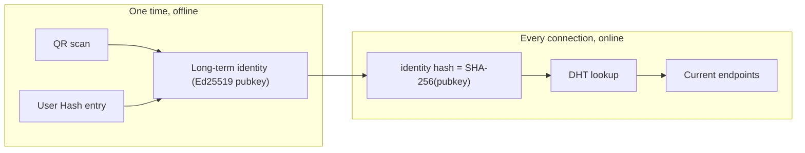
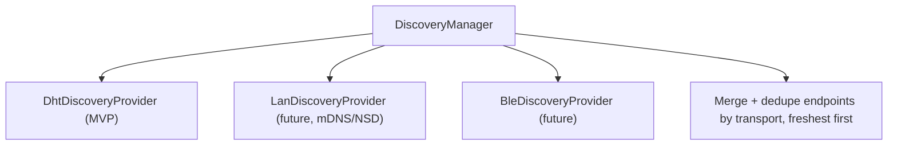
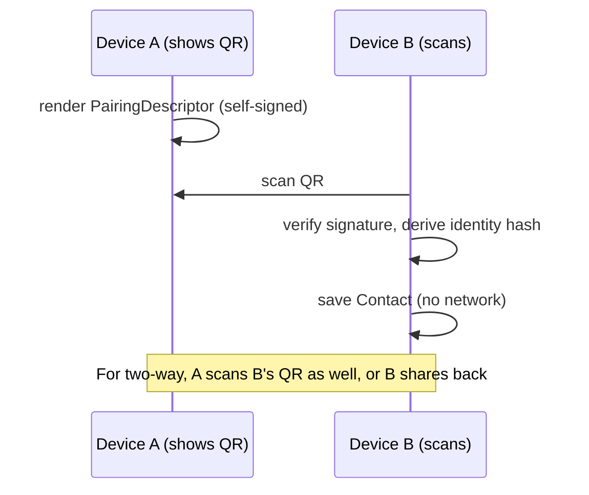
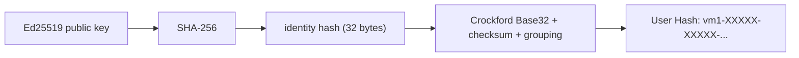
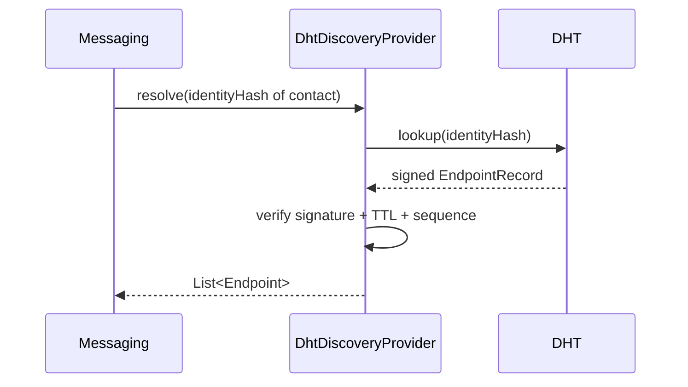

# vMessenger - Peer Discovery

This document specifies the Discovery layer: how an identity becomes reachable and how a peer's current network endpoints are found. Discovery is deliberately modular and completely independent from Messaging - Messaging asks Discovery "where is identity X right now?" and never cares how the answer was obtained.

Related: the DHT that backs Internet discovery is in [DHT.md](DHT.md); joining the DHT is in [Bootstrap.md](Bootstrap.md); the cryptography of pairing and signed records is in [Security.md](Security.md); wire formats are in [Protocol.md](Protocol.md).

---

## 1. The discovery problem

vMessenger separates two very different questions that other apps conflate:

1. Who is this person? - a long-term, stable identity (Ed25519 public key). Exchanged once, in person or out-of-band, via QR or User Hash. Never changes.
2. Where are they right now? - an ephemeral set of network endpoints that changes constantly as devices move between networks. Resolved on demand via the DHT.



Keeping these separate is what lets the network stay decentralized: identity is sovereign and offline-exchangeable, while routing is ephemeral, signed, and replaceable.

---

## 2. Independence from Messaging

The only coupling between Discovery and Messaging is a single contract:

```kotlin
interface DiscoveryProvider {
    val id: DiscoveryProviderId
    suspend fun announce(self: Identity, endpoints: List<Endpoint>): Result<Unit>
    suspend fun resolve(identityHash: IdentityHash): Result<List<Endpoint>>
}
```

- `announce` makes this device findable (MVP: publish a signed endpoint record into the DHT).
- `resolve` turns a contact's identity hash into current endpoints.

Messaging depends only on this interface. Swapping the DHT for mDNS/LAN discovery, BLE discovery, or a future technique is a binding change, not a refactor.

---

## 3. Provider registry and selection

Multiple providers can be active at once; they are injected as a set (Hilt multibinding) and coordinated by a `DiscoveryManager`.



- `resolve` queries providers in parallel and merges results; endpoints are tagged by transport (see [Network.md](Network.md)) and ranked by freshness and reachability.
- `announce` fans out to all providers so the device is discoverable through every available channel.
- For the MVP only `DhtDiscoveryProvider` is registered; the others are designed-for and added later (see [Roadmap.md](Roadmap.md)).

---

## 4. Identity exchange: QR pairing

QR is the strongest pairing method because it is in-person and offline - an authenticated key exchange with no network and no MITM opportunity.

- The "My QR Code" screen renders a `PairingDescriptor` (see [Protocol.md](Protocol.md) Section 12) containing the Ed25519 public key, the User Hash, an optional display label, a version, and a self-signature.
- The QR Scanner screen decodes the descriptor, verifies the self-signature, derives the identity hash, and creates a `Contact`. No endpoints are exchanged.
- Encoding: the serialized Protobuf descriptor is Base32/Base45-encoded into the QR for density and reliable scanning; the payload is small (a public key plus metadata).



---

## 5. Identity exchange: User Hash pairing

When scanning is impractical, users exchange a User Hash out-of-band (spoken, messaged through another channel, printed).

- Derivation: `identity hash = SHA-256(Ed25519 public key)`. The User Hash is a human-readable, checksummed encoding of that identity hash.
- Encoding goals: typable, unambiguous (avoid easily confused characters), checksummed to catch typos, and chunked for readability.
- Proposed format: a Base32 (Crockford) encoding of a truncated-with-checksum identity hash, grouped into blocks, with a short human-readable prefix, for example `vm1-XXXXX-XXXXX-XXXXX-XXXX`. The version prefix (`vm1`) allows the format to evolve; the trailing block carries a checksum.
- Security note: the User Hash binds to the full public key via SHA-256. Because it may be truncated for usability, vMessenger treats hash-only pairing as needing confirmation: after resolving and connecting, the full key is verified during the handshake, and a Safety Number screen lets users confirm in-band (see [Security.md](Security.md) Section 11).



---

## 6. Endpoint resolution via the DHT (MVP)

Once a contact's identity is known, reaching them is a DHT operation.

- Announce: this device publishes a signed `EndpointRecord` keyed by its identity hash, listing its current endpoints with a TTL (see [DHT.md](DHT.md)).
- Resolve: to message a contact, the app looks up the contact's identity hash, retrieves the signed record, verifies the signature against the contact's known public key, and hands the endpoints to the Transport selector.



Verification rules (also in [Security.md](Security.md)):

- Signature must validate against the public key whose SHA-256 equals the looked-up identity hash.
- Expired records (past TTL) are discarded; the freshest valid sequence number wins.

---

## 7. Privacy considerations

- Pairing leaks nothing to the network (offline).
- Announce publishes only ephemeral, signed endpoint hints - never identity, contacts, or content.
- Resolve reveals to storing DHT nodes that someone is interested in a particular identity hash. This metadata exposure is a known MVP limitation; mitigations (private lookups, lookup blinding) are future work (see [Security.md](Security.md) Section 17 and [Roadmap.md](Roadmap.md)).
- Endpoint records have short TTLs so stale location/IP exposure is minimized.

---

## 8. Future discovery providers

The same `DiscoveryProvider` contract absorbs future mechanisms with no impact on Messaging:

- LAN discovery (mDNS / Android NSD): zero-infrastructure discovery on the same Wi-Fi; ideal for offline/local use and faster than the DHT when peers are co-located.
- BLE discovery: advertise/scan for nearby peers, feeding Bluetooth-tagged endpoints.
- Wi-Fi Direct discovery: peer-to-peer group formation for transport without an access point.
- Mesh discovery: multi-hop neighbor discovery for store-and-forward routing.

Each provider produces transport-tagged endpoints; the `DiscoveryManager` merges them, and the `TransportSelector` (see [Network.md](Network.md)) picks the best path automatically.
