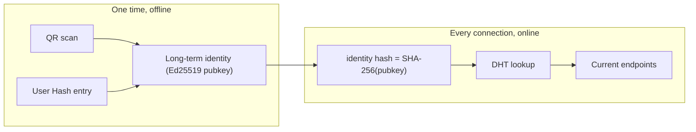
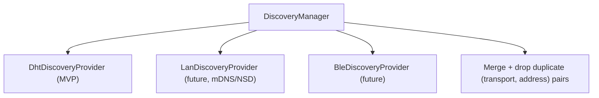
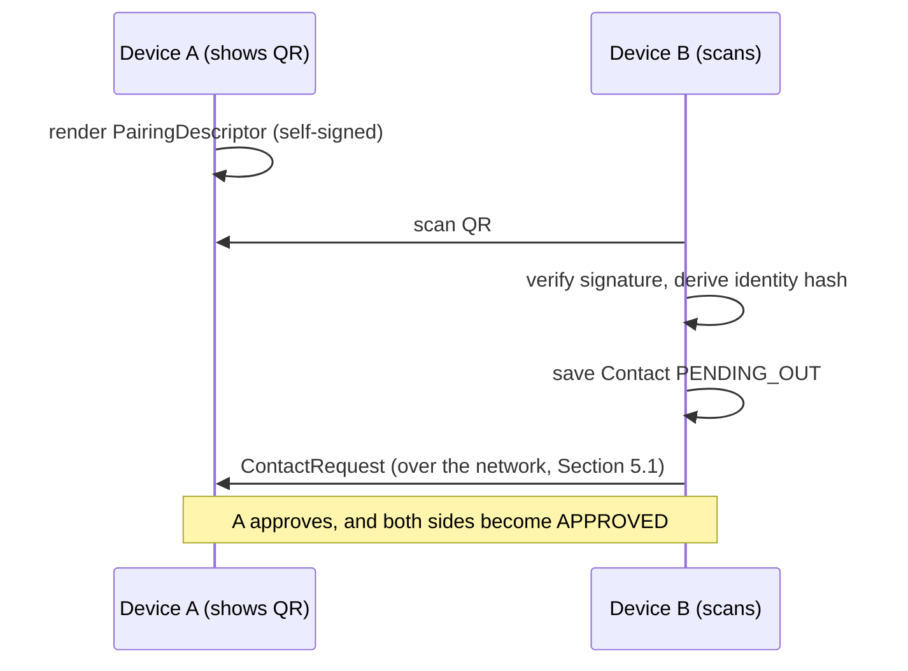
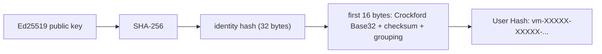
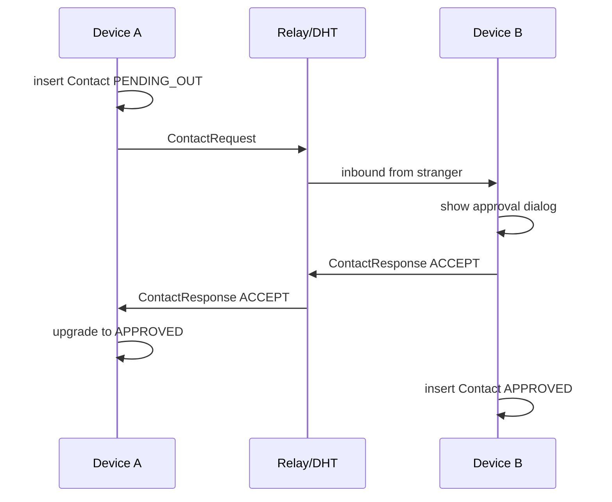
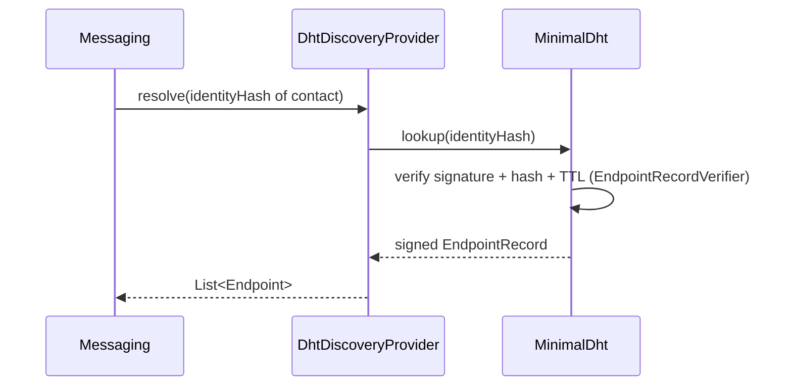

# vMessenger - Peer Discovery

This document specifies the Discovery layer: how an identity becomes reachable and how a peer's current network endpoints are found. Discovery is deliberately modular and completely independent from Messaging - Messaging asks Discovery "where is identity X right now?" and never cares how the answer was obtained.

Related: the DHT that backs Internet discovery, and how a device joins it, are in [DHT.md](DHT.md); the cryptography of pairing and signed records is in [Security.md](Security.md); wire formats are in [Protocol.md](Protocol.md).

---

## 1. The discovery problem

vMessenger separates two very different questions that other apps conflate:

1. Who is this person? - a long-term, stable identity (Ed25519 public key). Exchanged once, in person or out-of-band, via QR or User Hash. Never changes.
2. Where are they right now? - an ephemeral set of network endpoints that changes constantly as devices move between networks. Resolved on demand via the DHT.


```mermaid
flowchart LR
  subgraph oncePhase [One time, offline]
    QR["QR scan"] --> Idp["Long-term identity (Ed25519 pubkey)"]
    UH["User Hash entry"] --> Idp
  end
  subgraph live [Every connection, online]
    Idp --> Hash["identity hash = SHA-256(pubkey)"]
    Hash --> DHT["DHT lookup"]
    DHT --> Eps["Current endpoints"]
  end
```

Keeping these separate is what lets the network stay decentralized: identity is sovereign and offline-exchangeable, while routing is ephemeral, signed, and replaceable.

---

## 2. Independence from Messaging

The only coupling between Discovery and Messaging is a single contract:

```kotlin
// network/discovery/.../DiscoveryProvider.kt
interface DiscoveryProvider {
    val id: DiscoveryProviderId
    suspend fun announce(
        self: DiscoveryIdentity,
        endpoints: List<Endpoint>,
        ed25519PrivateKey: ByteArray,
    ): AppResult<Unit>
    suspend fun resolve(identityHash: ByteArray): AppResult<List<Endpoint>>
}
```

- `announce` makes this device findable (MVP: publish a signed endpoint record into the DHT).
- `resolve` turns a contact's identity hash into current endpoints.

Messaging reaches this interface only through `EndpointResolveService`, which consults the verified peer cache first and adds the relay fallback (Section 6). Swapping the DHT for mDNS/LAN discovery, BLE discovery, or a future technique is a binding change, not a refactor.

---

## 3. Provider registry and selection

Multiple providers can be active at once; they are injected as a set (Hilt multibinding) and coordinated by a `DiscoveryManager`.


```mermaid
flowchart TD
  Manager["DiscoveryManager"] --> P1["DhtDiscoveryProvider (MVP)"]
  Manager --> P2["LanDiscoveryProvider (future, mDNS/NSD)"]
  Manager --> P3["BleDiscoveryProvider (future)"]
  Manager --> Merge["Merge + drop duplicate (transport, address) pairs"]
```

- `resolve` asks the providers one after another and merges what they return, dropping duplicate (transport, address) pairs; it fails only when every provider failed. Endpoints are tagged by transport and ordered later, by `EndpointOrder` (see [Network.md](Network.md) §5).
- `DiscoveryManager.announce` tries the providers in turn and stops at the first success. The app does not call it today: it publishes through `DhtDiscoveryProvider` directly (`DiscoveryRepositoryImpl`).
- Only `DhtDiscoveryProvider` is registered today; the others are designed-for but not implemented.

---

## 4. Identity exchange: QR pairing

QR is the strongest pairing method because it is in-person and offline - an authenticated key exchange with no network and no MITM opportunity.

- The "My QR Code" screen (`MyQrRoute`) renders a `PairingDescriptor` (see [Protocol.md](Protocol.md) §8.5) containing the Ed25519 public key, the User Hash, an optional display label, a version, and a self-signature.
- The QR Scanner screen (`QrScannerRoute`) decodes the descriptor, verifies the self-signature, derives the identity hash, and saves a `Contact` as `PENDING_OUT`; a contact request then goes out in the background (Section 5.1). No endpoints are exchanged.
- Encoding: the serialized Protobuf descriptor is standard Base64-encoded into the QR (`PairingDescriptorCodec.encodeBase64`); the payload is small (a public key plus metadata).


```mermaid
sequenceDiagram
  participant A as Device A (shows QR)
  participant B as Device B (scans)
  A->>A: render PairingDescriptor (self-signed)
  B->>A: scan QR
  B->>B: verify signature, derive identity hash
  B->>B: save Contact PENDING_OUT
  B->>A: ContactRequest (over the network, Section 5.1)
  Note over A,B: A approves, and both sides become APPROVED
```

---

## 5. Identity exchange: User Hash pairing

When scanning is impractical, users exchange a User Hash out-of-band (spoken, messaged through another channel, printed).

- Derivation: `identity hash = SHA-256(Ed25519 public key)`. The User Hash is a human-readable, checksummed encoding of the first 16 bytes of that identity hash.
- Encoding goals: typable, unambiguous (avoid easily confused characters), checksummed to catch typos, and chunked for readability.
- Format v2 (`core/common/.../encoding/UserHashEncoder.kt`): `vm-` followed by Crockford base32 of `prefix16 || SHA256("vmessenger-userhash-v2" || prefix16)[0..2)`, grouped `5-5-5-5-5-4` (29 symbols), e.g. `vm-XXXXX-XXXXX-XXXXX-XXXXX-XXXXX-XXXX`. The checksum covers all 16 prefix bytes and decoding is canonical-only (leftover pad bits must be zero). `vm-` and the older `vm2-` (written before 2.0.0-beta.1, and by 1.1.2) are accepted; a `vm1-` string fails with reason `missing_prefix`.


```mermaid
flowchart LR
  Pk["Ed25519 public key"] --> Sha["SHA-256"]
  Sha --> Idh["identity hash (32 bytes)"]
  Idh --> Enc["first 16 bytes: Crockford Base32 + checksum + grouping"]
  Enc --> UH["User Hash: vm-XXXXX-XXXXX-..."]
```

- Security note: the User Hash carries the first 16 bytes of `SHA256(identity_pub)`, so all routing tables key on that prefix (`IdentityHashMatcher.routingKeyHex`). A hash-only contact is matched on the prefix during the handshake and the full identity key is adopted from the first authenticated session, then pinned. Pairing is trust-on-first-use: the contact page shows the pair's safety number («شماره امنیتی») and a «تأیید شده» ("Verified") switch, but nothing forces the comparison (see [Security.md](Security.md) §5 and "Known limitations", L4).

### 5.1 User Hash add flow (v0.2.0 — mutual approval)

Hash-only adds are **not** instant contacts. They initiate a contact-request protocol:

| Step | Initiator (A) | Recipient (B) |
|------|---------------|---------------|
| 1 | Enters B's User Hash | — |
| 2 | Local `Contact` inserted as `PENDING_OUT` | — |
| 3 | Sends `ContactRequest` (display name, user hash, pubkey, request ID) | Receives request from stranger peer |
| 4 | Waits for response | `ContactRequestOverlay` dialog: approve or reject |
| 5 | On `ACCEPT`: status → `APPROVED`, keys learned | On approve: `Contact` inserted as `APPROVED` |
| 6 | Chat and location enabled | Chat and location enabled |

QR pairing (Section 4) runs the same protocol from step 2, with the peer's real key in place of a placeholder: the signed descriptor proves who they are, not that they consent. (Up to 1.1.1 a scan was `APPROVED` immediately, which left a one-sided contact whose messages the peer silently dropped.)

Until approval, only `contact_request` / `contact_response` frames are accepted from the stranger; chat and location are rejected. See [Protocol.md](Protocol.md) §8.1 and §8.5, and [Security.md](Security.md) §6.


```mermaid
sequenceDiagram
  participant A as Device A
  participant Net as Relay/DHT
  participant B as Device B
  A->>A: insert Contact PENDING_OUT
  A->>Net: ContactRequest
  Net->>B: inbound from stranger
  B->>B: show approval dialog
  B->>Net: ContactResponse ACCEPT
  Net->>A: ContactResponse ACCEPT
  A->>A: upgrade to APPROVED
  B->>B: insert Contact APPROVED
```

---

## 6. Endpoint resolution via the DHT (MVP)

Once a contact's identity is known, reaching them is a DHT operation.

- Announce: this device publishes a signed `EndpointRecord` keyed by its identity hash, listing its current endpoints with a 20-minute TTL, and re-announces every 10 minutes (see [DHT.md](DHT.md)).
- Resolve: to message a contact, the app (`EndpointResolveService`) first consults the verified peer cache; otherwise it looks up the contact's identity hash, retrieves the signed record, verifies it, and hands the endpoints to the dialer. With no record, or when discovery fails, it falls back to the relay, since a relay circuit needs only the identity hash.


```mermaid
sequenceDiagram
  participant App as Messaging
  participant Disc as DhtDiscoveryProvider
  participant DHT as MinimalDht
  App->>Disc: resolve(identityHash of contact)
  Disc->>DHT: lookup(identityHash)
  DHT->>DHT: verify signature + hash + TTL (EndpointRecordVerifier)
  DHT-->>Disc: signed EndpointRecord
  Disc-->>App: List<Endpoint>
```

Verification rules (`EndpointRecordVerifier`; also in [Protocol.md](Protocol.md) §14):

- The record must be a v2 transcript, `SHA-256(identity_pub)` must equal the record's `identity_hash`, and the signature must validate against `identity_pub`. The record is not compared with the key that was looked up. A wrong record can therefore send the dial to the wrong address, but it cannot put anyone else on the line: the handshake authenticates the contact's pinned key (or, for a hash-only contact, the hash prefix), so such a dial fails.
- Expired records (past TTL), a TTL over 24 hours and a `published_at` more than 5 minutes ahead are refused. A lookup takes the first valid record a node returns; `sequence` is enforced where records are kept: a node refuses a record that is not newer than the one it holds, and the peer cache never replaces an entry with an older or equal one.

---

## 7. Privacy considerations

- The key exchange itself is offline. The contact request that follows is an ordinary encrypted session, with the same metadata exposure to relay and DHT nodes as any message.
- Announce publishes only ephemeral, signed endpoint hints and the public identity key they are signed with (in a production build, just the relay URL the device listens on) - never contacts, names, or content.
- Resolve reveals to storing DHT nodes that someone is interested in a particular identity hash. This metadata exposure is a known limitation; there is no private or blinded lookup (see [Security.md](Security.md) "Known limitations").
- Endpoint records have short TTLs so stale location/IP exposure is minimized.

---

## 8. Future discovery providers

The same `DiscoveryProvider` contract absorbs future mechanisms with no impact on Messaging:

- LAN discovery (mDNS / Android NSD): zero-infrastructure discovery on the same Wi-Fi; ideal for offline/local use and faster than the DHT when peers are co-located.
- BLE discovery: advertise/scan for nearby peers, feeding Bluetooth-tagged endpoints.
- Wi-Fi Direct discovery: peer-to-peer group formation for transport without an access point.
- Mesh discovery: multi-hop neighbor discovery for store-and-forward routing.

Each provider produces transport-tagged endpoints; the `DiscoveryManager` merges them, `EndpointOrder` ranks them and the dialer tries them in turn through the `TransportSelector` (see [Network.md](Network.md) §5).
