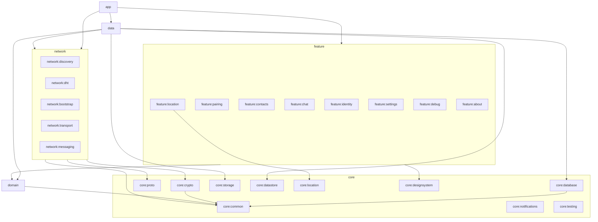

# vMessenger - Folder and Module Structure

vMessenger is a Gradle multi-module project organized by both architectural layer and feature. This structure enforces the Dependency Rule from [Architecture.md](Architecture.md), keeps the networking layers from [Network.md](Network.md) independently replaceable, isolates cryptography, and keeps build times and change blast-radius small.

This document defines the module map, the mapping to the required modules from the project brief, per-module responsibilities and dependencies, the package layout inside a module, the Gradle build conventions, and the repository directory tree.

---

## 1. Module strategy

- One responsibility per module; depend on interfaces, not implementations.
- Layer modules (`domain`, `data`, `core:*`) and feature modules (`feature:*`) are separated from networking modules (`network:*`).
- The `domain` module is pure Kotlin with no Android dependency.
- Implementations are wired with Hilt in `data` and `app`, so swapping a transport or discovery provider is a binding change (see [Architecture.md](Architecture.md) Section 7).

---

## 2. Module map



---

## 3. Mapping to the required modules

The project brief lists conceptual modules. Each maps to one or more Gradle modules:

| Required module | Gradle module(s) |
| --- | --- |
| Presentation | `app`, `feature:*`, `core:designsystem` |
| Domain | `domain` |
| Data | `data` |
| Crypto | `core:crypto` |
| Discovery | `network:discovery` |
| Transport | `network:transport` |
| Messaging | `network:messaging` |
| Location | `core:location` (service/sampling), `feature:location` (UI) |
| Storage | `core:storage` |
| Database | `core:database` |
| Networking | `network:discovery`, `network:dht`, `network:bootstrap`, `network:transport`, `network:messaging` |
| Utilities | `core:common` |
| Notifications | `core:notifications` |
| Settings | `feature:settings`, `core:datastore` |
| Testing | `core:testing` (plus test sources in every module) |

Serialization (Protocol Buffers) lives in `core:proto`; the DHT and Bootstrap pieces of "Networking" are first-class modules (`network:dht`, `network:bootstrap`).

---

## 4. Module responsibilities and dependencies

### app
- Application class, Hilt setup, root navigation host, theme application, dependency wiring of implementations.
- Depends on: all `feature:*`, `data`, `network:*`, `core:designsystem`, `core:notifications`.

### domain
- Pure Kotlin. Entities, value objects, repository interfaces, use cases. No Android, no framework.
- Depends on: `core:common` only.

### data
- Repository implementations; coordinates local stores and the networking facade; mappers between Protobuf, Room, and domain models.
- Depends on: `domain`, `network:*`, `core:database`, `core:storage`, `core:datastore`, `core:proto`, `core:common`.

### feature:identity
- Create Identity and identity display flows (My QR/User Hash surfaces shared with pairing).
- Depends on: `domain`, `core:designsystem`.

### feature:pairing
- My QR Code, QR Scanner, Add by User Hash screens and their ViewModels.
- Depends on: `domain`, `core:designsystem` (QR encode/decode utility may live in `core:common` or a small `core:qr`).

### feature:contacts
- Contact list, contact detail, verification (safety number), block/delete/rename.
- Depends on: `domain`, `core:designsystem`.

### feature:chat
- Chats list and Conversation screens, message composer, status rendering.
- Depends on: `domain`, `core:designsystem`.

### feature:location
- Live Location management and Map screens and ViewModels.
- Depends on: `domain`, `core:designsystem`, `core:location`.

### feature:settings
- Settings UI (appearance, privacy, network/bootstrap, identity), entry to Debug/About.
- Depends on: `domain`, `core:designsystem`, `core:datastore`.

### feature:debug
- Diagnostics UI (join status, routing table, connections, crypto self-test).
- Depends on: `domain`, `core:designsystem`.

### feature:about
- About screen (versions, docs links, license, disclosure).
- Depends on: `core:designsystem`.

### network:discovery
- `DiscoveryProvider` contract, `DiscoveryManager`, `DhtDiscoveryProvider` (adapts `network:dht`), future LAN/BLE providers.
- Depends on: `network:dht`, `core:crypto`, `core:proto`, `core:common`.

### network:dht
- Minimal DHT (`bootstrap/publish/lookup/TTL/refresh`), `DhtNode` RPC client, routing records, XOR key space.
- Depends on: `network:bootstrap`, `core:crypto`, `core:proto`, `core:common`.

### network:bootstrap
- `BootstrapProvider` interface, built-in/community/user/self-hosted providers, `BootstrapManager`, join logic, peer cache.
- Depends on: `core:crypto`, `core:proto`, `core:common`.

### network:transport
- `Transport`/`Connection` contracts, Internet (TCP) transport, framing, `TransportSelector`; future Bluetooth/Wi-Fi Direct/mesh transports as sibling modules or implementations.
- Depends on: `core:common`.

### network:messaging
- Secure session orchestration, handshake driver, ratchet, outbox/retry orchestration hooks, envelope sealing/opening.
- Depends on: `network:transport`, `network:discovery`, `core:crypto`, `core:proto`, `core:common`.

### core:common
- Utilities: `Result`/`AppError`, dispatchers and qualifiers, time, encoding (Base32/Base45), logging, extension functions.
- Depends on: nothing app-specific.

### core:crypto
- `CryptoEngine`: Ed25519, X25519, ChaCha20-Poly1305, HKDF, SHA-256, key wrapping via Android Keystore, ratchet primitives.
- Depends on: `core:common` and a vetted crypto library.

### core:proto
- Protocol Buffers schema files and generated code (wire and selected storage payloads). See [Protocol.md](Protocol.md) and [DHT.md](DHT.md).
- Depends on: `core:common`.

### core:database
- Room database, entities, DAOs, type converters, SQLCipher `SupportFactory`, migrations. See [Database.md](Database.md).
- Depends on: `core:common`, `core:crypto` (for the wrapped DB key).

### core:storage
- Encrypted file/blob storage (AEAD under Keystore-wrapped keys) for large/sensitive payloads.
- Depends on: `core:common`, `core:crypto`.

### core:datastore
- Jetpack DataStore for non-sensitive preferences; encrypted handling for sensitive flags.
- Depends on: `core:common`.

### core:location
- Foreground `LocationService`, adaptive sampling, motion detection, battery-aware scheduling; emits `LocationSample`.
- Depends on: `core:common`.

### core:notifications
- Notification channels and builders (message notifications, location foreground notification), privacy-aware content.
- Depends on: `core:common`, `core:designsystem` (for styling tokens if needed).

### core:designsystem
- Material 3 theme (color/typography/shape tokens), RTL setup, reusable Compose components (message bubble, identicon, QR card, security banner). See [UI.md](UI.md).
- Depends on: `core:common`.

### core:testing
- Shared fakes (fake repositories, in-memory transport, simulated DHT), fixtures, test dispatchers, KAT vectors for crypto.
- Depends on: `domain`, `core:common` (test-only consumers).

---

## 5. Package layout inside a module

A typical feature module follows a consistent internal structure:

```
feature/chat/
  src/main/kotlin/ir/vmessenger/feature/chat/
    ChatListScreen.kt
    ChatListViewModel.kt
    ConversationScreen.kt
    ConversationViewModel.kt
    components/         <- screen-specific composables
    model/             <- UI state + UI models
    di/                <- Hilt module(s) for this feature
  src/test/kotlin/...  <- ViewModel/unit tests
  src/androidTest/...  <- Compose UI tests
  build.gradle.kts
```

A typical core/network module:

```
network/dht/
  src/main/kotlin/ir/vmessenger/network/dht/
    Dht.kt              <- interface
    KademliaDht.kt      <- implementation
    RoutingTable.kt
    rpc/                <- DhtNode client
    di/
  src/test/kotlin/...   <- simulated DHT + TTL/refresh tests
  build.gradle.kts
```

Base package namespace: `ir.vmessenger.*`, consistent with bundle ID `ir.vmessenger.android`.

---

## 6. Gradle build conventions

- Kotlin DSL (`build.gradle.kts`) throughout.
- Version catalog (`gradle/libs.versions.toml`) is the single source of dependency versions.
- Convention plugins in a `build-logic` (composite) build encapsulate shared configuration: Android library setup, Kotlin/Compose options, Hilt, testing, and the Protobuf plugin. Modules apply a one-line convention plugin instead of duplicating config.
- Module types: `com.android.application` (`app`), `com.android.library` (Android modules), and pure `kotlin("jvm")` for `domain` and other framework-free modules.
- Static analysis: ktlint/detekt and Android Lint wired through convention plugins; CI runs build, lint, and tests.

---

## 7. Repository directory tree (target)

```
vMessenger/
  settings.gradle.kts
  build.gradle.kts
  gradle/
    libs.versions.toml
  build-logic/                 <- convention plugins
  app/
  domain/
  data/
  feature/
    identity/  pairing/  contacts/  chat/  location/  settings/  debug/  about/
  network/
    discovery/  dht/  bootstrap/  transport/  messaging/
  core/
    common/  crypto/  proto/  database/  storage/  datastore/  location/  notifications/  designsystem/  testing/
  docs/                        <- this documentation set
  vMessenger-icon/             <- launcher icons and brand logos
  README.md
```

Only `docs/`, `vMessenger-icon/`, and `README.md` exist today; the source modules are introduced during the scaffolding cycle described in [Roadmap.md](Roadmap.md).

---

## 8. How the structure protects the architecture

- The compiler enforces the Dependency Rule: `domain` cannot import Android, `feature:*` cannot import `data`/`network` internals, and `network:*` cannot import UI.
- New transports/discovery providers are new modules wired via Hilt multibinding - no edits to existing layers (see [Network.md](Network.md) Section 9).
- Cryptography is quarantined in `core:crypto`, simplifying audit (see [Security.md](Security.md)).
- Feature isolation keeps build times low and makes future features (groups, calls, files) additive.
