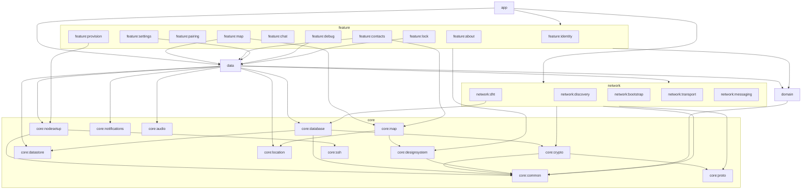

# vMessenger - Folder and Module Structure

vMessenger is a Gradle multi-module project organized by both architectural layer and feature. This structure enforces the Dependency Rule from [Architecture.md](Architecture.md), keeps the networking layers from [Network.md](Network.md) independently replaceable, isolates cryptography, and keeps build times and change blast-radius small.

This document defines the module map, the mapping to the required modules from the project brief, per-module responsibilities and dependencies, the package layout inside a module, the Gradle build conventions, and the repository directory tree.

---

## 1. Module strategy

- One responsibility per module; depend on interfaces, not implementations.
- Layer modules (`domain`, `data`, `core:*`) and feature modules (`feature:*`) are separated from networking modules (`network:*`).
- The `domain` module is pure Kotlin with no Android dependency.
- Implementations are wired with Hilt: the network modules contribute their transports and providers from their own `di/` packages, and `data` and `app` bind the rest, so swapping a transport or discovery provider is a binding change (see [Architecture.md](Architecture.md) Section 7).

---

## 2. Module map


```mermaid
flowchart TD
  app["app"]

  subgraph featureLayer [feature]
    fIdentity["feature:identity"]
    fLock["feature:lock"]
    fPairing["feature:pairing"]
    fContacts["feature:contacts"]
    fChat["feature:chat"]
    fMap["feature:map"]
    fSettings["feature:settings"]
    fDebug["feature:debug"]
    fAbout["feature:about"]
    fProvision["feature:provision"]
  end

  domain["domain"]
  data["data"]

  subgraph networkLayer [network]
    nDisc["network:discovery"]
    nDht["network:dht"]
    nBoot["network:bootstrap"]
    nTrans["network:transport"]
    nMsg["network:messaging"]
  end

  subgraph coreLayer [core]
    cCommon["core:common"]
    cCrypto["core:crypto"]
    cProto["core:proto"]
    cDb["core:database"]
    cData2["core:datastore"]
    cLoc["core:location"]
    cMap["core:map"]
    cNotif["core:notifications"]
    cDesign["core:designsystem"]
    cAudio["core:audio"]
    cSsh["core:ssh"]
    cSetup["core:nodesetup"]
  end

  app --> featureLayer
  app --> data
  app --> networkLayer
  featureLayer --> domain
  featureLayer --> cDesign
  data --> domain
  data --> networkLayer
  data --> cDb
  data --> cData2
  data --> cLoc
  data --> cNotif
  data --> cAudio
  data --> cSetup
  fMap --> data
  fContacts --> data
  fSettings --> data
  fDebug --> data
  fLock --> data
  fMap --> cMap
  fContacts --> cMap
  fProvision --> cSetup
  cSetup --> cSsh
  cSetup --> cCommon
  cMap --> cLoc
  cMap --> cDesign
  networkLayer --> cCrypto
  networkLayer --> cProto
  networkLayer --> cCommon
  nDht --> cDb
  cDb --> cCrypto
  cDb --> cData2
  cDb --> cCommon
  cCrypto --> cProto
  cCrypto --> cCommon
  cDesign --> cCommon
  domain --> cCommon
```

---

## 3. Mapping to the required modules

The project brief lists conceptual modules. Each maps to one or more Gradle modules:

| Required module | Gradle module(s) |
| --- | --- |
| Presentation | `app`, `feature:*`, `core:designsystem` |
| Domain | `domain` |
| Data | `data` |
| Crypto | `core:crypto` |
| Discovery | `network:discovery` |
| Transport | `network:transport` |
| Messaging | `network:messaging` |
| Location | `core:location` (service/sampling), `core:map` (MapLibre rendering), `feature:map` (UI), `feature:contacts` (a contact's location card and history) |
| Storage | `core:database` (structured data), `data` (encrypted attachment blobs) |
| Database | `core:database` |
| Networking | `network:discovery`, `network:dht`, `network:bootstrap`, `network:transport`, `network:messaging` |
| Utilities | `core:common` |
| Notifications | `core:notifications` |
| Settings | `feature:settings`, `core:datastore` |
| Testing | test sources in each module's `src/test` (most modules have them); `./gradlew unitTests` aggregates them (see [Testing.md](Testing.md)) |

Serialization (Protocol Buffers) lives in `core:proto`; the DHT and Bootstrap pieces of "Networking" are first-class modules (`network:dht`, `network:bootstrap`).

---

## 4. Module responsibilities and dependencies

### app
- Application class, Hilt setup, root navigation host, theme and app language (`AppLocaleController`), global overlays (`ContactRequestOverlay` for inbound contact requests), the first-run node question and permission prompts (`ui/onboarding`), the call screen and `CallActivity`, the share target, the network, location-stop and call services and receivers, and the WorkManager workers.
- Depends on: all `feature:*`, `domain`, `data`, `network:*`, `core:common`, `core:database`, `core:datastore`, `core:designsystem`, `core:location`, `core:notifications`, MapLibre (initialized in `VMessengerApplication`).

### domain
- Pure Kotlin. Entities, value objects, repository interfaces, use cases. No Android, no framework.
- Use cases are grouped by area under `domain/usecase/` — `chat/`, `group/`, `nodes/` and the rest — so a feature's surface is visible from the package list.
- Depends on: `core:common` only.

### data
- Repository implementations; coordinates local stores and the networking facade; mappers between Protobuf, Room, and domain models.
- Network coordinators: `NetworkCoordinator`, `IncomingMessageCollector`, `OutboxDispatcher`, `LocationSharingCoordinator`, `ContactRequestHandler`/`Service`/`Notifier`.
- Also: voice calls (`call/` — `CallCoordinator` and the media path), New node (`nodesetup/` — `NodeSetupController`, `AssetInstallerBundle`, `PinnedNodeVerifier`, `ManagedNodeRepositoryImpl`), the app lock (`lock/`), the activity log (`activity/`), attachments, backup, secure wipe (`wipe/`) and `LegacyUpdaterCleanup` (`cleanup/`).
- Depends on: `domain`, `network:*`, `core:database`, `core:crypto`, `core:datastore`, `core:location`, `core:notifications`, `core:audio`, `core:proto`, `core:common`; `core:ssh` and `core:nodesetup` as `api`; BouncyCastle and OkHttp.

### feature:identity
- Create Identity (intro → display name → keygen → success, or restore from a backup) and identity settings (edit display name, share User Hash).
- Depends on: `domain`, `core:designsystem`, `core:common`.

### feature:lock
- The app lock: the lock screen (`AppLockScreen`, `AppLockViewModel`), PIN entry and keypad, biometric unlock, and the PIN setup dialog (`PinSetupDialog`) that Settings shows — the app's home graph hands it to `SettingsRoute`, since `feature:settings` does not depend on `feature:lock`.
- Depends on: `data` (`AppLockCoordinator`), `core:crypto` (only for `PinVerifier`'s length bounds), `core:designsystem`, AndroidX Biometric. It has no `domain` dependency.

### feature:pairing
- My QR Code, QR Scanner, Add by User Hash screens and their ViewModels. Both QR and hash adds create a `PENDING_OUT` contact and send a `ContactRequest`.
- Depends on: `domain`, `core:designsystem`, `core:common`, CameraX and ML Kit barcode scanning.

### feature:contacts
- Contact list with relationship-status chips, incoming requests to approve or reject, and chat and call buttons on each row; the contact page with *Chat* and *Call*, verification (safety number), block/delete/rename, and a location card with the contact's position, the places they shared recently (kept for up to 24 hours, at most the newest 500 samples per share) and the route on a map. Chat disabled until `APPROVED`.
- Depends on: `domain`, `data` (`ContactRequestHandler`), `core:common`, `core:designsystem`, `core:location`, `core:map`.

### feature:chat
- The chat list (`ChatRoute`), the conversation (`ConversationRoute`/`ConversationHost` and its chrome, list, bubbles, message timer, call button and per-recipient info sheet), the new-chat picker, and the in-app image viewer. Two sub-packages carry the newer work: `group/` (create a group, group info, member picker, the review of edited and deleted messages) and `voice/` (voice messages: the composer mic button and its record-audio permission, recording and playback).
- Depends on: `domain`, `core:common`, `core:designsystem`, `core:notifications` (`ActiveConversationTracker`, which silences notifications for the open chat).

### feature:map
- The full-screen map (`MapRoute`, `MapViewModel`, `MapUiState`), its controls and bottom sheets (`MapControls`, `MapSheet`, `SharePickerSheet`), the per-contact share picker, and runtime location-permission handling (`LocationPermissionController`).
- Depends on: `domain`, `data` (for `LocationSharingCoordinator`), `core:common`, `core:designsystem`, `core:location`, `core:map`.
- One of five feature modules that depend on `data` (with `feature:contacts`, `feature:settings`, `feature:debug` and `feature:lock`); the reasons are listed in Section 8 and [Architecture.md](Architecture.md) Section 6.

### feature:settings
- Settings UI (language, appearance, privacy and app lock, network nodes and "Your servers", identity, backup export), the activity log, the blocked-contacts screen, the node QR scanner, and the entry points to Debug, About and New node.
- Depends on: `domain`, `data` (the app-lock coordinator, the activity log, and — through `data`'s `api` on `core:nodesetup` — the bundled installer's node version for "Update"), `feature:pairing` (its QR scanner), `core:designsystem`, `core:datastore`, `core:common`.

### feature:debug
- Diagnostics UI, shown in debug builds and in release once developer mode is on: network status (bootstrapped, known nodes, published endpoint), the active network path, the P2P feature flags, join-and-publish, the emulator dev mode, the `adb` port-forward commands for a two-emulator test, and the operation log (`LogsRoute`).
- Depends on: `domain`, `data` (`P2PConfigLoader`, which loads and saves the P2P flags), `network:messaging` (`RelayDirectory`, for the relay to publish), `core:datastore`, `core:common`, `core:designsystem`.

### feature:about
- About screen (app, protocol and database versions, the active nodes, the license, source and docs links) and the tap sequence (seven taps on the version row) that turns developer mode on or off.
- Depends on: `domain`, `core:common`, `core:datastore` (developer mode), `core:designsystem`.

### feature:provision
- **New node**: the wizard that sets a server up as a node over SSH (`NewNodeRoute`, `NewNodeViewModel`), its input normalisation (`ServerInput`), and the words for every step and issue code (`ProvisionText.kt`). Holds the SSH secrets in memory only (Security §18).
- Depends on: `domain`, `core:nodesetup` (contract types and `NodeSetupSession`), `core:designsystem`, `core:common`. The session itself is bound in `data`.

### network:discovery
- `DiscoveryProvider` contract, `DiscoveryManager`, `DhtDiscoveryProvider` (adapts `network:dht`), `EndpointResolveService` and the verified `PeerEndpointCache`; future LAN/BLE providers.
- Depends on: `network:dht`, `core:proto`, `core:common` (its build file also declares `core:crypto`, which it does not use).

### network:dht
- Minimal DHT (`bootstrap/publish/lookup/TTL/refresh`) in `MinimalDht`, the `DhtRpcClient`, routing records, XOR key space, and the opt-in embedded DHT node (`EmbeddedDhtService`, off by default).
- Depends on: `network:bootstrap`, `core:crypto`, `core:proto`, `core:common`, `core:database` (the embedded node's record store). Its build file also declares `network:transport`, which it does not use.

### network:bootstrap
- The `BootstrapProvider` contract, the `BootstrapNode` value type, `BuiltInBootstrapProvider` (the single shipped default) and `BootstrapManager`, which merges every provider by descending priority and de-duplicates by address. The database-backed provider that supplies user, imported and community nodes lives in `data` because it needs the node repository. See [DHT.md](DHT.md) Section 4.1.
- Depends on: `core:common` (its build file also declares `core:crypto` and `core:proto`, which it does not use).

### network:transport
- `Transport`/`Connection` contracts, Internet (TCP) transport, `RelayTransport` (circuits through a node's `/relay` WebSocket), `TransportSelector`, and a `UdpTransport` that is not registered; future Bluetooth/Wi-Fi Direct/mesh transports as sibling modules or implementations.
- Depends on: `core:common`, `core:proto`, OkHttp.

### network:messaging
- Secure session orchestration (`MessagingService`), handshake driver, ratchet (`SymmetricRatchet`), frame codec and guard, the relay listener (`RelayListener`) and relay-peer service, outbox/retry orchestration hooks, envelope sealing/opening.
- Depends on: `network:transport`, `network:discovery`, `core:crypto`, `core:proto`, `core:common`, OkHttp (its build file also declares `core:database`, which it does not use).

### core:common
- Utilities: `AppResult`/`AppError`, the network value types and policies (`NodeUrl`, `SpkiPin`, `PinnedTls`, `NodeAddressPolicy`, `NetworkConfig`, `P2PConfig`, `WebSocketFrameClient`), the User Hash encoding (Crockford Base32, `UserHashEncoder`), `DatabaseSchema.VERSION`, `SemVer`, `VmLocale` and bidi helpers, logging (`AppLogger`), and concurrency helpers (`KeyedMutex`, logging exception handlers).
- Depends on: nothing app-specific (coroutines, OkHttp).

### core:crypto
- `CryptoEngine` over libsodium (lazysodium): Ed25519, X25519, ChaCha20-Poly1305 and XChaCha20-Poly1305, HKDF, SHA-256, Argon2id, sealed boxes; Android Keystore key wrapping (`KeyStoreKeyManager`), the app lock's `PinVerifier`, the pairing-descriptor and backup codecs, and the attachment stream cipher. The ratchet itself lives in `network:messaging`.
- Depends on: `core:common`, `core:proto`, lazysodium-android.

### core:proto
- Protocol Buffers schema files and generated code (wire and selected storage payloads). See [Protocol.md](Protocol.md) and [DHT.md](DHT.md).
- Depends on: `core:common`.

### core:database
- Room database, entities, DAOs, type converters, SQLCipher `SupportFactory`, migrations. See [Database.md](Database.md).
- Depends on: `core:common`, `core:crypto` and `core:datastore` (the Keystore-wrapped database passphrase is kept in DataStore).

### core:map
- The MapLibre wrapper the app renders through: `VmMapView` and `MapViewCache`, `MapController` and `MapCamera`, the marker layer and its bitmap generation (`MarkerLayer`, `MarkerBitmaps`, `MarkerCanvas`), the route line (`PathLayer`), the own-position puck (`MapPuck`), the style descriptor (`MapStyle`) and a `BusLocationEngine` that feeds MapLibre from `LocationUpdateBus`.
- Depends on: `domain`, `core:common`, and — as `api` dependencies, since callers use their types — `core:designsystem`, `core:location` and the MapLibre Android SDK.

### core:datastore
- Jetpack Preferences DataStore for settings (theme, privacy, P2P flags, discovery, drafts, app lock, node setup, contact-request retries). It is not encrypted: the database passphrase and the attachment key in it are Keystore-wrapped blobs (`SecurityPreferences`), the app lock keeps a PIN verifier there rather than the PIN (`AppLockPreferences`), and unsent drafts are plain text (`DraftPreferences`).
- Depends on: `core:common`.

### core:location
- Foreground `LocationService` (15s GPS/network interval, persistent notification in the app's language), `LocationUpdateBus`, `LocationUpdate` model, and `DeviceLocationProvider` (the device's own position for the map puck and distances).
- Depends on: `core:common`.

### core:notifications
- Notification channels and builders — messages, location requests, calls (ringing and in call) and the network service's foreground notification — with privacy-aware content, built in the app's language rather than the device's; `ActiveConversationTracker` silences the open chat. (The location-sharing notification is `LocationService`'s own, in `core:location`.)
- Depends on: `core:common`.

### core:audio
- The audio side of voice calls: microphone capture and playback in 20 ms frames of 48 kHz mono (`AudioCaptureEngine`, `AudioPlaybackEngine`), the Opus codec (`OpusCodec`, pure-Java Concentus), a `JitterBuffer`, and `AudioSessionController`, which puts the device into and out of call mode. Used by the call media path in `data`.
- Depends on: `core:common`, Concentus.

### core:ssh
- SSH for **New node**: `SshConnector` (`probeHostKey` learns a server's host key without logging in; `connect` logs in only to the confirmed key) and `SshSession` (`run`, `stream`, `upload` over SFTP with a `cat >` fallback), over sshj. `SshAuth` holds a password or a key as char/byte arrays with `wipe()` and a redacted `toString()`; `HostKey` is OpenSSH's `SHA256:` fingerprint; `SshException` names what went wrong (unreachable, timeout, host-key mismatch, auth rejected, key unreadable, disconnected).
- Depends on: sshj and BouncyCastle (Apache-2.0, MIT), coroutines. Pure JVM, so the setup engine runs it off-device; tests use an embedded Apache MINA SSHD and keys made by the real `ssh-keygen`.

### core:nodesetup
- The **New node** engine. `NodeSetupEngine` drives `scripts/setup-node.sh` over `:core:ssh`: host key (confirmed before any login), privilege (root, passwordless sudo, or `sudo -S` with the password on stdin), the bundle (only missing or changed files, then `sha256sum -c`), preflight and its decisions, the detached run followed to its end — logging in again and resuming after the last whole line when the connection drops — key-only SSH confirmed by a fresh key login, and `result.json` checked (version, node URLs, the pin is the certificate's key). The contract with the installer lives here: `IssueCode`, `StepId`, `MarkerParser`, `LogLineAssembler`, `InstallOptions` (validated and shell-quoted), `InstallResult`. The request's credentials are wiped when the engine returns.
- Depends on: `core:ssh`, `core:common`, kotlinx-serialization. `ContractTest` checks that every issue code and step id in `setup-node.sh`, and its protocol version, match the Kotlin; `provisionE2e` runs the real engine against a Docker target (`scripts/provision-test/run.sh test --scenario engine`).

### core:designsystem
- The in-house design system on Compose Foundation — no Material: `VMessengerTheme` and its tokens (`VmColors`, typography, shapes, spacing, elevation, motion), `RtlLayout` (layout direction from the app language), and the components every screen uses (`VMessengerScaffold`, `VmButton`, `VmTextField`, `VmSecretField`, `VmNotice`, `VmStepList`, `VmCodeBlock`, `ConfirmDialog`, message bubble, identicon avatar, QR card, key-change banner, …), with date, calendar and digit formatting (`VmDateFormat`, `VmCalendar`, `VmTextFormat`), `AppError` texts and the secure-window helpers. See [UI.md](UI.md).
- Depends on: `core:common` (as `api`), Coil, ZXing, AndroidX Biometric.

### node
- Standalone JVM (Ktor) bootstrap/DHT + relay node: `/healthz`, `/dht` RPC socket, `/relay` control socket. Shares `core:common` and the `.proto` files of `core:proto` with the app so transcripts and framing cannot drift.
- Depends on: `core:common`, and compiles `core/proto/src/main/proto` itself with the full protobuf-java runtime (it does not depend on the `core:proto` module). Operating it: [Deployment.md](Deployment.md).

---

## 5. Package layout inside a module

A typical feature module follows a consistent internal structure:

```
feature/chat/
  src/main/kotlin/ir/vmessenger/feature/chat/
    ChatRoute.kt              <- route composable (the screen's entry point)
    ChatListViewModel.kt
    ChatListUiState.kt        <- immutable UI state next to its view model
    ConversationRoute.kt
    ConversationViewModel.kt
    ConversationUiState.kt
    group/                    <- sub-feature package
    voice/
  src/main/res/values/strings.xml     <- this module's user-facing text, in Persian
  src/main/res/values-en/strings.xml  <- the same strings in English
  src/test/kotlin/...                 <- unit tests (UI-state mapping, screen logic)
  build.gradle.kts
```

A typical core/network module:

```
network/dht/
  src/main/kotlin/ir/vmessenger/network/dht/
    MinimalDht.kt              <- the Dht interface, DhtRpcClient and the client implementation
    DhtRpcSender.kt            <- the RPC seam the tests fake
    EndpointRecordVerifier.kt  <- signature, hash and TTL checks, and the record signer
    EmbeddedDhtService.kt      <- opt-in on-device node (its routing table and policy in the files beside it)
    di/
  src/test/kotlin/...          <- simulated DHT + TTL/refresh tests
  build.gradle.kts
```

Base package namespace: `ir.vmessenger.*`, consistent with bundle ID `ir.vmessenger.android`.

---

## 6. Gradle build conventions

- Kotlin DSL (`build.gradle.kts`) throughout.
- Version catalog (`gradle/libs.versions.toml`) is the single source of dependency versions.
- Convention plugins in a `build-logic` (composite) build encapsulate shared configuration: Android application and library setup, Kotlin/Compose options, Hilt, Room, the Protobuf plugin, and plain JVM libraries (which emit Java 17 bytecode). `build-logic` also holds `BundleNodeInstallerTask` (`:app:bundleNodeInstaller`) and `VerifyBytecodeLevelTask` (`:node:verifyBytecodeLevel`). Modules apply a one-line convention plugin instead of duplicating config.
- Module types: `com.android.application` (`app`), `com.android.library` (Android modules), and pure `kotlin("jvm")` for `domain`, `core:common`, `core:ssh`, `core:nodesetup` and `node`.
- Static analysis: detekt with its formatting (ktlint) rules, applied to every subproject from the root `build.gradle.kts` with `config/detekt/detekt.yml` and a per-module baseline. CI (`.github/workflows/ci.yml`) runs shellcheck on the scripts, `detekt`, `assembleDebug :node:installDist` and `unitTests`; Android Lint is not part of it.

---

## 7. Repository directory tree

```
vMessenger/
  settings.gradle.kts
  build.gradle.kts             <- detekt for every subproject, the `unitTests` aggregate
  gradle/
    libs.versions.toml
    version.properties          <- versionName / versionCode
  build-logic/                 <- convention plugins
  config/detekt/               <- detekt.yml
  .github/workflows/           <- ci.yml, release-apk.yml
  app/
    src/main/kotlin/ir/vmessenger/
      navigation/                <- VMessengerNavHost, VmRoute, per-tab graphs
      ui/                        <- VMessengerApp, home, contact, network, onboarding, call, share
      app/network/               <- NetworkLifecycleService, BootCompletedReceiver, LocationSharingStopReceiver,
                                    NetworkKeepAliveWorker, NetworkServiceStarter
      app/call/                  <- CallForegroundService, CallActionReceiver, CallSessionPresenter
      app/locale/  app/work/     <- AppLocaleController; ExpiryPurgeWorker
  domain/
  data/
    src/main/kotlin/ir/vmessenger/data/
      repository/                <- *RepositoryImpl
      network/                   <- coordinators, ContactRequest*, LocationSharingCoordinator
      call/  nodesetup/  lock/  activity/  attachment/  backup/  wipe/  cleanup/  discovery/
      di/
  feature/
    identity/  lock/  pairing/  contacts/  chat/  map/  settings/  debug/  about/  provision/
  network/
    discovery/  dht/  bootstrap/  transport/  messaging/
  core/
    common/  crypto/  proto/  database/  datastore/  location/  map/  notifications/  designsystem/
    audio/  ssh/  nodesetup/
  node/                        <- standalone JVM bootstrap/DHT + relay node (`:node` Gradle module)
  deploy/                      <- nginx + systemd templates for a node host
  scripts/                     <- setup-node.sh, provision-test/ (Docker harness), emulator-connect.sh, p2p-terminal-check.sh, sign-node-record
  docs/                        <- this documentation set
  vMessenger-icon/             <- launcher icons and brand logos
  README.md  CHANGELOG.md  AGENTS.md  LICENSE
```

The tree above is implemented. New capabilities are added as vertical slices behind existing interfaces (see [Architecture.md](Architecture.md)).

---

## 8. How the structure protects the architecture

- The compiler enforces the Dependency Rule: `domain` cannot import Android, `network:*` cannot import UI, and a `feature:*` module can reach only what its `build.gradle.kts` declares (plus what those modules expose as `api`). The feature modules that reach past `domain` and `core:designsystem`, and why:
  - `feature:map` → `data` for `LocationSharingCoordinator`; `core:map` and `core:location` for the map and the device's position.
  - `feature:contacts` → `data` for `ContactRequestHandler` (approving and rejecting requests); `core:map` and `core:location` for the location card and history on a contact's page.
  - `feature:settings` → `data` for the app-lock coordinator and the activity log, and, through `data`'s `api` on `core:nodesetup`, the bundled installer's node version for "Update"; `feature:pairing` for its QR scanner (the node QR scanner); `core:datastore` for the theme and privacy preferences.
  - `feature:debug` → `data` for `P2PConfigLoader`, `network:messaging` for `RelayDirectory`, `core:datastore` for the P2P flags.
  - `feature:lock` → `data` for `AppLockCoordinator`, and `core:crypto` only for `PinVerifier`'s length bounds; it has no `domain` dependency.
  - `feature:about` → `core:datastore` for developer mode.
  - `feature:chat` → `core:notifications` for `ActiveConversationTracker`.
  - `feature:provision` reaches its session through the `NodeSetupSession` interface in `core:nodesetup`, bound in `data`.

  Every other feature module goes through `domain` use cases and repository interfaces.
- New transports/discovery providers are new modules wired via Hilt multibinding - no edits to existing layers (see [Network.md](Network.md) Section 9).
- Cryptography is quarantined in `core:crypto`, simplifying audit (see [Security.md](Security.md)).
- Feature isolation keeps build times low and makes new features additive. Groups, voice messages and the map rebuild all landed without touching the networking or crypto contracts.
