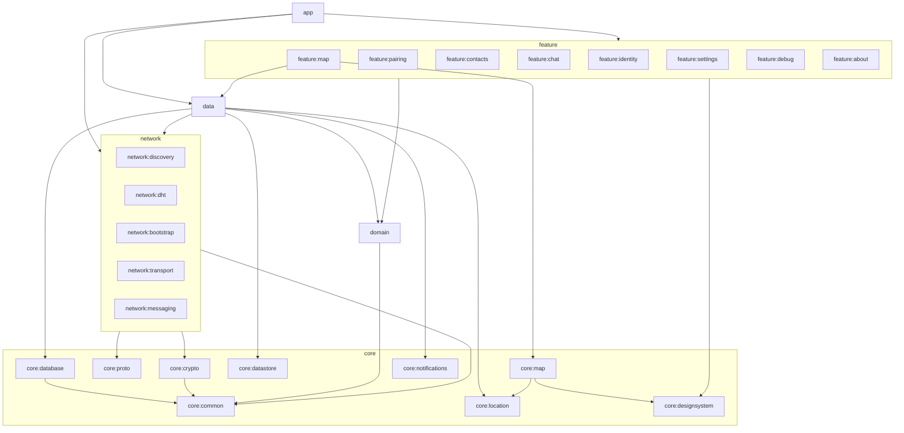

# vMessenger - Folder and Module Structure

vMessenger is a Gradle multi-module project organized by both architectural layer and feature. This structure enforces the Dependency Rule from [Architecture.md](Architecture.md), keeps the networking layers from [Network.md](Network.md) independently replaceable, isolates cryptography, and keeps build times and change blast-radius small.

This document defines the module map, the mapping to the required modules from the project brief, per-module responsibilities and dependencies, the package layout inside a module, the Gradle build conventions, and the repository directory tree.

---

## 1. Module strategy

- One responsibility per module; depend on interfaces, not implementations.
- Layer modules (`domain`, `data`, `core:*`) and feature modules (`feature:*`) are separated from networking modules (`network:*`).
- The `domain` module is pure Kotlin with no Android dependency.
- Implementations are wired with Hilt in `data` and `app`, so swapping a transport or discovery provider is a binding change (see [Architecture.md](Architecture.md) Section 7).

---

## 2. Module map


```mermaid
flowchart TD
  app["app"]

  subgraph featureLayer [feature]
    fIdentity["feature:identity"]
    fPairing["feature:pairing"]
    fContacts["feature:contacts"]
    fChat["feature:chat"]
    fMap["feature:map"]
    fSettings["feature:settings"]
    fDebug["feature:debug"]
    fAbout["feature:about"]
  end

  domain["domain"]
  data["data"]

  subgraph networkLayer [network]
    nDisc["network:discovery"]
    nDht["network:dht"]
    nBoot["network:bootstrap"]
    nTrans["network:transport"]
    nMsg["network:messaging"]
  end

  subgraph coreLayer [core]
    cCommon["core:common"]
    cCrypto["core:crypto"]
    cProto["core:proto"]
    cDb["core:database"]
    cData2["core:datastore"]
    cLoc["core:location"]
    cMap["core:map"]
    cNotif["core:notifications"]
    cDesign["core:designsystem"]
  end

  app --> featureLayer
  app --> data
  app --> networkLayer
  featureLayer --> domain
  featureLayer --> cDesign
  data --> domain
  data --> networkLayer
  data --> cDb
  data --> cData2
  data --> cLoc
  data --> cNotif
  fMap --> data
  fMap --> cMap
  cMap --> cLoc
  cMap --> cDesign
  networkLayer --> cCrypto
  networkLayer --> cProto
  networkLayer --> cCommon
  cDb --> cCommon
  cCrypto --> cCommon
  domain --> cCommon
```

---

## 3. Mapping to the required modules

The project brief lists conceptual modules. Each maps to one or more Gradle modules:

| Required module | Gradle module(s) |
| --- | --- |
| Presentation | `app`, `feature:*`, `core:designsystem` |
| Domain | `domain` |
| Data | `data` |
| Crypto | `core:crypto` |
| Discovery | `network:discovery` |
| Transport | `network:transport` |
| Messaging | `network:messaging` |
| Location | `core:location` (service/sampling), `core:map` (MapLibre rendering), `feature:map` (UI) |
| Storage | `core:database` (structured data), `data` (encrypted attachment blobs) |
| Database | `core:database` |
| Networking | `network:discovery`, `network:dht`, `network:bootstrap`, `network:transport`, `network:messaging` |
| Utilities | `core:common` |
| Notifications | `core:notifications` |
| Settings | `feature:settings`, `core:datastore` |
| Testing | test sources in every module; `./gradlew unitTests` aggregates them (see [Testing.md](Testing.md)) |

Serialization (Protocol Buffers) lives in `core:proto`; the DHT and Bootstrap pieces of "Networking" are first-class modules (`network:dht`, `network:bootstrap`).

---

## 4. Module responsibilities and dependencies

### app
- Application class, Hilt setup, root navigation host, theme application, global overlays (`ContactRequestOverlay` for inbound hash-add requests).
- Depends on: all `feature:*`, `data`, `network:*`, `core:designsystem`, `core:notifications`, MapLibre (initialized in `VMessengerApplication`).

### domain
- Pure Kotlin. Entities, value objects, repository interfaces, use cases. No Android, no framework.
- Use cases are grouped by area under `domain/usecase/` — `chat/`, `group/`, `nodes/` and the rest — so a feature's surface is visible from the package list.
- Depends on: `core:common` only.

### data
- Repository implementations; coordinates local stores and the networking facade; mappers between Protobuf, Room, and domain models.
- Network coordinators: `NetworkCoordinator`, `IncomingMessageCollector`, `OutboxDispatcher`, `LocationSharingCoordinator`, `ContactRequestHandler`/`Service`/`Notifier`.
- Depends on: `domain`, `network:*`, `core:database`, `core:crypto`, `core:datastore`, `core:location`, `core:notifications`, `core:proto`, `core:common`.

### feature:identity
- Create Identity (intro → display name → keygen → success) and identity settings (edit display name, share User Hash).
- Depends on: `domain`, `core:designsystem`, `core:common`.

### feature:pairing
- My QR Code, QR Scanner, Add by User Hash screens and their ViewModels. Both QR and hash adds create a `PENDING_OUT` contact and send a `ContactRequest`.
- Depends on: `domain`, `core:designsystem`.

### feature:contacts
- Contact list with relationship-status chips, contact detail, verification (safety number), block/delete/rename. Chat disabled until `APPROVED`.
- Depends on: `domain`, `core:designsystem`.

### feature:chat
- The chat list (`ChatRoute`), the conversation (`ConversationRoute`/`ConversationHost` and its chrome, list, bubbles and per-recipient info sheet), the new-chat picker, and the in-app image viewer. Two sub-packages carry the newer work: `group/` (create a group, group info, member picker) and `voice/` (the composer mic button and its record-audio permission).
- Depends on: `domain`, `core:designsystem`.

### feature:map
- The full-screen map (`MapRoute`, `MapViewModel`, `MapUiState`), its controls and bottom sheets (`MapControls`, `MapSheet`, `SharePickerSheet`), the per-contact share picker, and runtime location-permission handling (`LocationPermissionController`).
- Depends on: `domain`, `data` (for `LocationSharingCoordinator`), `core:designsystem`, `core:location`, `core:map`.
- This is the only feature module that depends on `data`; the reason is recorded in [Architecture.md](Architecture.md) Section 6.

### feature:settings
- Settings UI (appearance, privacy, network nodes, identity, backup export), the blocked-contacts screen, the node QR scanner, and the entry points to Debug and About.
- Depends on: `domain`, `core:designsystem`, `core:datastore`, `core:common`.

### feature:debug
- Diagnostics UI (join status, routing table, connections, crypto self-test).
- Depends on: `domain`, `core:designsystem`.

### feature:about
- About screen (versions, docs links, license, disclosure).
- Depends on: `core:designsystem`.

### network:discovery
- `DiscoveryProvider` contract, `DiscoveryManager`, `DhtDiscoveryProvider` (adapts `network:dht`), future LAN/BLE providers.
- Depends on: `network:dht`, `core:crypto`, `core:proto`, `core:common`.

### network:dht
- Minimal DHT (`bootstrap/publish/lookup/TTL/refresh`), `DhtNode` RPC client, routing records, XOR key space.
- Depends on: `network:bootstrap`, `core:crypto`, `core:proto`, `core:common`.

### network:bootstrap
- The `BootstrapProvider` contract, the `BootstrapNode` value type, `BuiltInBootstrapProvider` (the single shipped default) and `BootstrapManager`, which merges every provider by descending priority and de-duplicates by address. The database-backed provider that supplies user, imported and community nodes lives in `data` because it needs the node repository. See [DHT.md](DHT.md) Section 4.1.
- Depends on: `core:common`.

### network:transport
- `Transport`/`Connection` contracts, Internet (TCP) transport, framing, `TransportSelector`; future Bluetooth/Wi-Fi Direct/mesh transports as sibling modules or implementations.
- Depends on: `core:common`.

### network:messaging
- Secure session orchestration, handshake driver, ratchet, outbox/retry orchestration hooks, envelope sealing/opening.
- Depends on: `network:transport`, `network:discovery`, `core:crypto`, `core:proto`, `core:common`.

### core:common
- Utilities: `Result`/`AppError`, dispatchers and qualifiers, time, encoding (Base32/Base45), logging, extension functions.
- Depends on: nothing app-specific.

### core:crypto
- `CryptoEngine`: Ed25519, X25519, ChaCha20-Poly1305, HKDF, SHA-256, key wrapping via Android Keystore, ratchet primitives.
- Depends on: `core:common` and a vetted crypto library.

### core:proto
- Protocol Buffers schema files and generated code (wire and selected storage payloads). See [Protocol.md](Protocol.md) and [DHT.md](DHT.md).
- Depends on: `core:common`.

### core:database
- Room database, entities, DAOs, type converters, SQLCipher `SupportFactory`, migrations. See [Database.md](Database.md).
- Depends on: `core:common`, `core:crypto` (for the wrapped DB key).

### core:map
- The MapLibre wrapper the app renders through: `VmMapView` and `MapViewCache`, `MapController` and `MapCamera`, the marker layer and its bitmap generation (`MarkerLayer`, `MarkerBitmaps`, `MarkerCanvas`), the own-position puck (`MapPuck`), the style descriptor (`MapStyle`) and a `BusLocationEngine` that feeds MapLibre from `LocationUpdateBus`.
- Depends on: `domain`, `core:common`, and — as `api` dependencies, since callers use their types — `core:designsystem`, `core:location` and the MapLibre Android SDK.

### core:datastore
- Jetpack DataStore for non-sensitive preferences; encrypted handling for sensitive flags.
- Depends on: `core:common`.

### core:location
- Foreground `LocationService` (15s GPS/network interval, persistent notification), `LocationUpdateBus`, `LocationUpdate` model.
- Depends on: `core:common`.

### core:notifications
- Notification channels and builders (message notifications, location foreground notification), privacy-aware content.
- Depends on: `core:common`, `core:designsystem` (for styling tokens if needed).

### core:ssh
- SSH for **New node**: `SshConnector` (`probeHostKey` learns a server's host key without logging in; `connect` logs in only to the confirmed key) and `SshSession` (`run`, `stream`, `upload` over SFTP with a `cat >` fallback), over sshj. `SshAuth` holds a password or a key as char/byte arrays with `wipe()` and a redacted `toString()`; `HostKey` is OpenSSH's `SHA256:` fingerprint; `SshException` names what went wrong (unreachable, timeout, host-key mismatch, auth rejected, key unreadable, disconnected).
- Depends on: sshj and BouncyCastle (Apache-2.0, MIT), coroutines. Pure JVM, so the setup engine runs it off-device; tests use an embedded Apache MINA SSHD and keys made by the real `ssh-keygen`.

### core:designsystem
- Material 3 theme (color/typography/shape tokens), RTL setup, reusable Compose components (message bubble, identicon, QR card, security banner). See [UI.md](UI.md).
- Depends on: `core:common`.

### node
- Standalone JVM (Ktor) bootstrap/DHT + relay node: `/healthz`, `/dht` RPC socket, `/relay` control socket. Shares `core:common` and `core:proto` with the app so transcripts and framing cannot drift.
- Depends on: `core:common`, `core:proto`. Operating it: [Deployment.md](Deployment.md).

---

## 5. Package layout inside a module

A typical feature module follows a consistent internal structure:

```
feature/chat/
  src/main/kotlin/ir/vmessenger/feature/chat/
    ChatRoute.kt              <- route composable (the screen's entry point)
    ChatListViewModel.kt
    ChatListUiState.kt        <- immutable UI state next to its view model
    ConversationRoute.kt
    ConversationViewModel.kt
    ConversationUiState.kt
    group/                    <- sub-feature package
    voice/
  src/main/res/values/strings.xml   <- this module's user-facing text
  src/test/kotlin/...               <- ViewModel/unit tests
  build.gradle.kts
```

A typical core/network module:

```
network/dht/
  src/main/kotlin/ir/vmessenger/network/dht/
    MinimalDht.kt              <- the Dht interface, DhtRpcClient and the client implementation
    DhtRpcSender.kt            <- the RPC seam the tests fake
    EndpointRecordVerifier.kt  <- signature, hash, TTL and sequence checks
    EmbeddedDhtService.kt      <- opt-in on-device node, with its routing table and policy
    di/
  src/test/kotlin/...          <- simulated DHT + TTL/refresh tests
  build.gradle.kts
```

Base package namespace: `ir.vmessenger.*`, consistent with bundle ID `ir.vmessenger.android`.

---

## 6. Gradle build conventions

- Kotlin DSL (`build.gradle.kts`) throughout.
- Version catalog (`gradle/libs.versions.toml`) is the single source of dependency versions.
- Convention plugins in a `build-logic` (composite) build encapsulate shared configuration: Android library setup, Kotlin/Compose options, Hilt, testing, and the Protobuf plugin. Modules apply a one-line convention plugin instead of duplicating config.
- Module types: `com.android.application` (`app`), `com.android.library` (Android modules), and pure `kotlin("jvm")` for `domain` and other framework-free modules.
- Static analysis: ktlint/detekt and Android Lint wired through convention plugins; CI runs build, lint, and tests.

---

## 7. Repository directory tree

```
vMessenger/
  settings.gradle.kts
  build.gradle.kts
  gradle/
    libs.versions.toml
    version.properties          <- versionName / versionCode
  build-logic/                 <- convention plugins
  app/
    src/main/kotlin/ir/vmessenger/
      navigation/                <- VMessengerNavHost, VmRoute, per-tab graphs
      ui/                        <- VMessengerApp, home, contact, network, placeholder
      app/network/               <- NetworkLifecycleService, BootCompletedReceiver,
                                    NetworkKeepAliveWorker, NetworkServiceStarter
  domain/
  data/
    src/main/kotlin/ir/vmessenger/data/
      repository/                <- *RepositoryImpl
      network/                   <- coordinators, ContactRequest*, LocationSharingCoordinator
      di/
  feature/
    identity/  pairing/  contacts/  chat/  map/  settings/  debug/  about/
  network/
    discovery/  dht/  bootstrap/  transport/  messaging/
  core/
    common/  crypto/  proto/  database/  datastore/  location/  map/  notifications/  designsystem/  ssh/
  node/                        <- standalone JVM bootstrap/DHT + relay node (`:node` Gradle module)
  deploy/                      <- nginx + systemd templates for a node host
  scripts/                     <- setup-node.sh, emulator-connect.sh, p2p-terminal-check.sh, sign-node-record
  docs/                        <- this documentation set
  vMessenger-icon/             <- launcher icons and brand logos
  README.md
```

The tree above is implemented. New capabilities are added as vertical slices behind existing interfaces (see [Architecture.md](Architecture.md)).

---

## 8. How the structure protects the architecture

- The compiler enforces the Dependency Rule: `domain` cannot import Android, `network:*` cannot import UI, and a `feature:*` module can reach only what its `build.gradle.kts` declares. `feature:map` is the one module that declares `data`, for `LocationSharingCoordinator`; every other feature module goes through `domain` use cases.
- New transports/discovery providers are new modules wired via Hilt multibinding - no edits to existing layers (see [Network.md](Network.md) Section 9).
- Cryptography is quarantined in `core:crypto`, simplifying audit (see [Security.md](Security.md)).
- Feature isolation keeps build times low and makes new features additive. Groups, voice messages and the map rebuild all landed without touching the networking or crypto contracts.
