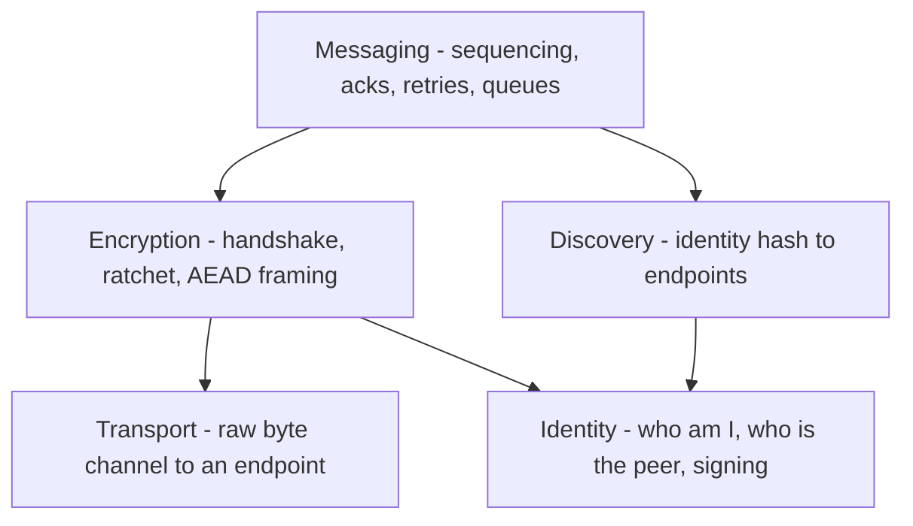
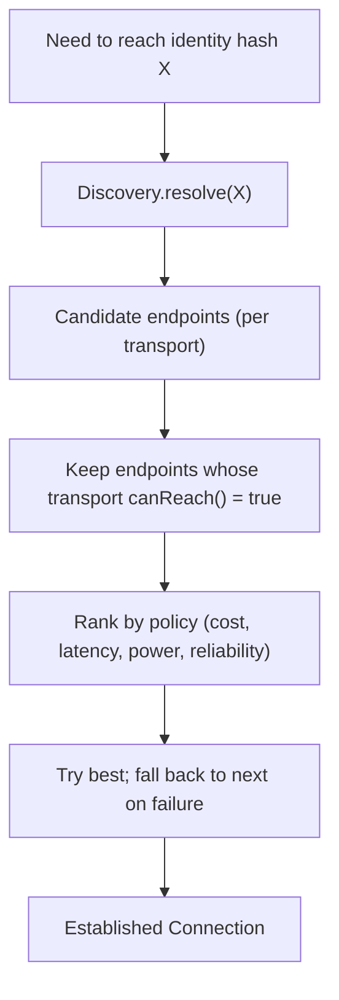
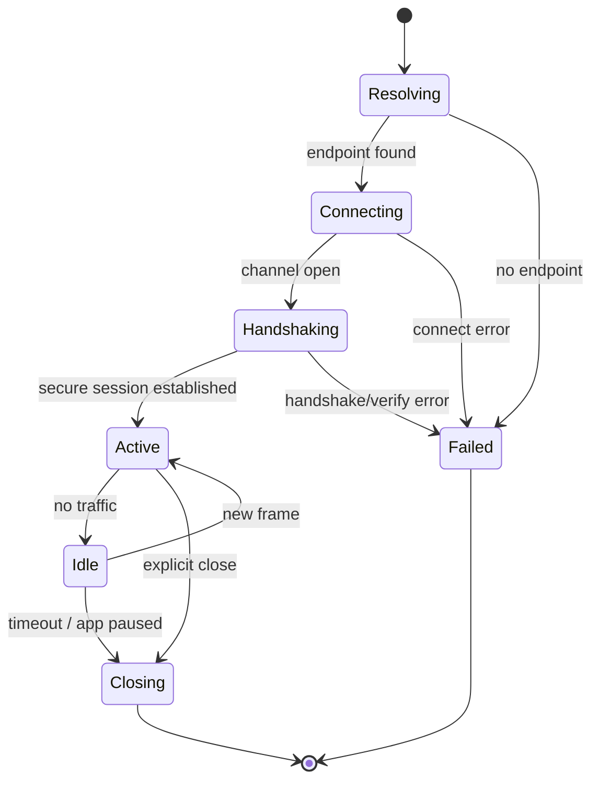

# vMessenger - Network Architecture

This document describes the networking architecture: the layered model, the interface contracts for each layer, the transport abstraction and automatic transport selection, the connection lifecycle, and how future transports plug in without changing the rest of the system.

The wire format, handshake, and message semantics are specified in [Protocol.md](Protocol.md). The cryptography is specified in [Security.md](Security.md). Peer location (turning an identity into an address) is specified in [Discovery.md](Discovery.md), [DHT.md](DHT.md), and [Bootstrap.md](Bootstrap.md).

---

## 1. Philosophy

Networking is decomposed into independent, replaceable layers. Each layer is defined by an interface and communicates with adjacent layers only through that interface. This is what makes vMessenger able to evolve from a single Internet transport today into Bluetooth, Wi-Fi Direct, and mesh transports later without rewrites.

The two hard rules:

- The Discovery layer is completely independent from the Messaging layer. Messaging asks Discovery for endpoints; it never knows how they were found.
- No plaintext crosses the Transport boundary. Encryption sits between Messaging and Transport, so Transport only ever moves opaque ciphertext frames.

---

## 2. The layered model



Responsibilities:

- Identity: holds the device keypair; signs records and handshakes; verifies peers. See [Security.md](Security.md).
- Discovery: resolves an identity hash to one or more reachable `Endpoint`s. See [Discovery.md](Discovery.md).
- Transport: opens and maintains a bidirectional byte channel to an `Endpoint`; listens for inbound channels.
- Encryption: negotiates a secure session over a channel and seals/opens frames. See [Protocol.md](Protocol.md) and [Security.md](Security.md).
- Messaging: turns application messages into ordered, acknowledged, retryable exchanges over a session.

---

## 3. Layer contracts

These are illustrative Kotlin interfaces that define the boundaries. Exact signatures are finalized during implementation, but the shapes are stable.

### 3.1 Identity

```kotlin
interface IdentityService {
    val self: Identity                       // public key, identity hash, user hash
    fun sign(data: ByteArray): ByteArray     // Ed25519 signature
    fun verify(publicKey: PublicKey, data: ByteArray, signature: ByteArray): Boolean
}
```

### 3.2 Discovery

```kotlin
interface DiscoveryProvider {
    val id: DiscoveryProviderId

    // Make ourselves reachable (e.g. publish a signed endpoint record).
    suspend fun announce(self: Identity, endpoints: List<Endpoint>): Result<Unit>

    // Resolve a peer's identity hash to current reachable endpoints.
    suspend fun resolve(identityHash: IdentityHash): Result<List<Endpoint>>
}
```

Multiple `DiscoveryProvider`s can be registered (QR/User Hash exchange feeds the contact's identity; the DHT provider resolves live endpoints). See [Discovery.md](Discovery.md).

### 3.3 Transport

```kotlin
interface Transport {
    val id: TransportId
    val capabilities: TransportCapabilities  // reliability, ordering, MTU, reachability class

    fun canReach(endpoint: Endpoint): Boolean
    suspend fun connect(endpoint: Endpoint): Result<Connection>
    fun listen(): Flow<Connection>           // inbound connections
}

interface Connection {
    val remote: Endpoint
    val state: StateFlow<ConnectionState>
    suspend fun write(frame: ByteArray): Result<Unit>
    fun read(): Flow<ByteArray>              // length-delimited frames
    suspend fun close()
}
```

### 3.4 Encryption

```kotlin
interface SecureChannelFactory {
    suspend fun initiate(connection: Connection, peer: Contact): Result<SecureSession>
    suspend fun accept(connection: Connection): Result<SecureSession>
}

interface SecureSession {
    val peer: Identity
    suspend fun seal(plaintext: ByteArray): ByteArray   // AEAD + ratchet
    suspend fun open(frame: ByteArray): ByteArray        // verifies + replay check
    suspend fun close()
}
```

### 3.5 Messaging

```kotlin
interface MessagingService {
    suspend fun send(envelope: Envelope): Result<Unit>   // resolves, connects, seals, writes
    fun incoming(): Flow<Envelope>                        // decrypted application messages
    fun connectionEvents(): Flow<ConnectionEvent>
}
```

---

## 4. Addressing model

An `Endpoint` is a transport-tagged address, never an identity. Identities are addressed by their identity hash; endpoints are how a transport reaches a device right now.

```kotlin
data class Endpoint(
    val transport: TransportId,   // e.g. INTERNET, BLUETOOTH, WIFI_DIRECT
    val address: String,          // e.g. "ip:port" for INTERNET; opaque for others
    val expiresAt: Instant        // endpoints are ephemeral
)
```

Endpoints are produced by Discovery (for MVP, from signed DHT records) and consumed by Transport. Because endpoints are transport-tagged, the same identity can be reachable simultaneously over several transports.

---

## 5. Transport abstraction and automatic selection

A `TransportSelector` chooses the best transport for a target. All registered `Transport`s are injected as a set (Hilt multibinding), so adding a transport requires no change to the selector.



Selection policy (MVP and beyond):

- Prefer already-open connections to the peer (connection reuse).
- Prefer local/offline transports when available and cheaper (future: Bluetooth/Wi-Fi Direct in the same room) over Internet.
- Prefer lower power and lower cost; degrade gracefully.
- On failure, transparently fall back to the next candidate endpoint/transport.

For the MVP only the Internet transport is registered, so selection trivially resolves to it; the machinery is in place so future transports activate automatically.

---

## 6. Internet transport (MVP)

- Reliable, ordered byte stream over TCP, carrying length-delimited frames (see [Protocol.md](Protocol.md)). TLS-style transport encryption is unnecessary because every frame is already end-to-end encrypted; the Encryption layer authenticates the peer by identity key, which is stronger than CA-based TLS for this use case.
- Listens on a local port and registers its address as an `Endpoint` published via the DHT discovery provider.
- Connection reuse: an established connection is cached per peer and reused for subsequent messages and location packets.
- MVP reachability assumption: the peer's published endpoint is directly reachable (public IP, IPv6, port-forwarded, or same network). NAT traversal and relay fallback are future transports/strategies (see [Roadmap.md](Roadmap.md)).

---

## 7. Connection lifecycle



- Resolving and connecting failures feed the retry/offline queue (see [Protocol.md](Protocol.md)).
- Idle connections are closed after a timeout to save battery; the next message re-establishes them.

---

## 8. Resilience and failure handling

- Resolution failure (peer offline / no fresh DHT record): message stays in the offline queue; the app periodically re-resolves and retries.
- Connection failure: try the next candidate endpoint/transport; if all fail, back off with jitter and requeue.
- Handshake/verification failure: treated as a security event, not retried blindly; surfaced to the user if the peer key mismatches (possible MITM or key change). See [Security.md](Security.md).
- Mid-session drop: the session can be resumed or re-established; Messaging guarantees at-least-once delivery with deduplication so no message is lost or double-applied.

---

## 9. How future transports plug in

To add Bluetooth, Wi-Fi Direct, or mesh:

1. Create a `:network:transport-<name>` module implementing `Transport` and `Connection`.
2. Provide `TransportCapabilities` (reachability class, MTU, ordering/reliability) so the selector can rank it.
3. Register it via a Hilt `@IntoSet` binding.
4. Optionally add a matching `DiscoveryProvider` (for example, BLE advertisement scanning) that produces endpoints tagged with the new transport.

No changes are required in Encryption, Messaging, Domain, or UI. This is the practical payoff of the layered design and is tracked in [Roadmap.md](Roadmap.md).
