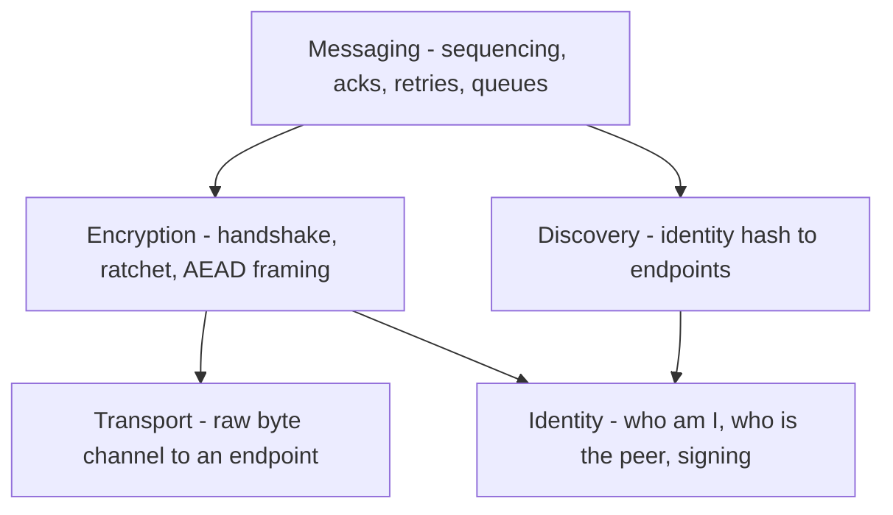
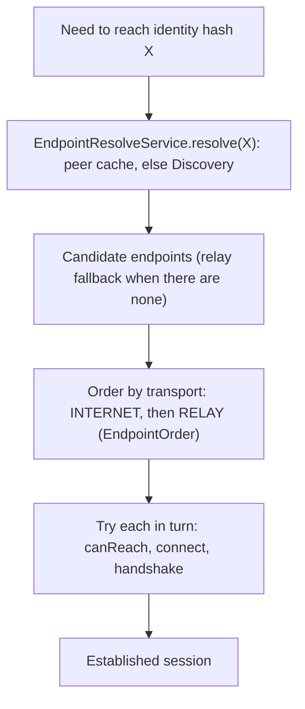
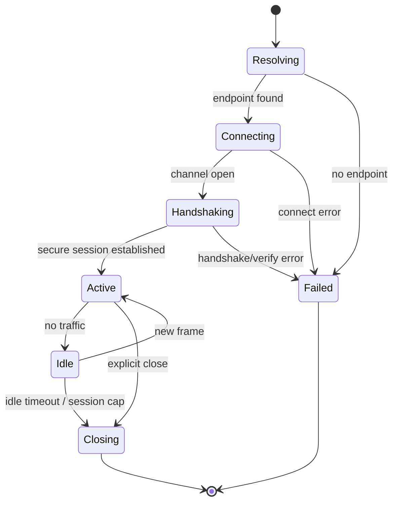

# vMessenger - Network Architecture

This document describes the networking architecture: the layered model, the interface contracts for each layer, the transport abstraction and automatic transport selection, the connection lifecycle, and how future transports plug in without changing the rest of the system.

The wire format, handshake, and message semantics are specified in [Protocol.md](Protocol.md). The cryptography is specified in [Security.md](Security.md). Peer location (turning an identity into an address) is specified in [Discovery.md](Discovery.md) and [DHT.md](DHT.md).

---

## 1. Philosophy

Networking is decomposed into independent, replaceable layers. Each layer is defined by an interface and communicates with adjacent layers only through that interface. This is what makes vMessenger able to evolve from today's two Internet transports (direct TCP and a relay) into Bluetooth, Wi-Fi Direct, and mesh transports later without rewrites.

The two hard rules:

- The Discovery layer is completely independent from the Messaging layer. Messaging asks Discovery for endpoints; it never knows how they were found.
- No application plaintext crosses the Transport boundary. Encryption sits between Messaging and Transport, so Transport only ever moves opaque ciphertext frames (the handshake and `CLOSE` frames carry only public keys, signatures, capabilities and a close reason).

---

## 2. The layered model


```mermaid
flowchart TD
  Identity["Identity - who am I, who is the peer, signing"]
  Discovery["Discovery - identity hash to endpoints"]
  Transport["Transport - raw byte channel to an endpoint"]
  Encryption["Encryption - handshake, ratchet, AEAD framing"]
  Messaging["Messaging - sequencing, acks, retries, queues"]

  Messaging --> Encryption
  Encryption --> Transport
  Messaging --> Discovery
  Discovery --> Identity
  Encryption --> Identity
```

Responsibilities:

- Identity: holds the device keypair; signs records and handshakes; verifies peers. See [Security.md](Security.md).
- Discovery: resolves an identity hash to one or more reachable `Endpoint`s. See [Discovery.md](Discovery.md).
- Transport: opens and maintains a bidirectional byte channel to an `Endpoint`; listens for inbound channels.
- Encryption: negotiates a secure session over a channel and seals/opens frames. See [Protocol.md](Protocol.md) and [Security.md](Security.md).
- Messaging: turns application messages into ordered, acknowledged, retryable exchanges over a session.

---

## 3. Layer contracts

These are the Kotlin types at each boundary, abridged; the file named above each block has the full signatures.

### 3.1 Identity

There is no single identity service. The device's identity and keys come from the domain's `IdentityRepository`, and signing goes through `CryptoEngine`:

```kotlin
// domain/.../repository/IdentityRepository.kt (abridged)
interface IdentityRepository {
    suspend fun getIdentity(): Identity?     // Ed25519 + X25519 public keys, identity hash, user hash
    suspend fun getEd25519PrivateKey(): ByteArray?
    suspend fun getX25519StaticPrivateKey(): ByteArray?
}

// core/crypto/.../CryptoEngine.kt (abridged)
interface CryptoEngine {
    fun signEd25519(message: ByteArray, privateKey: ByteArray): ByteArray
    fun verifyEd25519(message: ByteArray, signature: ByteArray, publicKey: ByteArray): Boolean
}
```

The messaging layer carries a peer's keys as a `PeerIdentity` (identity hash, Ed25519 key, X25519 static key; see 3.4).

### 3.2 Discovery

```kotlin
// network/discovery/.../DiscoveryProvider.kt
interface DiscoveryProvider {
    val id: DiscoveryProviderId

    // Make ourselves reachable (publish a signed endpoint record).
    suspend fun announce(
        self: DiscoveryIdentity,             // identity hash + Ed25519 public key
        endpoints: List<Endpoint>,
        ed25519PrivateKey: ByteArray,
    ): AppResult<Unit>

    // Resolve a peer's identity hash to current reachable endpoints.
    suspend fun resolve(identityHash: ByteArray): AppResult<List<Endpoint>>
}
```

Multiple `DiscoveryProvider`s can be registered; `DhtDiscoveryProvider` is the only one today. QR / User Hash pairing supplies a contact's identity, not endpoints. See [Discovery.md](Discovery.md).

### 3.3 Transport

```kotlin
// network/transport/.../Transport.kt
interface Transport {
    val id: TransportId
    val capabilities: TransportCapabilities  // reliable, ordered, mtu

    fun canReach(endpoint: Endpoint): Boolean
    suspend fun connect(endpoint: Endpoint): Result<Connection>
    fun listen(port: Int): Flow<Connection>  // inbound connections
}

interface Connection {
    val remote: Endpoint
    val state: StateFlow<ConnectionState>    // CONNECTING, OPEN, CLOSED, FAILED
    suspend fun write(frame: ByteArray): Result<Unit>
    fun read(): Flow<ByteArray>              // length-delimited frames
    suspend fun close()
}
```

`RelayTransport` is dialled with `connect(endpoint, relayTargetId)`, because a relay circuit is addressed by the peer's identity hash; inbound relay circuits arrive through `RelayListener`, not `listen`.

### 3.4 Encryption

```kotlin
// network/messaging/.../SecureChannelFactory.kt
class SecureChannelFactory {
    suspend fun initiate(connection: Connection, self: PeerIdentity, peer: PeerIdentity): Result<SecureSession>
    suspend fun accept(connection: Connection, self: PeerIdentity, expectedPeer: PeerIdentity): Result<SecureSession>
    // Inbound: the peer is resolved from the keys it actually presented.
    suspend fun acceptResolving(
        connection: Connection,
        self: PeerIdentity,
        resolvePeer: suspend (identityPub: ByteArray, staticPub: ByteArray) -> PeerIdentity?,
    ): Result<SecureSession>
}

interface SecureSession {
    val peer: PeerIdentity
    val ratchetState: RatchetState
    suspend fun seal(plaintext: ByteArray, frameType: FrameType = FRAME_TYPE_SECURE): ByteArray
    suspend fun open(frame: ByteArray, counter: Long, frameType: FrameType = FRAME_TYPE_SECURE): ByteArray?
    suspend fun close()   // zeroizes the ratchet state
}
```

The handshake is the three-step, doubly-signed v2 exchange with three Diffie-Hellman operations; `counter` is the ratchet counter carried in the frame header and bound into the AEAD associated data. See [Protocol.md](Protocol.md) §5 and §7.

### 3.5 Messaging

```kotlin
// network/messaging/.../MessagingService.kt (abridged; a class, not an interface)
class MessagingService {
    // Reuses the contact's open session, or resolves, connects and handshakes; then seals and writes.
    suspend fun send(
        contactId: String,
        self: PeerIdentity,
        peer: PeerIdentity,
        envelope: MessageEnvelope,
        forceReconnect: Boolean = false,
    ): AppResult<Unit>
    val incoming: Flow<IncomingEnvelope>                  // decrypted, authenticated envelopes
    fun startListening(listenPort: Int)                   // direct TCP listener
    fun startRelayListener(/* identity, key provider */)  // inbound circuits through a relay
}
```

---

## 4. Addressing model

An `Endpoint` is a transport-tagged address, never an identity. Identities are addressed by their identity hash; endpoints are how a transport reaches a device right now.

```kotlin
// core/common/.../network/Endpoint.kt
data class Endpoint(
    val transport: TransportId,        // INTERNET or RELAY today (TransportIds); UDP is defined but unused
    val address: String,               // "host:port" for INTERNET; a wss:// node URL for RELAY
    val expiresAtUnixMs: Long? = null, // endpoints are ephemeral: published_at + ttl of the DHT record; null for the relay fallback
)
```

Endpoints are produced by Discovery (for MVP, from signed DHT records, or the relay fallback when there is no record) and consumed by Transport. Because endpoints are transport-tagged, the same identity can be reachable simultaneously over several transports.

### 4.1 Node addresses and pinned certificates

A relay or DHT node is addressed by a URL — `wss://host[:port][/path]` — optionally followed by the
keys its certificate may carry: `#pin-sha256=<pin>[,<pin>…]`, at most four, each the base64url
(no padding) SHA-256 of a DER `SubjectPublicKeyInfo`. `NodeUrl` (`core/common/.../network/NodeUrl.kt`)
is the one parser; the grammar is in [Protocol.md](Protocol.md) §19.

- **A pinned URL trusts its pins and nothing else.** A node set up on a bare IP has a self-signed
  certificate that no CA vouches for; its key is its identity. `PinnedTls` accepts the server when
  the leaf certificate's key matches a pin, and ignores its name and dates. An unpinned URL keeps the
  platform's CA validation, unchanged.
- **The pin never goes on the wire.** `NodeUrl.dialUrl` drops the fragment; the address string, pin
  and all, is what is stored, shared and signed.
- **One way to open a socket.** Every WebSocket to a node — a relay dial, the listener's control
  channel, a DHT request — goes through `WebSocketFrameClient.openWebSocket(url, targetIp, listener)`,
  which picks the client: pins, and, for relay sockets, the backend IP. Variants derive from one base
  `OkHttpClient` and share its connection pool.
- **Sticky IPs.** A relay name that resolves to several backends keeps a listener and its dialers on
  the same one: a relay socket dialled to one backend makes it, once it opens, the host's *sticky IP*
  (`RelayDns`), which later relay sockets try first. (This used to be called "pinning"; the word now
  means certificate keys. It was recorded from an OkHttp `EventListener`, which OkHttp does not give
  WebSocket calls, so until 2.0 it never actually took effect.)
- **One row per location.** Stored addresses are canonical (`NodeUrl.canonical`), and a location
  (`NodeUrl.locationKey`) has one row. An address the person adds with a new pin replaces that row and
  resets its health; imports from peers, the DHT or signed records never change a stored location's
  pin; a backup restore (`NodeAddMode.KeepExisting`) keeps the row that is here. The Nodes screen shows
  the address without its pin, left to right, and a «کلید سنجاق‌شده» / "Pinned key" badge.
- **The published relay follows the listener.** The listener picks its relay afresh on every
  reconnect, and exposes the one it is on (`RelayListener.connectedRelay`); whenever that differs from
  the relay the endpoint record names, `NetworkCoordinator` publishes again and re-arms the announcer.
  Adding, enabling, disabling or removing a relay reconnects the listener at once (`RelayControl`).
  When every relay is failing, ranking tries the one that failed longest ago first, so a broken
  user-added relay cannot hold the listener while a working default waits (`NodeRanking`).
- **Bounded.** Unpinned, untargeted sockets (most DHT requests) use the base client; pinned or
  targeted variants are kept in a 32-entry LRU, since their addresses can come from DHT peers. The
  shared dispatcher is uncapped: an open WebSocket holds its call for its whole life.

---

## 5. Transport abstraction and automatic selection

A `TransportSelector` hands each endpoint to the transport registered for its `TransportId`, after checking `canReach()`. All registered `Transport`s are injected as a set (Hilt multibinding), so adding a transport requires no change to the selector. The order in which endpoints are tried is set by `EndpointOrder` (`network/messaging`), and `OutboundDialer` tries them in turn.


```mermaid
flowchart TD
  Need["Need to reach identity hash X"] --> Resolve["EndpointResolveService.resolve(X): peer cache, else Discovery"]
  Resolve --> Endpoints["Candidate endpoints (relay fallback when there are none)"]
  Endpoints --> Rank["Order by transport: INTERNET, then RELAY (EndpointOrder)"]
  Rank --> Try["Try each in turn: canReach, connect, handshake"]
  Try --> Conn["Established session"]
```

Selection policy:

- Prefer the already-open session to the peer (session reuse).
- Order by transport: direct `INTERNET` first, then `RELAY`; a transport `EndpointOrder` does not know is tried after the relay. With `P2PConfig.reduceDefaultRelayEnabled` (off by default) the built-in relay is tried after any other relay.
- On failure, fall back to the next candidate endpoint. A protocol-version or pinned-key failure stops the fallback, since every endpoint would give the same answer.
- Future: prefer local/offline transports (Bluetooth/Wi-Fi Direct in the same room) and lower power and cost. Nothing ranks by cost, latency or power today.

Two transports are registered: `InternetTransport` (direct TCP) and `RelayTransport` (WebSocket circuits through a relay node). `UdpTransport` exists but is deliberately not bound (`TransportModule`): it cannot carry a handshake.

---

## 6. Internet transport (MVP)

- Reliable, ordered byte stream over TCP, carrying length-delimited frames (see [Protocol.md](Protocol.md)). TLS-style transport encryption is unnecessary because every frame is already end-to-end encrypted; the Encryption layer authenticates the peer by identity key, which is stronger than CA-based TLS for this use case.
- Listens on TCP port 48555 (`NetworkLifecycleService.DEFAULT_LISTEN_PORT`). A phone does not know an address others can reach it on, so a production build publishes only its relay endpoint; a direct `INTERNET` endpoint (`10.0.2.2:<forward port>`) is published only in the emulator dev setup ([Testing.md](Testing.md)). Voice calls exchange direct addresses in their own signalling and use their own media path ([Protocol.md](Protocol.md) §17 and §18).
- Connection reuse: an established connection is cached per peer and reused for subsequent messages and location packets.
- **Direct-first, relay-fallback:** the app tries direct `INTERNET` before `RELAY`. The relay (built in: `wss://relay.vmessenger.ir/relay`) bridges opaque E2E-encrypted frames when there is no direct path and never decrypts them. There are no UDP candidates: `UdpTransport` is not registered and nothing publishes a UDP endpoint, so `P2PConfig.natTraversalEnabled` (off by default) only changes how one would be ranked.
- **Runtime flags (`core/common/.../network/P2PConfig.kt`):** endpoint resolution is cache-first, multiple bootstrap/relay nodes are health-ranked, and store-and-forward through approved contacts' mailboxes is on — all on by default. Peer exchange, embedded DHT participation, relay-peer mode, UDP attempts and default-relay demotion (`reduceDefaultRelayEnabled`) default to **false**; they are reachable code, not proven paths. See the "Known limitations" section of the [README](../README.md).
- DHT bootstrap and store/find use `wss://relay.vmessenger.ir/dht` through Arvan CDN + nginx TLS.
- Local emulator dev can use raw TCP bootstrap (`10.0.2.2:46555`) via `NetworkConfig.useDevBootstrap`.
- There is no NAT traversal: a `UdpTransport` class exists but is not registered, TCP endpoints are no longer mirrored as UDP candidates (`EndpointResolveService`), and there is no STUN/ICE candidate gathering, no hole punching and no connectivity checks. Full Kademlia routing and replication are likewise not implemented.

---

## 7. Connection lifecycle


```mermaid
stateDiagram-v2
  [*] --> Resolving
  Resolving --> Connecting: endpoint found
  Resolving --> Failed: no endpoint
  Connecting --> Handshaking: channel open
  Connecting --> Failed: connect error
  Handshaking --> Active: secure session established
  Handshaking --> Failed: handshake/verify error
  Active --> Idle: no traffic
  Idle --> Active: new frame
  Idle --> Closing: idle timeout / session cap
  Active --> Closing: explicit close
  Closing --> [*]
  Failed --> [*]
```

- Resolving and connecting failures feed the retry/offline queue (see [Protocol.md](Protocol.md)).
- Idle connections are closed after a timeout: a direct TCP socket after 120 s without a frame (`InternetTransport`), a relay circuit by the node after 10 minutes idle (`VMESSENGER_CIRCUIT_IDLE_TIMEOUT_MS`). A session also ends after 65 536 frames or 12 hours. The next message re-establishes it with a fresh handshake.

---

## 8. Resilience and failure handling

- Resolution failure (peer offline / no fresh DHT record): the relay is still tried, since a relay circuit needs only the identity hash; if that fails too, the message stays in the offline queue and the app periodically re-resolves and retries.
- Connection failure: try the next candidate endpoint/transport; if all fail, back off exponentially (4 s, doubling, capped at 60 s; no jitter) and retry. After 12 attempts a sealed copy is also parked for store-and-forward, to be offered to reachable approved contacts ([Protocol.md](Protocol.md) §11), and after 24 hours the message is given up (`OutboxDispatcher`).
- Handshake/verification failure: treated as a security event, not retried blindly; surfaced to the user if the peer key mismatches (possible MITM or key change). See [Security.md](Security.md).
- Mid-session drop: sessions are never persisted, so the next send runs a fresh handshake. Messaging is at-least-once with per-conversation `message_id` deduplication, so a retried chat message is not applied twice; a message is lost only when the retry window above runs out, and it is then marked failed.

---

## 9. How future transports plug in

To add Bluetooth, Wi-Fi Direct, or mesh:

1. Create a `:network:transport-<name>` module implementing `Transport` and `Connection`, with its `TransportCapabilities` (reliable, ordered, MTU).
2. Register it via a Hilt `@IntoSet` binding.
3. Give its `TransportId` a rank in `EndpointOrder`; an unranked transport is tried after the relay.
4. Optionally add a matching `DiscoveryProvider` (for example, BLE advertisement scanning) that produces endpoints tagged with the new transport.

Apart from that one ranking entry, no changes are required in Encryption, Messaging, Domain, or UI. That is the practical payoff of the layered design; no such transport module exists today.
