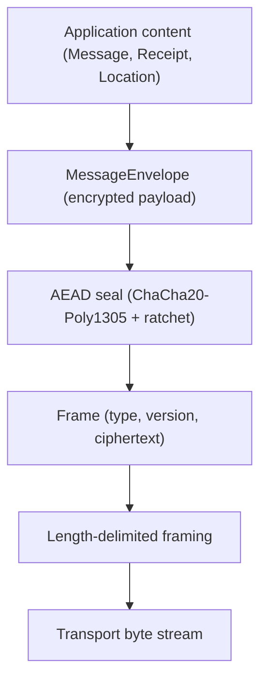
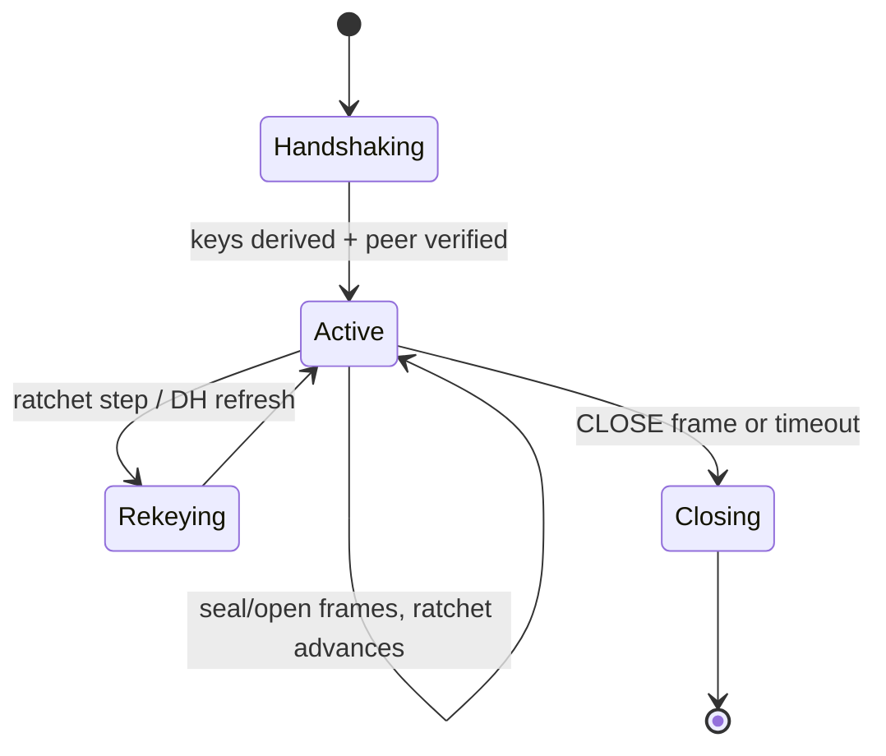
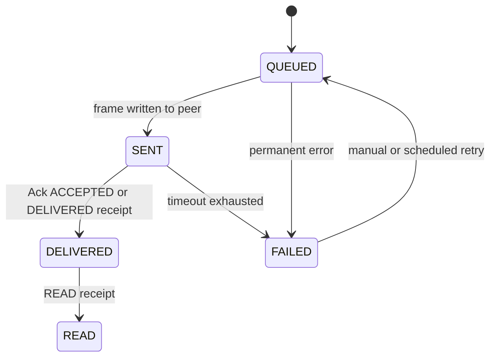
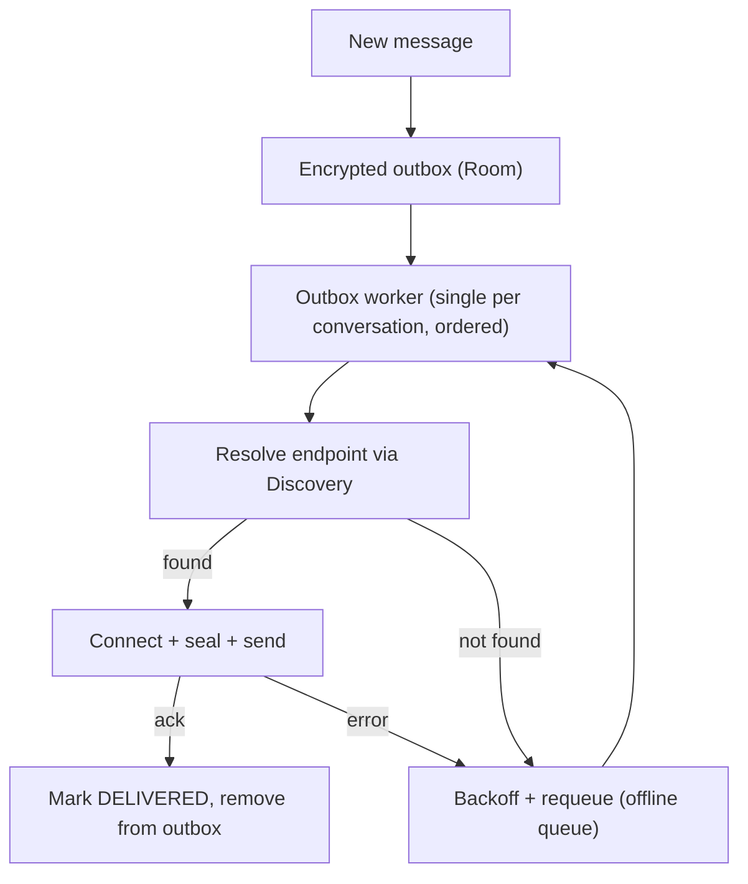

# vMessenger - Wire Protocol

This document specifies the vMessenger wire protocol: framing, version negotiation, the secure handshake, session lifecycle, the application message envelope, delivery and read receipts, acknowledgements, the retry and offline queues, ordering and deduplication, location packets, and the Protocol Buffers schemas.

The cryptographic constructions referenced here (Ed25519, X25519, HKDF, ChaCha20-Poly1305, ratchet, replay protection) are specified in [Security.md](Security.md). The transport that carries these frames is specified in [Network.md](Network.md).

---

## 1. Design goals

- Confidential, authenticated, forward-secret, replay-resistant message exchange.
- Compact, schema-evolvable binary format (Protocol Buffers, proto3).
- Clear separation between the unencrypted framing needed to route bytes and the encrypted payloads that carry meaning.
- Forward and backward compatibility via explicit versioning and capability negotiation.
- Transport-agnostic: the same frames work over any `Transport`.

---

## 2. Layering of the protocol



- The outer `Frame` is the only structure a transport sees. Its header is minimal and unencrypted (type and version); its body is either a handshake message or AEAD ciphertext.
- The `MessageEnvelope` is the plaintext-on-device structure that is sealed into a frame body.

---

## 3. Framing

Every transmission is a length-delimited `Frame`.

- A 4-byte big-endian unsigned length prefix precedes each serialized `Frame` (max frame size is bounded, default 1 MiB for MVP; larger payloads such as files are chunked in a later phase).
- The `Frame` is a Protobuf message with a small clear header and an opaque body.

```proto
syntax = "proto3";
package vmessenger.wire.v1;

message Frame {
  uint32 version = 1;          // protocol major version, see Section 4
  FrameType type = 2;
  bytes body = 3;              // HandshakeMessage (clear) or AEAD ciphertext
}

enum FrameType {
  FRAME_TYPE_UNSPECIFIED = 0;
  FRAME_TYPE_HANDSHAKE = 1;    // body = HandshakeMessage
  FRAME_TYPE_SECURE = 2;       // body = AEAD-sealed MessageEnvelope
  FRAME_TYPE_ACK = 3;          // body = AEAD-sealed Ack
  FRAME_TYPE_CLOSE = 4;        // graceful session close
  FRAME_TYPE_KEEPALIVE = 5;    // optional idle keepalive
}
```

---

## 4. Versioning and capability negotiation

- `Frame.version` carries the protocol major version. Incompatible changes bump the major version.
- During the handshake, peers exchange a `capabilities` bitset / list so optional features (future: groups, calls, file transfer, compression) can be negotiated without breaking older peers.
- Rule: receivers ignore unknown fields (proto3 default) and unknown capabilities; senders never assume a capability that was not advertised by the peer.
- If major versions are incompatible, the session is rejected with a clear, localized error rather than attempting a fragile downgrade.

```proto
message Capabilities {
  uint32 protocol_major = 1;
  uint32 protocol_minor = 2;
  repeated string features = 3;   // e.g. "receipts", "live-location"; extended over time
}
```

---

## 5. Secure handshake

The handshake authenticates both peers by their long-term Ed25519 identity keys and establishes a forward-secret session via ephemeral X25519 key agreement. It follows a Noise-style pattern (mutual authentication, identity hiding for the initiator where possible); the exact pattern and key schedule are specified in [Security.md](Security.md). This section defines the messages on the wire.

```mermaid
sequenceDiagram
  participant I as Initiator
  participant R as Responder
  I->>R: HandshakeMessage e1 (ephemeral X25519, capabilities)
  R->>I: HandshakeMessage e2 (ephemeral X25519, capabilities, static-key proof)
  I->>R: HandshakeMessage s_i (initiator static-key proof, confirmation)
  Note over I,R: Both derive root + chain keys via HKDF; session is Active
```

```proto
message HandshakeMessage {
  uint32 step = 1;                 // 1, 2, or 3
  bytes ephemeral_pub = 2;         // X25519 ephemeral public key
  bytes static_pub = 3;            // X25519 static (identity-bound) public key, when revealed
  bytes identity_pub = 4;          // Ed25519 identity public key, when revealed/encrypted per pattern
  bytes signature = 5;             // Ed25519 signature binding the handshake transcript
  Capabilities capabilities = 6;
  bytes payload = 7;               // optional encrypted handshake payload (e.g. early metadata)
}
```

Verification requirements:

- The responder/initiator static identity must match the contact's known Ed25519 public key obtained during pairing (QR/User Hash). A mismatch aborts the session and is surfaced as a possible key change or MITM (see [Security.md](Security.md)).
- The signature must cover the full handshake transcript to prevent transcript tampering and key-reuse attacks.

---

## 6. Session lifecycle



- Once Active, every `FRAME_TYPE_SECURE`/`FRAME_TYPE_ACK` body is AEAD-sealed and the symmetric ratchet advances per message, providing forward secrecy. The full ratchet design (and the path to a Double Ratchet) is in [Security.md](Security.md).
- Sessions can be persisted (sealed) so a conversation survives app restarts without a fresh handshake, subject to the forward-secrecy policy in [Security.md](Security.md).

---

## 7. Application payloads

All application content is carried inside a `MessageEnvelope`, which is AEAD-sealed into a `FRAME_TYPE_SECURE` frame.

```proto
syntax = "proto3";
package vmessenger.app.v1;

message MessageEnvelope {
  bytes message_id = 1;            // 16-byte random UUID, globally unique, used for dedup + acks
  bytes sender_identity_hash = 2;  // for routing/verification context
  int64 sent_at_unix_ms = 3;       // sender clock; advisory only
  uint64 counter = 4;              // per-session monotonic counter, replay protection

  oneof content {
    ChatMessage chat = 10;
    Receipt receipt = 11;
    LocationPacket location = 12;
    Control control = 13;
    // Reserved for future: GroupMessage, CallSignal, FileChunk, ImageMessage, Plugin payloads
  }
}

message ChatMessage {
  string text = 1;                 // UTF-8; Persian content fully supported
  bytes reply_to_message_id = 2;   // optional threaded reply
  // Future: attachments, formatting, mentions
}

message Receipt {
  bytes ref_message_id = 1;        // the message being acknowledged
  ReceiptType type = 2;
  int64 at_unix_ms = 3;
}

enum ReceiptType {
  RECEIPT_TYPE_UNSPECIFIED = 0;
  RECEIPT_TYPE_DELIVERED = 1;      // arrived and decrypted on the peer device
  RECEIPT_TYPE_READ = 2;           // user has viewed it
}

message Control {
  ControlType type = 1;
  bytes ref_message_id = 2;        // optional
}

enum ControlType {
  CONTROL_TYPE_UNSPECIFIED = 0;
  CONTROL_TYPE_TYPING = 1;
  CONTROL_TYPE_LOCATION_SHARE_START = 2;
  CONTROL_TYPE_LOCATION_SHARE_STOP = 3;
}
```

### 7.1 Acknowledgements

A transport-level `Ack` confirms receipt of a frame and is itself sealed (`FRAME_TYPE_ACK`). It is distinct from the application-level delivered/read `Receipt`.

```proto
message Ack {
  bytes ref_message_id = 1;
  AckStatus status = 2;
}

enum AckStatus {
  ACK_STATUS_UNSPECIFIED = 0;
  ACK_STATUS_ACCEPTED = 1;         // decrypted and persisted by peer
  ACK_STATUS_REJECTED = 2;         // e.g. replay detected, malformed
}
```

---

## 8. Delivery semantics and status model

Each outgoing message advances through a status machine that is persisted and observed by the UI (see [Architecture.md](Architecture.md) and [Database.md](Database.md)).



- QUEUED: written to the local DB and the outbox; not yet sent.
- SENT: the sealed frame was written to an active connection.
- DELIVERED: the peer acknowledged decryption/persistence.
- READ: the peer's user viewed the message.
- FAILED: retries exhausted or a permanent error occurred; user may retry.

---

## 9. Retry queue and offline queue

The sender owns durability. There is no server to hold messages, so undelivered messages live in a local, encrypted outbox until delivered or abandoned.



- Retry queue (transient failures): exponential backoff with jitter, bounded attempts before marking FAILED. Applies to connection and send errors.
- Offline queue (peer unreachable): messages persist indefinitely (subject to user settings) and are retried when the peer becomes resolvable again or on connectivity/DHT refresh events.
- Ordering: a single worker per conversation drains the outbox in order, so messages arrive in send order. Cross-conversation delivery is parallel.
- Idempotency: `message_id` makes redelivery safe; receivers deduplicate.

---

## 10. Ordering, deduplication, and replay

- Per-session `counter` is monotonic; receivers reject out-of-window or repeated counters (replay protection, see [Security.md](Security.md)).
- `message_id` deduplicates at the application layer in case a message is delivered more than once across reconnects.
- Display ordering uses a stable rule: primarily the receiver's arrival order within a conversation, with `sent_at_unix_ms` used only as an advisory tiebreaker (sender clocks are untrusted).

---

## 11. Live location packets

Live location reuses the same secure session as messaging. Packets are small and frequent, so they are compact and never include precise data beyond what the user shares.

```proto
message LocationPacket {
  bytes share_id = 1;              // identifies a sharing session
  double latitude = 2;
  double longitude = 3;
  float accuracy_m = 4;
  float speed_mps = 5;             // optional
  float heading_deg = 6;          // optional
  int32 battery_pct = 7;          // optional, recipient awareness
  int64 sampled_at_unix_ms = 8;
  bool is_final = 9;              // last packet when sharing stops
}
```

- A sharing session begins with `CONTROL_TYPE_LOCATION_SHARE_START` and ends with `CONTROL_TYPE_LOCATION_SHARE_STOP` or a packet with `is_final = true`.
- Packets are persisted to the encrypted location history table only if the user enabled history (future analytics build on this; see [Roadmap.md](Roadmap.md)).

---

## 12. Pairing payloads (QR and User Hash)

Pairing exchanges long-term identity, not endpoints. The QR encodes a compact, signed identity descriptor; the User Hash is a human-typable encoding of the identity hash. Details and encoding are in [Discovery.md](Discovery.md).

```proto
message PairingDescriptor {
  bytes identity_pub = 1;          // Ed25519 public key
  string user_hash = 2;            // human-readable form, derived from identity hash
  string display_label = 3;        // optional, local-only suggested name
  uint32 version = 4;
  bytes signature = 5;             // self-signature over the descriptor
}
```

---

## 13. Error handling on the wire

- Malformed frames, bad signatures, or replays result in an `Ack` with `ACK_STATUS_REJECTED` (when a session exists) and/or session termination; they are never silently accepted.
- Unknown `FrameType`, `oneof` content, or capabilities are ignored for forward compatibility, except where security requires rejection.
- All wire errors are mapped to domain `AppError`s and surfaced to the UI as calm, localized messages (see [Architecture.md](Architecture.md)).

---

## 14. Extensibility

- New content types are added as new `oneof` arms in `MessageEnvelope` (groups, calls, files, images, plugin payloads). Old clients ignore unknown arms.
- New frame types extend `FrameType`. New negotiated features extend `Capabilities.features`.
- Schema files are versioned by package (`v1`, `v2`, ...) so breaking changes coexist during migration windows.

The full schema lives in the `:core:proto` module; see [FolderStructure.md](FolderStructure.md).
