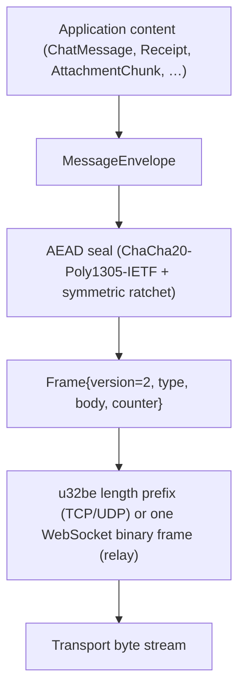
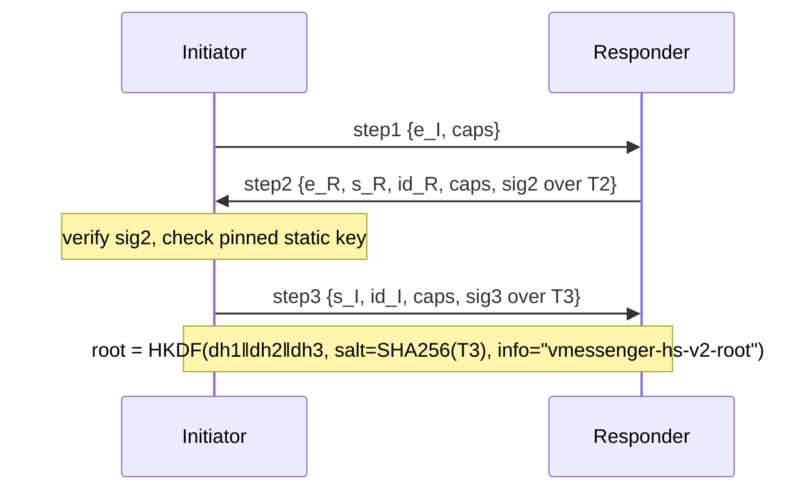
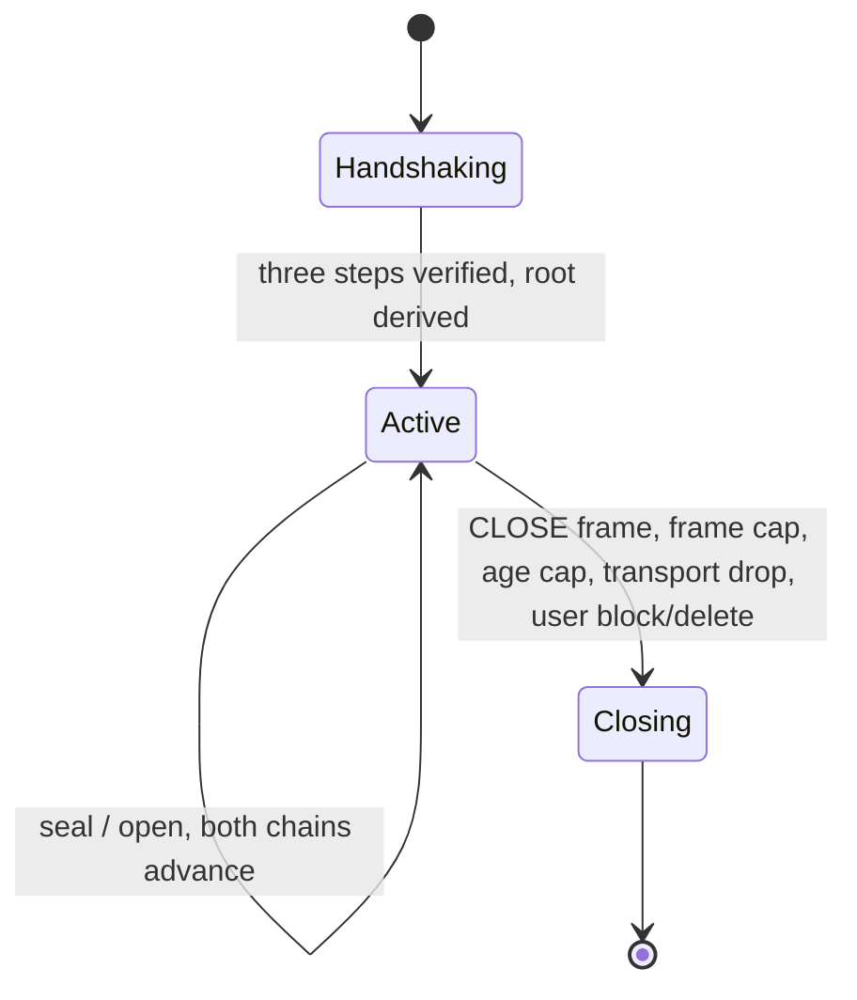
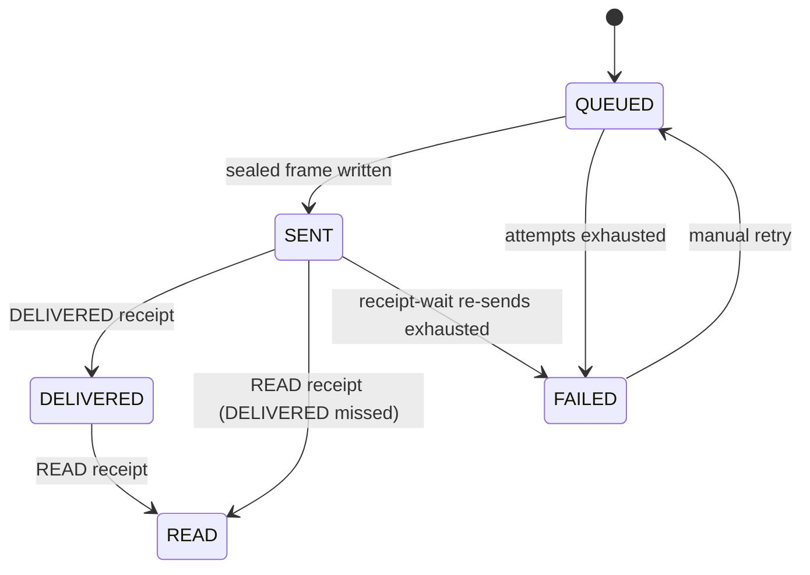
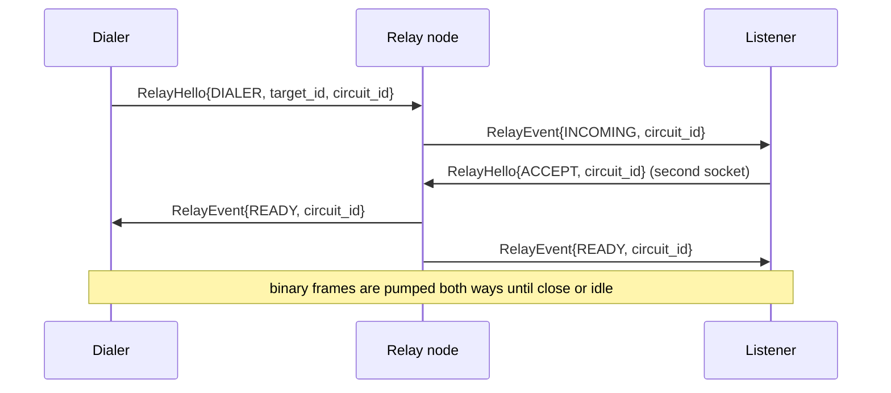

# vMessenger - Wire Protocol

This document specifies the vMessenger wire protocol as implemented: framing, version negotiation, the v2 handshake, the symmetric ratchet, the application envelope, receipts, attachments, the relay control protocol and the DHT RPC surface.

Everything below was read off the current source. Paths are given so each claim can be checked. The cryptographic rationale and threat model live in [Security.md](Security.md); the transports that carry these frames are in [Network.md](Network.md).

**Protocol major is 2.** A peer on any other major is rejected — there is no negotiation and no downgrade. See §14.

---

## 1. Design goals

- Confidential, authenticated, replay-resistant 1:1 message exchange with one handshake per connection.
- Compact, schema-evolvable binary format (Protocol Buffers, proto3).
- A clear split between the unencrypted framing a transport must see and the encrypted payloads that carry meaning.
- Transport-agnostic: the same frames run over direct TCP, UDP and relay circuits.
- Every signed structure has a domain-separated, length-prefixed transcript so no two field layouts can collide on the same bytes (`core/common/.../network/Canonical.kt`).

---

## 2. Layering


```mermaid
flowchart TD
  App["Application content (ChatMessage, Receipt, AttachmentChunk, …)"] --> Inner["MessageEnvelope"]
  Inner --> Seal["AEAD seal (ChaCha20-Poly1305-IETF + symmetric ratchet)"]
  Seal --> Frame["Frame{version=2, type, body, counter}"]
  Frame --> LenPrefix["u32be length prefix (TCP/UDP) or one WebSocket binary frame (relay)"]
  LenPrefix --> Transport["Transport byte stream"]
```

The outer `Frame` is the only structure a transport sees. Its header is unencrypted but authenticated: version, type and counter are bound into the AEAD associated data (§7), so none of them can be altered in transit without failing authentication.

---

## 3. Framing

`core/proto/src/main/proto/vmessenger/wire/v1/frame.proto`

```proto
message Frame {
  uint32 version = 1;   // must equal 2
  FrameType type = 2;
  bytes body = 3;       // HandshakeMessage (clear), Close (clear), or AEAD ciphertext
  uint64 counter = 4;   // ratchet counter of the sealed body, >= 1
}

enum FrameType {
  FRAME_TYPE_UNSPECIFIED = 0;
  FRAME_TYPE_HANDSHAKE = 1;
  FRAME_TYPE_SECURE = 2;
  FRAME_TYPE_ACK = 3;
  FRAME_TYPE_CLOSE = 4;
  FRAME_TYPE_KEEPALIVE = 5;
}
```

Byte framing on the wire (`core/common/.../network/LengthPrefixedFrames.kt`):

| Property | Value |
|---|---|
| Prefix | `u32be(length)` before each serialized `Frame` (TCP and UDP transports) |
| `MAX_FRAME_SIZE` | 1 MiB; the announced length is validated **before** any allocation |
| Read chunking | 64 KiB (`CHUNK_SIZE`); a truncated stream throws `EOFException` |
| Relay transport | one WebSocket binary message per `Frame`; the node caps frames at `VMESSENGER_WS_MAX_FRAME_BYTES` (default 1 MiB, `node/.../NodeConfig.kt`) |
| Handshake frames | additionally capped at 4096 B (`SecureChannelFactory.MAX_HANDSHAKE_FRAME_BYTES`) |

`FRAME_TYPE_ACK` and `FRAME_TYPE_KEEPALIVE` are declared in the schema but **never produced or consumed** by the current code: `SecureFrameGuard.process` handles `FRAME_TYPE_SECURE` and `FRAME_TYPE_CLOSE` and drops every other type. Delivery confirmation is the application-level `Receipt` (§8). The relay listener's keep-alive is a single `0x00` byte on the WebSocket control channel, not a `Frame` (`network/messaging/.../RelayListener.kt`).

---

## 4. Version negotiation and CLOSE

`core/common/.../network/ProtocolVersion.kt` pins `MAJOR = 2`, `MINOR = 0`.

Checks, in the order they run:

1. **Handshake read** (`SecureChannelFactory.readHandshake`): frame size → `Frame.version != 2` → frame type (a peer `CLOSE` is surfaced as its own error) → expected step number → `HandshakeMessage.capabilities.protocol_major != 2`. Either version mismatch answers with `CLOSE{VERSION_MISMATCH}` and throws `ProtocolVersionException`.
2. **Post-handshake** (`SecureFrameGuard.process`): `Frame.version != 2` closes the session outright — there is no per-frame tolerance.

```proto
message Close {
  uint32 code = 1;             // CloseCode
  string message = 2;
  uint32 supported_major = 3;  // the major the sender speaks
}

enum CloseCode {
  CLOSE_CODE_UNSPECIFIED = 0;
  CLOSE_CODE_VERSION_MISMATCH = 1;
  CLOSE_CODE_AUTH_FAILED = 2;
  CLOSE_CODE_SESSION_EXPIRED = 3;
  CLOSE_CODE_REJECTED = 4;
}
```

`Close` bodies are sent **unencrypted** (they may precede any session key) and are never trusted for anything but logging and error mapping (`FrameCodec.kt`, `CloseFrames`). A malformed body decodes to an `UNSPECIFIED` close; peer-supplied messages are truncated to 64 characters before logging.

Who sends which code:

| Code | Sent by | Situation |
|---|---|---|
| `VERSION_MISMATCH` | `SecureChannelFactory.rejectVersion` | `Frame.version` or advertised `protocol_major` is not 2 |
| `AUTH_FAILED` | `SecureChannelFactory.notifyFailure` | handshake signature invalid, identity mismatch, or pinned static key changed |
| `REJECTED` | `SecureChannelFactory.notifyFailure`, `MessagingService.closeSessions` | any other handshake failure; user blocked or deleted the contact |
| `SESSION_EXPIRED` | `MessagingService.processSecureFrame` | the frame/age cap of §6 was reached |

### Capabilities

```proto
message Capabilities {
  uint32 protocol_major = 1;
  uint32 protocol_minor = 2;
  repeated string features = 3;
}
```

Both sides send `{major: 2, minor: 0, features: ["receipts", "live-location"]}` (`SecureChannelFactory.defaultCapabilities`). The feature list is covered by the handshake signatures (§5) but the current code does not branch on it — it is a forward-compatibility channel, not a live negotiation. Unknown proto fields are ignored (proto3 default).

---

## 5. Handshake v2

Three messages, both directions authenticated by Ed25519 over a canonical transcript, three X25519 Diffie-Hellman operations.

`network/messaging/.../SecureChannelFactory.kt` and `HandshakeTranscript.kt`.

```proto
message HandshakeMessage {
  uint32 step = 1;            // 1, 2 or 3
  bytes ephemeral_pub = 2;    // X25519
  bytes static_pub = 3;       // X25519 static
  bytes identity_pub = 4;     // Ed25519
  bytes signature = 5;
  Capabilities capabilities = 6;
  bytes payload = 7;          // unused today; still covered by the transcript
}
```


```mermaid
sequenceDiagram
  participant I as Initiator
  participant R as Responder
  I->>R: step1 {e_I, caps}
  R->>I: step2 {e_R, s_R, id_R, caps, sig2 over T2}
  Note over I: verify sig2, check pinned static key
  I->>R: step3 {s_I, id_I, caps, sig3 over T3}
  Note over I,R: root = HKDF(dh1‖dh2‖dh3, salt=SHA256(T3), info="vmessenger-hs-v2-root")
```

### 5.1 Transcript construction

```
canon(step) = u32be(step)
           || lp(ephemeral_pub) || lp(static_pub) || lp(identity_pub)
           || lp(caps)          || lp(payload)

caps        = u32be(protocol_major) || u32be(protocol_minor)
           || u32be(n) || lpUtf8(feature_1) … lpUtf8(feature_n)

T1 = "vmessenger-hs-v2" || canon(step1)
T2 = T1 || canon(step2)
T3 = T2 || canon(step3)
```

`lp(x) = u32be(len(x)) || x`; `lpUtf8(s) = lp(utf8(s))` (`Canonical.kt`). The `signature` field is never part of `canon`. Both sides feed the **received** message through `HandshakeTranscript.canonical`, so protobuf serialization determinism is irrelevant.

### 5.2 What each signature covers

| Signature | Signer | Bytes signed |
|---|---|---|
| `sig2` (step 2) | responder identity key | `"vmessenger-hs-v2-sig-responder" || SHA256(T2)` |
| `sig3` (step 3) | initiator identity key | `"vmessenger-hs-v2-sig-initiator" || SHA256(T3)` |

The point of the v2 rewrite: `T2` includes the responder's own `e_R`, `s_R`, `id_R` and capabilities. In the 0.x protocol the responder signed only the initiator's first message, so an active attacker could replace the responder's DH keys and keep the signature valid. Per-role domain tags stop a signature from one role being replayed as the other.

`SecureChannelFactory.verifySignature` additionally requires `message.identity_pub` to equal the Ed25519 key the peer is expected to hold before checking the signature.

### 5.3 The three DHs and the key schedule

| | Initiator computes | Responder computes |
|---|---|---|
| `dh1` | `X25519(e_I, e_R)` | `X25519(e_R, e_I)` |
| `dh2` | `X25519(e_I, s_R)` | `X25519(s_R, e_I)` |
| `dh3` | `X25519(s_I, e_R)` | `X25519(e_R, s_I)` |

`SecureChannelFactory.sharedSecret` requires a 32-byte public key and rejects an all-zero shared secret (low-order point), zeroizing it first.

```
root = HKDF-SHA256(ikm = dh1 || dh2 || dh3,
                   salt = SHA256(T3),
                   info = "vmessenger-hs-v2-root",
                   len  = 32)

i2r  = HKDF-SHA256(root, salt = ∅, info = "vmessenger-hs-v2-i2r", 32)
r2i  = HKDF-SHA256(root, salt = ∅, info = "vmessenger-hs-v2-r2i", 32)
```

The initiator's send chain is `i2r` and its receive chain `r2i`; the responder's are swapped (`SymmetricRatchet.initFromRoot`). `dh1..dh3`, the concatenated IKM, `root` and the ephemeral private key are all zeroized after use.

Binding the root to `SHA256(T3)` means any change to any advertised key, capability or step number produces a different session key, so a tampered-with transcript cannot yield a working session even if signature checking were bypassed.

### 5.4 Identity resolution and key pinning

- Outbound: the contact row supplies the expected identity. `matchIdentity` requires an exact Ed25519 match, except for a hash-only (placeholder, all-zero key) contact created by User Hash pairing, which is matched on the identity hash prefix (`IdentityHashMatcher`, 16 bytes).
- Inbound: `acceptResolving` takes a resolver callback; the identity hash is recomputed as `SHA256(identity_pub)` from the key the peer actually presented, never from the payload.
- `checkPinnedStaticKey`: an all-zero pin is trust-on-first-use and is filled in by the caller. A real pin that does not match throws `PeerKeyChangedException`; the handshake is refused and the presented key is stored as *pending* (§ [Security.md](Security.md)). The new key is never adopted automatically.

### 5.5 Limits

| Limit | Value | Source |
|---|---|---|
| Handshake timeout per read | 15 s | `SecureChannelFactory.HANDSHAKE_TIMEOUT_MS` |
| Max handshake frame | 4096 B | `SecureChannelFactory.MAX_HANDSHAKE_FRAME_BYTES` |
| Concurrent unauthenticated inbound handshakes | 32 | `MessagingService.MAX_UNAUTHENTICATED_INBOUND` |

The initiator's `identity_pub` travels in the clear in step 3, so the handshake provides **no initiator identity hiding**.

---

## 6. Session lifecycle


```mermaid
stateDiagram-v2
  [*] --> Handshaking
  Handshaking --> Active: three steps verified, root derived
  Active --> Active: seal / open, both chains advance
  Active --> Closing: CLOSE frame, frame cap, age cap, transport drop, user block/delete
  Closing --> [*]
```

Sessions are **connection-scoped and never persisted**. `ActiveSecureSession` (`SecureChannelFactory.kt`):

| Property | Value |
|---|---|
| `MAX_SESSION_FRAMES` | 65 536 (sealed + opened) |
| `MAX_SESSION_AGE_MS` | 12 h |
| Write serialization | one `writeMutex` per session, so concurrent chat / receipt / protocol writers cannot race the send counter |
| On expiry | the guard reports `sessionExpired`; `MessagingService` writes `CLOSE{SESSION_EXPIRED}` and closes. The next send re-handshakes |
| On close | `ratchetState.wipe()` zeroizes both chain keys and every stored skipped key; a closed session refuses to seal or open |

The outbound side keeps at most one open session per contact in a `SessionSlot` (`MessagingService.kt`); `sendBatch` holds that slot for a whole batch so an attachment transfer costs one handshake.

A `session` table still exists in the Room schema but nothing reads or writes it — see [Database.md](Database.md) §2.

---

## 7. Secure frames: ratchet and AEAD

`network/messaging/.../SymmetricRatchet.kt`, `FrameCodec.kt`.

### 7.1 Key derivation

```
mk_n = HKDF-SHA256(ck_{n-1}, salt = ∅, info = "vmsg-v2-mk" || u64be(n), 32)
ck_n = HKDF-SHA256(ck_{n-1}, salt = ∅, info = "vmsg-v2-ck",             32)
```

Counters start at 1 and are carried in `Frame.counter`. The send chain advances on every seal; the receive chain advances on every successfully opened frame.

### 7.2 Associated data

```
AD = "vmsg-frame-v2" || u32be(2) || u32be(frame_type) || SHA256(sender_ed25519_pub) || u64be(counter)
```

`FrameAssociatedData.prefix` builds everything up to the sender key hash; `SymmetricRatchet` appends `u64be(counter)`. The sender key hash is the **local** key hash when sealing and the **peer's** when opening, so a frame cannot be reflected back at its sender. The cipher is ChaCha20-Poly1305-IETF with a fresh random 12-byte nonce prepended to each ciphertext (`CryptoEngine.seal`).

### 7.3 Ordering, skips and replay

`SymmetricRatchet.open` in order:

1. A wiped state or `counter <= 0` returns null.
2. `counter <= recvCounter` → look the message key up in the bounded skipped-key store. A hit that authenticates removes and zeroizes that key, so the same counter can never be accepted twice. A miss returns null — this is the replay check.
3. `counter > recvCounter + MAX_SKIP` (256) → dropped **before any KDF work**, so a forged far-future counter cannot force 2^64 HKDF invocations.
4. Otherwise keys for `recvCounter+1 .. counter` are derived into temporaries and the AEAD is tried. On failure every temporary is zeroized and the state is untouched — a forged frame never advances or poisons the chain. On success the skipped keys are committed, the old receive chain key is zeroized and `recvCounter` moves to `counter`.

| Bound | Value |
|---|---|
| `MAX_SKIP` | 256 frames ahead |
| `MAX_SKIPPED_STORE` | 256 keys; the oldest are evicted and zeroized |

Application-level deduplication is separate: `message_id` is unique per conversation (`MessageDao.getByIdInConversation`), so a message redelivered across reconnects is stored once.

### 7.4 What forward secrecy this does and does not give

- **Does:** compromising the device now does not reveal earlier frames of a live session — both chain keys are one-way KDF steps and old keys are zeroized. Session keys never touch disk, and a fresh handshake with fresh ephemerals starts every connection.
- **Does not:** there is no DH ratchet, so it is **not** a Double Ratchet and there is no post-compromise security — an attacker who takes the session state can follow the session until it ends. Mailbox (store-and-forward) delivery has no forward secrecy at all (§10). See [Security.md](Security.md) "Known limitations".

---

## 8. Application envelope

`core/proto/src/main/proto/vmessenger/app/v1/messaging.proto`. The whole `MessageEnvelope` is sealed into one `FRAME_TYPE_SECURE` body.

```proto
message MessageEnvelope {
  bytes message_id = 1;
  bytes sender_identity_hash = 2;
  int64 sent_at_unix_ms = 3;   // sender clock; advisory
  uint64 counter = 4;
  bytes group_id = 5;          // 16 bytes as hex; empty for a 1:1 chat

  oneof content {
    ChatMessage chat = 10;
    Receipt receipt = 11;
    LocationPacket location = 12;
    Control control = 13;
    NetworkNodeList network_nodes = 14;
    MailboxBlob mailbox_blob = 15;
    RelayOpen relay_open = 16;
    RelayReady relay_ready = 17;
    RelayData relay_data = 18;
    RelayClose relay_close = 19;
    MailboxPut mailbox_put = 20;
    MailboxListRequest mailbox_list = 21;
    MailboxListResponse mailbox_list_response = 22;
    MailboxFetchRequest mailbox_fetch = 23;
    MailboxFetchResponse mailbox_fetch_response = 24;
    MailboxDelete mailbox_delete = 25;
    MailboxDeleteAck mailbox_delete_ack = 26;
    ContactRequest contact_request = 27;
    ContactResponse contact_response = 28;
    AttachmentInfo attachment_info = 29;
    AttachmentChunk attachment_chunk = 30;
    GroupControl group_control = 31;
  }
}
```

### 8.1 Inbound authorization

Every envelope is classified and gated before it is dispatched (`data/.../network/InboundPolicy.kt`, applied by `IncomingMessageCollector`):

| `InboundKind` | Required sender state |
|---|---|
| `CHAT`, `ATTACHMENT`, `LOCATION`, `CONTROL`, `RECEIPT`, `NETWORK_NODES`, `GROUP_CONTROL` | contact exists, not blocked, `relationshipStatus == APPROVED` |
| `CONTACT_REQUEST`, `CONTACT_RESPONSE` | sender not blocked (strangers and pending contacts may pass) |
| mailbox / relay traffic | no `InboundKind`; authorized inside `MailboxProtocolService` / `PeerRelayForwarder` against the session peer |

Because the contact id is resolved once at handshake time, a stranger that becomes an approved contact mid-session is re-resolved per frame while the id is still provisional (`MessagingService.refreshProvisionalContactId`), so the first message after approval is delivered instead of dropped.

Being an approved contact is **not** enough to write into a group. `group_id` is peer-controlled, so a second gate runs for any envelope that carries one (`InboundConversationResolver`): the group must exist on this device, must not be closed, and the sender must be one of its active members. Otherwise a single contact could write into any group whose id they ever saw, or into one they were removed from. The check runs before a message is persisted and before a single attachment chunk is staged.

### 8.2 Receipts

```proto
message Receipt {
  bytes ref_message_id = 1;
  ReceiptType type = 2;              // DELIVERED = 1, READ = 2
  int64 at_unix_ms = 3;
  repeated bytes ref_message_ids = 4;  // batched READ; each validated like ref_message_id
}
```

Sending (`data/.../network/ReceiptSender.kt`):

- Handlers only enqueue (capacity 1024); one drain coroutine delivers. `DELIVERED` is enqueued by `IncomingMessageCollector` when a chat or a completed attachment is persisted; `READ` by `ConversationReadMarker` when the user opens a conversation.
- READ receipts queued for the same contact are coalesced into one envelope, up to `MAX_BATCH_REFS = 64` ids. The first id goes in `ref_message_id`, the rest in `ref_message_ids`.
- Route preference: the inbound session the message arrived on → an already-open outbound session → a full resolve + dial, each bounded by `SEND_TIMEOUT_MS = 10 s`. A failed receipt is dropped, not retried: the sender re-sends until it sees one and duplicates are re-acked.

Applying (`data/.../network/InboundReceiptHandler.kt`):

- The referenced message must be `OUTGOING` **and** live in the conversation of the sending contact; anything else is logged and ignored, so a peer cannot flip ticks on another conversation's messages.
- Statuses only move forward: `DELIVERED` needs `QUEUED`/`SENT`, `READ` needs `SENT`/`DELIVERED`.
- `at_unix_ms` is clamped to `[createdAtUnixMs, now]`, so a peer cannot forge timestamps.
- A confirmed message is removed from the outbox immediately, stopping receipt-wait re-sends.

### 8.3 Delivery status model


```mermaid
stateDiagram-v2
  [*] --> QUEUED
  QUEUED --> SENT: sealed frame written
  SENT --> DELIVERED: DELIVERED receipt
  DELIVERED --> READ: READ receipt
  SENT --> READ: READ receipt (DELIVERED missed)
  QUEUED --> FAILED: attempts exhausted
  SENT --> FAILED: receipt-wait re-sends exhausted
  FAILED --> QUEUED: manual retry
```

The state above is the **aggregate** of one row per recipient (`message_recipient`). A 1:1 message has exactly one, so it behaves as it always did; a group message has one per member, and the aggregate is READ only when everyone read it, DELIVERED only when everyone received it, FAILED only when every recipient was given up on, and SENT as soon as any recipient has it on the wire. Showing two ticks while a member is still offline would be a lie, so it is not shown. Per-recipient rows only ever move forward (`MessageRecipientDao.advance`), which is what makes an out-of-order or replayed receipt harmless.

Outbox behaviour (`data/.../network/OutboxDispatcher.kt`): one queue row per `(message, recipient)`; exponential backoff from 2 s, doubling, capped at 60 s; `MAX_ATTEMPTS = 12`; after transport delivery the row is kept and re-sent every 15 s up to `MAX_RECEIPT_WAITS = 4` until a receipt arrives; a 24 h retry window **per recipient**, so one unreachable member is given up on without failing the message for the others; at most 8 `(conversation, recipient)` pairs drained in parallel; poll interval 5 s. Failure reasons are stored as stable codes (`peer_protocol_outdated`, `peer_key_changed`, `endpoint_not_found`, `network_unavailable`, `send_failed`, `mailbox_handoff`, `contact_missing`, `contact_blocked`, `contact_not_approved`).

### 8.4 Chat, control and location

```proto
message ChatMessage { string text = 1; bytes reply_to_message_id = 2; }

message Control { ControlType type = 1; bytes ref_message_id = 2; }
enum ControlType {
  CONTROL_TYPE_UNSPECIFIED = 0;
  CONTROL_TYPE_TYPING = 1;
  CONTROL_TYPE_LOCATION_SHARE_START = 2;
  CONTROL_TYPE_LOCATION_SHARE_STOP = 3;
}

message LocationPacket {
  bytes share_id = 1;
  double latitude = 2;  double longitude = 3;
  float accuracy_m = 4; float speed_mps = 5; float heading_deg = 6;
  int32 battery_pct = 7;
  int64 sampled_at_unix_ms = 8;
  bool is_final = 9;
}
```

A sharing session starts with `LOCATION_SHARE_START` and ends with `LOCATION_SHARE_STOP` or a packet with `is_final = true`. The sender keeps a per-contact allow list (`location_access`); only granted, approved contacts receive outgoing shares.

### 8.5 Pairing and contact requests

```proto
message PairingDescriptor {
  bytes identity_pub = 1;
  string user_hash = 2;
  string display_label = 3;
  uint32 version = 4;   // must be 2
  bytes signature = 5;
}
```

`core/crypto/.../pairing/PairingDescriptorCodec.kt` signs and verifies over a v2 transcript, not over the protobuf bytes:

```
"vmessenger-pairing-v2" || lp(identity_pub) || lpUtf8(user_hash) || lpUtf8(display_label) || u32be(version)
```

`verify` accepts only `version == 2`, requires a 32-byte identity key, and checks that the embedded `user_hash` decodes to a prefix of `SHA256(identity_pub)`.

**User Hash format v2** (`core/common/.../encoding/UserHashEncoder.kt`): `vm2-` followed by Crockford base32 of `prefix16 || SHA256("vmessenger-userhash-v2" || prefix16)[0..2)`, grouped `5-5-5-5-5-4` (29 symbols). The checksum covers all 16 prefix bytes; v1 only XOR-ed the last two. Decoding is canonical-only — leftover pad bits must be zero — and a `vm1-` string fails with reason `missing_prefix`.

Contact requests (`ContactRequest` / `ContactResponse`, fields 27–28) carry display strings only. `data/.../network/ContactRequestHandler.kt`:

- If the payload names an identity key other than the authenticated session peer's, the request is ignored.
- The `request_id` must be the deterministic id derived over `(requester hash, our hash)` — either our full hash or our 16-byte routing prefix — so a peer cannot overwrite another requester's pending row or dodge the reject cap.
- The user hash shown on the approval card is derived from the proven identity, never taken from the payload.
- A response is only applied when it comes from a contact we are actually waiting on and carries the request id we derived for them. `CONTACT_RESPONSE_REVOKE` marks the contact `REJECTED`.

---

## 9. Attachments

`data/.../network/AttachmentSender.kt`, `AttachmentReceiver.kt`, `data/.../attachment/AttachmentCrypto.kt`, `AttachmentStore.kt`.

```proto
message AttachmentInfo {
  bytes transfer_id = 1;
  string file_name = 2;
  string mime_type = 3;
  int64 total_size = 4;
  int32 chunk_count = 5;
  AttachmentKind kind = 6;      // IMAGE | VIDEO | FILE | AUDIO
  string caption = 7;
  bytes sha256 = 8;             // SHA-256 of the plaintext file; required (32 B) in v2
  int64 duration_ms = 9;        // voice/video length
  bytes waveform = 10;          // exactly 64 amplitude buckets, one byte each (0..255)
}

message AttachmentChunk { bytes transfer_id = 1; int32 index = 2; bytes data = 3; }
```

| Property | Value |
|---|---|
| Chunk size | 128 KiB (`AttachmentSender.CHUNK_BYTES`), well under the 1 MiB frame cap |
| Max file size | 25 MiB (`AttachmentStore.MAX_ATTACHMENT_BYTES`) |
| Transport | one `AttachmentInfo` header then `chunk_count` `AttachmentChunk` envelopes over **one** session (`MessagingService.sendBatch`) |
| Concurrent inbound transfers | 2 per contact, 8 globally (`AttachmentReceiver.MAX_PER_CONTACT` / `MAX_GLOBAL`) |
| Stale transfer prune | every 60 s, transfers idle for 10 min are dropped |

Receiver rules: chunks may arrive in any order (a `BitSet` tracks arrivals, duplicates are ignored); a chunk whose length does not match the expected size for its index drops the whole transfer; a chunk from anyone but the transfer's sender is dropped without touching its state; a repeated header resets partial state so sender-side retries are safe. The transfer completes only when every bit is set, the byte count matches **and** the header's SHA-256 verifies over the decrypted stream.

**At rest**, chunks are staged encrypted (`IncomingStaging`) so a partial transfer is never plaintext on disk, and the final file is stored in the `VMA1` container:

```
"VMA1" || fileId(16) || secretstream header(24) || chunks
```

Chunks are libsodium `secretstream_xchacha20poly1305` frames of at most 64 KiB plaintext, the last tagged FINAL so truncation is detected. The per-file key is `HKDF-SHA256(master, salt = fileId, info = "vmessenger-attachment-v1")`, so a key or header swapped in from another file fails to open. `message.attachmentEncrypted` records whether a stored file is in this container.

**Voice messages** are an attachment of kind `AUDIO` (AAC in an MP4 container, 16 kHz mono). `duration_ms` and `waveform` travel in the *header*, not with the audio, so the receiving bubble has its full shape and length while the file is still arriving. A waveform that is not exactly 64 bytes is discarded rather than drawn. The recording itself is written plaintext to the cache and is encrypted into app-private storage by `AttachmentStore.importFile`, which deletes the plaintext source — nothing readable outlives the recording.

In a group, an attachment is transferred **once per recipient**: there is no shared storage to upload to, so this is O(n) by design and is bounded by the 32-member cap.

---

## 10. Groups

`core/proto/.../messaging.proto`, `data/.../network/GroupControlCodec.kt`, `GroupControlHandler.kt`, `GroupControlFanOut.kt`, `data/.../repository/GroupRepositoryImpl.kt`.

There is no group server and no group key. A group is **client-side fan-out**: a message is delivered over the same pairwise secure sessions as a 1:1 message, once per member, and `group_id` on the envelope says which thread it belongs to. Every security property of a 1:1 chat therefore holds unchanged — nothing new is trusted, and a group adds no new key material to lose.

```proto
message GroupMember {
  bytes identity_hash = 1;   // 16-byte routing prefix, lowercase hex
  bytes identity_pub = 2;    // Ed25519
  string display_name = 3;
  bytes x25519_static_pub = 4;
}

message GroupControl {
  bytes group_id = 1;
  GroupControlType type = 2;          // CREATE | UPDATE_NAME | ADD | REMOVE | LEAVE
                                      // | SNAPSHOT | SNAPSHOT_REQUEST | CLOSE
  string name = 3;
  repeated GroupMember members = 4;
  uint64 version = 5;
  bytes creator_identity_hash = 6;
  int64 at_unix_ms = 7;
  bytes target_identity_hash = 8;     // the member an ADD/REMOVE/LEAVE is about
}
```

### 10.1 Authority

Membership is **creator-authoritative and versioned**. Without a server there has to be exactly one writer, or two devices can disagree forever:

| Control | Accepted from | Accepted when |
|---|---|---|
| `CREATE`, `SNAPSHOT` | the named `creator_identity_hash`, and only if that is the session peer | `version >= local` (a re-sent snapshot at the current version still repairs drift) |
| `UPDATE_NAME`, `ADD`, `REMOVE`, `CLOSE` | the creator | `version == local + 1` |
| `LEAVE` | the member it is about | always |
| `SNAPSHOT_REQUEST` | any member | answered only by the creator |

A control at `version > local + 1` means one was missed: the receiver sends a `SNAPSHOT_REQUEST` and **drops** the control rather than applying a change it cannot place. A control below the local version is a replay and is ignored. Every structural control carries the full member list, so a snapshot is always enough to recover.

Two further rules close the obvious gaps: a snapshot that does not list us is dropped (a creator cannot push us into a group we are not in), and a `REMOVE` naming us marks the local group `closed` — the history stays readable, but nothing more is sent or accepted.

### 10.2 Membership and keys

Members carry their own `identity_pub` and `x25519_static_pub` in the snapshot, so fan-out can address someone who is not a contact of ours. That is deliberate: sharing a group is not consent to a private chat, so a non-contact member is shown as «ناشناس» and adding them goes through the ordinary contact-request flow (`GroupRepository.addMemberAsContact`), never by silently creating an approved contact.

Sending is restricted to members we hold an approved, unblocked contact for. A member we cannot address is skipped rather than queued forever; a message with no reachable recipient at all fails immediately with `NoReachableMembers` instead of spinning.

Departures are tombstones (`chat_group_member.removedAtUnixMs`), not deletes, so a control that arrives after someone left is recognised instead of quietly re-adding them.

| Limit | Value |
|---|---|
| Members (the user included) | 32 (`MAX_GROUP_MEMBERS`) |
| Group name | 64 characters |
| Group id | 16 random bytes, lowercase hex |

### 10.3 Non-goals

Deliberately not implemented, and not planned for 1.0: admin transfer, uploaded group avatars, invite links, message forwarding, mentions, and disappearing messages. Each of them needs either a shared secret or a trusted third party, which is what this design is built to avoid.

---

## 11. Mailbox (store-and-forward)

Off by default (`P2PConfig.DEFAULT_STORE_AND_FORWARD = false`). `data/.../network/MailboxSeal.kt`, `MailboxProtocolService.kt`.

```proto
message MailboxBlob {
  bytes blob_id = 1;
  bytes recipient_identity_hash = 2;
  bytes sealed_payload = 3;
  int64 expires_at_unix_ms = 4;
  uint32 seal_version = 5;   // 2
}

message MailboxInner {
  bytes sender_identity_pub = 1;
  bytes envelope = 2;
  bytes signature = 3;
}
```

- `sealed_payload = crypto_box_seal(MailboxInner, recipient X25519 static key)` — a storing peer only ever holds a sealed box.
- The inner signature is Ed25519 by the sender's identity key over `"vmessenger-mailbox-v2" || lp(recipient_identity_hash) || SHA256(envelope)`, binding the envelope to its intended recipient so a blob cannot be re-addressed.
- `blob_id = hex(SHA256(sealed_payload))[0..32)` — content-addressed; a sender-chosen id is ignored by the storing peer.
- `MailboxPut` is accepted only from approved contacts; `MailboxList` / `MailboxFetch` / `MailboxDelete` only ever touch blobs addressed to the authenticated session peer. A per-sender quota is backed by `mailbox_blob.senderIdentityHash`.
- **Limitation:** mailbox delivery is a sealed box, not a ratcheted session, so it has **no forward secrecy**.

---

## 12. Peer-exchanged node records

Off by default (`P2PConfig.DEFAULT_PEER_EXCHANGE = false`).

```proto
message SignedNodeRecord {
  string address = 1;
  NodeRole role = 2;            // BOOTSTRAP | RELAY
  bytes public_key = 3;
  repeated string capabilities = 4;
  int64 expires_at_unix_ms = 5;
  bytes signature = 6;
  uint32 transcript_version = 7;  // must be 2
}
```

`data/.../network/SignedNodeRecordVerifier.kt` verifies over:

```
"vmessenger-node-record-v2" || lpUtf8(address) || u32be(role) || lp(public_key)
                            || u32be(n) || lpUtf8(cap_1) … lpUtf8(cap_n) || u64be(expires_at)
```

A valid record signed by the operator key (`NetworkConfig.OPERATOR_ED25519_PUBLIC_KEY_HEX`) becomes `NodeTrust.OFFICIAL`; any other valid self-signed record becomes `COMMUNITY` and is stored **disabled** until the user enables it (`NodeRanking.autoEnabled`). The operator key is still an all-zero placeholder, so today no record can become OFFICIAL.

---

## 13. Relay control protocol

`core/proto/src/main/proto/vmessenger/relay/v1/relay.proto`; server side in `node/src/main/kotlin/ir/vmessenger/node/`.

```proto
enum RelayRole { UNSPECIFIED = 0; LISTENER = 1; DIALER = 2; ACCEPT = 3; }

message RelayHello {
  RelayRole role = 1;
  bytes listener_id = 2;    // SHA-256(identity_pub) of the listener
  bytes target_id = 3;      // dialer: the listener it wants
  string circuit_id = 4;
  bytes identity_pub = 5;
  bytes proof = 6;
  int64 ts = 7;
  uint32 proof_version = 8; // 2 = v2 transcript; 0/1 = 0.x transcript
}

enum RelayEventType { UNSPECIFIED = 0; INCOMING = 1; READY = 2; ERROR = 3; }
message RelayEvent { RelayEventType type = 1; string circuit_id = 2; string message = 3; }
```

A `/relay` WebSocket starts with exactly one binary `RelayHello`; `RelaySessionHandler` dispatches on the role.

### 13.1 LISTENER

Proof transcript (v2, `core/common/.../network/RelayProof.kt`, shared by app and node):

```
"vmessenger-relay-listener-v2" || lp(listener_id) || lp(identity_pub) || u64be(ts)
```

signed with the listener's Ed25519 identity key. The app only ever signs v2 (`RelayHelloFactory.buildListenerHello`). The node also accepts the 0.x transcript (`tag || listener_id || decimal ts`) when `proof_version` is 0 or 1, so pre-v2 apps keep a listener during the transition (`ListenerHandler.verifyProof`).

`ListenerHandler.validate` rejects, in order:

| Rejection message | Condition |
|---|---|
| `Invalid listener identity` | `listener_id` or `identity_pub` is not 32 bytes |
| `listener_id mismatch` | `SHA256(identity_pub) != listener_id` |
| `Stale listener proof` | `abs(now - ts) > proofMaxSkewMs` (default 300 000 ms) |
| `Invalid listener proof` | signature does not verify under `identity_pub` |
| `Replayed listener proof` | `(listener_id, ts)` already seen inside the replay window (`ReplayCache`, TTL-bounded, max 200 000 entries, oldest evicted when full) |
| `Relay full` | `listeners.size >= maxListeners` (default 20 000) |
| `Too many listeners from this address` | more than `maxListenersPerIp` (default 64); a client re-registering from the same address gets one extra slot so its own stale socket does not block it |

A successful registration replaces any previous socket for the same key (the old one is closed with `replaced`). The listener socket then only drains — the app sends a single `0x00` keep-alive byte every 40 s (the node reads and ignores any non-close frame) because idle control channels were being closed by CDNs after roughly 100 s.

### 13.2 DIALER and ACCEPT


```mermaid
sequenceDiagram
  participant D as Dialer
  participant N as Relay node
  participant L as Listener
  D->>N: RelayHello{DIALER, target_id, circuit_id}
  N->>L: RelayEvent{INCOMING, circuit_id}
  L->>N: RelayHello{ACCEPT, circuit_id} (second socket)
  N->>D: RelayEvent{READY, circuit_id}
  N->>L: RelayEvent{READY, circuit_id}
  Note over D,L: binary frames are pumped both ways until close or idle
```

Rejection messages a dialer can receive (`DialHandler.kt`):

| Message | Condition |
|---|---|
| `Rate limited` | per-IP dial token bucket (default 30/min, burst 10) |
| `Invalid target_id` | `target_id` is not 32 bytes |
| `Peer not listening on relay` | no listener registered for the target, or the INCOMING event could not be delivered |
| `Relay busy` | `pendingDialers.size >= maxPendingDialers` (default 5 000) |
| `Listener busy` | more than `maxPendingPerListener` dialers waiting (default 8) |
| `Duplicate circuit_id` | a pending dialer already holds that id |
| `Relay accept timed out` | no ACCEPT within `pendingDialerTtlMs` (default 30 000 ms) |
| `Missing circuit_id` / `Unknown or expired circuit` | ACCEPT with a blank or unknown id |
| `Relay full` | `activeCircuits > maxCircuits` (default 10 000) |
| `Unknown relay role` | the hello's role is not LISTENER/DIALER/ACCEPT |

**The one string the client matches literally** is `Peer not listening on relay` (`RelayDns.isPeerNotListening`); everything else is surfaced as a generic relay error. `RelayWire.reject` sends an `ERROR` event and then closes with `VIOLATED_POLICY`.

The listener lookup keys on the 16-byte routing prefix (`IdentityHashMatcher.routingKeyHex`), so a peer added by User Hash — which carries only that prefix — can still be dialed. Circuits idle out after `circuitIdleTimeoutMs` (default 600 000 ms). The relay only ever forwards opaque binary frames; it holds no session key.

---

## 14. DHT RPC

`core/proto/src/main/proto/vmessenger/dht/v1/dht.proto`. One request, one response, then the socket closes (`/dht` WebSocket, or `u32be`-prefixed frames over plain TCP in dev).

```proto
message DhtRpcRequest  { oneof payload { PingRequest ping = 1;  FindNodeRequest find_node = 2;  StoreRequest store = 3;  FindValueRequest find_value = 4; } }
message DhtRpcResponse { oneof payload { PingResponse ping = 1; FindNodeResponse find_node = 2; StoreResponse store = 3; FindValueResponse find_value = 4; } }

message EndpointRecord {
  bytes identity_hash = 1;
  bytes identity_pub = 2;
  repeated Endpoint endpoints = 3;     // {transport, address}
  int64 published_at_unix_ms = 4;
  int64 ttl_ms = 5;
  uint64 sequence = 6;
  bytes signature = 7;
  uint32 transcript_version = 8;       // 2 = v2; 0 = 0.x, node-only
}
```

Signed transcript (v2, `core/common/.../network/EndpointRecordTranscript.kt`):

```
"vmessenger-endpoint-record-v2"
  || lp(identity_hash) || lp(identity_pub)
  || u32be(n) || (lpUtf8(transport) || lpUtf8(address))*   // sorted by (transport, address)
  || u64be(published_at) || u64be(ttl) || u64be(sequence)
```

| Verifier | Accepts | Extra checks |
|---|---|---|
| App, `network/dht/.../EndpointRecordVerifier.kt` | `transcript_version == 2` only | 32-byte hash and key; `SHA256(identity_pub) == identity_hash`; `ttl_ms in 1..24 h`; `published_at <= now + 5 min`; not expired |
| Node, `node/.../NodeEndpointRecordVerifier.kt` | `transcript_version` 2 **or** 0 (0.x, during the transition) | same self-consistency and expiry checks |

Publishing: TTL 20 min (`DhtDiscoveryProvider.DEFAULT_TTL_MS`), re-announced every 10 min (half the TTL) by `EndpointAnnouncer`, or immediately when connectivity or the active relay changes. `sequence` is monotonic per device so a stale copy never displaces a newer one. The node bounds record lifetime itself with `VMESSENGER_MAX_RECORD_TTL_MS` (default 24 h) and rate-limits `STORE` per IP (default 60/min, burst 20).

`GET /healthz` returns `ok`; `GET /healthz?verbose=1` returns the counter/config JSON.

---

## 15. Version history

| Major | Status |
|---|---|
| 1 (0.x builds) | **Not interoperable.** Rejected with `CLOSE{VERSION_MISMATCH}` |
| 2 | Current |

Major 2 is a deliberate clean break, not an incremental change. Nothing on the wire is compatible:

- The handshake gained a responder signature over its own keys and a third DH; a v1 peer's step-2 message would not verify and its key schedule would not match.
- The AEAD associated data, the ratchet KDF labels, the pairing descriptor, the endpoint record, the node record and the relay listener proof all moved to domain-separated, length-prefixed v2 transcripts.
- The User Hash format changed from `vm1-` to `vm2-` with a different checksum, so identities are not even addressable across the boundary.
- `Frame.counter` and the `CLOSE` frame did not exist in v1.

Two transitional exceptions exist on the **node** only, because a node serves whatever clients connect to it: `NodeEndpointRecordVerifier` still accepts `transcript_version == 0` endpoint records, and `ListenerHandler` still accepts `proof_version` 0/1 relay listener proofs. The app never produces either.

Because there was no in-place upgrade path from 0.x anyway, no compatibility shim was built into the app: a 0.x install must be removed before installing a 2.x build.

Groups and voice messages were added **within** major 2, additively: `MessageEnvelope.group_id = 5`, `group_control = 31`, `AttachmentKind.ATTACHMENT_KIND_AUDIO = 4` and `AttachmentInfo.duration_ms = 9` / `waveform = 10` are all new fields, so a peer that predates them parses the envelope and simply ignores what it does not know. The practical effect is graceful: such a peer treats a group message as a 1:1 message from its sender and a voice message as an unknown-kind file. No version bump was needed, and none is claimed.

---

## 16. Extensibility

- New content types are new `oneof` arms in `MessageEnvelope`; old clients see them as unknown and `InboundKind.of` returns null, which routes them to infrastructure handling and drops them.
- New frame types extend `FrameType`; `SecureFrameGuard` ignores types it does not know.
- New negotiated features extend `Capabilities.features`, which is already covered by the handshake signatures.
- Schema packages are versioned (`wire/v1`, `app/v1`, …); note that the *package* names still say `v1` while the *protocol major* is 2 — the two are independent.

The full schema lives in `:core:proto`; see [FolderStructure.md](FolderStructure.md).
