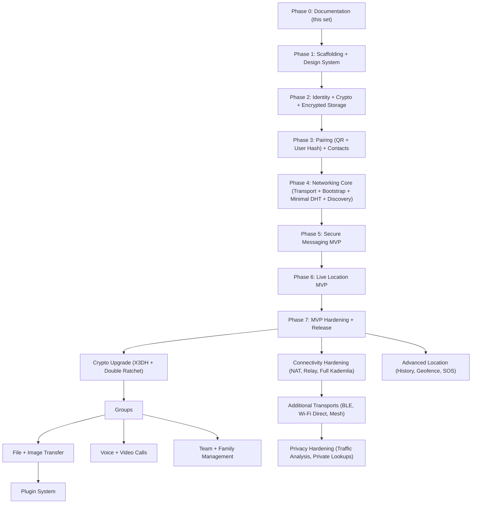

# vMessenger - Roadmap

This roadmap sequences vMessenger from its current documentation phase to the internet-functional MVP and then through the full feature set. Work is incremental: each phase produces a production-ready, reviewable increment, never a half-built whole. Every phase keeps the invariants from [Security.md](Security.md) and the layering from [Architecture.md](Architecture.md) and [Network.md](Network.md) intact.

---

## 1. Principles

- Ship vertical slices: each phase delivers something usable end-to-end, with tests.
- Production-ready at every stage: no throwaway prototypes; code merged is code we keep.
- Interfaces first: new capabilities arrive behind the existing contracts (Transport, DiscoveryProvider, BootstrapProvider, CryptoEngine), so later features do not break earlier ones.
- Security and decentralization are never traded for speed of delivery.

---

## 2. Phase sequence

---

## 3. MVP phases (detailed)

### Phase 0 - Documentation (current)
- Goal: complete, reviewed design for the whole system.
- Deliverables: this `docs/` set and `README.md`.
- Definition of done: documents reviewed and approved; decisions recorded.

### Phase 1 - Scaffolding and design system
- Goal: a buildable, empty multi-module project with conventions in place.
- Scope: Gradle multi-module layout from [FolderStructure.md](FolderStructure.md); version catalog and `build-logic` convention plugins; Hilt; Compose + Material 3; Room + SQLCipher wiring (empty schema); Protobuf plugin and `core:proto`; `core:designsystem` with the black/white/gray theme, Persian font, RTL, light/dark; CI (build, lint, tests); app shell with Splash and navigation host.
- Definition of done: app launches to a themed Splash; CI green; all modules compile; theme switching works.
- Implements: [FolderStructure.md](FolderStructure.md), [UI.md](UI.md) (foundation).

### Phase 2 - Identity, crypto, and encrypted storage
- Goal: the device has a sovereign, securely stored identity.
- Scope: `core:crypto` (Ed25519/X25519/ChaCha20-Poly1305/HKDF/SHA-256, Keystore wrapping); identity generation, identity hash, User Hash encoding; encrypted database open (SQLCipher key wrapped by Keystore); Create Identity screen; crypto known-answer and round-trip tests.
- Definition of done: first launch generates and persists an identity; private keys are Keystore-wrapped; DB opens encrypted; crypto test suite passes.
- Implements: [Security.md](Security.md), [Database.md](Database.md), parts of [Discovery.md](Discovery.md) (User Hash), [UI.md](UI.md) (Create Identity).

### Phase 3 - Pairing and contacts
- Goal: add contacts offline by QR or User Hash.
- Scope: `PairingDescriptor` generation and verification; My QR Code, QR Scanner (camera permission flow), Add by User Hash with checksum validation; Contacts list/detail; local alias, block, delete; safety-number screen (verification UI, fully active after first session).
- Definition of done: two devices can add each other purely offline; descriptors are signed and verified; contacts persist encrypted.
- Implements: [Discovery.md](Discovery.md) (identity exchange), [Protocol.md](Protocol.md) (pairing), [UI.md](UI.md) (pairing/contacts).

### Phase 4 - Networking core
- Goal: a device can join the network and resolve a contact's endpoints over the Internet.
- Scope: `network:transport` Internet (TCP) transport + framing + `TransportSelector`; `network:bootstrap` (`BootstrapProvider`s, `BootstrapManager`, join, peer cache); `network:dht` minimal DHT (`bootstrap/publish/lookup/TTL/refresh`, signed `EndpointRecord`s, XOR key space, `DhtNode` RPCs); `network:discovery` (`DiscoveryManager`, `DhtDiscoveryProvider`); a reference standalone bootstrap/DHT node for testing/self-hosting.
- Definition of done: a device joins via bootstrap, publishes a signed endpoint record, and resolves a contact's record; records expire and refresh correctly; simulated-DHT tests pass.
- Implements: [Network.md](Network.md), [DHT.md](DHT.md), [Bootstrap.md](Bootstrap.md), [Discovery.md](Discovery.md) (resolution).

### Phase 5 - Secure messaging MVP
- Goal: end-to-end encrypted 1:1 messaging over the Internet between two devices.
- Scope: `network:messaging` handshake driver (Noise-style mutual auth), session establishment and key schedule, symmetric ratchet (forward secrecy), AEAD framing, replay protection; `MessageEnvelope`/`ChatMessage`; delivery and read receipts; durable encrypted outbox with retry and offline queues; Chats and Conversation screens with status ticks and optimistic send.
- Definition of done: two paired devices exchange encrypted messages over the Internet with delivered/read status; messages survive restart via the outbox; replay/tamper tests pass; key-mismatch is detected and surfaced.
- Implements: [Protocol.md](Protocol.md), [Security.md](Security.md), [Network.md](Network.md), [UI.md](UI.md) (chat).

### Phase 6 - Live Location MVP
- Goal: secure, battery-aware live location sharing.
- Scope: `core:location` foreground `LocationService`, adaptive interval, motion detection, battery awareness; encrypted `LocationPacket`s over the messaging session; Live Location management and Map screens; share start/stop control messages; optional encrypted location history (off by default).
- Definition of done: a device shares live location to a contact who sees it update on a map; sharing is clearly indicated, revocable, and encrypted; battery impact is reasonable.
- Implements: [Protocol.md](Protocol.md) (location packets), [UI.md](UI.md) (Live Location/Map), [Database.md](Database.md) (location tables).

### Phase 7 - MVP hardening and release
- Goal: a trustworthy, polished MVP.
- Scope: Settings (appearance, privacy, network/bootstrap, identity, secure wipe), Debug diagnostics, About; notifications and channels; accessibility and RTL polish; full test pass (unit, integration, instrumented, fuzz on the frame parser); performance and battery tuning; security self-review; build/release pipeline and documentation of build/run in `README.md`.
- Definition of done: the MVP feature set in `README.md` works reliably between two devices; tests and CI green; security review complete; first release candidate.
- Implements: all MVP docs.

---

## 4. Post-MVP phases

These are designed-for in the current architecture and added without breaking existing code.

### Connectivity hardening
- **Done (MVP):** WebSocket-secure DHT node + circuit relay at `relay.vmessenger.ir`; app prefers direct `INTERNET` then falls back to `RELAY`; listener registers on relay for inbound NAT'd peers.
- Remaining: NAT hole punching (ICE/STUN/DCUtR) for direct mobile-to-mobile without relay; phones as full DHT routing nodes.
- Full Kademlia routing table (k-buckets, replication across closest k, parallel lookups), addressing the MVP simplifications in [DHT.md](DHT.md) Section 8.

### Cryptography upgrade
- X3DH asynchronous session setup with published prekey bundles (signed, expiring DHT records), enabling messaging to offline peers via store-and-forward.
- Double Ratchet for post-compromise security and robust out-of-order handling, replacing the MVP symmetric ratchet behind the same `Encryption` interface (see [Security.md](Security.md) Section 9).

### Groups
- Group identities, membership, and a group session strategy (sender keys or pairwise fan-out initially); the conversation/messaging abstractions already separate 1:1 from rendering.

### File and image transfer
- Chunked, encrypted transfer with resumable delivery; new `MessageEnvelope` content arms (`FileChunk`, `ImageMessage`); thumbnails and encrypted blob storage via `core:storage`.

### Voice and video calls
- Real-time media (WebRTC) reusing Identity, Discovery, and the handshake for signaling; `CallSignal` content arm; benefits directly from connectivity hardening.

### Additional transports
- Bluetooth, Wi-Fi Direct, and mesh transports as new modules implementing `Transport`, registered via Hilt multibinding, with matching discovery providers; automatic selection picks the best path (see [Network.md](Network.md) Section 9). Enables fully offline and multi-hop operation.

### Advanced location
- Location history and analytics (built on the existing samples table), geofencing, SOS/emergency mode, and richer telemetry (speed, heading, accuracy, battery) with privacy controls.

### Team and family management
- Higher-level grouping over contacts and location sharing (family tracking, team rosters), built on groups and advanced location, with self-hosted bootstrap/DHT nodes for organizations (see [Bootstrap.md](Bootstrap.md) Section 8).

### Plugin system
- Well-defined extension points (transports, discovery providers, message content handlers, UI surfaces) registered via multibinding, allowing third-party capabilities without forking the core.

### Privacy hardening
- Traffic-analysis resistance (padding, timing defenses, optional cover traffic) and private/blinded DHT lookups to reduce metadata exposure noted in [Security.md](Security.md) Section 17.

---

## 5. Cross-cutting, every phase

- Tests accompany every increment (see [Architecture.md](Architecture.md) Section 12).
- Documentation is updated alongside code; design docs remain the source of truth.
- Security review gates any change to crypto, networking, or storage.
- Decentralization invariants from [DHT.md](DHT.md) and [Bootstrap.md](Bootstrap.md) are re-verified before each release.

---

## 6. Feature coverage checklist

MVP: identity, QR pairing, User Hash pairing, minimal DHT discovery, E2EE messaging, delivery/read status, retry queue, offline queue, live location, encrypted storage, contact management.

Future (all designed-for): groups, voice calls, video calls, file transfer, image sharing, Bluetooth transport, Wi-Fi Direct transport, mesh networking, geofencing, location history, SOS mode, team management, family tracking, plugin system, NAT traversal/relay, full Kademlia, X3DH + Double Ratchet, privacy hardening.
