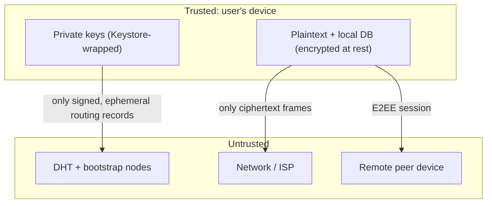
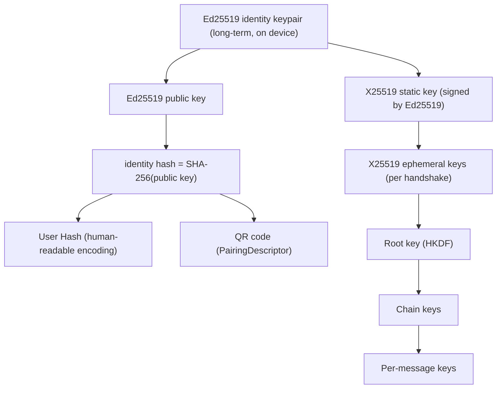
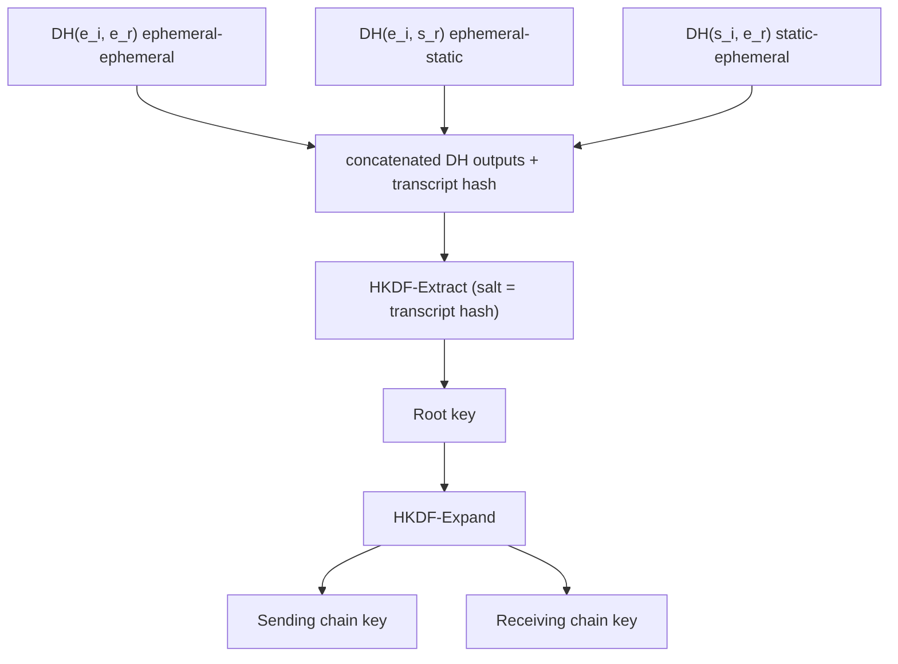
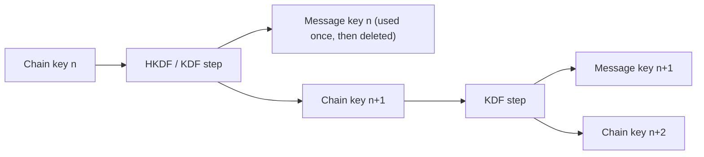

# vMessenger - Security and Cryptography

Security is the highest priority in vMessenger. This document defines the threat model, cryptographic primitives, identity and key hierarchy, on-device key management, the handshake and key schedule, forward secrecy, replay protection, message authenticity, encrypted local storage, signed DHT records, key verification, and the project's security limitations and roadmap.

Wire formats are in [Protocol.md](Protocol.md); the networking layers are in [Network.md](Network.md); routing record signing is also referenced in [DHT.md](DHT.md).

---

## 1. Security goals

- Confidentiality: only the intended recipient can read a message.
- Integrity: tampering with any frame is detected and rejected.
- Authenticity: each peer is cryptographically bound to its long-term identity key.
- Forward secrecy: compromise of long-term keys does not reveal past session traffic.
- Replay resistance: captured frames cannot be re-injected to duplicate effects.
- Metadata minimization: the network learns as little as possible; routing data is ephemeral and signed.
- Local data protection: data at rest is encrypted; private keys never leave the device in usable form.
- Decentralized trust: there is no certificate authority, identity server, or central key directory.

Non-negotiable invariants:

- Private keys are generated on-device and never transmitted.
- Plaintext never crosses the Transport boundary; nothing is sent unencrypted.
- A peer whose presented identity key does not match the paired key is rejected.

---

## 2. Threat model

### 2.1 Assets

- Long-term Ed25519 identity private key.
- X25519 static and ephemeral private keys.
- Session keys (root, chain, message keys).
- Message and location plaintext and history.
- Contact list and conversation metadata.
- The local database encryption key.

### 2.2 Adversaries considered

- Passive network observer (ISP, Wi-Fi sniffer): can see ciphertext, frame sizes, timing, and IP endpoints.
- Active network attacker (MITM): can intercept, modify, drop, reorder, and replay frames, and attempt to impersonate a peer.
- Malicious or curious DHT/bootstrap node: can observe lookups and publications and attempt to poison routing records.
- Malicious peer: a contact who tries to exploit the client (malformed frames, replays, oversized payloads).
- Device thief / forensic adversary: has physical possession of a locked or unlocked device.

### 2.3 Trust boundaries

### 2.4 In scope

End-to-end confidentiality/integrity/authenticity, forward secrecy, replay protection, MITM detection via key verification, signed/expiring routing records, encrypted storage.

### 2.5 Explicitly out of scope (MVP) or deferred

- Full traffic-analysis resistance (padding, cover traffic, onion routing) - future.
- Post-compromise security via full Double Ratchet / X3DH - designed, scheduled (see Section 9 and [Roadmap.md](Roadmap.md)); MVP ships a symmetric-ratchet forward-secret session.
- Hardware-backed remote attestation of peers.
- Protection against a fully compromised OS / rooted device with an active attacker present.
- Endpoint privacy from the DHT (a lookup reveals interest in an identity hash to nodes storing it) - mitigated, not eliminated, in MVP.

---

## 3. Cryptographic primitives

vMessenger uses a small, modern, well-reviewed primitive set. Implementations come from a vetted library (libsodium via Lazysodium, or BouncyCastle); no custom primitives are implemented.

- Ed25519 - digital signatures (identity, handshake transcript, DHT records, pairing descriptors).
- X25519 - Elliptic-curve Diffie-Hellman for key agreement (static and ephemeral).
- ChaCha20-Poly1305 (IETF, 96-bit nonce) - authenticated encryption with associated data (AEAD) for all frames and at-rest payloads.
- HKDF (HMAC-SHA-256) - key derivation: extract-then-expand for the handshake key schedule and per-message keys.
- SHA-256 - identity hashing, transcript hashing, DHT key derivation, integrity checks.
- CSPRNG - all randomness (keys, nonces, message IDs) comes from the platform secure random / libsodium randombytes; never from `java.util.Random`.

Notes:

- Ed25519 identity keys can be converted to X25519 for ECDH (standard birationally-equivalent mapping) or, preferably, a dedicated X25519 static key is generated and signed by the Ed25519 identity key to keep signing and key-agreement keys separated. vMessenger uses the latter (separate signed X25519 static key) for cleaner key hygiene.
- Nonces for ChaCha20-Poly1305 are never reused under the same key: per-session message keys are unique per counter, and at-rest encryption uses random nonces with fresh keys.

---

## 4. Identity and key hierarchy

- The Ed25519 keypair is the permanent identity; the public key is the root of trust for a peer.
- identity hash = SHA-256(Ed25519 public key). This is the DHT key and the basis of the User Hash.
- User Hash: a human-readable, checksummed encoding of the identity hash (see [Discovery.md](Discovery.md)) so it can be spoken, typed, and visually compared.
- The X25519 static key (used for ECDH) is generated on-device and signed by the Ed25519 identity key, binding key agreement to identity.
- Ephemeral X25519 keys are generated per handshake and discarded after use, which is the source of forward secrecy.

---

## 5. Key management on the device

- Generation: all keypairs are generated on-device using the platform CSPRNG. No key material is ever transmitted.
- Storage of the master secret: a device master key is held in the Android Keystore (hardware-backed where available, e.g. StrongBox/TEE). The Keystore key never leaves secure hardware and is used to wrap (encrypt) the at-rest key material and the database key.
- Storage of identity/X25519 private keys: stored encrypted (wrapped by the Keystore master key) in app-private storage; loaded into memory only when needed and zeroized after use where the platform allows.
- Database key: the SQLCipher key is random, stored wrapped by the Keystore master key, and supplied to Room/SQLCipher at open time (see Section 12 and [Database.md](Database.md)).
- Optional user authentication binding: Keystore keys can require device unlock / biometric (`setUserAuthenticationRequired`) so keys are usable only when the device is unlocked - a configurable security setting.
- Backup/export: by default keys are non-exportable and excluded from cloud backup (`android:allowBackup=false`, no auto-backup of key files). Encrypted identity export/recovery is a deliberate, user-initiated future feature (see [Roadmap.md](Roadmap.md)).

---

## 6. Handshake and key agreement

The handshake authenticates both peers and derives a shared, forward-secret session. It is a Noise-style mutually-authenticated pattern using static and ephemeral X25519 keys, with an Ed25519 signature binding the transcript to the long-term identity. Wire messages are in [Protocol.md](Protocol.md) Section 5.

### 6.1 Inputs

- Each side's Ed25519 identity key (long-term) and signed X25519 static key.
- A fresh X25519 ephemeral keypair per handshake.
- The peer's expected Ed25519 public key (from pairing) - this is what defeats MITM.

### 6.2 Diffie-Hellman combination and key schedule

Multiple DH operations are combined so that compromising any single key is insufficient:

- The transcript hash (SHA-256 over all handshake messages) is mixed in to bind the derived keys to the exact handshake, preventing transcript-substitution and key-reuse attacks.
- The Ed25519 signature in the handshake covers the transcript, proving control of the long-term identity key.
- After derivation both sides hold a root key and directional chain keys; the session becomes Active.

### 6.3 Peer authentication

- The presented X25519 static key must carry a valid Ed25519 signature, and that Ed25519 identity must equal the contact's paired public key.
- If it does not match, the handshake is aborted and the event is surfaced as a possible key change / MITM (Section 11). There is no fallback to an unauthenticated session.

---

## 7. Message encryption (AEAD)

- Every secure frame body is `ChaCha20-Poly1305(seal)` under a unique per-message key derived from the current chain key.
- Associated data (AAD) binds the ciphertext to its context: protocol version, frame type, sender identity hash, and the message counter. This prevents cross-context replay and downgrade.
- The 96-bit nonce is derived deterministically from the message counter and a per-session salt, guaranteeing nonce uniqueness without transmitting it in full.
- Decryption verifies the Poly1305 tag before any plaintext is processed; failures are rejected and reported via `Ack(REJECTED)`.

---

## 8. Forward secrecy (MVP symmetric ratchet)

- Each message advances the chain: a one-time message key is derived and the chain key is replaced by its successor.
- Message keys are deleted immediately after use, so capturing the device later does not reveal earlier messages whose keys are gone.
- This provides forward secrecy within a session. Post-compromise security (healing after a key leak) requires periodic DH ratcheting, delivered by the Double Ratchet upgrade.

---

## 9. Roadmap to full ratchet (X3DH + Double Ratchet)

The MVP design is forward-compatible with the Signal-style approach:

- X3DH-style asynchronous session setup using prekeys, so a session can be established without the peer being online (needed once offline messaging via store-and-forward matures).
- Double Ratchet adds a DH ratchet on top of the symmetric ratchet, providing post-compromise security (self-healing) and out-of-order message handling with skipped-message keys.

These are scheduled in [Roadmap.md](Roadmap.md). The `Encryption` interface and key schedule are intentionally structured so the upgrade does not affect Messaging, Transport, or UI.

---

## 10. Replay protection

- Per-session monotonic `counter` (see [Protocol.md](Protocol.md)). Receivers track the highest seen counter and a small sliding window for out-of-order arrivals.
- Counters below the window or already seen are rejected with `Ack(REJECTED)`.
- The counter is included in AAD, so a replayed frame cannot be re-purposed under a different context.
- Application-level `message_id` provides a second, idempotent dedup layer across reconnects.

---

## 11. Key verification and MITM defense

- Pairing (QR/User Hash) is the trust anchor: scanning a QR in person is authenticated key exchange with no network involved.
- For User-Hash pairing, the User Hash is a checksummed encoding of SHA-256(identity key); users can compare it out-of-band (read it aloud, compare on screen).
- A Safety Number / fingerprint screen lets two contacts verify they share the same keys (comparable digits or a scannable code). Verified contacts are marked as such.
- Key change handling: if a contact later presents a different identity key, vMessenger blocks the session by default and warns the user, requiring explicit re-verification. This converts silent MITM into a visible, user-acknowledged event.

---

## 12. Encrypted local storage

- Database: Room runs over SQLCipher with a random 256-bit key, wrapped by the Android Keystore master key. The plaintext DB key exists only transiently in memory at open time. See [Database.md](Database.md).
- Sensitive blobs/files: encrypted with ChaCha20-Poly1305 under keys wrapped by the Keystore master key.
- Settings: non-sensitive preferences in DataStore; sensitive flags stored encrypted.
- Memory hygiene: secret byte arrays are zeroized after use where the platform permits; secrets are kept out of logs and crash reports.
- Screen privacy: `FLAG_SECURE` is offered as a setting to block screenshots and hide content in the app switcher.

---

## 13. Signed DHT routing records

The DHT stores only ephemeral routing metadata, and every record is signed and expiring. Full design in [DHT.md](DHT.md). Security-relevant rules:

- A routing record (identity hash to endpoints) is signed with the publisher's Ed25519 key; nodes and clients verify the signature against the key whose SHA-256 equals the record's identity hash, so a node cannot forge or alter a record.
- Records carry a timestamp and TTL and auto-expire; newer signed records replace older ones (monotonic sequence number prevents rollback to a stale record).
- The DHT never stores messages, contacts, private keys, or profiles - only signed endpoint hints.
- Lookups reveal interest in an identity hash to the storing nodes; this metadata exposure is a known MVP limitation (Section 2.5) addressed later with private lookup techniques.

---

## 14. Randomness and nonce policy

- All keys, ephemeral keypairs, salts, message IDs, and at-rest nonces use a CSPRNG.
- Session message nonces are counter-derived and unique per key; at-rest nonces are random and stored alongside ciphertext, with keys rotated so no (key, nonce) pair repeats.

---

## 15. Cryptographic agility

- Algorithm identifiers and the protocol version travel in the handshake/frames, so primitives can be upgraded via version negotiation without breaking older peers.
- The crypto engine is an interface (`CryptoEngine`) with a single vetted implementation; alternative suites can be added behind the same interface and negotiated.

---

## 16. Secure development practices

- Use only vetted crypto libraries; never roll custom primitives.
- Constant-time comparisons for tags, signatures, and fingerprints.
- Strict input validation and bounded frame sizes to resist resource-exhaustion and parser attacks.
- Reproducible builds and dependency pinning; supply-chain review for crypto and networking dependencies.
- Test suite includes known-answer tests, tamper/replay negative tests, and fuzzing of the frame parser (see [Architecture.md](Architecture.md) Section 12).
- Security-sensitive changes require review; a documented disclosure process precedes public release.

---

## 17. Known limitations (MVP) and mitigations

- No post-compromise security yet (symmetric ratchet only) - upgrade to Double Ratchet planned.
- No traffic-analysis resistance - endpoints, sizes, and timing are observable on the network.
- DHT lookups leak interest in an identity hash to storing nodes.
- Direct connectivity assumes a reachable endpoint; until NAT traversal/relay land, some peers cannot connect over the public Internet.
- A compromised or rooted device with an active attacker is outside the protected envelope.

Each limitation has a scheduled mitigation in [Roadmap.md](Roadmap.md). None of them weaken the core guarantee: messages are end-to-end encrypted and authenticated to a verified identity, and private keys never leave the device.
