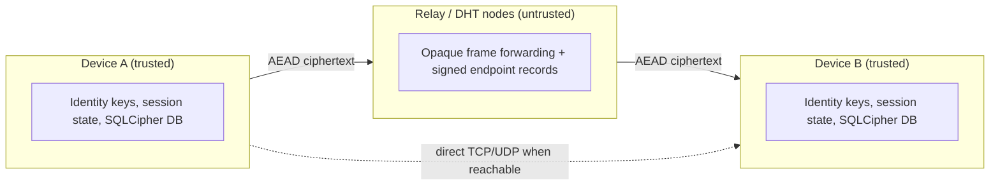

# vMessenger - Security and Cryptography

This document describes the security design as implemented: threat model, what the relay can and cannot see, the guarantees the v2 handshake provides, key pinning and re-verification, inbound authorization, encryption at rest, the secure wipe, and an honest list of what is **not** protected.

Wire formats and exact transcripts are in [Protocol.md](Protocol.md). Every claim here cites the file that implements it.

---

## 1. Security goals

| Goal | Status |
|---|---|
| End-to-end confidentiality and integrity of 1:1 messages | Implemented (ChaCha20-Poly1305-IETF over a symmetric ratchet) |
| Mutual authentication to a long-term Ed25519 identity | Implemented (both handshake directions sign their own keys) |
| Forward secrecy **within** a live session | Implemented (one-way chain KDF, keys zeroized) |
| No server able to read message content | Implemented (relay forwards opaque frames; DHT stores only signed endpoint records) |
| Replay resistance | Implemented (bounded skipped-key store, counter bound into the AEAD AD) |
| Encryption at rest for the database and attachments | Implemented (SQLCipher + `VMA1` container, keys wrapped in the Android Keystore) |
| Post-compromise security (Double Ratchet) | **Not implemented** — see §10 |
| Metadata privacy from the relay | **Not implemented** — see §10 |

No accounts, phone numbers or email addresses exist. Identity is an on-device Ed25519 key pair; the private key never leaves the device and is never transmitted.

---

## 2. Threat model

### 2.1 Assets

| Asset | Where it lives |
|---|---|
| Ed25519 identity private key | `key_material` row `identity-ed25519`, Keystore-wrapped, inside the SQLCipher database |
| X25519 static private key | `key_material` row `identity-x25519-static`, same protection |
| Session keys (root, chain, message) | Process memory only; never persisted, zeroized on close |
| SQLCipher passphrase | 32 random bytes, Keystore-wrapped, stored in the `vmessenger_security` DataStore as `wrapped_db_passphrase` |
| Attachment master key | 32 random bytes, Keystore-wrapped, `wrapped_attachment_key` in the same DataStore |
| Message and contact data | SQLCipher database |
| Attachment files | App-private `files/attachments`, `VMA1` container |
| Social graph, timing, endpoint records | Partly visible to relay and DHT nodes (§3) |

### 2.2 Adversaries considered

| Adversary | Result |
|---|---|
| Passive network observer | Sees ciphertext, frame sizes and timing. Content and identity keys are not recoverable. Both direct and relay paths are additionally inside TLS when the relay is reached over `wss://`. |
| Active network attacker (MITM) | Cannot complete a handshake without the peer's Ed25519 private key: `sig2` and `sig3` cover all three of the signer's own keys and the whole transcript, and the root key is bound to `SHA256(T3)` (§4). |
| Malicious or compromised relay/DHT node | Cannot read or forge message content, and cannot forge endpoint records (they are signed). It **does** see which identity hashes are online, who dials whom, and when. It can deny service. |
| A peer you added | Can send you content you accepted by adding them. Cannot forge receipts for other conversations, cannot re-address a mailbox blob, cannot silently change their static key (§5). |
| A stranger who reaches you | Can only deliver a contact request or response (§6). Everything else is dropped after decryption. |
| Attacker with physical access to a locked device | Database and attachments are encrypted; the wrapping key is non-exportable and (where available) StrongBox-backed. **But** by default the Keystore key does not require device unlock (§7.3), so a full device compromise while the OS is running also compromises the data. The app lock's **strict mode** (§7.4) is the only configuration that changes this answer: it moves the database passphrase behind an authentication-required key and deletes the copy that is not. |
| Attacker who compromises the device now | Can read past messages already in the database, and can follow any live session. Past *frames* of a live session are not recoverable, but there is no post-compromise security (§10). |

### 2.3 Trust boundaries


```mermaid
flowchart LR
  subgraph DeviceA["Device A (trusted)"]
    KA["Identity keys, session state, SQLCipher DB"]
  end
  subgraph Infra["Relay / DHT nodes (untrusted)"]
    R["Opaque frame forwarding + signed endpoint records"]
  end
  subgraph DeviceB["Device B (trusted)"]
    KB["Identity keys, session state, SQLCipher DB"]
  end
  DeviceA -- "AEAD ciphertext" --> Infra
  Infra -- "AEAD ciphertext" --> DeviceB
  DeviceA -. "direct TCP/UDP when reachable" .-> DeviceB
```

The only trusted components are the two endpoint devices. Nodes are infrastructure, not authorities.

---

## 3. What the relay and DHT can and cannot see

The reference node is in `node/src/main/kotlin/ir/vmessenger/node/`.

**Cannot see**

- Message content, attachment content, location samples, display names: everything above the frame is AEAD-sealed under keys derived from a handshake the node never participates in.
- Identity private keys, session keys, contact lists.
- Which of the frames it forwards are chat, receipts, control or attachment chunks. `DialHandler.pump` copies binary frames verbatim without parsing them.
- The content of a mailbox blob: `MailboxBlob.sealed_payload` is `crypto_box_seal(...)` to the recipient's X25519 static key.

**Can see**

| Visible to | What |
|---|---|
| Relay node | The 32-byte `listener_id` (= `SHA256(identity_pub)`) of every device registered on it, its source IP, when it connects and disconnects, which `target_id` each dialer asks for, circuit lifetimes and byte counts (`DialHandler` logs `circuit_closed circuit=… bytes=…`). That is the **social graph and timing of every relayed conversation.** |
| DHT node | Every stored `EndpointRecord`: identity hash, identity public key, endpoints, publish time, TTL, sequence — plus the IP that stored it. `FIND_VALUE` reveals that someone is looking for a particular identity hash. |
| Both | Frame sizes and timing. No padding or cover traffic is applied. |

The node logs only hash prefixes for identities and logs client IPs at DEBUG level (`RelayWire.reject`, `ListenerHandler`), but that is a logging policy, not a cryptographic guarantee.

---

## 4. Handshake guarantees

Implementation: `network/messaging/.../SecureChannelFactory.kt`, `HandshakeTranscript.kt`. Exact byte layout in [Protocol.md](Protocol.md) §5.

What the v2 handshake gives you:

1. **Mutual authentication.** The responder signs `"vmessenger-hs-v2-sig-responder" || SHA256(T2)`, where `T2` covers its own ephemeral, static and identity keys and its capabilities. The initiator signs `"vmessenger-hs-v2-sig-initiator" || SHA256(T3)`. Per-role domain tags stop a signature from one role being replayed as the other.
2. **Transcript binding.** `root = HKDF(dh1‖dh2‖dh3, salt = SHA256(T3), info = "vmessenger-hs-v2-root")`. Any change to any advertised key, capability, step number or protocol version yields a different root, so a tampered transcript cannot produce a working session even if signature verification were bypassed.
3. **MITM resistance.** This is what v2 fixed: in 0.x the responder signed only the initiator's first message, so an active attacker could substitute its own `ephemeral_pub` / `static_pub` in step 2 and the signature still verified. That impersonated any responder. It is no longer possible.
4. **Three DHs.** `e_I·e_R`, `e_I·s_R`, `s_I·e_R` — so the session key depends on both ephemerals *and* both static keys. An attacker needs a private ephemeral **and** a private static key to derive it. All-zero (low-order point) results are rejected and zeroized (`SecureChannelFactory.sharedSecret`).
5. **Fresh keys per connection.** Sessions are never persisted; every connection runs a full handshake with fresh ephemerals, and ephemeral private keys are zeroized in a `finally` block.
6. **Bounded exposure.** At most 32 inbound connections may be mid-handshake at once; each read is capped at 4096 B and 15 s.

What it does **not** give you:

- **No initiator identity hiding.** `identity_pub` and `static_pub` travel in the clear in step 3.
- **No deniability.** Both sides produce Ed25519 signatures over the transcript.
- **No post-compromise security.** See §10.

---

## 5. Key pinning and re-verification

Contacts are trust-on-first-use (TOFU): the key you receive when pairing is the key you are pinned to.

| Column | Meaning |
|---|---|
| `contact.ed25519Public` | Pinned identity key. A handshake whose `identity_pub` differs is rejected with `Identity key mismatch`. |
| `contact.x25519StaticPublic` | Pinned X25519 static key. All-zero (placeholder) means "not yet learned" and is filled in on first successful handshake. |
| `contact.pendingX25519StaticPublic` | A different static key the peer presented. The handshake that observed it was **refused**. |
| `contact.keyChangedAtUnixMs` | When that happened. |

Flow (`SecureChannelFactory.checkPinnedStaticKey`, `MessagingService.recordPeerKeyChange`, `NetworkCoordinator`, `ContactRepositoryImpl.acceptKeyChange`):

1. Peer presents a static key that does not match the pin → `PeerKeyChangedException`; the handshake aborts and `CLOSE{AUTH_FAILED}` is sent.
2. Both directions record the presented key as *pending* — the initiator via `peerKeyChangeRecorder`, the responder inside the inbound resolver. The pin itself is never overwritten automatically.
3. Outbox rows for that contact fail with the code `peer_key_changed` and the message "کلید مخاطب تغییر کرده است؛ تأیید مجدد لازم است".
4. `ContactRepository.acceptKeyChange(id)` promotes the pending key to the pin and clears `keyChangedAtUnixMs`. Until then the contact is unreachable.

The user's side of step 4 is the contact detail screen (`feature/contacts/.../ContactDetailRoute.kt`): a `KeyChangeBanner` appears on a contact whose key changed, and accepting it calls `acceptKeyChange`. The same screen shows the pair's safety number (`SafetyNumberDisplay`) and a "verified" switch, so a change can be compared out of band before it is accepted rather than waved through.

A hash-only contact (added by User Hash, before the keys are known) is matched on the 16-byte identity-hash prefix instead (`IdentityHashMatcher`), and the full key is adopted from the first authenticated handshake.

---

## 6. Inbound authorization

Decryption is not authorization. Every decrypted envelope passes `data/.../network/InboundPolicy.kt` before it is dispatched:

| Kind | Allowed from |
|---|---|
| `CHAT`, `ATTACHMENT`, `LOCATION`, `CONTROL`, `RECEIPT`, `NETWORK_NODES`, `GROUP_CONTROL` | an existing, non-blocked, `APPROVED` contact |
| `CONTACT_REQUEST`, `CONTACT_RESPONSE` | anyone not blocked (so strangers can introduce themselves and pending contacts can answer) |

This is the last line, not the only one: blocked contacts are also refused at the handshake and skipped by the outbox.

Additional per-kind checks:

- **Receipts** (`InboundReceiptHandler`): the referenced message must be `OUTGOING` **and the sender must be one of its recipients**. That is stricter than the old "owner of the conversation" check and is what makes per-member ticks safe: a group message legitimately gets a receipt from each member, and from nobody else. Per-recipient statuses only move forward; `at_unix_ms` is clamped to `[createdAt, now]`.
- **Group messages** (`InboundConversationResolver`): `group_id` is peer-controlled, so being an approved contact is not enough. The group must exist here, must not be closed, and the sender must be an active member — checked before a message is persisted and before a single attachment chunk is staged. Otherwise one contact could write into any group id they ever saw, or into one they were removed from.
- **Group membership** (`GroupControlHandler`): `CREATE`/`SNAPSHOT` are accepted only from the group's named creator and only when they do not move the version backwards; `UPDATE_NAME`/`ADD`/`REMOVE`/`CLOSE` only from the creator and only at exactly `local + 1` (a gap triggers a snapshot request and the control is dropped); `LEAVE` only from the member it is about. A snapshot that does not list us is dropped, so nobody can push us into a group. Being the target of a `REMOVE` closes our copy locally.
- **Contact requests** (`ContactRequestHandler`): a payload naming an identity other than the authenticated session peer is ignored; the `request_id` must be the deterministic id derived over `(requester, us)`; the displayed user hash is derived from the proven identity, not from the payload.
- **Contact responses**: only a contact we are actually waiting on (`PENDING_OUT`, or `APPROVED` for the mutual-add echo) may answer, and only with the request id we derived for them.
- **Attachments** (`AttachmentReceiver`): a chunk from anyone but that transfer's sender is dropped without touching its state; wrong-size chunks drop the transfer; the plaintext SHA-256 in the header must verify before the message is materialized.
- **Mailbox** (`MailboxProtocolService`): `List`/`Fetch`/`Delete` only ever touch blobs addressed to the authenticated peer; `Put` is accepted only from approved contacts and is subject to a per-sender quota (`mailbox_blob.senderIdentityHash`).
- **Peer-exchanged nodes** (`SignedNodeRecordVerifier`): only `transcript_version == 2` self-signed records are accepted, and they are stored as `COMMUNITY` and **disabled** unless signed by the operator key.

A stranger that becomes an approved contact mid-session is re-resolved per frame while its contact id is still provisional (`MessagingService.refreshProvisionalContactId`), so approval takes effect immediately instead of after the session ends.

---

## 7. Encryption at rest

### 7.1 Database (SQLCipher)

`core/database/.../di/DatabaseModule.kt` opens Room through `net.zetetic.database.sqlcipher.SupportOpenHelperFactory` with a 32-byte random passphrase. Everything in [Database.md](Database.md) — messages, contacts, wrapped private keys, mailbox blobs, node lists — is inside that file (`vmessenger.db`).

The passphrase is created on first use, wrapped by the Keystore master key and stored in the `vmessenger_security` DataStore (`KeystoreDatabasePassphraseSource`). `DatabaseKeyProvider` caches the unwrapped value for the process lifetime under a mutex, so a race between the application warm-up and the first DAO use cannot create two passphrases (which would leave the database unopenable).

### 7.2 Attachments (`VMA1`)

`data/.../attachment/AttachmentCrypto.kt`:

```
"VMA1" || fileId(16) || secretstream header(24) || chunks…
```

- Chunks are libsodium `secretstream_xchacha20poly1305` frames, at most 64 KiB plaintext each; the last is tagged FINAL, so a truncated file is detected rather than silently accepted.
- Per-file key: `HKDF-SHA256(master, salt = fileId, info = "vmessenger-attachment-v1")`. A header or key lifted from another file does not open the container.
- Plaintext never touches disk through these streams: incoming chunks are staged encrypted (`IncomingStaging`) so even a partial transfer is not readable.
- The 32-byte attachment master key is deliberately separate from the SQLCipher passphrase (different lifecycle) — `AttachmentKeyProvider`.

### 7.3 Key wrapping in the Android Keystore

`core/crypto/.../keystore/KeyStoreKeyManager.kt` and `WrappedKeyBlob.kt`.

| Property | Value |
|---|---|
| Master key | AES-256-GCM, alias `vmessenger_master`, non-exportable, in `AndroidKeyStore` |
| Hardware | StrongBox requested on API 28+; **any** failure (not just `StrongBoxUnavailableException`) falls back to the TEE-backed key, because many devices advertise the API without the hardware and refusing would make the app permanently unusable there |
| Blob format | `0x02 || iv(12) || ciphertext` — the version byte makes the format self-describing; unversioned 0.x dev blobs are **rejected**, never guessed at |
| Associated data | `"vmessenger:" + alias` — so a blob wrapped for the database cannot be unwrapped as an attachment key or an identity key |
| Aliases | `db`, `attachments`, `identity-ed25519`, `identity-x25519-static` — all under `vmessenger_master`. Strict mode adds a **separate** alias, `vmessenger_app_lock` (§7.4) |

**Deliberate trade-off:** the master key is created **without** `setUserAuthenticationRequired` and **without** `setUnlockedDeviceRequired`. The network foreground service must open the encrypted database to receive messages while the screen is locked; requiring an unlocked device would stop delivery whenever the phone is in a pocket. At-rest protection therefore rests on the Keystore (and StrongBox where present), not on the lock state. The consequence is stated plainly in §10.

That trade-off is the default, not the only option: §7.4 describes how strict mode reverses it, and what it costs.

The boot receiver is intentionally **not** direct-boot aware (`app/src/main/AndroidManifest.xml`): the passphrase is only unwrapped after the user has unlocked the device at least once since boot.

### 7.4 App lock

`core/crypto/.../lock/PinVerifier.kt`, `StrictModeKeyManager.kt`, `data/.../lock/AppLockCoordinator.kt`.
Added in 1.1; off until the user sets a PIN.

**Default mode protects the screen, not the data,** and the settings copy says exactly that in
Persian. Messages still arrive, the database is opened as before, and anyone who compromises the
running OS — or holds the unlocked device — reads everything. The PIN is verified against an
AEAD-sealed witness over a known constant, not a bare hash comparison, with Argon2id (ops 3,
64 MiB, 16-byte salt) over the PIN. That is a constant factor, not a rate limit: a 4–6 digit
keyspace is 10⁴–10⁶ and falls offline whatever the KDF costs. The attempt counter is therefore
written **before** the attempt is checked, so force-stopping between the two cannot reset it, and
the app wipes after ten consecutive failures with a warning from the third-from-last.

**Strict mode is the configuration that changes the threat model.** It re-wraps the database
passphrase under a second Keystore key created with `setUserAuthenticationRequired(true)` and
`setUserAuthenticationParameters(…, AUTH_BIOMETRIC_STRONG or AUTH_DEVICE_CREDENTIAL)`, then
**deletes the non-authenticating copy**, so the database key cannot be produced at all without a
device authentication. Note what that does *not* mean: the hardware never checks this app's PIN.
The PIN is Argon2id in software with the app's own backoff on top; what the hardware gates is the
key, and what it throttles is device-credential attempts. Three consequences, all deliberate:

- It must not reuse `vmessenger_master`. The StrongBox fallback path calls
  `deleteEntry(MASTER_KEY_ALIAS)`, so a StrongBox retry would destroy the only wrapping of the
  passphrase. Hence the separate `vmessenger_app_lock` alias.
- Device credential is accepted alongside biometrics, and that is what makes the key survive a new
  fingerprint enrolment: `setInvalidatedByBiometricEnrollment` only bites a key openable by
  biometrics alone, which `AUTH_DEVICE_CREDENTIAL` stops this one from being. What does destroy it
  is removing the device screen lock, which deletes every authentication-bound key, or moving the
  app's data to another device, since Keystore keys never travel. Turning strict mode on
  puts a confirmation in front of the user that names that loss and says to take a backup first.
  It is a warning, not a gate — nothing records whether a backup was taken, so nothing can check
  one, and saying otherwise would be claiming a control that does not exist.
- **Background delivery stops while locked.** `AppLockCoordinator` stops the network stack and
  closes the database, then `DatabaseKeyProvider.lock()` makes `getPassphrase()` fail rather than
  silently re-unwrap — it drops the key, it does not close anything itself, and its own KDoc says
  the caller must close first. The passphrase source refuses to
  mint a fresh passphrase while a strict blob exists — minting there would abandon the real
  database rather than open it. Every background entry point degrades instead of crashing.
- **What strict mode protects is the key at rest, not the key in a running process.** A cold start
  — a stolen device, a rebooted one, an app the system has killed — cannot open the database
  without authentication, and that is the property the mode exists for. A *locked but still
  running* app is weaker: the passphrase stays in memory inside SQLCipher's open helper for the
  life of the process, and `lock()` deliberately does not zero it. The first version did, and
  because Hilt hands that one array straight to `SupportOpenHelperFactory` there was only ever one
  copy — zeroing it destroyed the process's only key instead of hiding it, and the first unlock
  came back as `file is not a database` over completely intact data. Scrubbing memory as well
  needs a rebuildable Room instance or ending the process on lock; neither is done, and claiming
  the property without doing it would be worse than the gap.

Note what the PIN is **not**: it does not wrap anything. The passphrase is wrapped under the
Keystore key, and the PIN only gates the screen and drives the authentication that the hardware
key requires. So changing the PIN rewrites the verifier and nothing else — there is no re-wrapping
step to crash in the middle of. Enabling and disabling strict mode are the operations that move the
passphrase, and both write the new copy before dropping the old one, so an interruption leaves an
install that still opens rather than one that opens with neither key.

---

## 8. Android platform hardening

| Measure | Where |
|---|---|
| No cleartext traffic in release | `app/src/main/res/xml/network_security_config.xml` — `cleartextTrafficPermitted="false"`; the debug build type overlays it for the emulator/LAN bootstrap |
| Address policy enforced in code as well | `core/common/.../network/NodeAddressPolicy.kt` — release builds accept only `wss://`; `ws://` and bare `host:port` require a debug build **and** a local host (`10.0.2.2`, loopback, `localhost`, RFC 1918). Applied by the node repository on every add/import **and** by the transports before dialing, so a stored row from an older build cannot bypass it |
| Screenshot / recents protection | `FLAG_SECURE` set in `MainActivity.onCreate` before anything renders, then driven by `PrivacyPreferences.screenSecurityEnabled` (default **on**) |
| Lock-screen privacy | Message channel and every notification are `VISIBILITY_PRIVATE`; the public version carries no sender and no preview. With "hide notification content" on it is `VISIBILITY_SECRET`, so nothing reaches the lock screen (`core/notifications/.../MessageNotificationManager.kt`) |
| No cloud backup of app data | `android:allowBackup="false"` |
| Foreground service type | `remoteMessaging|dataSync` — `remoteMessaging` (API 34+) is exempt from Android 15's 6 h `dataSync` cap and from the Android 14 `BOOT_COMPLETED` start restriction |
| Restart after reboot | `BootCompletedReceiver` restarts the network service without the user opening the app |
| Debug surfaces gated | Debug and Logs screens require developer mode (`PrivacyPreferences.developerModeEnabled`, default false, unlocked by seven taps on the version row in About) |
| Read receipts opt-out | `PrivacyPreferences.sendReadReceipts` (default on) |

---

## 9. Secure wipe

`data/.../wipe/SecureWipePlan.kt` and `SecureWipeCoordinator.kt`. Nine ordered steps:

| # | Step | Action |
|---|---|---|
| 1 | `network` | `NetworkCoordinator.stop()` — first, so nothing writes new data into storage that is about to be deleted |
| 2 | `location` | stop the location foreground service |
| 3 | `notifications` | `cancelAll()` |
| 4 | `database` | `clearAllTables()` then `close()` |
| 5 | `database-files` | delete `vmessenger.db` and its `-wal` / `-shm` / `-journal` siblings |
| 6 | `files` | delete `files/attachments`, `files/logs` and everything in `cacheDir` |
| 7 | `preferences` | clear every DataStore: draft, security, privacy, p2p, discovery, theme, contact-retry, the updater store, and the app lock's own store |
| 8 | `memory` | zeroize cached identity, DB passphrase and attachment key; clear log buffer, network path tracker, pinned relay IPs; reset `P2PConfig` |
| 9 | `keystore` | delete **both** aliases — `vmessenger_master` and strict mode's `vmessenger_app_lock` — **last**, because every earlier step may still need to decrypt |

Properties:

- **Every step runs even if an earlier one throws.** Stopping at the first failure would leave data behind. The failed step names are logged.
- **Cancellation is rethrown, not swallowed**, and the whole wipe runs under `NonCancellable` on the IO dispatcher — a half-done wipe that destroyed the Keystore key while the wrapped passphrase survived would leave an unopenable install with no way back.
- Destroying the master key alone makes every leftover wrapped blob undecryptable, so even a failure in steps 4–7 still ends with unreadable data.
- The app lock's store was added to step 7 in 1.1 after it was found to survive a wipe. Two things were left behind: the PIN verifier, which is an offline-crackable record of a 4–6 digit secret the user may reuse elsewhere; and, under strict mode, a wrapped passphrase whose presence makes the passphrase source refuse to mint a new one — so the next start threw on a database that no longer existed.
- The process then exits and is relaunched by an inexact `AlarmManager` alarm ~300 ms later (the app does not request `SCHEDULE_EXACT_ALARM`).

**Known limitation:** Android's background-activity-start restriction means the relaunch does not bring the app to the foreground. The data is destroyed and the service restarts, but the user has to tap the launcher icon, which then opens onboarding.

---

## 10. Known limitations

These are real, current gaps. None of them is hidden behind a "future work" label.

| # | Limitation | Detail |
|---|---|---|
| L1 | **No post-compromise security; no Double Ratchet** | `SymmetricRatchet` is a one-way chain KDF with no DH ratchet. An attacker who obtains live session state can follow that session until it ends. Forward secrecy holds only for earlier frames of the same session, and only because session keys are never persisted and are zeroized on close. |
| L2 | **Metadata is visible to the relay** | A relay node sees which identity hashes are online, their IPs, who dials whom, circuit lifetimes and byte counts. A DHT node sees every published endpoint record and every lookup. There is no padding, no cover traffic and no private/blinded lookup. |
| L3 | **No forward secrecy for mailbox-delivered messages** | `MailboxBlob.sealed_payload` is a `crypto_box_seal` to the recipient's long-term X25519 static key. Anyone who later obtains that static key can decrypt every stored blob. **As of 1.1 this feature is ON by default**, because until then it delivered nothing: blobs were parked in the sender's own database and `putBlob` had no caller. The 24 h TTL bounds the exposure. |
| L15 | **A mailbox host learns who has mail waiting** | Handing a sealed blob to a third party tells that peer someone holds a message for a given routing key, and roughly when — metadata the direct path does not emit. Hosts are limited to approved contacts, a peer is asked to hold at most 5 blobs per session, and the quotas in §"Mailbox" bound the rest. |
| L4 | **Trust-on-first-use for contact keys** | QR pairing is in-person trust; User Hash pairing trusts whatever key answers for that hash prefix first. The contact detail screen shows the pair's safety number and a "verified" switch, so a comparison is *possible* — but nothing forces it, nothing warns that it has not happened, and the flag has no effect beyond a badge. |
| L5 | **Nothing verifies that the user actually compared** | A key change is surfaced and can be accepted from the contact screen (§5), which is the honest minimum. It is still one tap: an unattentive user can accept a key change from an attacker exactly as easily as one from a friend who reinstalled. |
| L6 | **Operator key is a placeholder** | `NetworkConfig.OPERATOR_ED25519_PUBLIC_KEY_HEX` is 64 zeros, so `operatorEd25519PublicKey()` returns null and **no** `SignedNodeRecord` can ever be `OFFICIAL`. This must be set before release, or the operator-trust tier is dead code. |
| L7 | **Keystore key does not require device unlock by default** | Deliberate (§7.3) so the foreground service can decrypt while the screen is locked. An attacker who compromises the running OS also gets the data. The app lock's strict mode (§7.4) opts out of this for the key *at rest*, at the cost of background delivery while locked; with the lock off, or on but not strict, this limitation stands unchanged. |
| L16 | **A locked app still holds its database key in memory** | Strict mode (§7.4) shuts the database and refuses to reopen it, but the passphrase remains inside SQLCipher's open helper until the process ends, because Hilt hands out one array and zeroing it destroys the process's only key rather than concealing it. So the lock resists someone picking up a running phone, and resists a cold start completely; it does not resist reading the memory of the running process. |
| L8 | **No initiator identity hiding, no deniability** | The initiator's identity and static keys are sent in the clear in handshake step 3, and both sides sign the transcript. |
| L9 | **Sender clock is untrusted but still displayed** | `MessageEnvelope.sent_at_unix_ms` is advisory. Receipt timestamps are clamped; message timestamps are not. |
| L10 | **Relay availability is a denial-of-service surface** | The node enforces caps and per-IP rate limits, but a device behind NAT with no reachable relay simply cannot be reached. |
| L11 | **Replay window is bounded, not absolute** | `ReplayCache` on the node evicts the oldest entries at 200 000 and after its TTL; a listener proof older than `proofMaxSkewMs` (default 5 min) is refused, so the exposure is bounded by that window rather than eliminated. |
| L12 | **A group is only as private as its smallest member set** | There is no group key and no group server: a group is client-side fan-out over pairwise sessions, so message content is protected exactly as in a 1:1 chat. But every member learns every other member's identity key from the snapshot, and the creator is the sole authority on membership — a malicious creator can add a device nobody else notices, and there is no mechanism (no admin transfer, no member-side veto) to stop them. Membership changes are also not signed independently of the transport: authority rests on the session having authenticated the creator. |
| L13 | **Group fan-out is O(n) and observable** | One session, one transfer and one queue row per recipient, including for attachments. A relay therefore sees a burst of connections from one identity to the same set of peers whenever a group message is sent, which is a strong hint that those peers form a group. The 32-member cap bounds the cost, not the signal. |
| L14 | **Half-finished P2P paths are off, not absent** | Peer exchange, embedded DHT participation, relay-peer mode, UDP attempts and default-relay demotion all ship as reachable code behind `P2PConfig` flags that default to false (store-and-forward left this list in 1.1). Turning any of them on in the debug screen enables code that has not been through the same verification as the default path. |

---

## 11. Cryptographic primitives

`core/crypto/.../CryptoEngine.kt` (libsodium via Lazysodium; `MessageDigest`/`Cipher` for SHA-256 and the Keystore AES-GCM).

| Purpose | Primitive |
|---|---|
| Identity signatures | Ed25519 |
| Key agreement | X25519 (`crypto_scalarmult`), all-zero result rejected |
| KDF | HKDF-SHA256 |
| Message AEAD | ChaCha20-Poly1305-IETF, fresh random 12-byte nonce prepended per ciphertext |
| Attachment AEAD | `crypto_secretstream_xchacha20poly1305` (24-byte header, per-chunk tags) |
| Mailbox seal | `crypto_box_seal` (anonymous sealed box) |
| Backup KDF | Argon2id13 (`crypto_pwhash`), 16-byte salt |
| Key wrapping | AES-256-GCM in the Android Keystore, 128-bit tag, alias-derived AAD |
| Hashing | SHA-256 |
| Randomness | libsodium CSPRNG (`randomBytes`) |

Key material is zeroized with `sodium_memzero` (`CryptoEngine.memzero`) wherever the lifetime is known: ephemeral private keys, DH outputs, the root key, message keys, chain keys, skipped keys, the sender's identity key after sealing a mailbox blob, and every cached key on wipe.

---

## 12. Development practices

- Detekt runs on every module; `./gradlew detekt unitTests` is a gate in both CI and the release workflow.
- Security-relevant units have focused tests: `HandshakeTranscriptTest`, `SecureChannelFactoryTest`, `SymmetricRatchetTest`, `MessagingServiceFrameGuardTest`, `MessagingServiceKeyChangeTest`, `FrameParserFuzzTest`, `RelayProofTest`, `EndpointRecordTranscriptTest`, `UserHashEncoderTest`, `WrappedKeyBlobTest`, `PairingDescriptorCodecTest`, plus the node's `RelayNodeServerTest`. See [Testing.md](Testing.md).
- Release APKs are signature-verified in CI with `apksigner` and refused if debug-signed or if the per-ABI APKs do not share one signer; `SHA256SUMS.txt` and `SIGNING.txt` ship with every release.
- No secrets in the repository. Node operator overrides live in `/etc/vmessenger/node.env` on the host ([Deployment.md](Deployment.md)).
