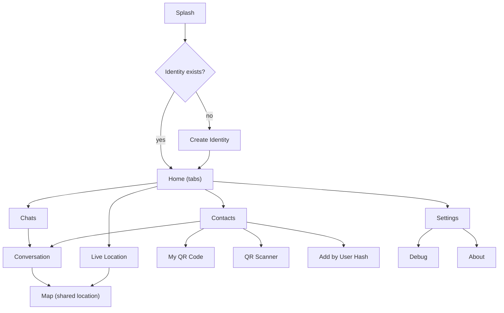

# vMessenger - UI and UX Design

vMessenger's interface must make people feel safe, private, reliable, calm, and fast. The visual language is minimal, premium, and privacy-focused, built with Jetpack Compose and Material Design 3, fully Persian and right-to-left, in a restrained black/white/gray palette with light and dark themes.

This document defines the design principles, theme and design tokens, typography, RTL rules, the navigation graph, and a screen-by-screen specification. Screen behavior ties back to [Architecture.md](Architecture.md); statuses and content come from [Protocol.md](Protocol.md) and [Database.md](Database.md).

---

## 1. Design principles

- Calm and minimal: generous whitespace, few accent elements, no visual noise. The content (conversations, map) is the interface.
- Premium and quiet: monochrome palette, precise spacing, subtle motion. Nothing flashy; everything intentional.
- Privacy-forward: security states are legible (verified contact, encrypted, key changed). The app communicates safety without alarm.
- Persian-first: every string, layout, and interaction is designed for Persian and RTL from the start, not retrofitted.
- Fast and responsive: instant optimistic UI for sending, reactive updates from the database, no blocking spinners where avoidable.

---

## 2. Brand and color system

The palette is intentionally restricted to black, white, and grays, matching the provided brand logos (`vMessenger-icon/`).

- Brand: monochrome wordmark/glyph; black logo on light, white logo on dark.
- Accent: a single near-neutral accent (a refined graphite/ink) used sparingly for primary actions and active states; success/warning/error use restrained semantic tints that still read as calm.
- Dynamic color (Material You): disabled by default to preserve the monochrome brand; the app ships a fixed, curated palette. (A future setting could opt into dynamic color.)

Light theme (tokens, descriptive):

- Background: near-white (`#FFFFFF` / `#FAFAFA`).
- Surface / surface variants: white to light gray (`#F2F2F2`, `#E6E6E6`).
- Primary / on-primary: ink black on white.
- Text: near-black primary (`#0A0A0A`), medium gray secondary (`#5C5C5C`).
- Outline/dividers: light gray (`#E0E0E0`).

Dark theme (tokens, descriptive):

- Background: true/near black (`#000000` / `#0B0B0B`) - premium OLED-friendly.
- Surface / surface variants: very dark grays (`#121212`, `#1C1C1C`).
- Primary / on-primary: white on dark.
- Text: near-white primary (`#F5F5F5`), light gray secondary (`#A3A3A3`).
- Outline/dividers: dark gray (`#2A2A2A`).

Semantic colors (both themes, muted): success (delivered/verified), warning (queued/unverified), error (failed/key-change). These are desaturated so the UI stays calm.

Theme switching: Light, Dark, and System (automatic) modes are user-selectable in Settings and persisted (see [Database.md](Database.md)); the default is System.

---

## 3. Typography

- Persian-first typeface: a high-quality, openly licensed Persian font such as Vazirmatn (alternatives: Sahel, Estedad). Bundled with the app for consistent rendering across devices.
- Type scale: Material 3 type scale (display, headline, title, body, label) mapped to the Persian font with adjusted line-height for Persian glyphs and diacritics.
- Numerals: Persian (Eastern Arabic) digits in user-facing content by default, with a setting to switch to Latin digits; timestamps and counts respect the locale.
- Weight usage: regular for body, medium for titles/actions; avoid heavy weights to keep the calm aesthetic.

---

## 4. Layout, spacing, and components

- Spacing scale: 4dp base grid (4/8/12/16/24/32). Comfortable, consistent rhythm.
- Shape: medium rounded corners (Material 3 shape scale) for cards, sheets, and message bubbles; pill shapes for primary buttons.
- Core components (Material 3): TopAppBar, NavigationBar/Rail, Cards/ListItems, FAB, Buttons, TextFields, Chips, Snackbars, Dialogs, BottomSheets, Switches.
- Custom components: message bubble (with status ticks), contact avatar (monogram/identicon derived from identity hash), QR card, map overlay sheet, security banner (verified / key-changed), connection-state indicator.
- Identicon: a deterministic monochrome avatar generated from the identity hash gives each contact a recognizable, verifiable visual fingerprint without storing any photo.

---

## 5. RTL and localization rules

- Layout direction is RTL globally; use start/end (not left/right) so the framework mirrors correctly.
- Mirror directional icons (back/forward, send) and chevrons; do not mirror inherently non-directional content (map, media, the QR code itself).
- Message alignment: outgoing messages align to the start edge for the author per RTL conventions; status ticks and timestamps positioned accordingly.
- All strings live in localized resources; no hardcoded text. Persian is the primary locale; the structure allows adding locales later.
- Date/time and numbers formatted via locale-aware formatters; relative times ("a moment ago") localized to Persian.

---

## 6. Accessibility

- Contrast: meet WCAG AA for text and essential icons in both themes (the monochrome palette makes this straightforward).
- Touch targets: minimum 48dp; comfortable spacing for one-handed use.
- TalkBack: meaningful content descriptions for avatars, status ticks, QR actions, and map controls.
- Dynamic type: respect system font scaling; layouts reflow without truncation.
- Reduced motion: honor the system setting; provide non-animated alternatives.

---

## 7. Motion

- Subtle, purposeful transitions (shared-axis for navigation, fade/scale for dialogs and sheets).
- Optimistic send animation; status ticks animate from queued to delivered.
- No gratuitous animation; motion communicates state changes, nothing more.

---

## 8. Navigation graph

Home uses a bottom NavigationBar (NavigationRail on large screens) with primary destinations; secondary screens are pushed onto the stack.

---

## 9. Screen specifications

### 9.1 Splash
- Purpose: brand moment while the app initializes (open encrypted DB, load identity).
- Content: centered monochrome logo on themed background; no progress bar unless init exceeds a threshold.
- Routing: to Create Identity if no identity exists, else to Home.

### 9.2 Create Identity
- Purpose: generate the device's Ed25519 identity on first launch.
- Content: short, reassuring explanation (no accounts, no phone number, keys stay on device); a primary "Create my identity" action; optional advanced note about key security.
- Behavior: generates keys on-device, shows the new User Hash and a success state, then proceeds to Home. Emphasizes that this is the user's sovereign identity.

### 9.3 Home
- Purpose: top-level container hosting the primary destinations via tabs.
- Content: NavigationBar with Chats, Contacts, Live Location, Settings; a global connection/decentralization status chip (joined to DHT / connecting).

### 9.4 Chats
- Purpose: list of conversations.
- Content: conversation rows (avatar/identicon, contact name, last message preview, time, unread badge, mute icon); empty state inviting the user to add a contact.
- Actions: tap to open Conversation; long-press for mute/delete; FAB to start a new chat (goes to Contacts).

### 9.5 Conversation
- Purpose: the 1:1 encrypted chat thread.
- Content: message list (bubbles with status ticks: queued/sent/delivered/read), date separators, a security banner if the contact is unverified or the key changed, a composer (text field + send), and an attach/location entry point.
- Header: contact name, verified badge, presence/last-seen if available, and a quick action to share live location.
- States: optimistic send; failed messages show a retry affordance; typing indicator (control message).

### 9.6 Contacts
- Purpose: manage and add contacts.
- Content: searchable contact list; entries show name, identicon, verified state; actions to add via QR scan, show My QR, or add by User Hash.
- Actions: tap a contact for detail (verify safety number, start chat, block, delete, rename local alias).

### 9.7 My QR Code
- Purpose: present this device's pairing descriptor for in-person pairing.
- Content: large QR card rendering the signed `PairingDescriptor` (see [Protocol.md](Protocol.md)); the User Hash shown below in readable, grouped form with a copy/share action.
- Privacy note: explains that sharing this lets someone add you and contains only your public identity, never private keys.

### 9.8 QR Scanner
- Purpose: scan another user's QR to add them.
- Content: camera viewfinder with a scan frame and guidance; on detection, validates the descriptor signature and shows a confirmation with the resolved User Hash before saving.
- Permissions: requests camera permission with a clear rationale; graceful fallback to "Add by User Hash" if denied.

### 9.9 Add by User Hash
- Purpose: pair without a camera by entering a User Hash.
- Content: grouped input with live checksum validation and clear error messaging; on success, creates the contact and prompts to verify the safety number after first connection.

### 9.10 Live Location
- Purpose: manage active location shares (outgoing and incoming).
- Content: list of active shares with contact, direction, start time, and a prominent stop control for outgoing shares; entry to view any share on the Map.
- Status: shows that a foreground service is running while sharing, with battery-aware messaging.

### 9.11 Map
- Purpose: visualize a contact's live (or historical) location.
- Content: full map with the contact's marker, accuracy circle, optional speed/heading, last-update time, and battery indicator; controls to recenter and to stop/leave the share.
- Note: map is not mirrored under RTL; surrounding chrome follows RTL.

### 9.12 Settings
- Purpose: configure appearance, privacy, network, and identity.
- Sections:
  - Appearance: theme mode (Light/Dark/System), Persian/Latin numerals.
  - Privacy and security: require unlock for keys, screen security (FLAG_SECURE), location history on/off, safety-number verification entry.
  - Network: manage bootstrap providers and nodes (add/remove/prioritize, paste signed community list), view DHT/join status.
  - Identity: view My QR/User Hash, export/recovery (future), secure wipe (panic) with confirmation.
  - About and Debug entry points.

### 9.13 Debug
- Purpose: developer/advanced diagnostics (more verbose in debug builds).
- Content: join status, reachable bootstrap nodes, routing-table size, last publish/lookup results, active connections and transports, outbox depth, crypto self-test results. Read-only, never exposes secrets.

### 9.14 About
- Purpose: identity of the project and trust information.
- Content: app version, protocol version, links to documentation, license, security disclosure contact, and a concise statement of the decentralization and privacy guarantees.

---

## 10. System states and feedback

- Loading: skeletons/placeholders over spinners where possible; the DB-backed UI usually has data instantly.
- Empty: friendly, instructive empty states (no chats yet, no contacts yet) with a clear next action.
- Error: calm, localized messages; actionable retry; never raw errors. Security-relevant errors (key change, verification failure) use the security banner pattern, not a generic toast.
- Offline/queued: messages clearly show queued state; a subtle global indicator reflects connectivity/DHT status without nagging.

---

## 11. Notifications

- Foreground service notification (Live Location): persistent, low-key, clearly states sharing is active and offers a stop action; required by Android for location foreground work.
- Message notifications: show on incoming messages when the app is backgrounded; content can be hidden by a privacy setting (show "New message" only). Grouped per conversation; localized.
- Channels: separate notification channels for messages and for the location service, each user-configurable.

---

## 12. Theming implementation notes

- A single `VMessengerTheme` composable provides Material 3 `ColorScheme` (light/dark), the Persian `Typography`, and `Shapes`; it sets `LayoutDirection.Rtl`.
- Color, type, and shape tokens live in `:core:designsystem` (see [FolderStructure.md](FolderStructure.md)) and are the only source of styling; screens never hardcode colors.
- Light/dark selection follows the persisted theme mode, defaulting to system; switching is instant and stateful across the app.
