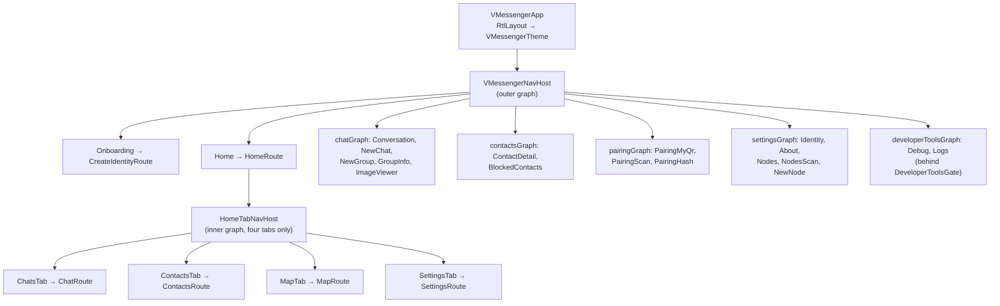

# vMessenger - UI

This document describes the presentation layer as it is implemented: the design system in
`:core:designsystem`, the component catalogue, the navigation structure, the screens each feature
module owns, and the rules that keep the interface Persian and right-to-left. Every claim below
names the file that implements it.

Screen behaviour ties back to [Architecture.md](Architecture.md); message statuses and content come
from [Protocol.md](Protocol.md) and [Database.md](Database.md). The module boundaries are in
[FolderStructure.md](FolderStructure.md).

---

## 1. Design principles

The interface is calm and content-first: generous whitespace, a restrained palette, and motion used
only to communicate a state change. Security states — a contact's key changed, a message failed, a
group is closed — are legible without being alarming, and are rendered as banners and system lines
rather than as toasts. The app is Persian and RTL by construction rather than by retrofit, and the
database is the source of truth, so the UI is reactive and rarely needs a blocking spinner.

The rule that keeps this from drifting is that screens do not invent styling. Colours, spacing,
shapes, type and formatting come from `:core:designsystem`, and a screen that needs a value the
tokens do not have is a signal to extend the tokens.

---

## 2. The design system

### 2.1 Theme entry point

[`Theme.kt`](../core/designsystem/src/main/kotlin/ir/vmessenger/core/designsystem/theme/Theme.kt) is
thirty-four lines and holds the entire theme surface:

```kotlin
@Composable fun VMessengerTheme(darkTheme: Boolean = isSystemInDarkTheme(), content: @Composable () -> Unit)
@Composable fun RtlLayout(content: @Composable () -> Unit)
```

`VMessengerTheme` selects `VmDarkColorScheme` or `VmLightColorScheme`, provides the matching
`VmColors` bundle through `LocalVmColors`, and hands Material 3 the scheme, `VMessengerTypography`
and `VMessengerShapes`.

**Dynamic colour is not used.** There is no `dynamicLightColorScheme` or `dynamicDarkColorScheme`
call anywhere in the repository; the palette is hand-written so the brand survives the device's
wallpaper.

Dark mode is a user preference rather than a system read. `VMessengerTheme`'s default parameter is
`isSystemInDarkTheme()`, but the app never takes the default:
[`MainActivity`](../app/src/main/kotlin/ir/vmessenger/MainActivity.kt) passes
`darkTheme = darkThemePref ?: isSystemInDarkTheme()`, where `darkThemePref` comes from
[`MainViewModel`](../app/src/main/kotlin/ir/vmessenger/MainViewModel.kt) mapping the persisted
`ThemePreferences.themeMode` — `LIGHT` to false, `DARK` to true, and `SYSTEM` to null so the system
decides.

The composition root is
[`VMessengerApp`](../app/src/main/kotlin/ir/vmessenger/ui/VMessengerApp.kt), which nests
`RtlLayout { VMessengerTheme { Surface { … } } }` around the navigation host, the contact-request
overlay and the device-clock warning banner.

### 2.2 Tokens

All four token objects are plain top-level Kotlin objects rather than composition locals, so they
are readable from any file that imports them.

[`Spacing.kt`](../core/designsystem/src/main/kotlin/ir/vmessenger/core/designsystem/theme/Spacing.kt)
declares `VmSpacing`, whose KDoc states the rule directly — these are the only spacing values the
app is allowed to use — and `VmSizes` for the fixed component dimensions screens share.

| `VmSpacing` | | `VmSizes` | |
|---|---|---|---|
| `xxs` | 2.dp | `avatarSm` | 36.dp |
| `xs` | 4.dp | `avatarMd` | 48.dp |
| `sm` | 8.dp | `avatarLg` | 72.dp |
| `md` | 12.dp | `listItemHeight` | 72.dp |
| `lg` | 16.dp | `touchTarget` | 48.dp |
| `xl` | 24.dp | `bubbleMaxWidthFraction` | 0.78f |
| `xxl` | 32.dp | | |

[`VmElevation.kt`](../core/designsystem/src/main/kotlin/ir/vmessenger/core/designsystem/theme/VmElevation.kt)
carries shadow elevations only — `none` 0.dp, `bar` 1.dp, `sheet` 3.dp, `fab` 6.dp — because tonal
elevation is expressed through the `surfaceContainer*` roles instead.

[`Shape.kt`](../core/designsystem/src/main/kotlin/ir/vmessenger/core/designsystem/theme/Shape.kt)
holds two things. `VMessengerShapes` is the Material scale handed to `MaterialTheme`
(`extraSmall` 4.dp through `extraLarge` 24.dp). `VmShapes` is the set that is deliberately *not*
part of that scale: `bubbleOutgoing` and `bubbleIncoming` (16.dp corners with a 4.dp tail on the
bottom-end and bottom-start corner respectively), `groupAvatar` and `media` at 12.dp. The bubble
tails are expressed in `start`/`end` terms, so they mirror correctly under RTL without a second
definition.

### 2.3 Colour and the `MaterialTheme.vm` extension

[`Color.kt`](../core/designsystem/src/main/kotlin/ir/vmessenger/core/designsystem/theme/Color.kt)
defines the two Material schemes and one extension bundle for the colours Material has no role for.
The exposure chain is:

```kotlin
@Immutable class VmColors(...)
val VmLightColors = VmColors(...)
val VmDarkColors  = VmColors(...)
val LocalVmColors = staticCompositionLocalOf { VmLightColors }
val MaterialTheme.vm: VmColors
    @Composable @ReadOnlyComposable get() = LocalVmColors.current
```

A screen therefore reads `MaterialTheme.vm.bubbleOutgoing` the same way it reads
`MaterialTheme.colorScheme.primary`. Because `LocalVmColors` is a *static* composition local, a
theme flip recomposes the whole subtree rather than only the readers.

| Extension colour | Light | Dark |
|---|---|---|
| `bubbleOutgoing` / `onBubbleOutgoing` | `0xFFD7F1EC` / `0xFF05302B` | `0xFF11423C` / `0xFFD7F1EC` |
| `bubbleIncoming` / `onBubbleIncoming` | `0xFFFFFFFF` / `0xFF0A0A0A` | `0xFF242424` / `0xFFF5F5F5` |
| `tickPending`, `tickSent` | `0xFF5C5C5C` | `0xFFA3A3A3` |
| `tickRead` | `0xFF0F766E` | `0xFF4FD1BE` |
| `chatBackground` | `0xFFF5F5F5` | `0xFF161616` |
| `recordingRed` | `0xFFD9534F` | `0xFFE57373` |
| `keyChangeWarning` | `0xFFDCEBE0` | `0xFF2A4634` |
| `senderPalette` | eight muted hues | eight lighter hues |

The base scheme is an ink monochrome with a single teal accent — `0xFF0F766E` in light,
`0xFF4FD1BE` in dark — used for primary actions, outgoing bubbles and read ticks.

`senderPalette` exists for group chat, where each member's name is coloured on the first message of
a run. `VmColors.senderColor(seed: ByteArray)` folds the seed with `acc * 31 + byte` masked to
`0x7FFFFFFF` and indexes the palette, falling back to `onBubbleIncoming` if the palette is empty.
The seed is derived from the identity hash, so a member keeps the same colour on every device.

### 2.4 Typography

[`Type.kt`](../core/designsystem/src/main/kotlin/ir/vmessenger/core/designsystem/theme/Type.kt)
binds `FontFamily` to the bundled Vazirmatn faces in
`core/designsystem/src/main/res/font/`. There are two assets — regular and medium — and the family
maps Medium, SemiBold and Bold all onto the medium face, deliberately: synthesising a heavier weight
would distort Persian glyphs, and the calm aesthetic does not call for one.

`VMessengerTypography` maps the complete fifteen-style Material scale onto that family. Two styles
sit outside the scale because they answer to specific components: `VmTextStyles.bubbleTime` (11sp)
for the timestamp inside a message bubble, and `UserHashTextStyle` (monospace, 14sp, 0.5sp letter
spacing, centred) so a user hash can be compared character by character.

### 2.5 Persian formatting

Formatting is split across two files on a deliberate line: everything that needs the platform's
calendar lives in one, and everything that is pure string arithmetic lives in the other so it can be
unit-tested on the JVM.

[`VmDateFormat`](../core/designsystem/src/main/kotlin/ir/vmessenger/core/designsystem/format/VmDateFormat.kt)
is the Android-dependent half:

| Function | Produces |
|---|---|
| `time(ms)` | `HH:mm` for a message bubble |
| `daySeparator(ms, nowMs)` | `امروز`, `دیروز`, a weekday name, or a Jalali date |
| `chatListTime(ms, nowMs)` | The compact stamp on a chat-list row |
| `dayAndTime(ms, nowMs)` | A day and time together, for the per-recipient info sheet |
| `fileSize(bytes)` | Delegates to `VmTextFormat` |
| `duration(ms)` | Delegates to `VmTextFormat` |
| `relative(ms, nowMs)` | A relative phrase, falling back to a date past the window |

The Jalali calendar and the Persian month and weekday names come from
`ULocale("fa_IR@calendar=persian")`. `SimpleDateFormat` instances are cached per thread, and day
deltas are computed with `Calendar.JULIAN_DAY` in the device time zone so a separator flips at local
midnight.

[`VmTextFormat`](../core/designsystem/src/main/kotlin/ir/vmessenger/core/designsystem/format/VmTextFormat.kt)
is the pure half, and is where the digits actually change. It holds no `android.icu` import, which
is what makes
[`VmTextFormatTest`](../core/designsystem/src/test/kotlin/ir/vmessenger/core/designsystem/format/VmTextFormatTest.kt)
a plain JVM test:

```kotlin
private const val PERSIAN_ZERO = '۰'      // U+06F0, Extended Arabic-Indic
fun persianDigits(value: String): String = buildString(value.length) {
    for (char in value) {
        if (char in '0'..'9') append(PERSIAN_ZERO + (char - '0')) else append(char)
    }
}
```

A per-character offset from U+06F0, with every non-digit passing through untouched. There is no
`Locale` and no `NumberFormat` involved — which is precisely why a formatted ICU string is still
passed through `persianDigits` before it reaches the screen. The decimal separator is U+066B
(`٫`), file sizes use `بایت` / `کیلوبایت` / `مگابایت` / `گیگابایت` on binary boundaries, and
`relative` returns null once past `RELATIVE_WINDOW_DAYS` (7) so the caller falls back to a date.
`fileSize`, `duration` and `percent` are the three that transfer progress and media bubbles depend
on, which is why they live here rather than being formatted at each call site.

Error text follows the same discipline.
[`AppErrorText.kt`](../core/designsystem/src/main/kotlin/ir/vmessenger/core/designsystem/error/AppErrorText.kt)
maps twenty-two parameterless `AppError` types to string resources, with four parameterised
branches for `AttachmentTooLarge`, `GroupFull`, `ProtocolVersion` and `NodeAddressRejected`, and a
fallback for anything unrecognised. This is what lets the data layer return a stable error code while the UI owns the
wording.

---

## 3. Component catalogue

Thirty files sit in
[`core/designsystem/…/component/`](../core/designsystem/src/main/kotlin/ir/vmessenger/core/designsystem/component).
Their strings live in the module's own `res/values/strings.xml`, so a shared component never asks its
caller for a label it could own.

| Component | Public API | Renders |
|---|---|---|
| `VMessengerScaffold` | `VMessengerScaffold` | The standard screen frame: top app bar with a title/subtitle pair or a `titleContent` slot, back button, actions, FAB, bottom bar, snackbar host, scroll behaviour and insets. |
| `Avatar` | `Avatar` | Identicon or first-letter avatar, coloured from `seed`; circle or rounded square per `AvatarVariant`. |
| `Identicon` | `internal Identicon` | The 5×5 vertically mirrored pattern behind avatars. Internal on purpose — screens go through `Avatar`. |
| `ChatListItem` | `ChatListItem` | One chats-tab row: avatar, title, preview, time, unread pill, mute icon, ticks. |
| `MessageBubble` | `MessageBubble`, `BubbleMeta` | Bubble chrome — side, shape, colours, the 78% width cap — and the trailing time-and-ticks line. |
| `BubbleContent` | `TextBubbleContent`, `ImageBubbleContent`, `VideoBubbleContent`, `FileBubbleContent` | The four payload bodies: text; image with caption and progress; video thumbnail with play badge and duration; file row with icon, name and Persian size. |
| `ReplyQuote` | `ReplyQuote` | The quoted message, used both inside a bubble and in the composer strip. |
| `SystemMessage` | `SystemMessage` | Centred pill for group control events and other non-user messages. |
| `DeliveryTicks` | `DeliveryTicks` | Delivery state as an icon — clock, one check, two checks, accented checks, error — with the Persian state name as its content description. |
| `DateSeparator` | `DateSeparator` | The centred day pill between message runs. |
| `Composer` | `Composer` | The input bar: attach button, text field, send button, reply strip and a `recordingContent` slot. Owns `navigationBarsPadding().imePadding()`. |
| `AttachmentSheet` | `AttachmentSheet` | Modal sheet with three attachment sources. |
| `ProgressPill` | `ProgressPill` | Transfer progress over a media bubble; a null progress is indeterminate. |
| `KeyChangeBanner` | `KeyChangeBanner` | The warning shown when a peer's identity key has changed. |
| `SafetyNumberDisplay` | `SafetyNumberDisplay` | Title plus the derived safety fingerprint in `UserHashTextStyle`. |
| `QrCard` | `QrCard`, `StyledQrCode` | The full pairing card and the bare rasterised QR. Always dark-on-light regardless of theme, so a scanner is not fighting a dark background. |
| `UserHashText`, `UserHashLabel`, `UserHashShareRow` | same names | The monospaced hash, its caption, and the copy/share row. |
| `EmptyState` | `EmptyState` | Icon, title, body and an optional action for a genuinely empty list. |
| `SkeletonList` | `SkeletonList` | Placeholder rows while a list loads — static, deliberately not shimmering. |
| `SectionHeader` | `SectionHeader` | Small accented caption above a group of rows. |
| `SettingsSection`, `SettingsRow`, `SettingsDivider` | same names | A titled bordered card, the rows inside it, and the inset divider between them. |
| `SettingsTrailing` | `Chevron`, `None`, `Switch`, `Badge`, `Text` | A sealed interface deciding a settings row's end slot; a `Switch` trailing makes the whole row toggle. |
| `ConfirmDialog` | `ConfirmDialog` | The single confirmation dialog for every irreversible action; `destructive` tints the confirm label. |
| `VmSearchBar` | `VmSearchBar` | The inline field that replaces the top bar while a list is in search mode. |
| `VmSnackbarHost` | `VmSnackbarHost`, `rememberVmSnackbar` | The app's one snackbar style and its state factory. |
| `UiMessage` | `Text(resId, args)`, `Failure(error)`, `UiMessage.asText()` | A one-shot snackbar message carried as a resource id, so a ViewModel never touches a `Context`. |
| `VmStepList` | `VmStepList`, `VmStep`, `VmStepState` | A process as steps — pending, running, done, warning, failed, skipped — announced as a live region when a step changes. |
| `VmSecretField` | `VmSecretField` | A password field over a `TextFieldState` (`BasicSecureTextField`); never saveable, so a secret can't reach saved state. |
| `VmNotice` | `VmNotice`, `VmNoticeKind` | An inline info / warning / critical card with an optional title and action. |
| `VmCodeBlock` | `VmCodeBlock` | Monospaced, always left to right, with an optional copy button: addresses, fingerprints, logs. |
| `ComponentModels` | `AvatarVariant`, `DeliveryTicksState`, `BubbleDirection`, `MessageBubbleColors`, `MessageBubbleDefaults`, `ReplyPreview`, `ComposerState`, `EmptyStateAction` | Shared value types; no rendering. |

`SkeletonList` not shimmering and `EmptyState` being distinct from it are the same decision: a
loading list and an empty list were previously the same blank screen, and telling them apart matters
more than the animation.

---

## 4. Navigation

### 4.1 Two hosts, one route type

Navigation is type-safe. [`VmRoute.kt`](../app/src/main/kotlin/ir/vmessenger/navigation/VmRoute.kt)
declares `@Serializable sealed interface VmRoute` with twenty-three members — nineteen `data object`s
and four `data class`es carrying arguments:

| Route | Argument |
|---|---|
| `Conversation` | `conversationId: String` |
| `ContactDetail` | `contactId: String` |
| `GroupInfo` | `groupId: String` |
| `ImageViewer` | `messageId: String` |

The file's KDoc pins the contract that argument names match their `SavedStateHandle` keys, so a
ViewModel can read `savedStateHandle["conversationId"]` or
`savedStateHandle.toRoute<VmRoute.Conversation>()` and existing ViewModels did not change when string
routes were retired.

The structure is an outer host that owns the whole window and an inner host that owns only the four
tabs. This is not a stylistic choice: the conversation used to live inside the tab host, so the
navigation bar rendered underneath the message composer.


```mermaid
flowchart TD
  App["VMessengerApp<br/>RtlLayout → VMessengerTheme"] --> Outer["VMessengerNavHost<br/>(outer graph)"]
  Outer --> Onb["Onboarding → CreateIdentityRoute"]
  Outer --> Home["Home → HomeRoute"]
  Outer --> Chat["chatGraph: Conversation, NewChat,<br/>NewGroup, GroupInfo, ImageViewer"]
  Outer --> Cont["contactsGraph: ContactDetail,<br/>BlockedContacts"]
  Outer --> Pair["pairingGraph: PairingMyQr,<br/>PairingScan, PairingHash"]
  Outer --> Set["settingsGraph: Identity, About,<br/>Nodes, NodesScan, NewNode"]
  Outer --> Dev["developerToolsGraph: Debug, Logs<br/>(behind DeveloperToolsGate)"]
  Home --> Inner["HomeTabNavHost<br/>(inner graph, four tabs only)"]
  Inner --> T1["ChatsTab → ChatRoute"]
  Inner --> T2["ContactsTab → ContactsRoute"]
  Inner --> T3["MapTab → MapRoute"]
  Inner --> T4["SettingsTab → SettingsRoute"]
```

[`VMessengerNavHost`](../app/src/main/kotlin/ir/vmessenger/navigation/VMessengerNavHost.kt) takes its
`startDestination` as a parameter, resolved by `MainViewModel` before the first frame while the
system splash covers the gap, so the first composed frame is the right screen rather than a
placeholder that redirects. It registers `Onboarding` inline and delegates everything else to six
`NavGraphBuilder` extensions, one file each.

| Graph file | Destinations |
|---|---|
| [`HomeGraph.kt`](../app/src/main/kotlin/ir/vmessenger/navigation/HomeGraph.kt) | `Home` |
| [`ChatGraph.kt`](../app/src/main/kotlin/ir/vmessenger/navigation/ChatGraph.kt) | `Conversation`, `NewChat`, `NewGroup`, `GroupInfo`, `ImageViewer` |
| [`ContactsGraph.kt`](../app/src/main/kotlin/ir/vmessenger/navigation/ContactsGraph.kt) | `ContactDetail`, `BlockedContacts` |
| [`PairingGraph.kt`](../app/src/main/kotlin/ir/vmessenger/navigation/PairingGraph.kt) | `PairingMyQr`, `PairingScan`, `PairingHash` |
| [`SettingsGraph.kt`](../app/src/main/kotlin/ir/vmessenger/navigation/SettingsGraph.kt) | `settingsGraph`: `Identity`, `About`, `Nodes`, `NodesScan`, `NewNode(managedNodeId?)`; `developerToolsGraph`: `Debug`, `Logs` |

`HomeGraph` is the bridge between the two hosts. It converts the outer `NavController` into a
`HomeNavigation` bundle of fourteen callbacks
([`HomeNavigation.kt`](../app/src/main/kotlin/ir/vmessenger/ui/home/HomeNavigation.kt)), remembered
against the controller, so nothing inside a tab holds the outer controller and a tab cannot navigate
somewhere the bundle does not offer.

`Debug` and `Logs` sit behind `DeveloperToolsGate`, backed by
[`DeveloperToolsViewModel`](../app/src/main/kotlin/ir/vmessenger/navigation/DeveloperToolsViewModel.kt):
the gate is open when the build is debug or `privacyPreferences.developerModeEnabled` is set, a null
value renders nothing because the preference is still loading, and false pops the destination.
Developer mode is unlocked by seven taps on the About screen's version row.

### 4.2 Tabs

The four tabs are declared as `HomeTabs` in
[`HomeRoute.kt`](../app/src/main/kotlin/ir/vmessenger/ui/home/HomeRoute.kt):

| Route | String resource | Label | Icon |
|---|---|---|---|
| `ChatsTab` | `tab_chats` | گفتگوها | `Icons.AutoMirrored.Outlined.Chat` |
| `ContactsTab` | `tab_contacts` | مخاطبین | `Icons.Outlined.Contacts` |
| `MapTab` | `tab_map` | نقشه | `Icons.Outlined.LocationOn` |
| `SettingsTab` | `tab_settings` | تنظیمات | `Icons.Outlined.Settings` |

Tab switching uses `popUpTo(graph.findStartDestination().id) { saveState = true }` with
`launchSingleTop` and `restoreState`, so each tab keeps its own scroll position and back stack.
Selection is decided by `destination?.hasRoute(tab.route::class)` rather than by an index.

The chats icon is the `AutoMirrored` variant so its speech-bubble tail flips with layout direction.

### 4.3 Motion

[`NavTransitions.kt`](../app/src/main/kotlin/ir/vmessenger/navigation/NavTransitions.kt) provides the
four shared-axis transitions used by the outer host: a 280 ms slide of a quarter of the container
(`SLIDE_FRACTION = 4`) paired with a 180 ms fade, sliding `towards = SlideDirection.Start` on push
and `SlideDirection.End` on pop. Because those directions resolve against layout direction, one set
covers RTL without a mirrored copy.

The inner tab host deliberately does not use them. Tabs are siblings rather than a hierarchy, so
switching cross-fades over 160 ms instead of implying depth.

---

## 5. Screens

### 5.1 `feature:identity`

[`CreateIdentityRoute`](../feature/identity/src/main/kotlin/ir/vmessenger/feature/identity/CreateIdentityRoute.kt)
is the start destination when no identity exists: it explains what an identity is, takes a display
name, generates the key pair on device, and offers restore-from-backup as the alternative path (its
steps are in `RestoreBackupSteps.kt`).
[`IdentityRoute`](../feature/identity/src/main/kotlin/ir/vmessenger/feature/identity/IdentityRoute.kt)
is the settings counterpart — edit the display name, view and share the user hash and QR. Both
ViewModels, `CreateIdentityViewModel` and `IdentityViewModel`, share `IdentityViewModel.kt`.

### 5.2 `feature:pairing`

[`MyQrRoute`](../feature/pairing/src/main/kotlin/ir/vmessenger/feature/pairing/MyQrRoute.kt) shows
this device's signed pairing descriptor as a QR alongside the readable user hash.
[`QrScannerRoute`](../feature/pairing/src/main/kotlin/ir/vmessenger/feature/pairing/QrScannerRoute.kt)
scans someone else's. The camera shell underneath both — permission handling, preview and scan frame
— is
[`QrScannerScreen`](../feature/pairing/src/main/kotlin/ir/vmessenger/feature/pairing/QrScannerScreen.kt),
which is shared with node import in `feature:settings` rather than duplicated.
[`AddByHashRoute`](../feature/pairing/src/main/kotlin/ir/vmessenger/feature/pairing/AddByHashRoute.kt)
is the camera-free path: type a user hash, which sends a contact request rather than adding
instantly. `MyQrViewModel`, `AddByHashViewModel` and `QrScanViewModel` share `PairingViewModel.kt`.

### 5.3 `feature:contacts`

[`ContactsRoute`](../feature/contacts/src/main/kotlin/ir/vmessenger/feature/contacts/ContactsRoute.kt)
is the tab: pending requests first, then contacts, each row carrying a relationship-status chip, a
key-change shield where relevant, and a distance badge when a contact is sharing location.
[`ContactDetailRoute`](../feature/contacts/src/main/kotlin/ir/vmessenger/feature/contacts/ContactDetailRoute.kt)
is a real destination in the outer graph rather than remembered state, which is what makes system
back close the detail rather than leave the tab, and lets it pop itself when the contact stops
existing after a delete. Formatting helpers — `distanceLabel`, `statusLabel`, `ContactStatusChip`,
`KeyChangeShield` — live in `ContactFormatting.kt`.

### 5.4 `feature:chat`

[`ChatRoute`](../feature/chat/src/main/kotlin/ir/vmessenger/feature/chat/ChatRoute.kt) is the chats
tab: search, long-press selection with mute and delete, and three genuinely distinct list states
(skeleton, empty, content).
[`ConversationRoute`](../feature/chat/src/main/kotlin/ir/vmessenger/feature/chat/ConversationRoute.kt)
owns the whole window — header, warning banners, message list, composer — and is also where read
receipts are driven from the screen lifecycle. Supporting composables are split by concern:
`ConversationChrome`, `ConversationList`, `MessageBubbleItem`, `MessageActions`, `MessageInfoSheet`.

`MessageInfoSheet` is the group counterpart to a single tick. A group message is N pairwise sends, so
its bubble status is an aggregate; long-pressing one of your own group messages opens the sheet,
which lists one row per member with the moment they received and read it.

Two sub-packages carry the newer work. `group/` holds
[`NewGroupRoute`](../feature/chat/src/main/kotlin/ir/vmessenger/feature/chat/group/NewGroupRoute.kt)
(member picker then name, inside one destination),
[`GroupInfoRoute`](../feature/chat/src/main/kotlin/ir/vmessenger/feature/chat/group/GroupInfoRoute.kt)
(which pops itself when the group is left or closed, and renders read-only behind a banner when
closed) and the shared `GroupMemberPicker`. `voice/` holds the recording state machine —
`ComposerMicButton`, `RecordingRow`, `VoiceRecorder`, `VoiceSession` — and playback:
`VoicePlaybackController`, `VoiceBubbleHost`, `VoiceBubbleContent`, `WaveformBar`.

[`ImageViewerRoute`](../feature/chat/src/main/kotlin/ir/vmessenger/feature/chat/ImageViewerRoute.kt)
is a full-bleed viewer with pinch and double-tap zoom, drag to pan and drag down to dismiss. It
decodes from the decrypted stream, so an end-to-end encrypted photo is never written to disk in
plaintext for an arbitrary gallery app to open. Video and files still open externally, via
`ExternalViewer.kt`.

### 5.5 `feature:map`

[`MapRoute`](../feature/map/src/main/kotlin/ir/vmessenger/feature/map/MapRoute.kt) is a full-bleed
`VmMapView` inside a `BottomSheetScaffold`, with floating controls over it and a sheet listing the
contacts currently sharing a position. `MapControls.kt` holds the sharing pill, the camera buttons
and the tiles-error banner; `SharePickerSheet.kt` is the per-contact allow list;
`LocationPermissionController.kt` handles the runtime permission.
[`MapViewModel`](../feature/map/src/main/kotlin/ir/vmessenger/feature/map/MapViewModel.kt) combines
contacts, access grants, sharing state, incoming samples and the device's own position into one
`MapUiState`, and chooses the camera mode — follow-me when there are no markers, fit-all when there
are.

### 5.6 `feature:settings`

[`SettingsRoute`](../feature/settings/src/main/kotlin/ir/vmessenger/feature/settings/SettingsRoute.kt)
is sectioned rows over identity, privacy switches, network nodes, blocked contacts, about and debug.
[`NodesRoute`](../feature/settings/src/main/kotlin/ir/vmessenger/feature/settings/NodesRoute.kt)
manages the bootstrap and relay node lists and
[`NodeQrScannerRoute`](../feature/settings/src/main/kotlin/ir/vmessenger/feature/settings/NodeQrScannerRoute.kt)
imports one from a `vmnode:` QR. The Nodes screen leads with *Set up a new server* (§5.9) and, once this
device has set one up, a *Your servers* section: each server's address and node version, *Update* when the
app carries a newer node (*Set up again* otherwise), and *Forget*.
[`BlockedContactsRoute`](../feature/settings/src/main/kotlin/ir/vmessenger/feature/settings/BlockedContactsRoute.kt)
exists because blocking had no way back: blocked contacts are filtered out of the contacts list, so
without this screen they were invisible and permanently unblockable.

Backup export is not a destination of its own — it is a section of `SettingsRoute` plus
`BackupPassphraseDialog`, because the flow is one passphrase prompt and a status line rather than a
screen. Restore is on the other side of the app's life cycle and lives in `CreateIdentityRoute`
(§5.1).

### 5.7 `feature:debug` and `feature:about`

[`DebugRoute`](../feature/debug/src/main/kotlin/ir/vmessenger/feature/debug/DebugRoute.kt) carries the
adb forward commands, the active network path diagnostics and the P2P migration feature flags;
[`LogsRoute`](../feature/debug/src/main/kotlin/ir/vmessenger/feature/debug/LogsRoute.kt) is the in-app
log viewer. Both are gated as described in §4.1.
[`AboutRoute`](../feature/about/src/main/kotlin/ir/vmessenger/feature/about/AboutRoute.kt) shows the
app name, the real version and the licence, and its version row is the seven-tap developer-mode
unlock.

### 5.9 `feature:provision` (New node)

[`NewNodeRoute`](../feature/provision/src/main/kotlin/ir/vmessenger/feature/provision/NewNodeRoute.kt) is
one destination with its own steps — Intro, Server, Address, Security, Review, Install — driven by
[`NewNodeViewModel`](../feature/provision/src/main/kotlin/ir/vmessenger/feature/provision/NewNodeViewModel.kt)
through a single `onEvent`. Back steps back through the form, asks before stopping a running install, and
closes from the first step or a finished install. The install step shows a `VmStepList` (connect, upload,
the server's own steps as the installer reports them, the phone's check), the issues as `VmNotice`s, and the
log in a collapsible `VmCodeBlock`; the host-key, sudo-password and consent questions are dialogs that can't
be dismissed by tapping outside. The window is forced secure and kept out of autofill for the whole wizard
(`RequireSecureWindow`, `ExcludeFromAutofill`) and the screen stays on while installing (`KeepScreenOn`).
Secrets are `VmSecretField`s over `TextFieldState`s the ViewModel owns; nothing secret is saveable. Entered
from Settings → Nodes, and from the first-run node question's *Create a node*, which records the node as the
person's own when the wizard finishes (the `node_provisioned` result on the back stack entry).

### 5.8 Screens owned by `:app`

Three composables do not belong to a feature module because they are app-wide:
[`HomeRoute`](../app/src/main/kotlin/ir/vmessenger/ui/home/HomeRoute.kt) (the tab scaffold and inner
host), [`ContactRequestOverlay`](../app/src/main/kotlin/ir/vmessenger/ui/contact/ContactRequestOverlay.kt)
(the inbound contact-request dialog, which must appear over whatever is on screen), and
[`ClockWarningBanner`](../app/src/main/kotlin/ir/vmessenger/ui/network/ClockWarningBanner.kt) (shown
when a wrong device clock is making TLS validation fail).

---

## 6. RTL and Persian rules

### 6.1 The three rules

**All user-facing text lives in `strings.xml`, in Persian and English together.** Each module owns its
own, so a component's labels travel with the component rather than being passed in by every caller.
Persian is the default `values/` folder and English is `values-en/`; a string added to one is added to the
other in the same change. `feature:chat` splits its resources across three files — `strings.xml`,
`strings_group.xml` and `strings_voice.xml` — one per sub-feature.

`UiMessage` is the mechanism that keeps this honest across the ViewModel boundary: a one-shot message
is carried as a `@StringRes` id plus arguments, resolved to text only at the composable that shows
it, so no ViewModel needs a `Context` to say something to the user.

**Persian digits go through `VmTextFormat`.** Nothing formats a number for display by itself. Even
`VmDateFormat`, which uses ICU with a Persian locale, passes the result through
`VmTextFormat.persianDigits` rather than trusting the locale's digit shaping.

**Layout direction is set once, at the root, from the app language.** `RtlLayout` provides right to left
for Persian and left to right for English in `VMessengerApp`. Below the root, only technical text changes
direction: IP addresses, ports, host names, URLs, fingerprints and logs are laid out left to right in both
languages (`VmCodeBlock`, and the `Ltr` wrapper in `feature:provision`) and keep ASCII digits. A repository-wide search for `LocalLayoutDirection` finds exactly three files:
`Theme.kt` where it is declared, `VMessengerApp.kt` where it is applied, and
[`ComposerMicButton.kt`](../feature/chat/src/main/kotlin/ir/vmessenger/feature/chat/voice/ComposerMicButton.kt),
which reads it to mirror the slide-to-cancel gesture — a gesture direction is not something the
framework can mirror for you.

Because direction is forced rather than derived, the manifest's `android:supportsRtl="true"` matters
only for the small amount of View-based surface (the map, the splash), and every Compose layout must
use `start`/`end` rather than `left`/`right`.

### 6.2 What is not enforced by the build

Persian-first is a convention here, not a build configuration, and it is worth being precise about
that:

- `app/build.gradle.kts` declares no `resourceConfigurations` and no `localeFilters`. A search across
  the repository for `resourceConfigurations`, `localeConfig` and `setApplicationLocales` returns
  nothing.
- `app/src/main/AndroidManifest.xml` has `android:supportsRtl="true"` but no `android:localeConfig`,
  and there is no `res/xml/locales_config.xml`.
- `app/src/main/res/values-fa/` exists but is empty, and
  `feature/debug/src/main/res/values-fa/strings.xml` contains only `<resources />`.

All copy is simply authored in Persian in the default resource folder. Nothing would stop a device
locale from selecting a different folder if one were ever added, and nothing in CI fails if a
hardcoded literal slips in.

### 6.3 Known deviations

A grep for string literals inside composables finds the following, listed rather than hidden:

- **`feature:debug` is English and unlocalised.** `DebugRoute.kt` hardcodes "Active network path",
  "Diagnostics", "Last delivery path", "P2P migration flags", each of the nine `P1`–`P9` flag labels,
  and "Reset P2P flags to defaults". This screen is developer-mode gated and unreachable in a release
  build without the seven-tap unlock, so it is a deliberate exception rather than an oversight — but
  the module's other strings *are* in `strings.xml`, so the file is inconsistent with itself. The
  adb command it displays is legitimately untranslated.
- **Two ViewModels build Persian sentences in Kotlin** instead of emitting a `UiMessage`:
  `IdentityViewModel.kt` for the display-name length error, and `NodeQrScanViewModel.kt` for the
  invalid-QR message.
- **`NetworkNotificationManager.kt` hardcodes three Persian literals** — the channel name, its
  description, and the foreground-service notification's content text — even though
  `core:notifications` does have a `strings.xml` that the message notification uses.

---

## 7. The map layer

Map rendering is factored into `:core:map` so `feature:map` contains no drawing code at all — it
supplies a `MapContent` and reads back callbacks.

Pins are **pre-rendered Android bitmaps pushed into a MapLibre `SymbolLayer`**, not Compose drawing.
Three files implement this:

- [`MarkerCanvas.kt`](../core/map/src/main/kotlin/ir/vmessenger/core/map/MarkerCanvas.kt) does the
  drawing: `drawLabelChip` (the rounded name chip, in the theme's surface colour with a hairline
  outline), `drawAvatarDisc` (the contact's identicon inside a ringed disc, using the same 5×5
  mirrored pattern as the design system's `Avatar`, so a pin and a chat row agree), and `drawPointer`
  (the triangle that puts the pin tip on the coordinate).
- [`MarkerBitmaps.kt`](../core/map/src/main/kotlin/ir/vmessenger/core/map/MarkerBitmaps.kt) assembles
  and caches them. `rememberMarkerBitmaps()` builds a `MarkerChrome` from `MaterialTheme.colorScheme`
  and `MaterialTheme.vm`, so pins follow the theme; `bitmap(marker)` is an LRU cache of 32 entries
  keyed on `MapMarker.iconKey`, and `imageId(marker)` carries a palette tag so a theme flip does not
  serve a stale image under the same id.
- [`MarkerLayer.kt`](../core/map/src/main/kotlin/ir/vmessenger/core/map/MarkerLayer.kt) owns one
  GeoJSON source with a `CircleLayer` for the accuracy circle and a `SymbolLayer` for the pins,
  anchored `ICON_ANCHOR_BOTTOM` with overlap and placement checks disabled so a pin is never silently
  dropped.

The label is baked into the bitmap with a `StaticLayout` using the bundled Vazirmatn medium face and
`TextDirectionHeuristics.FIRSTSTRONG_RTL`, specifically so Persian shaping and bidi do not depend on
the vector style's glyph coverage. This is the one place in the app where Persian text is rendered
outside Compose.

The device's own position is not a custom drawing: `MapPuck` delegates to MapLibre's own
`LocationComponent`, fed by `BusLocationEngine` from `LocationUpdateBus`.

---

## 8. Known limitations

- **Map pin rendering has never been visually verified.** The marker bitmaps are composed in code
  and the layer is exercised, but no one has looked at the result: `screencap` returns a black image
  on the software-GPU emulator used for testing, which is where MapLibre's surface renders. Pin
  geometry, the label chip's fit around Persian text, and the identicon inside the disc are therefore
  confirmed only by reading the code. This should be checked on a physical device before release.
- **`feature:debug` is not localised** and two ViewModels build Persian sentences in Kotlin, as
  itemised in §6.3.
- **Nothing enforces the string rules.** There is no lint rule or CI check that fails a hardcoded
  user-facing literal or a Latin digit reaching the screen; both are conventions held up by review.
- **There is no Latin-digit setting.** Persian digits are unconditional wherever `VmTextFormat`
  is used. An earlier draft of this document promised a user-selectable numeral system; it was never
  built.
- **Accessibility is unaudited.** Content descriptions exist on the components where they matter most
  (`DeliveryTicks` carries the Persian state name, decorative icons are marked as such), but there
  has been no TalkBack pass, no contrast measurement against WCAG AA, and no test of the layouts
  under large system font scales.
- **There are no Compose UI tests.** The presentation layer is covered by ViewModel unit tests only;
  see [Testing.md](Testing.md).
