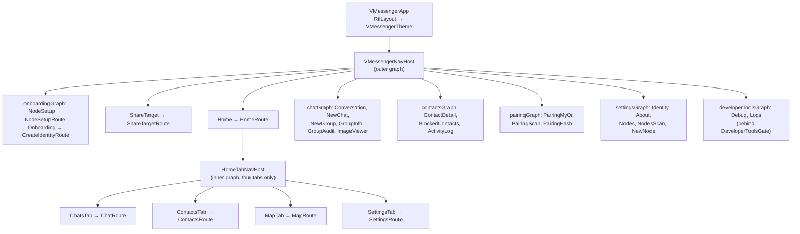

# vMessenger - UI

This document describes the presentation layer as it is implemented: the design system in
`:core:designsystem`, the component catalogue, the navigation structure, the screens each feature
module owns, and the rules that keep the interface correct in Persian (right to left, the default)
and English (left to right). Every claim below names the file that implements it.

Screen behaviour ties back to [Architecture.md](Architecture.md); message statuses and content come
from [Protocol.md](Protocol.md) and [Database.md](Database.md). The module boundaries are in
[FolderStructure.md](FolderStructure.md).

---

## 1. Design principles

The interface is calm and content-first: generous whitespace, a restrained palette, and motion used
only to communicate a state change. Security states — a contact's key changed, a message failed, a
group is closed — are legible without being alarming, and are rendered as banners and system lines
rather than as toasts. The app is Persian and RTL by construction rather than by retrofit, with
English and LTR as a first-class second language, and the database is the source of truth, so the
UI is reactive and rarely needs a blocking spinner.

The rule that keeps this from drifting is that screens do not invent styling. Colours, spacing,
shapes, type and formatting come from `:core:designsystem`, and a screen that needs a value the
tokens do not have is a signal to extend the tokens.

---

## 2. The design system

### 2.1 Theme entry point

[`VmTheme.kt`](../core/designsystem/src/main/kotlin/ir/vmessenger/core/designsystem/theme/VmTheme.kt)
is seventy lines and holds the entire theme surface:

```kotlin
object VmTheme { val colors: VmColors; val typography: VmTypography }   // read in composition
@Composable fun VMessengerTheme(darkTheme: Boolean = isSystemInDarkTheme(), content: @Composable () -> Unit)
@Composable fun RtlLayout(content: @Composable () -> Unit)
```

**There is no Material underneath.** `androidx.compose.material3` was removed in V2 (2.0.0-beta.1); every
component the app draws is its own, built on Compose Foundation in Element X's visual language (no
code copied from Element, which is AGPL). The only Material artefact left is the icon set
(`material-icons-extended`). `VMessengerTheme` selects `VmDarkColors` or `VmLightColors` and provides
them through `LocalVmColors`, `VmDefaultTypography` through `LocalVmTypography`, the default content
colour and text style every `VmText` and `VmIcon` inherits (`LocalVmContentColor`, `LocalVmTextStyle`
in `foundation/ContentLocals.kt`), text-selection handles in the accent, and `VmIndication` — a press
state layer in the content colour instead of Material's ripple. `RtlLayout` sets the layout direction
from the app language (§6.1).

**Dynamic colour is not used.** There is no `dynamicLightColorScheme` or `dynamicDarkColorScheme`
call anywhere in the repository; the palette is hand-written so the brand survives the device's
wallpaper.

Dark mode is a user preference rather than a system read. `VMessengerTheme`'s default parameter is
`isSystemInDarkTheme()`, but the app never takes the default:
[`MainActivity`](../app/src/main/kotlin/ir/vmessenger/MainActivity.kt) passes
`darkTheme = appDarkTheme(darkThemePref)`, where `darkThemePref` comes from
[`MainViewModel`](../app/src/main/kotlin/ir/vmessenger/MainViewModel.kt), which reads the persisted
`ThemePreferences.themeMode` through `themeChoice()` — `LIGHT` to false, `DARK` to true, and `SYSTEM`
to null so the system decides. Both functions are in
[`ThemeChoice.kt`](../app/src/main/kotlin/ir/vmessenger/ui/ThemeChoice.kt): `appDarkTheme` resolves
null against `isSystemInDarkTheme()` and keeps the system bars' icons in step with the app's theme
rather than the phone's; `CallActivity` resolves its theme the same way.

The composition root is
[`VMessengerApp`](../app/src/main/kotlin/ir/vmessenger/ui/VMessengerApp.kt), which nests
`RtlLayout { VMessengerTheme { VmSurface { … } } }` around the navigation host, the contact-request
overlay, the notification-permission explanation and the app-lock screen. The app-alert banner
(§5.8) is drawn by `HomeRoute`, above the tabs.

### 2.2 Tokens

The dimension tokens — `VmSpacing`, `VmSizes`, `VmElevation`, `VmShapes` and `VmMotion` — are plain
top-level Kotlin objects rather than composition locals, so they are readable from any file that
imports them. Colours and type are composition locals, read through `VmTheme` (§2.3, §2.4).

[`Spacing.kt`](../core/designsystem/src/main/kotlin/ir/vmessenger/core/designsystem/theme/Spacing.kt)
declares `VmSpacing`, whose KDoc states the rule directly — these are the only spacing values the
app is allowed to use — and `VmSizes` for the fixed component dimensions screens share.

| `VmSpacing` | | `VmSizes` | |
|---|---|---|---|
| `xxs` | 2.dp | `avatarSm` | 36.dp |
| `xs` | 4.dp | `avatarMd` | 48.dp |
| `sm` | 8.dp | `avatarLg` | 72.dp |
| `md` | 12.dp | `listItemHeight` | 72.dp |
| `lg` | 16.dp | `touchTarget` | 48.dp |
| `xl` | 24.dp | `bubbleMaxWidthFraction` | 0.78f |
| `xxl` | 32.dp | `iconSm` / `iconMd` / `iconLg` | 16.dp / 20.dp / 28.dp |
| | | `emptyStateIcon` | 56.dp |
| | | `progressStroke` | 2.dp |

[`VmElevation.kt`](../core/designsystem/src/main/kotlin/ir/vmessenger/core/designsystem/theme/VmElevation.kt)
carries shadow elevations only — `none` 0.dp, `bar` 1.dp, `sheet` 3.dp, `fab` 6.dp — because tonal
steps are colour tokens instead (`bgSubtle`, `bgSubtleStrong`, `bgElevated`; §2.3).

[`VmShapes.kt`](../core/designsystem/src/main/kotlin/ir/vmessenger/core/designsystem/theme/VmShapes.kt)
holds every corner in the app; there is no Material shape scale. Anything you press is a `pill`
(`CircleShape`: buttons, chips, badges, the search field); `field`, `menu` and `snackbar` are 12.dp,
`card` 16.dp, `dialog` 24.dp, and `sheet` rounds only its top corners (24.dp). `bubbleOutgoing` and
`bubbleIncoming` have 18.dp corners with a 6.dp tail on the bottom-end and bottom-start corner
respectively; `groupAvatar` is 12.dp and `media` 14.dp. Every corner is expressed in `start`/`end`
terms, so the shapes — the bubble tails included — mirror correctly under RTL without a second
definition.

[`VmMotion.kt`](../core/designsystem/src/main/kotlin/ir/vmessenger/core/designsystem/theme/VmMotion.kt)
collects the app's durations: `SLIDE_MS` 280, `FADE_MS` 180, `TAB_FADE_MS` 160, `EMPHASIS_MS` 150 (a
control appearing or disappearing in place) and `PLACEMENT_MS` 90 (a list item sliding to its new
place), with `emphasis()` and `fade()` specs. The navigation transitions (§4.3) keep their own
constants with the same values.

### 2.3 Colour and `VmTheme.colors`

[`VmColors.kt`](../core/designsystem/src/main/kotlin/ir/vmessenger/core/designsystem/theme/VmColors.kt)
defines one token bundle, named for what each colour does rather than where Material would put it,
in a light and a dark value. The exposure chain is:

```kotlin
@Immutable class VmColors(...)
val VmLightColors = VmColors(...)
val VmDarkColors  = VmColors(...)
val LocalVmColors = staticCompositionLocalOf { VmLightColors }
object VmTheme {
    val colors: VmColors
        @Composable @ReadOnlyComposable get() = LocalVmColors.current
}
```

A screen therefore reads `VmTheme.colors.textSecondary` or `VmTheme.colors.bubbleOutgoing`. Because
`LocalVmColors` is a *static* composition local, a theme flip recomposes the whole subtree rather
than only the readers.

The tokens come in groups: backgrounds back to front (`bgCanvas`, `bgSubtle`, `bgSubtleStrong`,
`bgElevated`, `bgActionPrimary`, `bgAccent`, `bgAccentSubtle`, the critical / warning / info fills,
`scrim`), text (`textPrimary`, `textSecondary`, `textPlaceholder`, `textAccent`, `textCritical`, …),
icons (`icon*`), lines (`borderSubtle`, `borderInteractive`, `borderFocused`, `borderCritical`), and
the conversation colours:

| Conversation colour | Light | Dark |
|---|---|---|
| `bubbleOutgoing` / `onBubbleOutgoing` | `0xFFE5F3F1` / `0xFF1B1D22` | `0xFF123733` / `0xFFEBEEF2` |
| `bubbleIncoming` / `onBubbleIncoming` | `0xFFF0F2F5` / `0xFF1B1D22` | `0xFF1B1E23` / `0xFFEBEEF2` |
| `tickPending`, `tickSent` | `0xFF8D97A5` | `0xFF6F7882` |
| `tickRead` | `0xFF0F766E` | `0xFF4FD1BE` |
| `chatBackground` | `0xFFFFFFFF` | `0xFF101317` |
| `recordingRed` | `0xFFD51928` | `0xFFE5484D` |
| `keyChangeWarning` | `0xFFFFF3E0` | `0xFF392A14` |
| `bubbleHighlight` | `0xFFE1E6EC` | `0xFF25282E` |
| `senderPalette` | eight muted hues | eight lighter hues |

The base is cool neutral greys on a plain canvas, with primary actions filled in the text colour
itself — near-black `0xFF1B1D22` in light, near-white `0xFFEBEEF2` in dark — and a single teal accent
— `0xFF0F766E` in light, `0xFF4FD1BE` in dark — used sparingly: links, unread counts, the send
button, a toggle that is on, read ticks, and (as a faint wash) outgoing bubbles.

`senderPalette` exists for group chat, where each member's name is coloured on the first message of
a run, and it also colours avatars and map pins. `VmColors.senderColor(seed: ByteArray)` folds the
seed with `acc * 31 + byte` masked to `0x7FFFFFFF` and indexes the palette, falling back to
`onBubbleIncoming` if the palette is empty. The seed is derived from the identity hash, so a member
keeps the same colour on every device.

### 2.4 Typography

[`Type.kt`](../core/designsystem/src/main/kotlin/ir/vmessenger/core/designsystem/theme/Type.kt)
binds the `Vazirmatn` `FontFamily` to the bundled faces in
`core/designsystem/src/main/res/font/`. There are three assets — regular, medium and bold, all real
faces rather than synthesised — and the family maps Normal to regular, Medium and SemiBold to the
medium face (nothing requests SemiBold), and Bold to bold.

`VmDefaultTypography` is the app's `VmTypography`: a deliberately short, Element X-sized scale of
twelve styles — four headings (`headingXl` 30sp, `headingLg` 26sp, `headingMd` 22sp in bold,
`headingSm` 19sp in medium) and four body sizes (`bodyLg` 16sp, `bodyMd` 14sp, `bodySm` 12sp,
`bodyXs` 11sp), each in a regular and a `…Medium` weight. Line heights are generous for Persian's
descenders and diacritics, and every style sets `TextDirection.Content`, so a paragraph takes its
direction from its first strong character instead of the forced layout direction. Two styles sit
outside the scale because they answer to specific components: `VmTextStyles.bubbleTime` (11sp) for
the timestamp inside a message bubble, and `UserHashTextStyle` (monospace, 14sp, 0.5sp letter
spacing, centred, always `TextDirection.Ltr`) so a user hash can be compared character by character.

### 2.5 Persian and English formatting

Formatting follows the app's language, which formatters read from `VmLocale.current` (`:core:common`,
kept in step with the resources by `AppLocaleController`; §6.2). It is split across two files on a
deliberate line: everything that needs the platform's calendar lives in one, and everything that is
pure string arithmetic lives in the other so it can be unit-tested on the JVM.

[`VmDateFormat`](../core/designsystem/src/main/kotlin/ir/vmessenger/core/designsystem/format/VmDateFormat.kt)
is the Android-dependent half:

| Function | Produces |
|---|---|
| `time(ms)` | `HH:mm` for a message bubble |
| `daySeparator(ms, nowMs)` | `امروز` / `Today`, `دیروز` / `Yesterday`, a weekday name, or a date |
| `chatListTime(ms, nowMs)` | The compact stamp on a chat-list row |
| `dayAndTime(ms, nowMs)` | A day and time together: message info, the activity log, location history |
| `monthAndYear(ms)`, `fullDate(ms)`, `fullDateAndTime(ms)` | The date picker's month heading and spelled-out moments |
| `number(value, minDigits)` | A number as the app writes it, for a calendar grid or a time field |
| `fileSize(bytes)` | Delegates to `VmTextFormat` |
| `duration(ms)` | Delegates to `VmTextFormat` |
| `relative(ms, nowMs)` | A relative phrase, falling back to a date past the window |

In Persian the Jalali calendar and the Persian month and weekday names come from
`ULocale("fa_IR@calendar=persian")`; in English, `en_US` and the Gregorian calendar. The calendar
follows the language, not the device. `SimpleDateFormat` instances are cached per thread (keyed by
locale and pattern), and day deltas are computed with `Calendar.JULIAN_DAY` in the device time zone
so a separator flips at local midnight.
[`VmCalendar`](../core/designsystem/src/main/kotlin/ir/vmessenger/core/designsystem/format/VmCalendar.kt)
does the month-grid arithmetic for the date picker in the same calendar.

[`VmTextFormat`](../core/designsystem/src/main/kotlin/ir/vmessenger/core/designsystem/format/VmTextFormat.kt)
is the pure half, and is where the digits actually change. It holds no `android.icu` import, which
is what makes
[`VmTextFormatTest`](../core/designsystem/src/test/kotlin/ir/vmessenger/core/designsystem/format/VmTextFormatTest.kt)
a plain JVM test:

```kotlin
private const val PERSIAN_ZERO = '۰'      // U+06F0, Extended Arabic-Indic
fun digits(value: String): String {
    if (VmLocale.current == VmLocale.En) return value
    return buildString(value.length) {
        for (char in value) {
            if (char in '0'..'9') append(PERSIAN_ZERO + (char - '0')) else append(char)
        }
    }
}
```

In Persian, a per-character offset from U+06F0, with every non-digit passing through untouched; in
English, ASCII digits as they are. There is no `Locale` and no `NumberFormat` involved — which is
precisely why a formatted ICU string is still passed through `digits` before it reaches the screen.
In Persian the decimal separator is U+066B (`٫`) and file sizes use `بایت` / `کیلوبایت` / `مگابایت` /
`گیگابایت`; in English `.` and `B` / `KB` / `MB` / `GB`; both on binary boundaries. `relative`
returns null once past `RELATIVE_WINDOW_DAYS` (7) so the caller falls back to a date. `fileSize`,
`duration` and `percent` are the three that transfer progress and media bubbles depend on, which is
why they live here rather than being formatted at each call site; `oneDecimal`, `list` and `isolate`
(bidi isolation of peer-supplied text) sit beside them.

Error text follows the same discipline.
[`AppErrorText.kt`](../core/designsystem/src/main/kotlin/ir/vmessenger/core/designsystem/error/AppErrorText.kt)
maps twenty-two parameterless `AppError` types to string resources, with four parameterised
branches for `AttachmentTooLarge`, `GroupFull`, `ProtocolVersion` and `NodeAddressRejected`, and a
fallback for anything unrecognised. This is what lets the data layer return a stable error code while the UI owns the
wording.

---

## 3. Component catalogue

Sixty-three files sit in
[`core/designsystem/…/component/`](../core/designsystem/src/main/kotlin/ir/vmessenger/core/designsystem/component).
Their strings live in the module's own `res/values/strings.xml` (Persian) and
`res/values-en/strings.xml` (English), so a shared component never asks its caller for a label it
could own.

| Component | Public API | Renders |
|---|---|---|
| Foundation primitives | `VmText`, `VmIcon`, `VmIconButton`, `VmButton` / `VmOutlinedButton` / `VmTextButton`, `VmTextField`, `VmSwitch` / `VmCheckbox` / `VmRadioButton`, `VmChip`, `VmBadge`, `VmDivider`, `VmSurface`, `VmProgressIndicator` / `VmProgressRing` / `VmLinearProgress`, `VmFab` / `VmSmallFab` / `VmExtendedFab`, `VmDropdownMenu`, `VmListRow` | The building blocks that replace Material's, on Compose Foundation and the tokens of §2. |
| Frames and windows | `VmScaffold`, `VmTopBar`, `VmNavigationBar`, `VmDialog`, `VmInputDialog`, `VmModalSheet`, `VmBottomSheet`, `VmSheetScaffold` | Screen layout, the top bar (a hairline appears when content scrolls under it), the tab bar, dialogs, modal and action sheets, and the map's persistent sheet. A dialog or modal sheet is a window of its own, so it is not composed while the app is locked (`LocalAppObscured`). |
| `VMessengerScaffold` | `VMessengerScaffold` | The standard screen frame, `VmTopBar` over `VmScaffold`: a title/subtitle pair or a `titleContent` slot, back button, actions, FAB, bottom bar, snackbar host, the `scrolled` hairline and insets. |
| `Avatar` | `Avatar` | Identicon or first-letter avatar, coloured from `seed`; circle or rounded square per `AvatarVariant`. |
| `Identicon` | `internal Identicon` | The 5×5 vertically mirrored pattern behind avatars. Internal on purpose — screens go through `Avatar`. |
| `ChatListItem` | `ChatListItem` | One chats-tab row: avatar, title, preview, time, unread pill, mute icon, ticks. |
| `MessageBubble` | `MessageBubble`, `BubbleMeta` | Bubble chrome — side, shape, colours, the 78% width cap — and the trailing time-and-ticks line. |
| `BubbleContent` | `TextBubbleContent`, `ImageBubbleContent`, `VideoBubbleContent`, `FileBubbleContent` | The four payload bodies: text; image with caption and progress; video thumbnail with play badge and duration; file row with icon, name and size. |
| `AlbumGrid` | `AlbumGridContent`, `albumRows` | Photos sent together as one grid in one bubble, rows of two or three; each tile opens and long-presses on its own. |
| `ReplyQuote` | `ReplyQuote` | The quoted message, used both inside a bubble and in the composer strip. |
| `SystemMessage` | `SystemMessage` | A line the conversation says about itself — group control events and other non-user messages — centred in small secondary text, no bubble or pill. |
| `DeliveryTicks` | `DeliveryTicks` | Delivery state as an icon — clock, one check, two checks, accented checks, error — cross-fading between states, with the state name in the app's language as its content description. |
| `DateSeparator` | `DateSeparator` | The centred day label between message runs: plain medium text, no pill, and a heading to a screen reader. |
| `Composer` | `Composer` | The input bar: attach button, text field, send button (an accent circle once there is something to send), reply strip, a `micButton` slot and a `recordingContent` slot. Owns `navigationBarsPadding().imePadding()`. |
| `AttachmentSheet` | `AttachmentSheet` | Modal sheet with three attachment sources. |
| `ProgressPill` | `ProgressPill` | Transfer progress over a media bubble; a null progress is indeterminate. |
| `KeyChangeBanner` | `KeyChangeBanner` | The warning shown when a peer's identity key has changed. |
| `SafetyNumberDisplay` | `SafetyNumberDisplay` | Title plus the derived safety fingerprint in `UserHashTextStyle`. |
| `QrCard`, `QrStyle` | `QrCard`, `StyledQrCode`, `QrStyle` | The full pairing card and the bare rasterised QR. `QrStyle.Plain` is square modules; the pairing card uses `QrStyle.Branded` (rounded modules, vMessenger eyes, the mark in the centre, safe because the encoder runs at error-correction level H). Always dark-on-light regardless of theme, so a scanner is not fighting a dark background. |
| `UserHashText`, `UserHashLabel`, `UserHashShareRow` | same names | The monospaced hash, its caption, and the copy/share row. |
| `EmptyState` | `EmptyState` | Icon, title, body and an optional action for a genuinely empty list. |
| `SkeletonList` | `SkeletonList` | Placeholder rows while a list loads — static, deliberately not shimmering. |
| `SectionHeader` | `SectionHeader` | Quiet medium-weight caption in the secondary text colour above a group of rows; a heading to a screen reader. |
| `SettingsSection`, `SettingsRow`, `SettingsDivider` | same names | A titled group of rows — flat and edge to edge, no card around it — the rows inside it, and the inset divider between them. |
| `SettingsTrailing` | `Chevron`, `None`, `Switch`, `Badge`, `Text` | A sealed interface deciding a settings row's end slot; a `Switch` trailing makes the whole row toggle. |
| `ConfirmDialog` | `ConfirmDialog` | The single confirmation dialog for every irreversible action; `destructive` tints the confirm label. |
| `VmSearchBar` | `VmSearchBar` | The inline field that replaces the top bar while a list is in search mode. |
| `VmSnackbarHost` | `VmSnackbarHost`, `rememberVmSnackbar` | The app's one snackbar style and its state factory. |
| `UiMessage` | `Text(resId, args)`, `Failure(error)`, `UiMessage.asText()` | A one-shot snackbar message carried as a resource id, so a ViewModel never touches a `Context`. |
| `UiMessageBus`, `UiMessageSnackbar` | `UiMessageBus`, `UiMessageSnackbarEffect` | Carries a snackbar across a pop, to the screen the user lands back on; shows each `UiMessage` a ViewModel emits. |
| `VmDateTimePicker` | `VmDateTimePickerDialog` | A day and a time in the app's calendar (Jalali in Persian, Gregorian in English), within a range; used for a message timer's date. |
| `DeviceAuthentication` | `rememberDeviceAuthentication` | The system biometric (optionally device-credential) prompt, shared by the lock screen's biometric unlock and the app-lock settings. |
| `VmStepList` | `VmStepList`, `VmStep`, `VmStepState` | A process as steps — pending, running, done, warning, failed, skipped — announced as a live region when a step changes. |
| `VmSecretField` | `VmSecretField` | A password field over a `TextFieldState` (`BasicSecureTextField`); never saveable, so a secret can't reach saved state. |
| `VmNotice` | `VmNotice`, `VmNoticeKind` | An inline info / warning / critical card with an optional title and action. |
| `VmCodeBlock` | `VmCodeBlock` | Monospaced, always left to right, with an optional copy button: addresses, fingerprints, logs. |
| `ComponentModels` | `AvatarVariant`, `DeliveryTicksState`, `BubbleDirection`, `MessageBubbleColors`, `MessageBubbleDefaults`, `ReplyPreview`, `ComposerState`, `EmptyStateAction`, `VmTextFieldConfig`, `VmButtonSize`, `AlbumTile`, `VmNoticeKind` | Shared value types; no rendering. |

`SkeletonList` not shimmering and `EmptyState` being distinct from it are the same decision: a
loading list and an empty list were previously the same blank screen, and telling them apart matters
more than the animation.

Beside `component/`, the module has `foundation/` — the content colour and text style locals,
`VmIndication`, `VmModalWindow` (the full-screen window a modal sheet draws in), `RuntimePermission`,
`rememberCopyToClipboard`, and `RequireSecureWindow` / `KeepScreenOn` / `ExcludeFromAutofill` for
screens that must force `FLAG_SECURE`, stay awake or stay out of autofill — `gesture/SwipeToGoBack`
(the conversation's swipe back), and `LocalAppObscured`, true while the app lock covers the screen so
nothing sends a read receipt or opens a window over it.

---

## 4. Navigation

### 4.1 Two hosts, one route type

Navigation is type-safe. [`VmRoute.kt`](../app/src/main/kotlin/ir/vmessenger/navigation/VmRoute.kt)
declares `@Serializable sealed interface VmRoute` with twenty-seven members — twenty-one
`data object`s and six `data class`es carrying arguments:

| Route | Argument |
|---|---|
| `Conversation` | `conversationId: String` |
| `ContactDetail` | `contactId: String` |
| `GroupInfo` | `groupId: String` |
| `GroupAudit` | `groupId: String` |
| `ImageViewer` | `messageId: String` |
| `NewNode` | `managedNodeId: String? = null` |

The file's KDoc pins the contract that argument names match their `SavedStateHandle` keys, so a
ViewModel can read `savedStateHandle["conversationId"]` or
`savedStateHandle.toRoute<VmRoute.Conversation>()` and existing ViewModels did not change when string
routes were retired.

The structure is an outer host that owns the whole window and an inner host that owns only the four
tabs. This is not a stylistic choice: the conversation used to live inside the tab host, so the
navigation bar rendered underneath the message composer.


```mermaid
flowchart TD
  App["VMessengerApp<br/>RtlLayout → VMessengerTheme"] --> Outer["VMessengerNavHost<br/>(outer graph)"]
  Outer --> Onb["onboardingGraph: NodeSetup → NodeSetupRoute,<br/>Onboarding → CreateIdentityRoute"]
  Outer --> Share["ShareTarget → ShareTargetRoute"]
  Outer --> Home["Home → HomeRoute"]
  Outer --> Chat["chatGraph: Conversation, NewChat,<br/>NewGroup, GroupInfo, GroupAudit, ImageViewer"]
  Outer --> Cont["contactsGraph: ContactDetail,<br/>BlockedContacts, ActivityLog"]
  Outer --> Pair["pairingGraph: PairingMyQr,<br/>PairingScan, PairingHash"]
  Outer --> Set["settingsGraph: Identity, About,<br/>Nodes, NodesScan, NewNode"]
  Outer --> Dev["developerToolsGraph: Debug, Logs<br/>(behind DeveloperToolsGate)"]
  Home --> Inner["HomeTabNavHost<br/>(inner graph, four tabs only)"]
  Inner --> T1["ChatsTab → ChatRoute"]
  Inner --> T2["ContactsTab → ContactsRoute"]
  Inner --> T3["MapTab → MapRoute"]
  Inner --> T4["SettingsTab → SettingsRoute"]
```

[`VMessengerNavHost`](../app/src/main/kotlin/ir/vmessenger/navigation/VMessengerNavHost.kt) takes its
`startDestination` as a parameter, resolved by `MainViewModel` before the first frame while the
system splash covers the gap, so the first composed frame is the right screen rather than a
placeholder that redirects. It registers `ShareTarget` inline and delegates everything else to seven
`NavGraphBuilder` extensions in six files. It also opens the conversation a notification tap asked
for, and the share picker, once `Home` has been reached.

| Graph file | Destinations |
|---|---|
| [`OnboardingGraph.kt`](../app/src/main/kotlin/ir/vmessenger/navigation/OnboardingGraph.kt) | `NodeSetup`, `Onboarding` |
| [`HomeGraph.kt`](../app/src/main/kotlin/ir/vmessenger/navigation/HomeGraph.kt) | `Home` |
| [`ChatGraph.kt`](../app/src/main/kotlin/ir/vmessenger/navigation/ChatGraph.kt) | `Conversation`, `NewChat`, `NewGroup`, `GroupInfo`, `GroupAudit`, `ImageViewer` |
| [`ContactsGraph.kt`](../app/src/main/kotlin/ir/vmessenger/navigation/ContactsGraph.kt) | `ContactDetail`, `BlockedContacts`, `ActivityLog` |
| [`PairingGraph.kt`](../app/src/main/kotlin/ir/vmessenger/navigation/PairingGraph.kt) | `PairingMyQr`, `PairingScan`, `PairingHash` |
| [`SettingsGraph.kt`](../app/src/main/kotlin/ir/vmessenger/navigation/SettingsGraph.kt) | `settingsGraph`: `Identity`, `About`, `Nodes`, `NodesScan`, `NewNode(managedNodeId?)`; `developerToolsGraph`: `Debug`, `Logs` |

`HomeGraph` is the bridge between the two hosts. It converts the outer `NavController` into a
`HomeNavigation` bundle of fourteen callbacks
([`HomeNavigation.kt`](../app/src/main/kotlin/ir/vmessenger/ui/home/HomeNavigation.kt)), remembered
against the controller, so nothing inside a tab holds the outer controller and a tab cannot navigate
somewhere the bundle does not offer.

`Debug` and `Logs` sit behind `DeveloperToolsGate`, backed by
[`DeveloperToolsViewModel`](../app/src/main/kotlin/ir/vmessenger/navigation/DeveloperToolsViewModel.kt):
the gate is open when the build is debug or `privacyPreferences.developerModeEnabled` is set, a null
value renders nothing because the preference is still loading, and false pops the destination.
Developer mode is unlocked by seven taps on the About screen's version row.

### 4.2 Tabs

The four tabs are declared as `HomeTabs` in
[`HomeRoute.kt`](../app/src/main/kotlin/ir/vmessenger/ui/home/HomeRoute.kt):

| Route | String resource | Label (Persian / English) | Icon |
|---|---|---|---|
| `ChatsTab` | `tab_chats` | گفتگوها / Conversations | `Icons.AutoMirrored.Outlined.Chat` |
| `ContactsTab` | `tab_contacts` | مخاطبین / Contacts | `Icons.Outlined.Contacts` |
| `MapTab` | `tab_map` | نقشه / Map | `Icons.Outlined.LocationOn` |
| `SettingsTab` | `tab_settings` | تنظیمات / Settings | `Icons.Outlined.Settings` |

Tab switching uses `popUpTo(graph.findStartDestination().id) { saveState = true }` with
`launchSingleTop` and `restoreState`, so each tab keeps its own scroll position and back stack.
Selection is decided by `destination?.hasRoute(tab.route::class)` rather than by an index.

The chats icon is the `AutoMirrored` variant so its speech-bubble tail flips with layout direction.

### 4.3 Motion

[`NavTransitions.kt`](../app/src/main/kotlin/ir/vmessenger/navigation/NavTransitions.kt) provides the
four shared-axis transitions used by the outer host: a 280 ms slide of a quarter of the container
(`SLIDE_FRACTION = 4`) paired with a 180 ms fade, sliding `towards = SlideDirection.Start` on push
and `SlideDirection.End` on pop. Because those directions resolve against layout direction, one set
covers RTL without a mirrored copy.

The inner tab host deliberately does not use them. Tabs are siblings rather than a hierarchy, so
switching cross-fades over 160 ms instead of implying depth.

---

## 5. Screens

### 5.1 `feature:identity`

[`CreateIdentityRoute`](../feature/identity/src/main/kotlin/ir/vmessenger/feature/identity/CreateIdentityRoute.kt)
is the start destination when no identity exists and the first-run node question (§5.8) has been
answered: it explains what an identity is, takes a display name, generates the key pair on device,
and offers restore-from-backup as the alternative path. Its intro, name, progress and success steps
are in `CreateIdentitySteps.kt` and the restore steps in `RestoreBackupSteps.kt`. When the person
continues past the step that shows their new ID, the app asks for location once
(`OnboardingPermissions.kt` in `:app`), and moves on whatever the answer.
[`IdentityRoute`](../feature/identity/src/main/kotlin/ir/vmessenger/feature/identity/IdentityRoute.kt)
is the settings counterpart — the identicon, the display name to edit, and the user hash with copy
and share (`IdentityHashCard`, which the success step shares); the QR is on the pairing screen
(§5.2). `CreateIdentityViewModel` and `IdentityViewModel` each have a file of their own.

### 5.2 `feature:pairing`

[`MyQrRoute`](../feature/pairing/src/main/kotlin/ir/vmessenger/feature/pairing/MyQrRoute.kt) shows
this device's signed pairing descriptor as a QR alongside the readable user hash.
[`QrScannerRoute`](../feature/pairing/src/main/kotlin/ir/vmessenger/feature/pairing/QrScannerRoute.kt)
scans someone else's. The camera shell underneath both — permission handling, preview and scan frame
— is
[`QrScannerScreen`](../feature/pairing/src/main/kotlin/ir/vmessenger/feature/pairing/QrScannerScreen.kt),
which is shared with node import in `feature:settings` rather than duplicated.
[`AddByHashRoute`](../feature/pairing/src/main/kotlin/ir/vmessenger/feature/pairing/AddByHashRoute.kt)
is the camera-free path: type a user hash, which sends a contact request rather than adding
instantly. `MyQrViewModel`, `AddByHashViewModel` and `QrScanViewModel` share `PairingViewModel.kt`.

### 5.3 `feature:contacts`

[`ContactsRoute`](../feature/contacts/src/main/kotlin/ir/vmessenger/feature/contacts/ContactsRoute.kt)
is the tab: pending requests first, then contacts, each row carrying a second line (a pin and the
contact's distance while they share their location, and when you last heard from them), a
relationship-status chip until the contact is approved, a key-change shield where relevant, and —
for a contact you can talk to — chat and call icons for one-tap starts.
[`ContactDetailRoute`](../feature/contacts/src/main/kotlin/ir/vmessenger/feature/contacts/ContactDetailRoute.kt)
is a real destination in the outer graph rather than remembered state, which is what makes system
back close the detail rather than leave the tab, and lets it pop itself when the contact stops
existing after a delete. It leads with *Chat* and *Call*; below them, the contact's location — live
while they share, otherwise where they last shared, with the route they shared drawn on the map — and
their location history: every place they shared with you inside the 24-hour retention window,
newest first, with a stay (samples within 20 m of each other) collapsed into one entry timed when
they arrived (`locationChanges` in `ContactLocationCard.kt`, listed by `ContactLocationHistory`).
Formatting helpers — `distanceLabel`, `statusLabel`, `ContactStatusChip`, `KeyChangeShield` — live in
`ContactFormatting.kt`.

### 5.4 `feature:chat`

[`ChatRoute`](../feature/chat/src/main/kotlin/ir/vmessenger/feature/chat/ChatRoute.kt) is the chats
tab: search, long-press selection with mute and delete, and three genuinely distinct list states
(skeleton, empty, content). Its floating button opens `NewChatRoute`, the contact picker, where contacts not
yet approved stay listed but greyed with their status chip.
[`ConversationRoute`](../feature/chat/src/main/kotlin/ir/vmessenger/feature/chat/ConversationRoute.kt)
owns the whole window — header, warning banners, message list, composer — and is also where read
receipts are driven from the screen lifecycle. The header carries the call button (absent in a
group or for a blocked contact; `ConversationCallAction`) and the self-destruct timer — a duration
or a date and time from `VmDateTimePickerDialog` (`ConversationTimerAction`). A bubble dragged toward
the end of the line opens a reply; a left-to-right drag across the content goes back
(`swipeToGoBack`). In Persian the two run in opposite directions. In English both are rightward,
and a drag that starts on a message is taken as a reply, so there the swipe back only works from
outside the messages (§8). Supporting composables are split by concern: `ConversationChrome`,
`ConversationList`, `ConversationHost`, `MessageBubbleItem`, `AlbumBubbleItem`, `MessageActions`,
`MessageInfoSheet`.

`MessageInfoSheet` is the *Message info* entry of every message's long-press sheet: the message's own
timeline (sent, delivered, read, edited, deleted, as far as each has happened), and for a message
you sent, one row per recipient with the moment they received and read it. That is where a group
message's single tick collapses back into the truth: a group message is N pairwise sends, so its
bubble status is only an aggregate.

Two sub-packages carry the newer work. `group/` holds
[`NewGroupRoute`](../feature/chat/src/main/kotlin/ir/vmessenger/feature/chat/group/NewGroupRoute.kt)
(member picker then name, inside one destination),
[`GroupInfoRoute`](../feature/chat/src/main/kotlin/ir/vmessenger/feature/chat/group/GroupInfoRoute.kt)
(which pops itself when the group is left or closed, and renders read-only behind a banner when
closed), the shared `GroupMemberPicker`, the creator's admin and message-review settings
(`GroupAuditDialogs`), and `GroupAuditRoute`, the list of edited and withdrawn messages that the
creator and admins can read while the creator has review switched on. `voice/` holds the recording state machine —
`ComposerMicButton`, `RecordingRow`, `VoiceRecorder`, `VoiceSession` — and playback:
`VoicePlaybackController`, `VoiceBubbleHost`, `VoiceBubbleContent`, `WaveformBar`.

[`ImageViewerRoute`](../feature/chat/src/main/kotlin/ir/vmessenger/feature/chat/ImageViewerRoute.kt)
is a full-bleed viewer with pinch and double-tap zoom, drag to pan and a swipe up or down to leave. It
decodes from the decrypted stream, so an end-to-end encrypted photo is never written to disk in
plaintext for an arbitrary gallery app to open. Video and files still open externally, via
`ExternalViewer.kt`.

### 5.5 `feature:map`

[`MapRoute`](../feature/map/src/main/kotlin/ir/vmessenger/feature/map/MapRoute.kt) is a full-bleed
`VmMapView` inside a `VmSheetScaffold`, with floating controls over it and a sheet (`MapSheet.kt`)
that peeks with the sharing switch and expands to every approved contact — those sharing first —
with both directions of sharing and, for those sharing, their distance. `MapControls.kt` holds the
sharing pill, the camera buttons and the tiles-error banner; `SharePickerSheet.kt` is the
per-contact "who may see me" list; `LocationPermission.kt` and `LocationPermissionController.kt`
handle the runtime permission. Switching sharing on with nobody ticked shares with every approved contact and ticks
them.
[`MapViewModel`](../feature/map/src/main/kotlin/ir/vmessenger/feature/map/MapViewModel.kt) combines
contacts, access grants, sharing state, incoming samples and the device's own position into one
`MapUiState`. The camera starts on fit-all; the buttons switch between follow-me and fit-all (which
is hidden while there are no contact markers), selecting a contact centres on them and draws the
route they shared, and a pan or pinch hands the camera to the user.

### 5.6 `feature:settings`

[`SettingsRoute`](../feature/settings/src/main/kotlin/ir/vmessenger/feature/settings/SettingsRoute.kt)
is a profile header (to Identity) over sections for language (Persian or English), theme, privacy
(app lock, screen security, hidden notification content, read receipts, blocked contacts, the
activity log, secure wipe), network (nodes, the battery-optimisation exemption, and Debug once
developer tools are on) and backup; About is the top bar's one action.
[`ActivityLogRoute`](../feature/settings/src/main/kotlin/ir/vmessenger/feature/settings/ActivityLogRoute.kt)
is the user's own record of what they did in the app, exportable as JSON, CSV or text.
[`NodesRoute`](../feature/settings/src/main/kotlin/ir/vmessenger/feature/settings/NodesRoute.kt)
manages the bootstrap and relay node lists and
[`NodeQrScannerRoute`](../feature/settings/src/main/kotlin/ir/vmessenger/feature/settings/NodeQrScannerRoute.kt)
imports one from a `vmnode:` QR. The Nodes screen leads with *Set up a new server* (§5.9) and, once this
device has set one up, a *Your servers* section: each server's address and node version, *Update* when the
app carries a newer node (*Set up again* otherwise), and a *Forget server* button.
[`BlockedContactsRoute`](../feature/settings/src/main/kotlin/ir/vmessenger/feature/settings/BlockedContactsRoute.kt)
exists because blocking had no way back: blocked contacts are filtered out of the contacts list, so
without this screen they were invisible and permanently unblockable.

Backup export is not a destination of its own — it is a section of `SettingsRoute` plus
`BackupPassphraseDialog`, because the flow is one passphrase prompt and a status line rather than a
screen. Restore is on the other side of the app's life cycle and lives in `CreateIdentityRoute`
(§5.1).

### 5.7 `feature:debug` and `feature:about`

[`DebugRoute`](../feature/debug/src/main/kotlin/ir/vmessenger/feature/debug/DebugRoute.kt) carries the
adb forward commands, the active network path diagnostics and the P2P migration feature flags;
[`LogsRoute`](../feature/debug/src/main/kotlin/ir/vmessenger/feature/debug/LogsRoute.kt) is the in-app
log viewer. Both are gated as described in §4.1.
[`AboutRoute`](../feature/about/src/main/kotlin/ir/vmessenger/feature/about/AboutRoute.kt) shows the
app name, this build (app version, build number, protocol and database versions), the bootstrap and
relay nodes it dials (read-only), the GPL-3.0 licence and the source repository
(`AboutSections.kt`); its version row is the seven-tap developer-mode switch.

### 5.8 Screens owned by `:app`

Some composables do not belong to a feature module because they are app-wide or tie several
features together:
[`HomeRoute`](../app/src/main/kotlin/ir/vmessenger/ui/home/HomeRoute.kt) (the tab scaffold and inner
host), [`ContactRequestOverlay`](../app/src/main/kotlin/ir/vmessenger/ui/contact/ContactRequestOverlay.kt)
(the inbound contact-request dialog, which must appear over whatever is on screen), and
[`AppAlertBanner`](../app/src/main/kotlin/ir/vmessenger/ui/network/AppAlertBanner.kt) (one dismissible
banner above the tabs, ranked rather than stacked: this identity is active on another device; the
device clock is making the relay reject it or TLS validation fail; notifications are off).
[`NodeSetupRoute`](../app/src/main/kotlin/ir/vmessenger/ui/onboarding/NodeSetupRoute.kt) is the
first-run node question, asked once before an identity exists (*Use the test nodes*, *Add node* for
an address or `vmnode:` link, *Create a new node*, or *Skip for now* behind a warning); as it ends the
app asks for the battery-optimisation exemption (`OnboardingPermissions.kt`).
[`ShareTargetRoute`](../app/src/main/kotlin/ir/vmessenger/ui/share/ShareTargetRoute.kt) is where
content shared from another app lands: a one-tap pick of an existing conversation.
[`CallScreen`](../app/src/main/kotlin/ir/vmessenger/ui/call/CallScreen.kt) is drawn in its own
`CallActivity`, which can show over the lock screen and is always `FLAG_SECURE`; `rememberCallLauncher`
asks for the microphone at the moment a call is placed from a conversation, a contact's page or the
contacts list.

### 5.9 `feature:provision` (New node)

[`NewNodeRoute`](../feature/provision/src/main/kotlin/ir/vmessenger/feature/provision/NewNodeRoute.kt) is
one destination with its own steps — Intro, Server, Address, Security, Review, Install — driven by
[`NewNodeViewModel`](../feature/provision/src/main/kotlin/ir/vmessenger/feature/provision/NewNodeViewModel.kt)
through a single `onEvent`. Back steps back through the form, asks before stopping a running install, and
closes from the first step or a finished install. The install step shows a `VmStepList` (connect, upload,
the server's own steps as the installer reports them, the phone's check), the issues as `VmNotice`s, and the
log in a collapsible `VmCodeBlock`; the host-key, sudo-password and consent questions are dialogs that can't
be dismissed by tapping outside. The window is forced secure and kept out of autofill for the whole wizard
(`RequireSecureWindow`, `ExcludeFromAutofill`) and the screen stays on while installing (`KeepScreenOn`).
Secrets are `VmSecretField`s over `TextFieldState`s the ViewModel owns; nothing secret is saveable. Entered
from Settings → Nodes, and from the first-run node question's *Create a new node*, which records the node as the
person's own when the wizard finishes (the `node_provisioned` result on the back stack entry).

### 5.10 `feature:lock`

[`AppLockScreen`](../feature/lock/src/main/kotlin/ir/vmessenger/feature/lock/AppLockScreen.kt) is the
PIN keypad (`PinKeypad`) and biometric button (`BiometricUnlock`) drawn over the whole app while it is
locked; `VMessengerApp` composes nothing of the app underneath (§2.1). `PinSetupDialog` sets a PIN
from the same keypad, so a PIN is always entered from one digit source. Settings owns the lock's
options (`AppLockSettingsRows`).

---

## 6. RTL and Persian rules

### 6.1 The three rules

**All user-facing text lives in `strings.xml`, in Persian and English together.** Each module owns its
own, so a component's labels travel with the component rather than being passed in by every caller.
Persian is the default `values/` folder and English is `values-en/`; a string added to one is added to the
other in the same change. `feature:chat` splits its resources across three files — `strings.xml`,
`strings_group.xml` and `strings_voice.xml` — one per sub-feature.

`UiMessage` is the mechanism that keeps this honest across the ViewModel boundary: a one-shot message
is carried as a `@StringRes` id plus arguments, resolved to text only at the composable that shows
it, so no ViewModel needs a `Context` to say something to the user.

**Digits go through `VmTextFormat`.** Nothing formats a number for display by itself; digits follow
the app's language — Persian digits in Persian, ASCII in English. Even `VmDateFormat`, which uses ICU
with the language's locale, passes the result through `VmTextFormat.digits` rather than trusting the
locale's digit shaping.

**Layout direction is set once, at the root, from the app language.** `RtlLayout` (in `VmTheme.kt`)
provides right to left for Persian and left to right for English, in `VMessengerApp` and in
`CallActivity`; changing the language recreates the activity, so nothing needs to observe it. Below
the root, only technical text changes direction: IP addresses, ports, host names, URLs, fingerprints
and logs are laid out left to right in both languages (`VmCodeBlock`, the `Ltr` wrapper in
`feature:provision`, the addresses under *Your servers*) and keep ASCII digits. The time row of the
date picker and the voice-message player are also laid out left to right, but their numbers use the
language's digits. A few other files read `LocalLayoutDirection` rather than set it:
[`ComposerMicButton.kt`](../feature/chat/src/main/kotlin/ir/vmessenger/feature/chat/voice/ComposerMicButton.kt)
to mirror the slide-to-cancel gesture and `ConversationList.kt` to mirror swipe-to-reply — a gesture
direction is not something the framework can mirror for you — and `VmLinearProgress`,
`VmModalWindow` and `AboutSections.kt` for drawing and alignment.

Because direction comes from the app language rather than from each layout, the manifest's
`android:supportsRtl="true"` matters only for the small amount of View-based surface (the map, the
splash), and every Compose layout must use `start`/`end` rather than `left`/`right`.

### 6.2 What is not enforced by the build

Persian-first is decided at run time, not by the build configuration, and it is worth being precise
about that:

- `app/src/main/AndroidManifest.xml` has `android:supportsRtl="true"` and
  `android:localeConfig="@xml/locales_config"`; `res/xml/locales_config.xml` lists `fa` then `en`,
  which puts the app in Android 13's per-app language picker in system Settings.
- [`AppLocaleController`](../app/src/main/kotlin/ir/vmessenger/app/locale/AppLocaleController.kt)
  owns the choice: the first launch pins Persian (through the platform `LocaleManager` on Android
  13+, `AppCompatDelegate.setApplicationLocales` below it) whatever the device language is, the
  Settings language section switches it, and every activity sets `VmLocale` from the configuration it
  actually received, so the formatters can never disagree with the resources.
- `app/build.gradle.kts` declares no `localeFilters` (or the older `resourceConfigurations`), so
  libraries' resources in other languages are still packaged.
- `feature/debug/src/main/res/values-fa/strings.xml` contains only `<resources />`.

Copy is authored in Persian in the default `values/` folder and in English in `values-en/`. Nothing in
the gate compares the two folders or fails if a hardcoded literal slips in; at 2.0.1 every
`values/` string file has the same names as its `values-en/` counterpart.

### 6.3 Known deviations

A grep for string literals inside composables and ViewModels finds the following, listed rather than
hidden:

- **`feature:debug` is partly English and unlocalised.** `DebugRoute.kt` hardcodes "Active network
  path", "Diagnostics", "Last delivery path", "P2P migration flags", each of the eight flag labels
  (`P1`, `P3`–`P9`), and "Reset P2P flags to defaults". This screen is developer-mode gated and
  unreachable in a release build without the seven-tap unlock, so it is a deliberate exception rather
  than an oversight — but the module's other strings *are* in `strings.xml`, so the file is
  inconsistent with itself. The adb command it displays is legitimately untranslated.
- **Group system lines are built in Kotlin, in both languages**, by `GroupEventText` in `:data`. They
  are stored as message bodies, so they need concrete text when they are written; a line keeps the
  language the app was in at that moment.

The ViewModels that used to build Persian sentences now emit resource ids or `AppError`s, and every
notification — message, location request, location sharing, network and call — takes its text from
resources in the app's language rather than the device's. Some `:data` and `:network` code still
puts Persian developer text into `AppError` messages; the UI never renders it, because
`AppError.toUiText()` maps by type (§2.5).

---

## 7. The map layer

Map rendering is factored into `:core:map` so `feature:map` contains no drawing code at all — it
supplies a `MapContent` and reads back callbacks.

Pins are **pre-rendered Android bitmaps pushed into a MapLibre `SymbolLayer`**, not Compose drawing.
Three files implement this:

- [`MarkerCanvas.kt`](../core/map/src/main/kotlin/ir/vmessenger/core/map/MarkerCanvas.kt) does the
  drawing: `drawLabelChip` (the rounded name chip, in the theme's surface colour with a hairline
  outline), `drawAvatarDisc` (the contact's identicon inside a ringed disc, using the same 5×5
  mirrored pattern as the design system's `Avatar`, so a pin and a chat row agree), and `drawPointer`
  (the triangle that puts the pin tip on the coordinate).
- [`MarkerBitmaps.kt`](../core/map/src/main/kotlin/ir/vmessenger/core/map/MarkerBitmaps.kt) assembles
  and caches them. `rememberMarkerBitmaps()` builds a `MarkerChrome` from `VmTheme.colors`, so pins
  follow the app's theme. The base map does not: `MapRoute` and `ContactLocationCard` pick the light
  or dark vector style (`MapStyle.forTheme`) from `isSystemInDarkTheme()`, the phone's setting.
  `bitmap(marker)` is an LRU cache of 32 entries keyed on `MapMarker.iconKey`, and `imageId(marker)` carries a palette tag so a theme flip does not
  serve a stale image under the same id.
- [`MarkerLayer.kt`](../core/map/src/main/kotlin/ir/vmessenger/core/map/MarkerLayer.kt) owns one
  GeoJSON source with a `CircleLayer` for the accuracy circle and a `SymbolLayer` for the pins,
  anchored `ICON_ANCHOR_BOTTOM` with overlap and placement checks disabled so a pin is never silently
  dropped. [`PathLayer.kt`](../core/map/src/main/kotlin/ir/vmessenger/core/map/PathLayer.kt) draws the
  route a contact shared as one `LineLayer`, installed under the pins.

The label is baked into the bitmap with a `StaticLayout` using the bundled Vazirmatn medium face and
`TextDirectionHeuristics.FIRSTSTRONG_RTL`, specifically so Persian shaping and bidi do not depend on
the vector style's glyph coverage. This is the one place in the app where Persian text is rendered
outside Compose.

The device's own position is not a custom drawing: `MapPuck` delegates to MapLibre's own
`LocationComponent`, fed by `BusLocationEngine` from the app's `DeviceLocationProvider` (which
passes on the location service's fixes from `LocationUpdateBus`, and registers for fixes itself
only when that service is not running), so the puck adds no location registration of its own.

---

## 8. Known limitations

- **Map pin rendering has never been visually verified.** The marker bitmaps are composed in code
  and the layer is exercised, but no one has looked at the result: `screencap` returns a black image
  on the software-GPU emulator used for testing, which is where MapLibre's surface renders. Pin
  geometry, the label chip's fit around Persian text, and the identicon inside the disc are therefore
  confirmed only by reading the code. This should be checked on a physical device before release.
- **`feature:debug` is partly unlocalised**, as itemised in §6.3.
- **In English, the conversation's swipe back does not start on a message.** `swipeToGoBack` always
  treats a physical left-to-right drag as back, and `SwipeToReply` in `ConversationList.kt` takes
  drags toward the end of the line, which in English is the same direction; the reply claims the
  drag first (§5.4). This follows from the code and has not been checked on a device.
- **Nothing enforces the string rules.** There is no lint rule or CI check that fails a hardcoded
  user-facing literal, a string missing from `values-en/`, or a Latin digit reaching a Persian
  screen; all three are conventions held up by review.
- **There is no separate numeral setting.** Digits follow the app language — Persian digits in
  Persian, ASCII in English — wherever `VmTextFormat` is used; a Persian screen with ASCII digits is
  not offered.
- **Accessibility is unaudited.** Content descriptions exist on the components where they matter most
  (`DeliveryTicks` carries the state name, decorative icons are marked as such), but there
  has been no TalkBack pass, no contrast measurement against WCAG AA, and no test of the layouts
  under large system font scales.
- **Compose UI tests are few.** Two instrumented tests in `app/src/androidTest` (`SwipeToGoBackTest`,
  `BidiRenderingTest`) run on a device and are not part of CI; otherwise the presentation layer is
  covered by ViewModel and JVM unit tests only; see [Testing.md](Testing.md).
